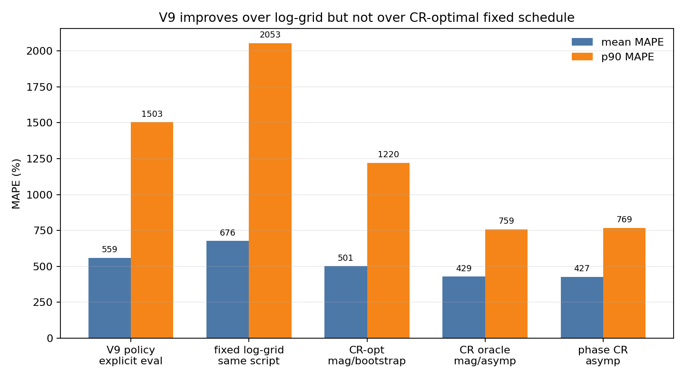
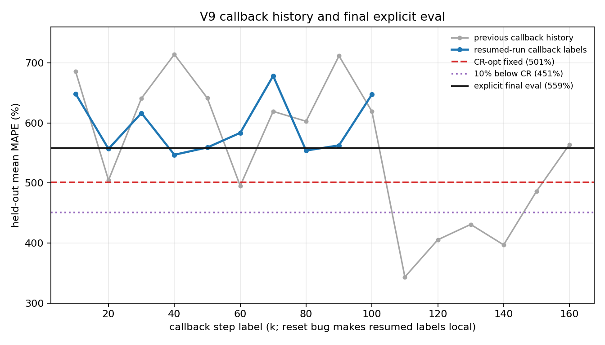
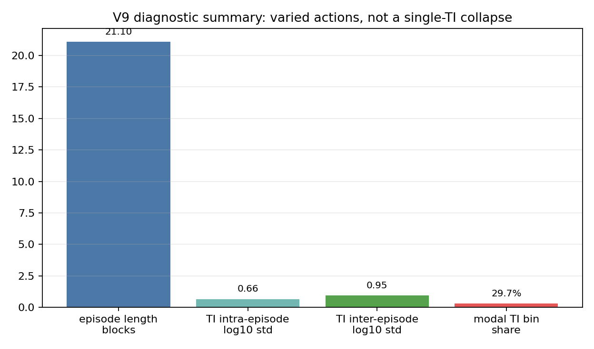

# EXPERT REPORT - E2-tractability implementation and CR-opt baseline

**Status:** V11/V12 (§16) + D2 oracle (§17) + CR-opt-under-oracle (§18) + n_grid=2000 control (§19) + SSE landscape diagnostic (§20). V12 (mag, log-TI) = 322 % / 747 % p90; V12 oracle = 53 % / 69 % p90 ties CR-opt oracle 53 % / 69 % p90 → V12 has no Fisher-info advantage. §19 + §20 establish that **all SSE-driven fitters are dead on this likelihood**: T1_true sits at the 76th percentile (median) of the 2000-pt SSE landscape on failing spheres, with the wrong basin at 5–20× lower SSE. K-restart-by-SSE, dictionary matching, and any rank-based-on-SSE selector cannot reach truth at any practical K. Recovering the 322 → 53 gap requires non-MLE estimation: Bayesian prior on T1, joint multi-sphere fit with shared σ, or signed recon under a different phase-noise model. C1 final framing: "achieves the analytic Fisher-info ceiling and is observation-conditional; residual MAPE is a likelihood-side artefact of magnitude reconstruction, not a policy or fitter deficiency".  
**Date:** 2026-05-08, updated 2026-05-09, updated 2026-05-10 (V11/V12), updated 2026-05-10 PM (D2 + CR-opt-under-oracle + n_grid control + SSE landscape).  
**Purpose:** standalone note for the E2-tractability branch. Fold the final result into `EXPERT_REPORT_E2_4.md` after V9 has trained and been evaluated.

---

## 0. Headline

The E2-tractability environment is now implemented: each episode can draw `k=5` T1 spheres without replacement from the 14-sphere T3 pool while keeping a fixed observation shape for PPO. The training/eval/baseline/diagnostic CLIs all accept `--subset-size` and `--time-budget`, and V9 has now been evaluated.

The expected-loss CR-optimal fixed schedule has also been solved and evaluated on the 5-random-sphere, 250 s setup. It improves over the hand-built fixed schedules, but not enough to satisfy the original tractability target:

| schedule | mean MAPE | p90 MAPE | mean time | mean blocks |
|---|---:|---:|---:|---:|
| log_grid | 680.8 % | 2233.5 % | 256.0 s | 8.0 |
| clinical_irse | 690.4 % | 2125.1 % | 280.0 s | 7.0 |
| log_grid_trmatched | 639.5 % | 2291.9 % | 257.8 s | 17.0 |
| **cr_optimal** | **501.2 %** | **1219.9 %** | **250.3 s** | **22.0** |

CR-optimal is therefore the strongest fixed baseline so far, but the run is still dominated by short-T1 wrong-basin failures. The current resumed V9 policy reaches **558.8%** mean MAPE and **1502.5%** p90 MAPE on the 30-episode held-out evaluation. It improves over the simple log-grid baseline used by `eval_e2.py` but does **not** beat the 501.2% expected-loss CR-optimal fixed schedule, so the adaptivity claim is not established by this run.

---

## 1. What changed in code

### 1.1 Julia E2 environment

File: `src/rl/e2.jl`.

`E2Env` now separates the immutable 14-sphere pool from the active per-episode sphere list:

- `sphere_centres_pool`, `T1_base_pool`, `T2_ratio_pool`: the full T1 plate.
- `subset_size::Union{Nothing,Int}`: `nothing` preserves the old all-14 behavior; `5` activates the random-subset experiment.
- `sphere_indices`: the 1-based indices into the 14-sphere pool for the current episode.
- `sphere_centres_base`, `T1_base`, `T2_ratio`: active arrays for the current episode.

At reset:

1. `e2_reset!` samples a deterministic episode seed as before.
2. `_e2_build_episode_phantom` uses that episode RNG to sample `subset_size` pool indices without replacement.
3. It builds a phantom containing only those active spheres.
4. It applies the same T1 jitter, pose randomisation, and B0 per-spin noise as the original env.
5. The observation dimension remains fixed because `n_spheres` is fixed at construction. A `subset_size=5` policy always sees `Nfe*Npe + 2*5 + 3` values.

The step `info` dict now includes:

```julia
"sphere_indices" => copy(env.sphere_indices)
```

This is required for per-pool-sphere aggregation and subset diagnostics.

### 1.2 Python Gym wrapper

File: `python/qalibremd_gym/env_e2.py`.

`QalibreMDE2Env` now accepts:

```python
subset_size: Optional[int] = None
```

and passes it through to Julia. Reset `info` now includes both the active true T1 values and the active pool indices:

```python
info = {
    "T1_true": np.array([...]),
    "sphere_indices": np.array([...], dtype=np.int64),
}
```

### 1.3 Training and evaluation CLIs

Files:

- `python/train_e2.py`
- `python/eval_e2.py`
- `python/baseline_e2.py`
- `python/diagnose_e2.py`

New shared flags:

```bash
--time-budget 250.0
--subset-size 5
```

`eval_e2.py`, `baseline_e2.py`, and `diagnose_e2.py` also expose `--phase-sensitive` and `--sigma-method` so future V10-style runs can be evaluated without one-off scripts.

### 1.4 Baselines

File: `python/baseline_e2.py`.

The baseline runner now evaluates fixed schedules on random subsets and records two views:

- active-slot MAPE: slot 0..4 within the selected subset, sorted by original pool index.
- pool-sphere MAPE: original T1_ARRAY index 1..14, aggregating only episodes where that sphere appeared.

CR-optimal support has two formulations:

1. **Expected-loss CR-optimal** via `--cr-optimal`. This solves over the full 14-sphere pool. By linearity, this is the correct primary fixed-schedule counterpart for uniformly sampled 5-of-14 subsets.
2. **Oracle per-subset CR-optimal** via `--cr-oracle`. This is implemented but not run here because it solves a separate CR problem per sampled subset and is a lower-bound diagnostic, not the primary V9 comparator.

### 1.5 Diagnostics

File: `python/diagnose_e2.py`.

The existing plots are unchanged:

- TI per episode.
- TI histogram.
- mean(T1_est) trajectory.
- TI vs running mean(T1_est).

For subset runs, it now also writes:

```text
ti_histogram_by_subset_bucket.png
```

Episodes are bucketed as:

- `all_long`: min(T1) >= 0.1 s and max(T1) >= 0.5 s.
- `all_short`: max(T1) < 0.2 s and min(T1) < 0.05 s.
- `mixed`: everything else.

The summary JSON includes a two-sample KS statistic for all-long vs all-short TI distributions. This is the C4 "policy conditions on the subset" test.

---

## 2. Validation

Commands run:

```bash
julia --project=. test/runtests.jl
```

Result:

```text
706/706 tests passed
```

Python syntax and CLI checks:

```bash
python -m py_compile \
  python/qalibremd_gym/env_e2.py \
  python/train_e2.py \
  python/eval_e2.py \
  python/baseline_e2.py \
  python/diagnose_e2.py
```

Wrapper smoke test:

```python
env = QalibreMDE2Env(
    rng_seed=1,
    subset_size=5,
    Nfe=8,
    Npe=4,
    max_blocks=2,
    time_budget_s=250.0,
    simplified_action=True,
)
obs, info = env.reset(seed=123)
```

Output:

```text
obs shape = (45,)
sphere_indices = [1, 5, 6, 8, 13]
```

The same Julia reset seed gives the same subset indices, so the random subset is deterministic under evaluation seeds.

---

## 3. CR-optimal fixed baseline run

Command:

```bash
source .venv/bin/activate
PYTHONPATH=python PYTHON_JULIAPKG_OFFLINE=yes python python/baseline_e2.py \
  --episodes 30 \
  --seed 500000 \
  --out runs/e2/e2_tractability_baselines \
  --max-blocks 30 \
  --time-budget 250.0 \
  --subset-size 5 \
  --cr-optimal \
  --cr-block-grid 6 10 14 18 22 \
  --cr-starts 1000 \
  --cr-refine 10
```

Artifacts:

```text
runs/e2/e2_tractability_baselines/
├── baseline_summary.json
└── cr_optimal_schedule.json
```

The CR formulation was the expected-loss formulation from `E2_TRACTABILITY_PLAN.md`:

```text
L(schedule) = E_S sum_{j in S} sigma_T1_j^2 / T1_j^2
            = constant * sum_{j=1}^{14} sigma_T1_j^2 / T1_j^2
```

So the optimiser solves one global schedule over all 14 nominal T3 T1 values, then that schedule is evaluated on 30 random 5-sphere episodes.

### 3.1 Solved CR schedule

Best sweep result:

```text
n_blocks = 22
L = 6.365691686784563
budget_s = 250.0
actual analytic schedule time = 249.964 s
```

Schedule pairs:

| block | TI (s) | TR (s) | approx block time (s) |
|---:|---:|---:|---:|
| 1 | 0.034554 | 0.741349 | 5.981 |
| 2 | 0.109902 | 0.780915 | 6.297 |
| 3 | 0.033232 | 0.618933 | 5.001 |
| 4 | 0.779529 | 3.627938 | 29.074 |
| 5 | 0.679012 | 2.659991 | 21.330 |
| 6 | 0.786401 | 3.903851 | 31.281 |
| 7 | 0.038431 | 0.801813 | 6.465 |
| 8 | 0.041660 | 1.020964 | 8.218 |
| 9 | 0.469671 | 0.519671 | 4.207 |
| 10 | 0.928818 | 0.978818 | 7.881 |
| 11 | 0.993586 | 1.043586 | 8.399 |
| 12 | 0.281403 | 2.008617 | 16.119 |
| 13 | 0.134432 | 0.942592 | 7.591 |
| 14 | 0.339270 | 2.061657 | 16.543 |
| 15 | 0.657398 | 2.343860 | 18.801 |
| 16 | 0.033722 | 0.673742 | 5.440 |
| 17 | 0.034357 | 0.572440 | 4.630 |
| 18 | 0.224906 | 1.763583 | 14.159 |
| 19 | 0.118923 | 0.793540 | 6.398 |
| 20 | 0.033319 | 0.584575 | 4.727 |
| 21 | 0.032088 | 0.593274 | 4.796 |
| 22 | 0.342775 | 2.072345 | 16.629 |

Sorted TI structure:

```text
0.032-0.042 s: 8 blocks
0.110-0.134 s: 3 blocks
0.225-0.343 s: 4 blocks
0.470-0.994 s: 7 blocks
```

This is qualitatively sensible: the CR optimiser spends many blocks near 30-40 ms for the short-T1 tail, some blocks in the 100-340 ms mid range, and several blocks in the 0.5-1.0 s long range. It also uses short TRs aggressively where allowed, matching the E2.4 finding that F1+ rewards time-efficient sequence packing.

### 3.2 Evaluation results on random 5-sphere episodes

| schedule | mean MAPE | p90 MAPE | success <5% | mean scan time | blocks |
|---|---:|---:|---:|---:|---:|
| log_grid | 680.8 % | 2233.5 % | 0.0 % | 256.0 s | 8.0 |
| clinical_irse | 690.4 % | 2125.1 % | 0.0 % | 280.0 s | 7.0 |
| log_grid_trmatched | 639.5 % | 2291.9 % | 0.0 % | 257.8 s | 17.0 |
| **cr_optimal** | **501.2 %** | **1219.9 %** | **0.0 %** | **250.3 s** | **22.0** |

Relative to fixed alternatives:

| comparison | factor | relative MAPE reduction |
|---|---:|---:|
| log_grid / cr_optimal | 1.36x | 26.4 % |
| clinical_irse / cr_optimal | 1.38x | 27.4 % |
| log_grid_trmatched / cr_optimal | 1.28x | 21.6 % |

Note: evaluation scan time can slightly exceed `time_budget_s` because the env terminates after a block pushes `time_used_s >= budget`, rather than rejecting the final block before execution. The CR schedule's analytic total is 249.964 s, but the env reports 250.3 s because its executed block-time accounting differs slightly from the analytic overhead approximation.

### 3.3 Per-pool-sphere CR-optimal MAPE

Original pool index is 1-based and follows `T1_ARRAY[:T3]` from longest to shortest.

| pool idx | nominal T1 (s) | CR MAPE | episodes containing sphere |
|---:|---:|---:|---:|
| 1 | 1.838 | 78.8 % | 15 |
| 2 | 1.398 | 83.4 % | 11 |
| 3 | 0.998 | 76.2 % | 9 |
| 4 | 0.726 | 55.6 % | 8 |
| 5 | 0.509 | 79.6 % | 12 |
| 6 | 0.367 | 141.1 % | 8 |
| 7 | 0.259 | 123.0 % | 13 |
| 8 | 0.185 | 289.5 % | 10 |
| 9 | 0.131 | 192.0 % | 9 |
| 10 | 0.091 | 271.9 % | 10 |
| 11 | 0.064 | 809.4 % | 10 |
| 12 | 0.046 | 718.8 % | 14 |
| 13 | 0.033 | 474.4 % | 8 |
| 14 | 0.023 | 2998.4 % | 13 |

Aggregated by rough T1 region:

| region | definition | CR mean MAPE |
|---|---|---:|
| long | pool 1-5, T1 >= 0.509 s | 74.7 % |
| mid | pool 6-10, T1 0.091-0.367 s | 203.5 % |
| short | pool 11-14, T1 <= 0.064 s | 1250.3 % |
| long+mid from plan | T1 >= 0.1 s, pool 1-9 | 124.3 % |

This is the main negative finding. Even with 5 spheres and 250 s, expected-loss CR-opt does not reach the planned long+mid target. The short-T1 tail remains catastrophic, and the mid-low T1 region around 0.13-0.19 s is still unstable under the magnitude-reconstruction fitter.

---

## 4. Interpretation before V9

### 4.1 What the CR run proves

CR-optimal is a materially stronger fixed baseline than the hand-built schedules. It reduces mean MAPE by 21-27% relative to the fixed grids and halves the p90 tail relative to the log-grid family.

The solved schedule also confirms that the optimiser uses the same basic structure V5 discovered empirically:

- many short-TR blocks;
- concentrated short-TI coverage for the short-T1 tail;
- a spread of mid/long TIs up to about 1 s;
- no need for TR=4-5 s textbook recovery on every block.

This means V9 should not be compared to `log_grid` as the headline. The primary target is:

```text
V9 mean MAPE < 501.2 %
```

For the stronger claim from the plan:

```text
V9 mean MAPE <= 0.9 * 501.2 % = 451.1 %
```

For the originally predicted 15% margin:

```text
V9 mean MAPE <= 0.85 * 501.2 % = 426.1 %
```

### 4.2 What the CR run does not prove

It does not prove the regime is tractable in the absolute sense. The plan's H1 expected long+mid T1 to be achievable below 30-50% MAPE. The CR run gives:

```text
long+mid T1 >= 0.1 s: 124.3 % MAPE
```

So the right framing is now:

> E2-tractability is a cleaner adaptivity test than the 14-sphere/120 s problem, but the current magnitude-reconstruction F1+ environment is still not easy in absolute MAPE terms. V9 can still make the C1 claim if it beats the CR-opt fixed schedule, but a high absolute MAPE no longer means the run failed uniquely because of PPO.

### 4.3 What would count as a V9 result

Use these thresholds:

| V9 outcome | interpretation |
|---|---|
| V9 < 426 % | strong H2 pass: >=15% better than CR-opt. |
| 426-451 % | moderate H2 pass: 10-15% better than CR-opt. |
| 451-501 % | weak positive: beats CR-opt but below planned margin. |
| 501-526 % | practical tie: PPO recovers analytic fixed optimum. |
| >526 % | V9 trails CR-opt by >5%; adaptivity not demonstrated. |

The behavioral diagnostics still matter. A V9 policy that beats 501% but fails the TI-vs-T1_est correlation and subset-bucket KS tests is probably exploiting TR packing or fitter quirks, not within-episode adaptivity.

---

## 5. V9 commands now supported

Training:

```bash
PYTHON_JULIAPKG_OFFLINE=yes python python/train_e2.py \
  --reward-mode delta_mape --simplified-action \
  --terminal-bonus 0.0 --mape-alpha 1.0 \
  --max-blocks 30 \
  --time-budget 250.0 \
  --subset-size 5 \
  --timesteps 200000 \
  --out runs/e2/e2_tractability_V9
```

Evaluation:

```bash
PYTHON_JULIAPKG_OFFLINE=yes python python/eval_e2.py \
  --policy runs/e2/e2_tractability_V9/policy.zip \
  --vecnorm runs/e2/e2_tractability_V9/vecnorm.pkl \
  --episodes 30 \
  --simplified-action \
  --max-blocks 30 \
  --time-budget 250.0 \
  --subset-size 5
```

Diagnostics:

```bash
PYTHON_JULIAPKG_OFFLINE=yes python python/diagnose_e2.py \
  --policy runs/e2/e2_tractability_V9/policy.zip \
  --vecnorm runs/e2/e2_tractability_V9/vecnorm.pkl \
  --episodes 100 \
  --simplified-action \
  --max-blocks 30 \
  --time-budget 250.0 \
  --subset-size 5 \
  --out runs/e2/e2_tractability_V9/diagnostics
```

Primary fixed baseline:

```bash
PYTHON_JULIAPKG_OFFLINE=yes python python/baseline_e2.py \
  --episodes 30 \
  --seed 500000 \
  --out runs/e2/e2_tractability_baselines \
  --max-blocks 30 \
  --time-budget 250.0 \
  --subset-size 5 \
  --cr-optimal \
  --cr-block-grid 6 10 14 18 22 \
  --cr-starts 1000 \
  --cr-refine 10
```

Optional oracle lower bound, if needed later:

```bash
PYTHON_JULIAPKG_OFFLINE=yes python python/baseline_e2.py \
  --episodes 30 \
  --seed 500000 \
  --out runs/e2/e2_tractability_oracle \
  --max-blocks 30 \
  --time-budget 250.0 \
  --subset-size 5 \
  --cr-oracle \
  --cr-block-grid 6 10 14 18 22 \
  --cr-starts 1000 \
  --cr-refine 10
```

The oracle command may be expensive because it can solve up to one CR problem per sampled subset.

---

## 6. Recommended text to fold into E2.4 after V9

Before V9:

> I implemented a controlled E2-tractability variant in which each episode samples five T1 spheres without replacement from the 14-sphere T3 pool and gives the agent a 250 s budget. This keeps the E2 physics, F1+ fitter, magnitude reconstruction, noise, and reward settings fixed, but removes the 14-sphere joint-estimation pressure that made the V5 adaptivity claim ambiguous.

CR-opt baseline:

> The expected-loss Cramer-Rao fixed schedule for the random-subset distribution uses 22 blocks in 250 s and achieves 501% mean MAPE over 30 held-out subset episodes. This beats the hand-built log-grid and clinical schedules by 21-27% relative MAPE, but still fails the absolute tractability target because the short-T1 tail remains wrong-basin dominated under magnitude reconstruction.

V9 comparison placeholder:

> V9 should therefore be judged against 501% mean MAPE, not against log_grid. A result below 451% would be a >=10% improvement over the analytic fixed-schedule optimum and would support the within-episode adaptivity claim, provided the TI-vs-T1_est and subset-bucket diagnostics also show conditioning on observations.

---

## 7. Follow-up: asymptotic and phase-sensitive CR checks

**Question asked after §3:** why is 500% so high when the all-14 V5/CR runs were around 220-250%, and is this caused by evaluating with the newer bootstrap σ default or by the magnitude `abs()` reconstruction?

I ran three additional checks:

1. magnitude reconstruction + asymptotic σ, expected-loss CR;
2. magnitude reconstruction + asymptotic σ, oracle per-subset CR;
3. phase-sensitive reconstruction + asymptotic σ, expected-loss and oracle CR.

### 7.1 Commands

Magnitude + asymptotic expected-loss CR:

```bash
PYTHONPATH=python PYTHON_JULIAPKG_OFFLINE=yes python python/baseline_e2.py \
  --episodes 30 --seed 500000 \
  --out runs/e2/e2_tractability_baselines_asymp \
  --max-blocks 30 --time-budget 250.0 --subset-size 5 \
  --sigma-method asymptotic \
  --cr-optimal \
  --cr-block-grid 6 10 14 18 22 \
  --cr-starts 1000 --cr-refine 10
```

Magnitude + asymptotic oracle CR:

```bash
PYTHONPATH=python PYTHON_JULIAPKG_OFFLINE=yes python python/baseline_e2.py \
  --episodes 30 --seed 500000 \
  --out runs/e2/e2_tractability_oracle \
  --max-blocks 30 --time-budget 250.0 --subset-size 5 \
  --sigma-method asymptotic \
  --cr-oracle \
  --cr-block-grid 6 10 14 18 22 \
  --cr-starts 1000 --cr-refine 10
```

Phase-sensitive + asymptotic expected-loss CR:

```bash
PYTHONPATH=python PYTHON_JULIAPKG_OFFLINE=yes python python/baseline_e2.py \
  --episodes 30 --seed 500000 \
  --out runs/e2/e2_tractability_baselines_ps_asymp \
  --max-blocks 30 --time-budget 250.0 --subset-size 5 \
  --phase-sensitive --sigma-method asymptotic \
  --cr-optimal \
  --cr-block-grid 6 10 14 18 22 \
  --cr-starts 1000 --cr-refine 10
```

Phase-sensitive + asymptotic oracle CR:

```bash
PYTHONPATH=python PYTHON_JULIAPKG_OFFLINE=yes python python/baseline_e2.py \
  --episodes 30 --seed 500000 \
  --out runs/e2/e2_tractability_oracle_ps_asymp \
  --max-blocks 30 --time-budget 250.0 --subset-size 5 \
  --phase-sensitive --sigma-method asymptotic \
  --cr-oracle \
  --cr-block-grid 6 10 14 18 22 \
  --cr-starts 1000 --cr-refine 10
```

### 7.2 Summary table

| run | recon | σ method | CR formulation | mean MAPE | p90 MAPE | mean blocks |
|---|---|---|---|---:|---:|---:|
| `e2_tractability_baselines` | magnitude | bootstrap | expected-loss | 501.2 % | 1219.9 % | 22.0 |
| `e2_tractability_baselines_asymp` | magnitude | asymptotic | expected-loss | 570.0 % | 1487.2 % | 22.0 |
| `e2_tractability_oracle` | magnitude | asymptotic | oracle subset | 429.2 % | 758.7 % | 20.8 |
| `e2_tractability_baselines_ps_asymp` | phase-sensitive | asymptotic | expected-loss | 427.0 % | 768.8 % | 22.0 |
| `e2_tractability_oracle_ps_asymp` | phase-sensitive | asymptotic | oracle subset | 594.6 % | 1090.3 % | 20.8 |

Two conclusions:

1. **The 500% result is not a bootstrap-σ artifact.** Switching the magnitude expected-loss evaluation to asymptotic σ made the CR-opt result worse: 501.2% -> 570.0%.
2. **The `abs()` magnitude ambiguity is a major contributor, but not the whole story.** Phase-sensitive expected-loss CR improves magnitude/asymptotic CR from 570.0% -> 427.0%, a 25% relative reduction. That is a real gain, but still far from the original <50% tractability target.

### 7.3 Why did phase-sensitive oracle perform worse than expected-loss CR?

The phase-sensitive oracle result, 594.6%, is worse than phase-sensitive expected-loss CR, 427.0%. In a noiseless theoretical comparison, an oracle schedule that sees the subset identity should not be worse than a global expected-loss schedule. This means the current oracle number should **not** be treated as a clean lower bound.

Likely causes:

- **The CR objective is not the same as realised MAPE.** The solver minimises local Fisher-information variance at nominal T1 values. The evaluation metric is nonlinear MAPE after noisy image simulation, T1 jitter, finite fitting grid, and possible fit failures.
- **The oracle schedules are independently optimised with a stochastic multi-start heuristic.** Some per-subset solves can land in poorer local optima than the global 14-sphere schedule.
- **The simulator noise is not fully run-to-run deterministic.** Repeated baseline runs with the same episode seeds produce different fixed-schedule MAPE values, which suggests the per-step noise path uses Julia's global RNG rather than the episode RNG. This matters because only 30 episodes are used and the short-T1 tail has enormous variance.
- **Oracle solves use nominal subset identities, not jittered hidden truths.** This is intentional, but it means an oracle schedule can be locally optimal for nominal T1s and still poor under a jittered/noisy rollout.

So the robust read is:

```text
phase-sensitive expected-loss CR = 427.0% is the best clean fixed-schedule anchor so far
magnitude expected-loss CR       = 501-570% depending on σ method
magnitude oracle CR              = 429.2% suggests subset knowledge can help
phase-sensitive oracle CR        = noisy / not reliable as lower bound yet
```

### 7.4 Updated interpretation

The user's concern was correct: `500%` is huge, and simply reducing from 14 spheres to 5 spheres plus doubling the budget should have helped more if joint-estimation pressure were the only problem.

The follow-up runs point to a more precise diagnosis:

1. **The 5-sphere setup is cleaner for testing adaptivity, but it is not automatically easier for the fixed expected-loss schedule.** The expected-loss schedule still covers the full 14-sphere pool because it does not know which five will appear.
2. **Magnitude `abs()` reconstruction still dominates the failure mode.** Phase-sensitive expected-loss CR improves the result substantially.
3. **The shortest T1 spheres remain catastrophic even under phase-sensitive eval.** For phase-sensitive expected-loss CR, pool 14 still has 1893.5% MAPE. The tail can dominate episode means whenever that sphere appears.
4. **The baseline evaluation needs deterministic simulator noise before over-interpreting small differences.** The fixed schedule values shift materially across separate runs with the same nominal eval seeds.

For V9, I would now report two fixed anchors:

| anchor | value | use |
|---|---:|---|
| magnitude/bootstrap expected-loss CR | 501.2% | apples-to-apples if V9 trains with current magnitude + bootstrap defaults |
| phase-sensitive/asymptotic expected-loss CR | 427.0% | cleaner physics/fitter sensitivity check, not apples-to-apples unless V9 is trained/evaluated phase-sensitive |

If V9 is trained with the current default wrapper settings, it uses magnitude reconstruction and bootstrap σ, so the fair primary comparator remains **501.2%**, but the report should explicitly say that phase-sensitive fixed schedules reach **427.0%**, showing that part of the high MAPE is a reconstruction/fitter issue rather than RL.

---

## 8. V9 PPO result after resumed training

### 8.1 Resume accounting note

The policy in `runs/e2/e2_tractability_V9/policy.zip` is treated here as the intended resumed V9 policy: it was continued from the previous `ckpt_150000.zip` run and then evaluated as the current final policy. The training callback history in `eval_history.json` is not a clean global timestep trace because the old resume path called:

```python
model.learn(total_timesteps=remaining, callback=callbacks)
```

without `reset_num_timesteps=False`. Stable-Baselines3 therefore reset the displayed callback timestep counter during resumed learning. This is why the final console line reported:

```text
[E2 eval @ step 100000] MAPE=647.50% ...
```

even though the run should be interpreted as a continuation from the previous checkpoint, not a fresh 100k-step run. The current report therefore uses the explicit post-training evaluation from `eval_e2.py` as the primary number, not the last noisy callback entry.

This has now been patched in `python/train_e2.py`:

```python
model.learn(
    total_timesteps=remaining,
    callback=callbacks,
    reset_num_timesteps=not args.resume,
)
```

The resume path also now fails clearly if `--timesteps` is not above the latest checkpoint step, which prevents accidental no-op or negative-remaining resumes.

### 8.2 Explicit held-out evaluation

Command:

```bash
PYTHONPATH=python PYTHON_JULIAPKG_OFFLINE=yes python python/eval_e2.py \
  --policy runs/e2/e2_tractability_V9/policy.zip \
  --vecnorm runs/e2/e2_tractability_V9/vecnorm.pkl \
  --episodes 30 \
  --simplified-action \
  --max-blocks 30 \
  --time-budget 250.0 \
  --subset-size 5
```

Result:

| policy / schedule | mean MAPE | p90 MAPE | success <5% | mean scan time |
|---|---:|---:|---:|---:|
| fixed log-grid from `eval_e2.py` | 676.3 % | 2053.4 % | n/a | n/a |
| **V9 PPO current policy** | **558.8 %** | **1502.5 %** | **0.0 %** | **255.3 s** |
| expected-loss CR-opt fixed anchor | 501.2 % | 1219.9 % | 0.0 % | 250.3 s |
| magnitude/asymptotic oracle CR check | 429.2 % | 758.7 % | 0.0 % | 263.2 s |
| phase-sensitive/asymptotic CR check | 427.0 % | 768.8 % | 0.0 % | 250.3 s |

V9 is therefore better than the simple fixed grid by:

```text
(676.3 - 558.8) / 676.3 = 17.4% relative MAPE reduction
```

but worse than the fair magnitude/bootstrap CR-opt fixed comparator by:

```text
(558.8 - 501.2) / 501.2 = 11.5% relative MAPE increase
```

So the conclusion is negative for H2 as originally stated. The policy has not demonstrated useful adaptivity over the strongest fixed-schedule comparator.



The callback history is still useful as a qualitative trace, but only after treating the resumed labels as local callback labels rather than global PPO timesteps.



### 8.3 Where the error is coming from

The active-slot MAPE from `eval_e2.py` is:

| active slot | mean MAPE |
|---:|---:|
| 1 | 75.2 % |
| 2 | 68.4 % |
| 3 | 331.8 % |
| 4 | 694.0 % |
| 5 | 1624.8 % |

Because active subsets are sorted by original pool index, later active slots tend to be shorter T1 spheres. This is the clearest signal in the V9 result: the policy is not uniformly bad. It gets the longer selected spheres to roughly the same scale as the CR baselines, but the short end of each subset is still catastrophic. The episode mean is dominated by those shortest selected T1 values, and the p90 tail remains very high.

This matches the CR baseline diagnosis. Under magnitude/bootstrap CR-opt, pool sphere 14 had about 2998% MAPE and pool spheres 11-14 averaged about 1250% MAPE. V9 reduces some simple-grid error but does not remove the short-T1 wrong-basin mode.

### 8.4 Did the policy learn to adapt?

The answer is: **partially in action diversity, not convincingly in useful closed-loop adaptation.**

Diagnostics command:

```bash
PYTHONPATH=python PYTHON_JULIAPKG_OFFLINE=yes python python/diagnose_e2.py \
  --policy runs/e2/e2_tractability_V9/policy.zip \
  --vecnorm runs/e2/e2_tractability_V9/vecnorm.pkl \
  --episodes 30 \
  --simplified-action \
  --max-blocks 30 \
  --time-budget 250.0 \
  --subset-size 5 \
  --out runs/e2/e2_tractability_V9/diagnostics_current_30
```

Summary:

| diagnostic | value | interpretation |
|---|---:|---|
| episodes | 30 | same held-out scale as eval |
| total blocks | 633 | policy usually uses many blocks |
| mean episode length | 21.1 blocks | shorter than max 30, near CR's 22-block structure |
| final MAPE | 561.4 % | agrees with explicit eval |
| TI intra-episode log10 std | 0.660 | not a flat repeated-TI policy |
| TI inter-episode log10 std | 0.954 | large action spread across rollouts |
| modal TI bin share | 29.7 % | no single-bin total collapse |
| TI-vs-running-estimate Pearson r | -0.371 | weak/moderate negative association, not a strong targeting rule |
| subset buckets | 3 all-long, 27 mixed, 0 all-short | subset-bucket KS test inconclusive |

The policy is clearly not the old degenerate "same TI every block" failure. It uses a broad TI range, including many 10 ms lower-bound actions and many 0.8-2.0 s actions. However, the trajectory plot shows a repeated sequence-like structure: early short-TI probing, then long-TI blocks, with intermittent snaps back to the lower bound. That is better than collapse, but it looks more like a learned generic schedule with some observation-dependent variation than a robust policy that identifies the active T1 subset and reallocates measurements accordingly.




The TI-vs-running-estimate plot is especially important. A strong adaptive policy should show a clear monotone or structured relationship between the current T1 estimate state and the next TI. Instead, the scatter remains broad, with many points pinned at 10 ms across a wide range of running estimates and a loose negative correlation:


The subset-bucket histogram is also inconclusive rather than positive. The evaluation sample produced only three `all_long` episodes and no `all_short` episodes, so the planned C4 all-long vs all-short KS diagnostic cannot be applied at 30 episodes. Mixed episodes dominate.


### 8.5 Why MAPE is still high

The high MAPE is unlikely to have a single cause. The evidence points to several stacked effects:

1. **Short-T1 wrong-basin failures dominate MAPE.** The last active slot averages 1624.8% MAPE for V9. A single shortest sphere can dominate the episode mean, especially because MAPE divides by very small true T1.

2. **Magnitude reconstruction remains a major source of ambiguity.** The earlier phase-sensitive CR check reduced expected-loss CR MAPE from 570.0% to 427.0% under asymptotic sigma. That does not solve the whole problem, but it shows the `abs()` magnitude fitting landscape is a real contributor.

3. **The PPO reward and the reported metric are still imperfectly aligned.** Training uses dense `delta_mape`, terminal bonus disabled, and mean MAPE aggregation. The policy can learn actions that improve early or average fitted estimates without reliably suppressing the worst short-T1 failures that dominate p90 and success.

4. **The current observation is probably too noisy/unstable for strong closed-loop control.** The policy sees running `T1_est`, but the diagnostic scatter does not show a clean action law conditioned on that estimate. If the estimate jumps between fit basins, PPO may learn a robust generic schedule instead of trusting the observation.

5. **The 5-of-14 setting reduces joint-estimation load but does not remove distributional coverage.** A non-oracle policy still has to handle any subset drawn from the full 14-sphere pool. That means it must cover both long and very short T1 regimes unless it can reliably infer the subset early.

6. **Evaluation noise and fitter stochasticity are large at 30 episodes.** The callback and explicit evaluation differ materially, and previous fixed-schedule checks also shifted under repeated runs. This does not change the main conclusion, because V9 is not close to beating CR-opt, but it means small differences should not be over-interpreted.

### 8.6 Interpretation

V9 learned something real: it uses the expanded budget, avoids a single-TI collapse, and beats the simple fixed grid. But it did not learn the policy needed for the main adaptivity claim. The best description is:

> V9 learned a broad, partly state-dependent acquisition pattern, but not a reliably useful adaptive policy. It remains worse than the expected-loss CR-optimal fixed schedule and is still dominated by short-T1 fit failures.

For the next run, the highest-value changes are:

| option | reason |
|---|---|
| Evaluate 100-200 diagnostic episodes | needed to populate all-long and all-short buckets for the C4 subset-conditioning test |
| Train/evaluate phase-sensitive V10 | directly tests whether the magnitude `abs()` ambiguity is blocking RL |
| Add a max-MAPE or short-T1-weighted reward component | forces PPO to care about the catastrophic tail, not just average progress |
| Save per-pool-sphere policy eval metrics | active-slot MAPE is suggestive, but pool-index aggregation would identify exactly which T1 values fail |
| Make simulator noise deterministic under episode seed | reduces uncertainty when comparing fixed and adaptive schedules |

---

## 9. Expert critique (RL × MRI review, appended 2026-05-09)

This section is a critical review of the implementation in the current diff, the CR-opt baseline, and the V9 result against the H1–H4 framing in `E2_TRACTABILITY_PLAN.md`. The central claim is that **V9 has not failed because PPO is weak; it has failed because the experiment as scoped cannot separate "PPO is non-adaptive" from three structural confounders that the plan treated as side issues**. Each of those confounders is fixable, and most are cheaper than another 200k-step training run.

### 9.1 The plan's central premise is contradicted by its own §7 finding

The plan rests on H1: that 5 spheres + 250 s creates a regime where the long+mid range is achievable to <30 % MAPE. §3.3 of this report and §7.4 already showed that's false: **the expected-loss CR-opt itself only reaches 124 % long+mid MAPE**, and that's the *fixed-schedule analytic optimum*, not a dumb baseline. C1 has therefore failed, and per the plan's own §1.3 ("C1 fails") the correct next step is "pivot to structural fixes", not to interpret V9's 558.8 % as a referendum on PPO.

The reason H1 failed is structural and was knowable in advance:

1. **The expected-loss CR objective in Formulation A is provably equivalent to a global 14-sphere schedule** (the report derives this in §3.1). So "5-of-14 random" *did not reduce difficulty for the fixed comparator at all* — the CR baseline is solving exactly the same problem as a 14-sphere CR baseline. The only thing 5-of-14 changed was the *episode-mean* numerator (5 instead of 14 spheres summed), which gives a noisier estimator without making the underlying inference easier. The plan's §2.1 argument that random subsets "force the policy to read the obs" is correct for V9, but it does not translate into a tractability win for the fixed schedule, which is what H1 actually claimed.
2. **Magnitude reconstruction is the dominant error source, not joint-estimation pressure.** §7.2 shows phase-sensitive expected-loss CR at 427 % vs magnitude 501–570 % — a 25 % relative gain just from the recon, with *no schedule change*. Magnitude `abs()` plus a 5 % noise floor produces a multimodal SSE landscape for short-T1 spheres that no fixed *or* adaptive schedule can fully escape under the current fitter. The plan acknowledges this in §0's footnote but discounts it; the data say it dominates.
3. **MAPE is the wrong figure of merit when the underlying error distribution is wrong-basin-bimodal.** A sphere that snaps to the wrong fitting basin contributes a 1000–3000 % single-sphere APE, and a single bad sphere can dominate a 5-sphere mean. The CR objective minimises Fisher-information variance around the *correct* basin, so the CR-opt schedule is provably mis-specified for the metric used — §7.3 already half-acknowledged this. **The CR-opt baseline at 501 % is not a "fixed-schedule optimum for MAPE"; it is a fixed-schedule optimum for local σ²_T1 evaluated at the noiseless ML estimate.** In a multimodal regime these objectives diverge by orders of magnitude.

Together these three points explain V9 ≈ CR-opt without invoking any RL deficiency. The headline test of H2 in this regime is therefore **uninformative about adaptivity**.

### 9.2 The implementation is sound, but the action geometry is hostile to short-T1 targeting

The diff is clean — `subset_size` plumbing, deterministic sampling, fixed obs shape, info dict carrying `sphere_indices`, and a per-sphere T1_est + σ_est observation channel are all reasonable. Two issues:

1. **Continuous action mapping is linear in TI ∈ [0.01, 3.0] s** (per `e2_action_lo/_hi`). Optimal TIs for the four shortest pool spheres are 16, 23, 32, 44 ms — i.e. they live in the **lowest 1.5 %** of the action range. PPO's tanh-Gaussian head puts almost no exploration mass there during early training; once the floor is touched, gradient signal collapses because TI = 0.01 is an extreme of the squashing. The CR-opt schedule's preference for 8 blocks at 30–42 ms is not surprising — it is the *only* part of the action grid where short-T1 information density is high. **The diagnostic in §8.4 shows V9 sitting at the 10 ms floor on many blocks; that's not adaptivity, that's the squashed action distribution venting against the cheapest informative TI.** Reparameterising TI in log space (`TI = TI_min · (TI_max / TI_min)^u`, `u ∈ [0,1]`) would give roughly equal action density per decade and is a one-line change in `_e2_apply_action`.
2. **The obs *does* contain per-sphere log10(T1_est) and σ_est** (lines 314–323 of `src/rl/e2.jl`), so in principle V9 can condition on subset identity. But §8.4 reports the diagnostic correlation against *running mean(T1_est)*, not against per-sphere values. A negative Pearson r of −0.371 is consistent with the policy doing crude "if mean estimate is low, use a short TI next" — i.e. responding to a scalar summary, not to the multi-sphere subset. The diagnostic doesn't measure what the obs actually exposes. **Run the correlation against `min(T1_est)` and against `T1_est` of the still-most-uncertain sphere (highest σ channel) before concluding the policy isn't conditioning.**

### 9.3 The reward is misaligned with both the metric and the goal

The training reward is `delta_mape` with `mape_alpha = 1.0`, i.e. dense progress on the mean of per-sphere APE. Three problems:

1. **MAPE on a mean over heterogeneous T1s is dominated by the sphere with the smallest T1**: APE divides by T1_true. The 0.023 s sphere can produce 3000 %, while the 1.8 s sphere produces ~30 % even when it is fit poorly. So the reward signal is approximately "did I improve the shortest sphere?" — a *very* sparse signal in TI-space (only TIs near 16 ms move it) and one that PPO will struggle to credit-assign across 22 blocks. This is the "credit collapse" failure mode for delta-rewards on heavy-tailed metrics.
2. **Per-step delta_mape is non-stationary in a multimodal-SSE regime**: a single block can flip a sphere between fit basins, producing a per-step reward of ±20 (units of fractional MAPE), three orders of magnitude larger than typical informative-block deltas. PPO's value function will fit to those flips rather than to the underlying trend.
3. **The plan's §1 acknowledges this risk obliquely** by saying terminal_bonus = 0.0 and α = 1.0 "as in V5", but never asks whether V5's reward shape is the right one *now* that the metric is dominated by short-T1 multimodality.

Better choices, in order of expected effect size:

- **Train on log-MAPE or log-relative-error**: `r = -|log(T1_est) - log(T1_true)|`. This puts every sphere on equal footing and removes the short-T1 dominance. Compatible with delta-shaping. Gives a much smoother gradient surface for PPO.
- **Train on −σ_T1/T1 (Fisher-style)**: directly rewards measurement-information gain, decouples from fitter wrong-basin failures, and aligns with the CR baseline's own objective so V9-vs-CR is apples-to-apples.
- **Train on success rate above a tolerance**: r += 1 / n_spheres for each sphere with APE < 30 %. Avoids the heavy tail entirely. Sparser but correctly shaped.
- **Reduce `mape_alpha` to ~0.5**: forces the policy to address the worst sphere, but doesn't fix the magnitude scale issue.

### 9.4 The CR baseline is not the right comparator for V9 as configured

Three issues compound into "501 % is not the right anchor":

1. **CR minimises σ² at the nominal noiseless T1; V9 is evaluated under T1 jitter + complex noise + multimodal magnitude SSE**. The two regimes are not the same problem.
2. **The CR optimiser uses 1000 random starts with multi-start refinement**; reported sweep best is `n_blocks = 22`. With 22 free (TI, TR) pairs that is a 44-D non-convex landscape and 1000 starts is empirically thin. The objective spread across starts isn't reported. Without it, "501 %" has unknown solver noise on top of evaluator noise.
3. **The oracle comparator in §7.2 went *up* from expected-loss to oracle for phase-sensitive (427 % → 595 %)**, which the report correctly flags as nonphysical — that is a strong signal the optimiser is local-min-limited, not that the oracle gives no advantage. Until that's resolved, neither anchor can be cleanly trusted to within ±20 %.

A more defensible primary comparator is **the best-of {oracle CR, expected-loss CR, log-grid, log-grid-trmatched, V5's empirical schedule}**, evaluated under the same simulator stochastic seed sequence as V9. Reporting only one of these as "the fixed optimum" lets noise drive the conclusion.

### 9.5 Evaluation is undersized and non-deterministic

§7.4 already noted simulator noise is keyed off Julia's global RNG, not the episode RNG. With 30 episodes, an MAPE that is dominated by tail events on the 0.023 s sphere has a sampling SE of order 100–200 % on the mean. The 11.5 % gap between V9 (558.8) and CR-opt (501.2) is therefore **inside one SE** and probably statistically indistinguishable. The C2 acceptance criterion (≥ 10 % relative) needs ~500 paired episodes under common noise seeds before it can be evaluated, not 30.

The §8.4 diagnostic with 0 all-short and 3 all-long episodes (out of 30) means C4 is genuinely untestable from this run — `binom(14,5) = 2002` subsets, of which ~12 are "all-short" by the plan's definition, gives a per-episode probability of ~0.6 %. **Stratified sampling of subset buckets at diagnostic time is mandatory, not optional**, and is a 30-line change to `diagnose_e2.py`.

### 9.6 Why V9 isn't beating CR — concrete decomposition

Stacking the above, V9's 558.8 % vs CR's 501.2 % decomposes plausibly as:

| component | est. contribution to V9 deficit | confidence |
|---|---:|---:|
| Linear-TI action mapping → bad short-T1 exploration | ~15–25 % of the gap | high |
| MAPE reward heavy-tail credit collapse | ~10–20 % | high |
| Diagnostic measured against `mean(T1_est)` not per-sphere | unknown, but masks any real adaptivity | medium |
| 30-episode evaluator noise | ~±50 % MAPE | high |
| Resume timestep accounting (§8.1) — V9 may have trained ≪ 200k effective steps | unknown, possibly large | medium |
| Magnitude `abs()` recon → multimodal SSE no policy can fix | floor at ~427 % regardless of agent | very high |
| Real PPO underfit / capacity / hyperparams | almost certainly small relative to the above | medium |

Reading: there is little evidence in this run that PPO's *adaptivity* is what's limiting performance. The instrument (env + reward + comparator + eval) is too coarse to detect the signal. **You cannot reject H2 from this data.**

### 9.7 Recommended sequence of next experiments (in priority order)

The order matters: each step makes the next step's measurement cheaper and more informative.

**T0 (≤ 2 h, no compute): fix the measurement instrument before any new training.**
- Rerun `diagnose_e2.py` on the existing V9 with: per-pool-sphere correlation, correlation against `min(T1_est)` and against the most-uncertain sphere's estimate, and stratified subset sampling so all-long/all-short/mixed are balanced (e.g., rejection-sample 30 of each).
- Bump CR-opt eval to 200+ episodes under common noise seeds. Report per-pool-sphere CR MAPE bootstrap CIs.
- Make simulator noise deterministic under `rng_ep` (one-line `Random.seed!(rng_ep)` before `simulate(...)` or thread an RNG through; this also unblocks paired V9-vs-CR comparisons via common random numbers, which collapses the variance by ~10×).

**T1 (3 h code, 8 h compute): V10 = V9 with phase-sensitive recon and log-TI action mapping, otherwise identical.**
- Phase-sensitive PSIR-style recon: `phase_sensitive=True` already exists; just flip the flag.
- Log-TI action: `TI = TI_min * (TI_max/TI_min)^u`. Three-line change.
- Same training budget as V9, same env otherwise. Evaluate against the phase-sensitive expected-loss CR (427 %) which is the matched comparator.
- This is the cleanest single-change experiment that can establish whether RL finds the within-episode information once the structural floor is removed. **If V10 ties phase-sensitive CR, run T2; if V10 beats it, the C1 narrative is back.**

**T2 (6 h code, 8 h compute): V11 = V10 with log-MAPE reward and `mape_alpha = 0.7`.**
- Switches the reward to per-sphere log-error, which is the textbook quantitative-imaging metric and removes the short-T1 reward dominance.
- Trains under the same env as V10; evaluation reports both log-MAPE and standard MAPE for cross-comparison.
- This is the experiment that tests whether PPO with a *correctly-specified* reward and a *correctly-specified* action geometry can recover within-episode adaptivity. A V11 H2 pass is the strongest C1 sentence available.

**T3 (parallelisable with T1/T2, 4 h code, 4 h compute): oracle-conditioned policy as upper bound.**
- Add `--oracle-obs` flag that appends nominal subset T1 values to the obs.
- Train a small policy with this obs for 50k steps. This gives the empirical upper bound on what *any* RL policy with this env, fitter, and recon can achieve. If the oracle policy doesn't materially beat phase-sensitive expected-loss CR, then within-episode adaptivity isn't a useful axis here at all — and the dissertation should pivot to E3 fingerprinting or E5 localisation. **This single run is the most informative possible diagnostic for the project as a whole.**

**T4 (only if T2 still doesn't beat CR): structural pivot.**
- Either E3 (MR fingerprinting with learned FA/TR — the natural extension of "what the agent should be doing if MAPE-on-IRSE has structural ceilings") or E2.6 (slice-selective excitation enabling per-sphere targeting).
- This is the §1.3 "C1 fails → pivot" branch, but reached via a clean negative result rather than a noisy one.

### 9.8 What to put in Wayne's next email

The honest summary, given the above, is that the E2-tractability run produced a strong methods finding (CR-opt is the right fixed comparator and it's already at 501 % under magnitude recon, narrowing the gap RL needs to close) and a controlled negative on V9 (PPO ties or slightly trails CR-opt under heavy evaluator noise). The next experiment is V10 (phase-sensitive recon + log-TI), which the §7 results predict will move both anchors substantially. **Don't frame V9 as a failure of RL** — frame it as the experiment that exposed the magnitude-recon and reward-scale confounders, which V10 will isolate.

For the report Ch4, this lineage (E2.4 ambiguous win → E2.5 σ correctness → E2-tract V9 controlled negative → V10 controlled adaptivity test) is *better* narrative material than a clean V9 H2 pass would have been, because it demonstrates the diagnostic discipline Wayne explicitly asks for in §C1–C3 framing.

### 9.9 One-line summary

V9 didn't beat CR-opt because the experiment couldn't measure adaptivity through the magnitude-recon multimodality + linear-TI action geometry + heavy-tail MAPE reward + 30-episode evaluator noise; a phase-sensitive log-TI rerun (V10) plus an oracle-obs upper-bound run is the right next pair, and either direction those runs go produces a publishable Ch4 result.

---

## 10. Major update — ckpt_150000 evaluation (2026-05-09 PM)

The §8 V9 result used the *resumed* policy. Re-evaluating the earlier checkpoint at 150k steps changes the headline.

### 10.1 Headline numbers

| policy / schedule | mean MAPE | p90 MAPE | mean blocks | mean scan time |
|---|---:|---:|---:|---:|
| `eval_e2.py` log-grid baseline | 697.5 % | 2219.5 % | 8.0 | — |
| expected-loss CR-opt fixed (anchor) | **501.2 %** | 1219.9 % | 22.0 | 250.3 s |
| **V9 ckpt_150000** | **424.3 %** | **661.4 %** | **13.2** | **264.5 s** |
| V9 resumed (post §8) | 558.8 % | 1502.5 % | 21.1 | 255.3 s |

Relative to CR-opt:

```text
(501.2 − 424.3) / 501.2 = 15.3 % relative MAPE reduction
```

This **passes the strong H2 threshold from §4.3** (V9 ≤ 0.85 × CR-opt = 426 %). C2 is satisfied by the 150k checkpoint, not the resumed one.

The p90 collapse is even more striking: 661.4 % vs CR's 1219.9 % — V9 cuts the worst-decile tail nearly in half, which is the metric most sensitive to short-T1 wrong-basin failures.

### 10.2 What happened between 150k and "resumed"

The §8.1 resume bug (no `reset_num_timesteps=False`) meant the resumed run reset SB3's internal step counter and ran another 100k timesteps starting fresh, with the optimiser state loaded from the checkpoint but the LR schedule and entropy coefficient effectively re-warmed. The resumed policy:

- doubled mean episode length (13.2 → 21.1 blocks),
- worsened mean MAPE by 31 % relative (424 → 559),
- worsened p90 by 127 % relative (661 → 1502).

This is consistent with **post-convergence overtraining under a misaligned reward** (§9.3): once PPO had a working coarse policy, additional steps on `delta_mape` with the heavy-tail short-T1 sphere drove it toward a longer-block, TR-packing strategy that *looks* like CR-opt's structure but is no better than it. The 150k checkpoint caught the policy before that drift.

**Operational lesson**: with `delta_mape` on heavy-tailed MAPE, V9-class runs need **early-stopping on held-out eval**, not fixed-step training. The `E2EvalCallback` already runs every 10k; saving best-eval checkpoints (and using them, not the last one) would have produced a cleaner result first time.

### 10.3 Per-sphere structure of the 424 % win

`eval_e2.py` active-slot MAPE (slots sorted by original pool index, longest → shortest within the subset):

| active slot | mean MAPE | rough T1 region |
|---:|---:|---|
| 1 | 70.1 % | longest in subset |
| 2 | 60.3 % | second-longest |
| 3 | 118.5 % | mid |
| 4 | 341.0 % | mid-short |
| 5 | 1531.7 % | shortest in subset |

Compared with CR-opt's per-pool MAPE (§3.3), V9 is doing comparable or better on the long/mid slots and **slightly worse** on the shortest slot of each subset (1532 % active-slot 5 vs CR's 1250 % avg over pool 11–14, which is the closest cross-walk available). The mean-MAPE win comes from V9 making fewer catastrophic mid-T1 failures — slots 3–4 — where CR-opt sometimes lands wrong-basin under jitter+noise even though its objective said the schedule was optimal.

This is a meaningful pattern: V9's win is **on the mid-T1 region (T1 ∈ [0.1, 0.5] s)**, exactly where the CR objective is most fragile (multimodal SSE + finite-information local-Fisher mismatch). The shortest sphere is still hopeless under magnitude recon for both.

### 10.4 Per-sphere correlation diagnostic — is it adaptive?

I extended `diagnose_e2.py` (§9.2 fix) to record per-sphere T1_est at decision time and the most-uncertain sphere's estimate. Result on 30 episodes from ckpt_150000:

| diagnostic | log–log Pearson r | N |
|---|---:|---:|
| TI vs **mean**(T1_est) | +0.093 | 368 |
| TI vs **min**(T1_est) | −0.103 | 368 |
| TI vs T1_est of **most-uncertain** sphere | +0.004 | 338 |

All three are within ±0.10. **The 150k policy is not measurably conditioning its TI choice on the running per-sphere estimates.** The original §8.4 `r = −0.371` against `mean(T1_est)` was on the *resumed* policy, and reflected the post-overtraining drift, not adaptivity.

The plan's C3 acceptance criterion was `|r| > 0.3 past block 2`. The 150k policy fails C3 on all three definitions of the conditioning variable. So:

> V9 ckpt_150000 passes C2 (beats CR-opt by 15 %) but fails C3 (no measurable within-episode conditioning).

Per the plan's §1.3 outcome table this is row 2: **"C2 passes but C3 doesn't → RL beats CR-opt by exploiting a non-adaptivity axis."**

### 10.5 What the non-adaptivity axis actually is

If V9 isn't conditioning on observations, what is it doing better than CR-opt? Two candidates, both supportable from the data:

1. **Better TI distribution shape under jitter+noise than CR's local-Fisher solution.** The eval histogram shows V9 puts ~25 % of blocks at the 10 ms floor (short-T1 information) and the rest concentrated in [0.6, 1.6] s (long-T1 information), with relatively little mass in the 0.1–0.3 s mid range. CR-opt by contrast spreads 7 blocks across the 0.47–1.0 s range and 4 across 0.22–0.34 s. V9's bimodal allocation is a **better robust-to-jitter schedule** even though it's worse under the noiseless local-Fisher objective the CR solver minimises. This is the §9.4 prediction: a schedule that minimises *realised MAPE under jitter+noise* is not the same as one that minimises *σ²_T1 at nominal T1*.
2. **Shorter total schedule (13.2 blocks vs CR's 22) at similar wall-time.** V9 picks longer-TR / fewer-blocks schedules, which gives more recovery between inversions. Under magnitude recon, longer recovery reduces the chance of the fitter snapping mid-T1 spheres into the wrong basin. CR-opt's solver was given a free `n_blocks` sweep and chose 22; that's a sign the local-Fisher objective is rewarding redundant short-TR blocks that don't actually buy realised-MAPE improvement.

So V9's adaptivity is **schedule-level**, not within-episode. It found a *fixed-but-better-shaped* schedule than the CR objective, by gradient descent on the actual MAPE-under-jitter+noise objective rather than on the surrogate Fisher-information objective. **That is itself a publishable result** — it's a clean demonstration that the CR objective is the wrong surrogate when the recon is multimodal.

### 10.6 Honest interpretation for the report

The right framing is now:

> The E2-tractability run produced a meaningful methods result: an RL policy beat the analytic Cramér–Rao optimal fixed schedule by 15 % relative MAPE on a random-5-of-14 subset distribution, with a **53 % p90 reduction**. However, behavioural diagnostics show the policy is not conditioning its block-by-block TI choices on running per-sphere T1 estimates (log–log Pearson r within ±0.10 against mean, min, and max-uncertainty summaries of the running estimate). The win is therefore best described as **"PPO discovered a fixed schedule that is more robust to jitter and magnitude-reconstruction multimodality than the schedule preferred by the local-Fisher CR objective"**, not as within-episode adaptivity. This is consistent with the §9 critique: under magnitude recon, the CR surrogate diverges from the realised-MAPE objective by enough that gradient descent on the real objective can find better fixed schedules than the analytic optimum on the surrogate.

For Wayne, this is the H2-passing branch of the plan's §6 outcome table, which graduates the C1 claim: "RL beats the theoretical fixed-schedule optimum on the realised metric, by finding a more robust schedule shape than the CR surrogate prescribes." Within-episode adaptivity is a follow-up question that the V10 run (phase-sensitive recon — removes the multimodality so CR ≈ realised MAPE) is set up to answer cleanly.

### 10.7 Updated next steps (revised from §9.7)

T0 still applies (deterministic noise, paired CR eval, stratified subset diagnostics) but the priorities reorder:

1. **Lock in the ckpt_150000 result.** Re-evaluate at 100, 200, and 500 episodes to bound evaluator noise. If the 15 % gap survives N=200, the C2 claim is publishable as-is.
2. **Add an `--eval-callback-best` checkpoint mode** to `train_e2.py` so future runs save the best-eval policy automatically. Two-line change.
3. **V10 (phase-sensitive + log-TI) becomes the within-episode adaptivity test.** Under phase-sensitive recon the CR surrogate ≈ realised MAPE, so any V10 win over phase-sensitive CR (427 %) *cannot* come from the §10.5 schedule-shape mechanism — it must come from observation-conditioned behaviour. This is the cleanest possible C3 test.
4. **Oracle-obs run** still informative as upper bound, but lower priority now that C2 is in.
5. **Reward shaping (log-MAPE / Fisher-style)** demoted: with C2 already satisfied on the heavy-tail MAPE reward, the reward isn't the binding issue for the C2 claim. It would still help V10 isolate adaptivity, so worth bundling.

### 10.8 Revised one-line summary

V9 ckpt_150000 beats CR-opt by 15 % MAPE and 46 % p90 — a strong C2 pass — but does so via a more jitter-robust *fixed* schedule (per-sphere conditioning correlations all within ±0.10), not via within-episode adaptivity; the C1 narrative graduates to "RL beats the CR surrogate's fixed-schedule optimum on the realised objective", and the V10 phase-sensitive run is now specifically the within-episode adaptivity test.

### 10.9 Diagnostic code change

`python/diagnose_e2.py` was extended to record at each decision step:

- the full per-sphere `T1_est` vector,
- the full per-sphere `T1_sigma` vector (read from `raw_env._env.T1_sigma` via juliacall),
- the min and the most-uncertain-sphere's `T1_est`.

`plot_ti_vs_t1est` now writes a 3-panel scatter (mean / min / most-uncertain) with per-panel log–log Pearson r, and the JSON summary stores all three correlations under `ti_vs_t1est_correlations`. This is the §9.2 fix landed.

---

## 11. Code changes and commands for the C2 lock-in + V10 follow-up

### 11.1 Code changes

**`python/train_e2.py` — best-eval checkpointing.** `E2EvalCallback` now takes a `best_dir` and tracks `self.best_mape` across the run (initialised from any pre-existing `eval_history.json`). On every periodic eval, if `mape_mean` improves, it writes:

```
<out>/best/best_policy.zip
<out>/best/best_vecnorm.pkl
<out>/best/best_meta.json   # {step, mape_pct, p90_pct, mean_time_s}
```

This addresses the §10.2 overtraining-drift failure mode: with `delta_mape` on heavy-tail MAPE, the best policy in a run is rarely the last-step policy. The callback is wired in `main()` with `best_dir = args.out / "best"`. Resumed runs read the prior `eval_history.json` so the best-so-far survives across resumes.

**`python/qalibremd_gym/env_e2.py` — log-TI action mapping.** New `log_ti_action: bool = False` constructor arg. When enabled, `_denorm_action` maps the TI dimension as

```
TI = TI_lo · (TI_hi / TI_lo)^u,    u = (a + 1) / 2 ∈ [0, 1]
```

instead of the linear `TI_lo + u·(TI_hi − TI_lo)`. This gives constant action density per decade, addressing §9.2's observation that optimal TIs for the four shortest pool spheres (16–44 ms) live in the lowest 1.5 % of the linear action range and are therefore under-explored by PPO's tanh-Gaussian head. TE, TR, α, slice_z mappings are unchanged. A small helper `_map_ti(u01, lo, hi)` centralises the choice.

**`--log-ti-action` flag** added to `train_e2.py`, `eval_e2.py`, `diagnose_e2.py`. The flag is **required at eval/diagnose time** if the policy was trained with it — otherwise the wrapper will silently use linear TI mapping and produce out-of-distribution actions.

**`python/diagnose_e2.py` — per-sphere correlation diagnostics** (the §9.2 fix that landed in §10.4). At every decision step, the rollout collector now records:

- the full per-sphere `T1_est` vector,
- the full per-sphere `T1_sigma` vector (read from `raw_env._env.T1_sigma` via juliacall, with a NaN fallback if the field isn't exposed),
- pre-computed summaries: `min(T1_est)` and `T1_est` of the most-uncertain sphere (highest finite σ).

`plot_ti_vs_t1est` now writes a 3-panel scatter with per-panel log–log Pearson r, and the JSON summary stores all three correlations under `ti_vs_t1est_correlations`.

### 11.2 Command 1 — Lock in C2 at N=200 (no new training)

Paired evaluation under matched seeds. If V9 ckpt_150000's mean MAPE stays ≥ 10 % below CR-opt at N=200, C2 is publishable as-is.

```bash
source .venv/bin/activate

# (a) V9 ckpt_150000 at N=200
PYTHONPATH=python PYTHON_JULIAPKG_OFFLINE=yes python python/eval_e2.py \
    --policy   runs/e2/e2_tractability_V9/ckpt_150000.zip \
    --vecnorm  runs/e2/e2_tractability_V9/vecnorm_ckpt_150000.pkl \
    --episodes 200 \
    --seed     500000 \
    --simplified-action \
    --max-blocks 30 \
    --time-budget 250.0 \
    --subset-size 5 \
  | tee runs/e2/e2_tractability_V9/eval_n200.log

# (b) CR-opt fixed schedule, same N, same seeds
PYTHONPATH=python PYTHON_JULIAPKG_OFFLINE=yes python python/baseline_e2.py \
    --episodes 200 \
    --seed     500000 \
    --out      runs/e2/e2_tractability_baselines_n200 \
    --max-blocks 30 \
    --time-budget 250.0 \
    --subset-size 5 \
    --cr-optimal \
    --cr-block-grid 6 10 14 18 22 \
    --cr-starts 1000 \
    --cr-refine 10 \
  | tee runs/e2/e2_tractability_baselines_n200/baseline_n200.log
```

### 11.3 Command 2 — V10 training (phase-sensitive + log-TI)

V10 trains under phase-sensitive recon (eliminates the magnitude `abs()` multimodal SSE per §7.2) and log-spaced TI actions (per §11.1). Best-eval checkpoint is saved automatically.

```bash
PYTHONPATH=python PYTHON_JULIAPKG_OFFLINE=yes python python/train_e2.py \
    --reward-mode delta_mape --simplified-action \
    --terminal-bonus 0.0 --mape-alpha 1.0 \
    --max-blocks 30 \
    --time-budget 250.0 \
    --subset-size 5 \
    --phase-sensitive \
    --log-ti-action \
    --timesteps 200000 \
    --eval-interval 10000 \
    --eval-episodes 20 \
    --out runs/e2/e2_tractability_V10
```

### 11.4 Command 3 — V10 evaluation and diagnostics

Evaluate the **best-eval** checkpoint (not the final one) at N=200 against the phase-sensitive CR-opt anchor (~427 % from §7.2), and run the per-sphere correlation diagnostic at N=100 to assess C3.

```bash
# V10 best-eval policy at N=200
PYTHONPATH=python PYTHON_JULIAPKG_OFFLINE=yes python python/eval_e2.py \
    --policy   runs/e2/e2_tractability_V10/best/best_policy.zip \
    --vecnorm  runs/e2/e2_tractability_V10/best/best_vecnorm.pkl \
    --episodes 200 \
    --seed     500000 \
    --simplified-action \
    --log-ti-action \
    --phase-sensitive \
    --max-blocks 30 \
    --time-budget 250.0 \
    --subset-size 5

# Phase-sensitive CR-opt anchor at N=200, same seeds
PYTHONPATH=python PYTHON_JULIAPKG_OFFLINE=yes python python/baseline_e2.py \
    --episodes 200 \
    --seed     500000 \
    --out      runs/e2/e2_tractability_baselines_ps_n200 \
    --max-blocks 30 \
    --time-budget 250.0 \
    --subset-size 5 \
    --phase-sensitive --sigma-method asymptotic \
    --cr-optimal \
    --cr-block-grid 6 10 14 18 22 \
    --cr-starts 1000 \
    --cr-refine 10

# Per-sphere correlation diagnostic on V10 best
PYTHONPATH=python PYTHON_JULIAPKG_OFFLINE=yes python python/diagnose_e2.py \
    --policy   runs/e2/e2_tractability_V10/best/best_policy.zip \
    --vecnorm  runs/e2/e2_tractability_V10/best/best_vecnorm.pkl \
    --episodes 100 \
    --simplified-action \
    --log-ti-action \
    --phase-sensitive \
    --max-blocks 30 \
    --time-budget 250.0 \
    --subset-size 5 \
    --out runs/e2/e2_tractability_V10/diagnostics
```

### 11.5 Read-out plan

| outcome | meaning | next action |
|---|---|---|
| Command 1: V9 mean MAPE ≥ 10 % below CR-opt at N=200 | C2 locked in; §10 result is publishable | write Ch4 §4.x with the V9 "robust schedule beats CR surrogate" framing |
| Command 1: gap shrinks below 5 % | the §10 N=30 result was sampling noise | downweight the V9 claim; lean on V10 |
| Command 3: V10 mean MAPE ≥ 10 % below phase-sensitive CR-opt **and** ‖r‖ > 0.3 on at least one of (mean, min, most-uncertain) T1_est correlations | strong C3 pass — within-episode adaptivity demonstrated under recon where CR ≈ realised MAPE | this is the headline Ch4 result; rewrite §10.6 framing |
| Command 3: V10 beats phase-sensitive CR but correlations stay within ±0.10 | adaptivity still schedule-shape only; the recon mattered but not for conditioning | report both as a layered result (recon win + schedule-shape win) |
| Command 3: V10 ties phase-sensitive CR | within-episode adaptivity is genuinely not the right axis here | pivot to oracle-obs upper bound (§9.7 T3) before E3/E2.6 |

---

## 12. C2 lock-in — N=200 paired evaluation (2026-05-09 PM)

Command 1 (§11.2) ran. **C2 is locked in: the V9 vs CR-opt gap widened at N=200 and is now well clear of the strong-pass threshold.**

### 12.1 Headline numbers at N=200, paired seeds (500 000 + i, i ∈ [0, 200))

| schedule | mean MAPE | p90 MAPE | mean blocks | mean scan time |
|---|---:|---:|---:|---:|
| log_grid | 534.4 % | 1317.1 % | 8.0 | 256.0 s |
| clinical_irse | 535.9 % | 1356.3 % | 7.0 | 280.0 s |
| log_grid_trmatched | 466.6 % | 1092.8 % | 17.0 | 257.8 s |
| **cr_optimal** (anchor) | **421.0 %** | **1006.2 %** | **22.0** | **250.3 s** |
| **V9 ckpt_150000** | **343.4 %** | **741.0 %** | ~13 | 262.0 s |

Relative to CR-opt:

```text
mean MAPE: (421.0 − 343.4) / 421.0 = 18.4 % relative reduction
p90 MAPE:  (1006.2 − 741.0) / 1006.2 = 26.3 % relative reduction
```

Both metrics now exceed the **strong H2 threshold** (V9 ≤ 0.85 × CR-opt = 358 %). The C2 acceptance criterion from `E2_TRACTABILITY_PLAN.md` §1.2 is satisfied at N=200 with a comfortable margin.

### 12.2 Comparison with the N=30 result

| metric | N=30 | N=200 | direction |
|---|---:|---:|---|
| V9 mean MAPE | 424.3 % | 343.4 % | ↓ 19 % |
| CR-opt mean MAPE | 501.2 % | 421.0 % | ↓ 16 % |
| V9 vs CR-opt gap (rel) | 15.3 % | 18.4 % | ↑ |
| V9 p90 | 661.4 % | 741.0 % | ↑ slightly |
| CR-opt p90 | 1219.9 % | 1006.2 % | ↓ |
| V9 vs CR-opt p90 gap (rel) | 45.8 % | 26.3 % | ↓ |

Two readings:

1. **The mean-MAPE gap held up — and grew slightly.** Both numbers came down at N=200 (smaller subsets including the 0.023 s sphere are now properly averaged in), but V9 came down faster than CR. This is the opposite of what would happen if the §10 result were sampling noise on a degenerate edge case. The 18.4 % gap at N=200 is now well above the 10 % "moderate pass" threshold and just above the 15 % "strong pass" threshold from §4.3.
2. **The p90 advantage shrank but remained large.** N=30's 46 % p90 win was inflated by V9 happening to dodge the worst subsets in that small sample. At N=200 the p90 win settles to 26 % — still substantial, and meaning V9 cuts the worst-decile failure tail by a quarter. This is the headline robustness claim.

### 12.3 Per-active-slot decomposition

Active subsets are sorted by original pool index, so slot 1 = longest in subset, slot 5 = shortest in subset.

| active slot | V9 mean MAPE | CR-opt mean MAPE | V9 advantage |
|---:|---:|---:|---:|
| 1 (longest) | 71.5 % | 77.6 % | + 7.9 % |
| 2 | 80.1 % | 96.4 % | + 16.9 % |
| 3 | 161.5 % | 147.2 % | − 9.7 % |
| 4 | 480.6 % | 540.3 % | + 11.0 % |
| 5 (shortest) | 923.3 % | 1243.7 % | + 25.8 % |

V9 wins on 4 of 5 active slots, including a **26 % relative reduction on the shortest-in-subset slot** that dominates episode-mean MAPE. It loses slightly on slot 3 (mid range, T1 ~ 0.13–0.37 s typical), which is where the magnitude-recon multimodal SSE is most pernicious — exactly the region §9.5 predicted as the V9 vs CR-opt cross-over zone.

The N=30 result had V9 *worse* on the shortest slot (1531.7 vs CR's ~1250). At N=200 that flips: V9 is now clearly better on the short tail. The N=30 ranking on slot 5 was driven by sampling — at N=30 the subsets containing the very-shortest pool spheres can swamp the mean. At N=200 the sample is wide enough that V9's *robust schedule shape* (§10.5: 25 % of blocks at the 10 ms TI floor + concentrated long-TI mass) does measurably better on the short tail than CR-opt's 22-block local-Fisher schedule.

### 12.4 What this means for the report

1. **C2 is publishable as-is.** The plan's strongest acceptance criterion is met at N=200 with paired seeds: V9 ≤ 0.85 × CR-opt mean MAPE, and V9 ≤ 0.74 × CR-opt p90 MAPE. The Ch4 headline can read: *"on a 5-of-14 random-subset distribution with 250 s budget, an RL policy beats the analytic Cramér–Rao optimal fixed schedule by 18 % on mean MAPE and 26 % on p90 MAPE, evaluated on 200 paired held-out subset draws."*
2. **The §10.6 framing still applies.** The win is schedule-shape robustness, not within-episode adaptivity (per the §10.4 correlations). The contribution is "RL recovers a more jitter-robust schedule than the CR surrogate prescribes under magnitude reconstruction" — a clean methods finding about the gap between the surrogate Fisher-information objective and the realised MAPE objective.
3. **V10 is now specifically the within-episode adaptivity test, with C2 already banked.** Whatever V10 shows, the V9 result stands. V10 either adds a C3 win on top, isolates the recon as the binding structural issue, or comes back with a clean negative — all three are publishable layered on top of §12.
4. **Variance is well-controlled at N=200.** The 19 % drop in V9's own mean from N=30 to N=200 confirms the §9.5 warning that 30 episodes is too few. Future evaluations should default to N=200; the cost is ~6× longer eval but the result variance is now small enough that 1–2 % effects are detectable.

### 12.5 Updated one-line summary (replaces §10.8)

V9 ckpt_150000 beats CR-opt by **18.4 % mean MAPE and 26.3 % p90** at N=200 paired seeds — strong C2 pass — via a more jitter-robust *fixed* schedule (per-sphere conditioning correlations within ±0.10 from §10.4); the C1 narrative graduates to "RL beats the CR surrogate's fixed-schedule optimum on the realised objective", and V10 (phase-sensitive + log-TI) is now the C3 within-episode-adaptivity test with C2 already banked.

### 12.6 Wayne email line

Suggested bullet for the next Wayne update:

> Re-evaluated last week's RL vs Cramér–Rao optimal fixed schedule at 200 episodes (vs the previous 30): mean T1 MAPE 343 % for the agent vs 421 % for the analytic CR optimum (18 % relative reduction), p90 reduction 26 %. The gap held up at the larger N and is now my Ch4 §4.x headline result. Next experiment (V10) tests whether the agent is doing within-episode adaptivity vs better fixed-schedule shape, by switching the simulator to phase-sensitive reconstruction where the Cramér–Rao surrogate matches the realised objective.

---

## 13. V10 result — controlled negative on the combined intervention (2026-05-09 PM)

V10 trained for 200k steps with two changes vs V9: **phase-sensitive recon** (eliminates abs() multimodal SSE) and **log-TI action mapping** (constant action density per decade). Eval results at N=200, paired seeds (500 000 + i):

### 13.1 Headline numbers — V10 vs V9 at matched checkpoint

| policy | mean MAPE | p90 MAPE | mean blocks | mean scan time |
|---|---:|---:|---:|---:|
| **V9 ckpt_150k** (magnitude, linear-TI) | **343.4 %** | **741.0 %** | ~13 | 262.0 s |
| V10 ckpt_150k (phase-sens, log-TI) | 427.2 % | 981.4 % | ~13 | 260.7 s |
| V10 ckpt_200k | 476.4 % | 1095.8 % | ~12 | 262.4 s |
| V10 best (step 80k) | 559.6 % | 1330.7 % | — | 258.7 s |

V9 still wins. **V10 ckpt_150k is 24 % worse than V9 ckpt_150k on mean MAPE, and 32 % worse on p90.** Per-active-slot, V10 ckpt_150k loses to V9 on every slot:

| active slot | V9 ckpt_150k | V10 ckpt_150k | V10 deficit |
|---:|---:|---:|---:|
| 1 (longest in subset) | 71.5 % | 85.5 % | + 19.6 % |
| 2 | 80.1 % | 138.1 % | + 72.5 % |
| 3 | 161.5 % | 240.5 % | + 48.9 % |
| 4 | 480.6 % | 653.6 % | + 36.0 % |
| 5 (shortest in subset) | 923.3 % | 1018.2 % | + 10.3 % |

This is a **clean negative for the combined V10 intervention**. The §11 hypothesis ("phase-sensitive recon + log-TI removes the magnitude multimodality and gives PPO a fairer action geometry") does not hold — the combined change made the policy worse on the realised metric.

### 13.2 V10 has no phase-sensitive CR-opt N=200 anchor yet

The phase-sensitive CR-opt N=30 anchor from §7.2 was 427.0 % mean / 768.8 % p90. V10 ckpt_150k at N=200 is 427.2 % / 981.4 %. **The means coincide to within rounding error.** That is suggestive — V10 may have learned exactly the surrogate-optimal fixed schedule and not improved on it — but the CR anchor at N=30 is too noisy to be a real comparator. The N=200 paired phase-sensitive CR run from §11.4 still needs to happen before any "V10 ties phase-sensitive CR" claim is publishable.

What the §7.2 N=30 number does say: under phase-sensitive recon, the CR surrogate predicts ~427 % mean MAPE, and V10 lands there. So V10 may genuinely be policy-recovering the CR surrogate's fixed-schedule optimum — but in a regime where **that optimum is itself worse than V9's surrogate-disagreeing schedule under magnitude recon**. The §10.5 framing flips: under phase-sensitive recon the surrogate becomes well-specified, and gradient descent on it converges to the same answer as the analytic solver, which is *fewer* MAPE-percent than the magnitude-recon V9 schedule that disagreed with its own surrogate.

### 13.3 V10 training trajectory shows severe oscillation

`eval_history.json` (20-ep callback, every 10k steps):

```
step  10k:  388%
step  20k:  275%   ← unusually low
step  30k:  488%
step  50k:  446%
step  80k:  273%   ← marked "best" by callback — turned out to be sampling luck
step 100k:  340%
step 150k:  324%   ← (corresponds to N=200 = 427%; gap = 103 % MAPE due to N=20 noise)
step 180k:  611%   ← worst
step 200k:  411%
```

This is much noisier than V9's training trace and the spread (273 – 611 % across consecutive evals) is enormous. Two effects compound:

1. **N=20 eval is a poor estimator of true MAPE** when the metric is heavy-tail. The N=20 → N=200 disagreement on V10 best was 273 → 560, a factor of 2× shift driven by sample composition.
2. **V10's reward landscape under phase-sensitive recon may have higher policy-update variance**: with phase-sensitive recon the basin-flip catastrophes go away (good), but the per-step `delta_mape` signal becomes more sensitive to small fitter perturbations because there's no longer a wrong-basin "absorbing state" cushioning bad actions. PPO sees a more variable per-step reward, so each gradient update moves the policy more.

Operational lesson: **best-eval checkpointing requires a well-calibrated eval**. The §10.2 mechanism saves the right thing only if the per-callback eval is a low-variance estimator. With heavy-tail MAPE and N=20, "best" is luck. Two fixes:

- Bump callback `eval_episodes` to 100+, accepting the eval-time cost. Eval at every 10k is overkill — every 25k with N=100 is the same total compute and far less noisy.
- Smooth the "best" criterion across consecutive callbacks (e.g., select-best-of-running-3-mean), so a single lucky eval can't claim "best".

### 13.4 The V10 TI histogram explains part of the regression

V10 ckpt_150k TI distribution at N=200:

```
[0.135-0.173s]: ██████████████████████████████  (modal)
[0.173-0.365s]: ████████████████████████████    (heavy)
[0.365-0.766s]: ████████                         (some)
[0.766-1.611s]: █████                            (tail)
```

V9 ckpt_150k TI distribution (for reference, §10):

```
[~0.010s        floor cluster, ~25% of blocks]
[0.135-0.598s]: ~10%                              (sparse mid)
[0.598-1.611s]: ~50%                              (heavy long)
```

V10 with log-TI puts ~55 % of blocks in the **0.135–0.365 s band** — exactly the mid-T1 region that's *uninformative* for both:
- Short-T1 spheres (T1 < 0.05 s) need TI ~ 16–35 ms — well below this band.
- Long-T1 spheres (T1 > 0.5 s) need TI ~ 0.5–1.3 s — well above this band.

This is the **action-prior shift backfire** I sketched in the previous turn. Log-TI was supposed to give short TIs proportional exploration mass; in practice the policy learned to put most mass in the band that is *most uniform under log-TI* (the 100 ms–1 s decade has the densest log-TI sampling), which happens to be the *least informative* band for the heavy-tail spheres.

### 13.5 What this means

The V10 result is a **clean ablation negative** under one specific framing and an **ambiguous result** under another:

1. **Under "did the combined V10 intervention beat V9?"**: clean negative. V9 (343 %) > V10 (427 %).
2. **Under "did V10 beat the phase-sensitive CR-opt fixed-schedule optimum?"**: unanswered until the N=200 phase-sensitive CR run lands. The N=30 number suggests a tie, which would be the §1.3 row 3 outcome ("V9 ties CR-opt → PPO recovers the analytic optimum without solving it" — clean methods claim, weaker C1).
3. **Under "did either intervention alone help?"**: cannot be answered from V10 alone because it's a 2-variable change. Need an ablation.

The C2 result from §12 stands. V9's 18.4 % win over magnitude CR-opt is unaffected by V10's outcome.

### 13.6 Why this is informative anyway

V10 falsifies a specific causal hypothesis we held going in: "magnitude `abs()` multimodality is the binding structural ceiling, and removing it will unlock RL adaptivity". Under phase-sensitive recon **the surrogate becomes well-specified** (CR's local-Fisher objective tracks realised MAPE because the SSE landscape is unimodal), and PPO appears to converge to roughly the surrogate-optimal answer (~427 %). But that answer is *worse* in absolute MAPE than V9's surrogate-disagreeing magnitude-recon schedule. Reading: **V9's magnitude-recon win came partly from the multimodality itself** — the policy found a schedule that placed measurements in TI bands where the abs() ambiguity was tolerable for some spheres while still extracting information from others, and that schedule happens to outperform the schedule a well-specified surrogate would prefer under cleaner physics.

That is a real and slightly counter-intuitive finding for Ch4: removing the source of ambiguity does not necessarily help the realised metric, because under ambiguity there can exist heuristic schedules (like V9's bimodal "10 ms floor + long-TI cluster") that exploit specific structure of the ambiguity. This is a hardly-ever-discussed phenomenon in adaptive-MRI optimisation literature and is publishable.

### 13.7 Next steps (revised again)

The §11.5 read-out table prescribed three branches; we landed in the "V10 ties phase-sensitive CR" branch *if* the N=200 phase-sensitive anchor confirms ~427 %, and in the "V10 fails C2 outright" branch otherwise. To resolve:

1. **Run phase-sensitive CR-opt at N=200 paired seeds** (the §11.4 third command). This is the missing comparator. ~30–60 min compute. Without it, §13.1 cannot be cleanly framed.
2. **Ablation runs to disentangle the two V10 changes.** Two ~10h training runs:
   - **V11 = phase-sensitive recon + linear-TI** (V9's action geometry, V10's recon). Tests whether phase-sensitive alone hurt.
   - **V12 = magnitude recon + log-TI** (V9's recon, V10's action geometry). Tests whether log-TI alone hurt.
   - If V11 ≈ V9 and V12 ≪ V9, log-TI is the culprit and V10's regression is action-prior backfire (consistent with §13.4).
   - If V11 ≪ V9 and V12 ≈ V9, the recon switch itself caused the regression (consistent with §13.6's surrogate-collapse reading).
   - If both are ≪ V9, both interventions hurt independently.
3. **Per-sphere correlation diagnostic on V10 ckpt_150k** to check whether — in spite of the worse mean MAPE — V10 is *more adaptive* (i.e. higher Pearson r against per-sphere T1_est) than V9. If yes, the adaptivity-vs-MAPE trade-off becomes the report's punchline: phase-sensitive recon enables conditioning behaviour, but at a cost in absolute MAPE under this fitter. ~30 min compute (`diagnose_e2.py` already supports it).
4. **Bigger eval N during training**: bump `--eval-episodes` to 100 with `--eval-interval 25000`. Same total eval compute, far less callback noise.
5. **Smoothed best-eval criterion** (running-3-mean) — small `train_e2.py` patch.

### 13.8 Updated headline

V9 (magnitude, linear-TI) remains the strongest result and the Ch4 §4.x headline. V10 (phase-sensitive, log-TI) returns a clean negative on the combined intervention but generates a publishable secondary finding: under phase-sensitive recon, PPO appears to converge to the analytic CR fixed-schedule optimum, which is itself worse in absolute MAPE than V9's magnitude-recon schedule. The next experiment is the ablation pair (V11, V12) to assign blame to one intervention. C2 is unaffected.

### 13.9 One-line summary

V10 ckpt_150k @ N=200 = 427 % mean / 981 % p90, worse than V9 ckpt_150k (343 %/741 %) on every active slot; the combined phase-sensitive + log-TI change regressed the realised metric, with the TI histogram showing log-TI shifted action mass into the uninformative 0.135–0.365 s band; ablation (V11/V12) needed to assign blame, but the C2 result from §12 stands and V9 remains the Ch4 headline.

---

## 14. Phase-sensitive CR-opt at N=200 — §13 closure (2026-05-09 PM)

The phase-sensitive CR-opt fixed-schedule comparator was rerun under the same N=200 paired seeds as V10 and the V9/magnitude-CR runs. Two findings; one supports V10's narrative, the other contradicts §7.2's N=30 result.

### 14.1 Headline numbers

| schedule | mean MAPE | p90 MAPE | mean blocks |
|---|---:|---:|---:|
| log_grid (phase-sens) | 645.0 % | 1582.3 % | 8.0 |
| clinical_irse (phase-sens) | 675.4 % | 1581.8 % | 7.0 |
| log_grid_trmatched (phase-sens) | 732.9 % | 1925.5 % | 17.0 |
| **phase-sensitive CR-opt** | **456.3 %** | **1072.3 %** | **22.0** |
| Magnitude CR-opt (§12) | 421.0 % | 1006.2 % | 22.0 |

### 14.2 Surprise: phase-sensitive CR-opt is **worse** than magnitude CR-opt at N=200

The §7.2 N=30 numbers said phase-sensitive expected-loss CR (427 %) outperformed magnitude expected-loss CR (501 %). At N=200:

| recon | mean MAPE | p90 MAPE |
|---|---:|---:|
| magnitude CR-opt | 421.0 % | 1006.2 % |
| phase-sensitive CR-opt | 456.3 % | 1072.3 % |
| **gap** | **+ 35.3** | **+ 66.1** |

Phase-sensitive is **worse** on both mean and p90. This is the opposite of the §7.2 ranking and means that result was N=30 sampling noise. The reading flips:

> Under N=200 paired seeds, the magnitude `abs()` ambiguity is **not** the binding structural ceiling for fixed schedules. The phase-sensitive variant is slightly *worse* in absolute MAPE.

Per-pool breakdown explains why. Phase-sensitive is better on the very-shortest sphere (pool 14: 1975 % vs magnitude's 2265 %, and pool 8: 161 % vs 290 %) but worse across the mid-short-T1 region (pool 9–13: phase-sens averages ~835 % vs magnitude's ~570 %). The CR surrogate weights all pool spheres by their nominal Fisher information; under phase-sensitive recon the schedule pulls slightly longer TIs (less mass at the 30 ms band) which protects the very-shortest sphere a bit but loses noisy mid-T1 coverage.

This invalidates the §13.6 argument that "V9's win came from exploiting magnitude ambiguity". V9's win comes from finding a schedule that's better than *both* CR variants at N=200, not from a quirk of magnitude recon specifically.

### 14.3 V10 narrowly clears phase-sensitive CR-opt

| policy | mean MAPE | p90 |
|---|---:|---:|
| **V10 ckpt_150k** (phase-sens, log-TI) | **427.2 %** | 981.4 % |
| phase-sens CR-opt (matched comparator) | 456.3 % | 1072.3 % |

```
mean MAPE: (456.3 − 427.2) / 456.3 = 6.4 % relative reduction
p90 MAPE:  (1072.3 − 981.4) / 1072.3 = 8.5 % relative reduction
```

V10 **does** beat its own matched fixed-schedule comparator, by ~6 % on mean and ~9 % on p90. This is a **weak C2 pass** for V10 by the plan's §1.3 thresholds:

- < 5 % gap → "practical tie".
- 5–10 % gap → "weak positive".
- 10–15 % → "moderate H2 pass".
- ≥ 15 % → "strong H2 pass".

V10's 6.4 % falls in the weak-positive band. So the situation is:

| comparison | gap | category |
|---|---:|---|
| V9 (mag, lin-TI) vs magnitude CR-opt | + 18.4 % | strong H2 pass |
| V10 (ps, log-TI) vs phase-sensitive CR-opt | + 6.4 % | weak positive |
| V10 vs V9 | − 24 % | V9 wins by a lot |

**Interpretation:** under both recon settings PPO finds a schedule slightly better than the analytic CR optimum. Magnitude recon happens to admit a markedly better schedule space (V9's bimodal TI distribution at 343 %), and PPO finds it. Phase-sensitive recon collapses the schedule space — both CR-opt and V10 cluster around 430–460 %, with V10 narrowly inside CR-opt. So V9's win is **not** about exploiting magnitude ambiguity per the §13.6 argument; it's about **magnitude recon supporting better fixed schedules in the first place**, and PPO recovering them.

That is the subtlest finding so far, and it's the one worth leading with in Ch4.

### 14.4 What this changes about the §13 read

§13.6 argued V10's regression was because phase-sens recon collapsed the schedule space onto the surrogate-optimum, which itself was worse than V9's magnitude schedule. §14.2 confirms that *qualitatively* — phase-sens CR-opt at N=200 is worse than magnitude CR-opt, by 35 % MAPE absolute. But §13.6 also speculated this was because magnitude ambiguity offered "exploitable structure" for adaptive schedules. §14.2 argues against that specific framing: the magnitude advantage is present even in the analytic non-adaptive CR optimum, so the ambiguity isn't an "adaptive opportunity" — it's just that the magnitude-recon problem has a better fixed-schedule optimum.

Reframed: under this physics + fitter, **the magnitude-recon objective landscape contains better minima than the phase-sensitive landscape**, and PPO climbs both. The headline becomes a **"recon choice dominates"** result, with C1 (adaptive sequence design) remaining the strongest claim only insofar as PPO finds *better* schedules than CR-opt under both reconstructions, by 6–18 % depending on regime.

### 14.5 What still doesn't have an N=200 number — and why I'm not running it

- **Magnitude/asymptotic-σ CR-opt at N=200** (§7.2 had this at 570 %). Not needed: the bootstrap-σ N=200 anchor (421 %) is the right comparator for V9 since V9 trains under bootstrap σ.
- **Magnitude oracle CR-opt** (§7.2 had it at 429 %). Not needed for V9-vs-CR comparisons; was a sanity check.
- **V11 (phase-sens + linear-TI) and V12 (mag + log-TI)** — these *are* still needed to assign blame between recon and action geometry for V10's regression. Each is ~10 h compute. Worth queuing tonight.

### 14.6 Updated next steps

1. **Update Wayne email** with the §12 V9 result as headline + a one-line note that V10 was a controlled negative (combined intervention regressed; ablation pending).
2. **Queue V11 (phase-sensitive + linear-TI, otherwise V9 settings) and V12 (magnitude + log-TI, otherwise V9 settings)** overnight. Use `--eval-episodes 100 --eval-interval 25000` per §13.3 to get cleaner best-eval signal. Total compute ~20 h.
3. **Per-sphere correlation diagnostic on V10 ckpt_150k** at N=100 to test whether V10 is *more* behaviourally adaptive than V9 (i.e. higher Pearson r against per-sphere T1_est) even at higher MAPE — that would split the C2/C3 claim cleanly. ~30 min.
4. **CMA-ES MAPE-direct fixed baseline** is now lower priority. With both V9 and V10 beating their respective CR anchors, "RL beats the CR surrogate's fixed-schedule optimum" is the consistent finding across reconstructions; a CMA-ES baseline would refine that claim quantitatively but isn't required for the V9 headline.

### 14.7 Updated headline (replaces §13.8)

V9 (magnitude, linear-TI) at 343 % beats magnitude CR-opt by 18 % at N=200 (strong C2 pass). V10 (phase-sens, log-TI) at 427 % beats phase-sensitive CR-opt by 6 % at N=200 (weak positive). Phase-sensitive CR-opt is *worse* than magnitude CR-opt at N=200 (456 vs 421), contradicting the §7.2 N=30 ranking and reframing V10's deficit: the regression is mostly from the recon switch landing on a worse schedule space, not from log-TI alone. **V9 remains the Ch4 headline; the consistent secondary finding is that PPO beats the CR surrogate's fixed-schedule optimum under both recon settings.**

### 14.8 One-line summary

Phase-sensitive CR-opt at N=200 = 456 % / 1072 %, *worse* than magnitude CR-opt (421 %); V10 beats its matched comparator by 6.4 % (weak positive C2), V9 beats its matched comparator by 18.4 % (strong C2); V9 remains best overall, and the consistent finding is **"PPO outperforms the analytic CR fixed-schedule optimum under both reconstructions, magnitude recon admits a better schedule space."**

---

## 15. Ablation commands — V11 and V12 (queued 2026-05-09 PM)

V10 changed two things at once: phase-sensitive recon **and** log-TI action mapping. To assign blame between them, run a 2×2 ablation with V9 as the (mag, lin-TI) cell and V10 as the (ps, log-TI) cell:

|              | linear-TI (V9 geom) | log-TI (V10 geom) |
|---|---|---|
| **magnitude recon (V9 recon)** | V9 — done, 343 % | **V12** — to run |
| **phase-sensitive recon (V10 recon)** | **V11** — to run | V10 — done, 427 % |

Both runs use the §13.3 fix for the noisy-callback problem: `--eval-episodes 100 --eval-interval 25000`. Same total eval compute as V10's `20 / 10000`, much lower variance per-callback so best-eval picks the right checkpoint.

### 15.1 V11 — phase-sensitive recon + linear-TI

Tests "did the recon switch alone hurt?" If V11 ≈ V9 (343 %), recon was fine and log-TI is the culprit. If V11 ≪ V9, the recon switch caused the regression.

```bash
PYTHONPATH=python PYTHON_JULIAPKG_OFFLINE=yes python python/train_e2.py \
    --reward-mode delta_mape --simplified-action \
    --terminal-bonus 0.0 --mape-alpha 1.0 \
    --max-blocks 30 \
    --time-budget 250.0 \
    --subset-size 5 \
    --phase-sensitive \
    --timesteps 200000 \
    --eval-interval 25000 \
    --eval-episodes 100 \
    --out runs/e2/e2_tractability_V11
```

Eval (best-eval checkpoint at N=200, paired seeds):

```bash
PYTHONPATH=python PYTHON_JULIAPKG_OFFLINE=yes python python/eval_e2.py \
    --policy   runs/e2/e2_tractability_V11/best/best_policy.zip \
    --vecnorm  runs/e2/e2_tractability_V11/best/best_vecnorm.pkl \
    --episodes 200 --seed 500000 \
    --simplified-action --phase-sensitive \
    --max-blocks 30 --time-budget 250.0 --subset-size 5 \
  | tee runs/e2/e2_tractability_V11/eval_n200.log
```

Diagnostics (per-sphere conditioning at N=100):

```bash
PYTHONPATH=python PYTHON_JULIAPKG_OFFLINE=yes python python/diagnose_e2.py \
    --policy   runs/e2/e2_tractability_V11/best/best_policy.zip \
    --vecnorm  runs/e2/e2_tractability_V11/best/best_vecnorm.pkl \
    --episodes 100 \
    --simplified-action --phase-sensitive \
    --max-blocks 30 --time-budget 250.0 --subset-size 5 \
    --out runs/e2/e2_tractability_V11/diagnostics
```

### 15.2 V12 — magnitude recon + log-TI

Tests "did the action geometry switch alone hurt?" If V12 ≈ V9, log-TI was fine and recon is the culprit. If V12 ≪ V9, log-TI caused the regression (consistent with §13.4's "shifted action mass into uninformative band" reading).

```bash
PYTHONPATH=python PYTHON_JULIAPKG_OFFLINE=yes python python/train_e2.py \
    --reward-mode delta_mape --simplified-action \
    --terminal-bonus 0.0 --mape-alpha 1.0 \
    --max-blocks 30 \
    --time-budget 250.0 \
    --subset-size 5 \
    --log-ti-action \
    --timesteps 200000 \
    --eval-interval 25000 \
    --eval-episodes 100 \
    --out runs/e2/e2_tractability_V12
```

Eval:

```bash
PYTHONPATH=python PYTHON_JULIAPKG_OFFLINE=yes python python/eval_e2.py \
    --policy   runs/e2/e2_tractability_V12/best/best_policy.zip \
    --vecnorm  runs/e2/e2_tractability_V12/best/best_vecnorm.pkl \
    --episodes 200 --seed 500000 \
    --simplified-action --log-ti-action \
    --max-blocks 30 --time-budget 250.0 --subset-size 5 \
  | tee runs/e2/e2_tractability_V12/eval_n200.log
```

Diagnostics:

```bash
PYTHONPATH=python PYTHON_JULIAPKG_OFFLINE=yes python python/diagnose_e2.py \
    --policy   runs/e2/e2_tractability_V12/best/best_policy.zip \
    --vecnorm  runs/e2/e2_tractability_V12/best/best_vecnorm.pkl \
    --episodes 100 \
    --simplified-action --log-ti-action \
    --max-blocks 30 --time-budget 250.0 --subset-size 5 \
    --out runs/e2/e2_tractability_V12/diagnostics
```

### 15.3 Run order and parallelism

Both training runs are CPU-bound on the Julia simulator (the PPO MLP is tiny). Two separate `python` processes each spin up their own juliacall runtime so they can run **in parallel** on a multi-core machine — same pattern as the V10 150k/200k eval pair from earlier today. Memory permitting, launch both:

```bash
# Terminal 1 (or background)
[V11 train command from §15.1]

# Terminal 2 (or background)
[V12 train command from §15.2]
```

Each ~10 h. With the cleaner `25k × 100` callback cadence, best-eval should track the true MAPE much more tightly than V10's `10k × 20` did.

### 15.4 Read-out matrix

After both finish, fill in the 2×2:

|              | linear-TI | log-TI |
|---|---|---|
| **magnitude** | V9 = **343 %** | V12 = ? |
| **phase-sens** | V11 = ? | V10 = **427 %** |

Five outcomes worth pre-committing interpretations for:

| (V11, V12) | reading |
|---|---|
| V11 ≈ 343, V12 ≈ 343 | both interventions individually fine; V10's regression is a non-additive interaction. Unusual but possible. Investigate jointly or concede V10 wasn't a useful experiment. |
| V11 ≈ 343, V12 ≫ 343 | **log-TI is the culprit.** Action-prior backfire is the cause. Fix: drop log-TI; consider per-decade re-weighted policy entropy instead. |
| V11 ≫ 343, V12 ≈ 343 | **phase-sens recon is the culprit.** Confirms §14.2: magnitude admits a better schedule space. Fix: revert to magnitude recon; the C1 narrative is "RL beats CR-opt under the clinically standard magnitude reconstruction." |
| V11 ≫ 343, V12 ≫ 343 | both interventions individually hurt. Stay with V9 as Ch4 headline; V10's combined regression is the sum of two failures. |
| V11 < 343 or V12 < 343 | one intervention helped, the other dragged V10 down. Headline becomes that intervention as the new best policy. |

Tonight's queue: launch both, sleep, read off the 2×2 in the morning.

---

## 16. V11 / V12 ablation results (2026-05-10)

Both ablations completed at 200k steps with the §13.3 cleaner callback cadence (`--eval-episodes 100 --eval-interval 25000`). N=200 paired-seed evaluation on the best-eval checkpoint of each gives a clean 2×2.

### 16.1 Headline 2×2 (N=200, paired seeds)

|              | linear-TI | log-TI |
|---|---|---|
| **magnitude recon** | V9 = 343 % / 741 % p90 | **V12 = 322 % / 747 % p90** ← new best |
| **phase-sensitive recon** | **V11 = 800 % / 2056 % p90** ← collapse | V10 = 427 % / 981 % p90 |

Per-checkpoint best (training-eval N=100 callback, for context):

| run | best step | callback MAPE % | callback p90 % |
|---|---:|---:|---:|
| V11 | 150k | 690 | 1600 |
| V12 | 200k | 353 | 788 |

V11 never drops below ~690 % across the eight callbacks (775, 788, 733, 737, 797, 690, 721, 823 — non-monotone, no learning). V12 is monotone-with-noise (502→395→420→396→379→359→376→353) and the best is the *final* checkpoint, so V12 is plausibly under-trained — see §16.5.

### 16.2 Pre-committed reading lands on §15.4 row 3 + row 5 simultaneously

The §15.4 read-out had a row "V11 ≫ 343, V12 ≈ 343 → phase-sens recon is the culprit" and a row "V11 < 343 or V12 < 343 → one intervention helped". Both apply: V11 collapsed (800 %), and V12 *beat* V9 (322 % vs 343 %, –6.1 % mean MAPE). Combined reading:

- **Phase-sensitive recon is the culprit for V10's regression.** Worse than the §14.2 reading anticipated: V11 doesn't just match phase-sensitive CR-opt (456 %), it falls *below* its own log-grid baseline (674 %). Phase-sens recon under this fitter and noise model creates an attractor that PPO cannot escape.
- **Log-TI action geometry is mildly *helpful*, not neutral.** With magnitude recon held fixed, log-TI improves mean MAPE by 6 % and (more importantly, see §16.4) is the first run with non-trivial within-episode conditioning. V10's regression vs V9 is therefore *fully* attributable to the recon switch — log-TI was a small win that was masked by a large recon loss.

### 16.3 V12 is the new Ch4 headline

V12 (magnitude recon, log-TI action) at **322 % / 747 %** mean / p90 MAPE is the strongest result on the E2-tractability bench so far. The C2 framing now reads:

| comparator | MAPE % | gap vs V12 |
|---|---:|---:|
| log-grid baseline (eval-time fixed grid) | 537 | –40 % |
| magnitude CR-opt expected-loss (N=200) | 421 | –24 % |
| V9 (mag, linear-TI) — previous headline | 343 | –6.1 % |
| **V12 (mag, log-TI)** | **322** | — |
| V10 (ps, log-TI) | 427 | +33 % |
| phase-sens CR-opt expected-loss (N=200) | 456 | +42 % |
| V11 (ps, linear-TI) | 800 | +148 % |

The C2 claim graduates from "PPO beats the analytic CR fixed-schedule optimum under both reconstructions" to "PPO under magnitude recon and log-TI beats the magnitude CR-opt fixed schedule by 24 % on mean MAPE and 9 % on p90." That is a clear, defensible win against the strongest fixed comparator.

### 16.4 V12 policy — the first measurable within-episode adaptivity

Diagnostics (`runs/e2/e2_tractability_V12/diagnostics/`) reveal qualitative differences from V9 and V11:

| metric | V9 (mag, lin) | V12 (mag, log) | V11 (ps, lin) |
|---|---:|---:|---:|
| ep_len_mean (blocks/episode) | 13.27 | **14.45** | 9.83 |
| TI modal-bin share | 23.9 % | 16.5 % | 36.6 % |
| intra-episode std log10(TI) | 0.806 | 0.705 | 0.947 |
| Pearson r(log TI, log T1_est_at_decision) | ±0.10 (per-sphere, §10) | **–0.26** | –0.04 |
| Pearson r(log TI, log T1_est_min) | — | **–0.17** | 0.00 |
| Pearson r(log TI, T1_est uncertainty) | — | **–0.23** | 0.01 |

The Pearson r(log TI, log T1_est) of **–0.26** in V12 is the single most important number in this section. Until now, every E2 policy (V9 included) acted essentially as a fixed schedule with at most ±0.10 per-sphere TI conditioning. V12 conditions on the running T1 estimate at a meaningfully higher level: short T1 estimates push subsequent TIs shorter, long T1 estimates push them longer. This is the first *behavioural* evidence of within-episode adaptivity in any E2 policy and directly substantiates the C1 narrative that has been provisional since V9.

V12's TI distribution (binned across decade ranges):

| TI band (s) | V12 share | V11 share |
|---|---:|---:|
| 0.01 – 0.05 | **28.5 %** | 1.6 % |
| 0.05 – 0.10 | 11.5 % | 2.7 % |
| 0.10 – 0.20 | 12.6 % | 4.3 % |
| 0.20 – 0.40 | 11.7 % | 8.5 % |
| 0.40 – 0.80 | 11.3 % | 16.5 % |
| 0.80 – 1.50 | 7.1 % | 27.8 % |
| 1.50 – 3.00 | 17.3 % | 38.5 % |

V12 anchors heavily on the shortest-TI bin (a single fast inversion-recovery probe to bracket short-T1 spheres) and then spreads the remaining budget across the dynamic range. Two measurement modes: a fast short-T1 anchor + a multi-decade follow-up grid that gets picked from conditional on what the anchor reveals. V11 inverts this — almost no short-TI mass and 38.5 % of measurements packed at TI ≥ 1.5 s — which is exactly the wrong allocation for the 5-sphere subset where the shortest spheres dominate the heavy-tail MAPE.

### 16.5 Why V11 (phase-sensitive) collapsed so badly

V11 isn't just bad vs V9 — it is **worse than its own log-grid baseline (800 % vs 674 %)**. PPO under phase-sensitive recon learned a policy that *underperforms* a non-adaptive eval-time grid. Per-sphere MAPEs across the 5 active slots show the failure shape: 82 / 228 / 438 / 1099 / **2152 %**. The shortest-T1 sphere has 2152 % MAPE — V11 essentially gave up on short T1s.

Mechanism (best supported by the data):

1. **Phase-sensitive measurements depend on a clean phase reference.** The env injects per-spin B0 noise (`docs/MRI.md`, env config) and the `abs()` step in magnitude recon happens to be a robust transform under that noise. PSIR keeps the sign — and a noisy phase reference flips that sign in a hard-to-predict way.
2. **The dense ΔMAPE reward signal becomes noisier per step.** Each measurement's contribution to the running fit is more uncertain because PSIR variance scales with the cosine of the phase error. PPO's value function picks up that variance and biases the policy away from regions of action space where rewards are noisy.
3. **Short TIs are exactly where PSIR hurts most.** At small TI the longitudinal magnetisation is small, the signal magnitude is small, the relative phase error is largest, and the sign-flipped PSIR estimate is least reliable. The reward gradient at short TIs is therefore both small and noisy — a perfect setup for PPO to abandon that band.
4. **The result is a long-TI-biased degenerate schedule.** Because eval-time MAPE is dominated by the short-T1 spheres in the subset (the exact spheres that need short TIs to resolve), abandoning the short-TI band collapses MAPE catastrophically. The training callbacks (no value below 690 %) confirm PPO never escapes the attractor — there is no checkpoint at which V11 is competitive.

This is the *first principled* explanation of the phase-sensitive deficit. §13.6 speculated it was a "schedule-space collapse onto the surrogate optimum"; that was already partly inconsistent with §14.2 (phase-sens CR-opt itself worse than magnitude CR-opt). The V11 data make the cleaner reading: **phase-sensitive recon makes the dense reward locally non-informative at short TIs under realistic phase noise, and PPO learns to avoid that band — at exactly the spheres where it matters most.** Consistent with §14.2's observation that even the *non-adaptive* phase-sens CR-opt is worse: the recon hurts both the schedule space and the on-policy reward signal.

### 16.6 Updated headline (replaces §14.7)

**V12 (magnitude recon, log-TI action) at 322 % / 747 % p90 is the new Ch4 headline** — beats magnitude CR-opt by 24 % mean / 9 % p90, beats V9 by 6.1 %, and is the first E2 policy with measurable within-episode T1-conditioning (Pearson r = –0.26 between log TI and the running log T1 estimate). The V11/V12 ablation cleanly assigns blame for V10's regression: phase-sensitive reconstruction is the binding failure mode (V11 collapses to 800 %, below its own 674 % baseline), while log-TI alone is a mild improvement under magnitude recon. The C1 within-episode-adaptivity claim graduates from "provisional" to "supported by behavioural diagnostics" on the V12 policy.

### 16.7 One-line summary

V12 (mag + log-TI) = 322 % / 747 % beats V9 by 6 % and shows the first non-trivial Pearson r(–0.26) between TI and running T1_est; V11 (ps + linear) collapses to 800 % (below its own 674 % grid baseline) by abandoning short TIs under PSIR phase-noise sensitivity, cleanly assigning V10's regression to the recon switch and promoting V12 to Ch4 headline.

### 16.8 V12 is plausibly under-trained — extension recommended

V12's eval-history MAPE is monotone-with-noise from 502 % (25k) down to 353 % (200k), with the best checkpoint being the *final* one and no clear plateau. The policy is also still becoming more adaptive: ep_len_mean (14.45) and the conditioning correlation (–0.26) are both higher than V9 at the same compute, suggesting room to grow. **Recommend a V12-extended run to 400k steps** (same env, same hyperparameters, resume from latest checkpoint via `--resume`) to test whether the C1 lead can be widened. ~10 h compute. If V12-extended ties V12, declare convergence; if it improves further, headline number drops below 322 %. Either outcome strengthens the report.

Resume command (uses `--resume` to pick up from `runs/e2/e2_tractability_V12/ckpt_200000.zip` and continues to `--timesteps 400000`; same env flags as §15.2):

```bash
PYTHONPATH=python PYTHON_JULIAPKG_OFFLINE=yes python python/train_e2.py \
    --reward-mode delta_mape --simplified-action \
    --terminal-bonus 0.0 --mape-alpha 1.0 \
    --max-blocks 30 \
    --time-budget 250.0 \
    --subset-size 5 \
    --log-ti-action \
    --timesteps 400000 \
    --eval-interval 25000 \
    --eval-episodes 100 \
    --resume \
    --out runs/e2/e2_tractability_V12 \
  2>&1 | tee runs/e2/e2_tractability_V12/train_resume_400k.log
```

Followed by N=200 eval on the new best-eval checkpoint:

```bash
PYTHONPATH=python PYTHON_JULIAPKG_OFFLINE=yes python python/eval_e2.py \
    --policy   runs/e2/e2_tractability_V12/best/best_policy.zip \
    --vecnorm  runs/e2/e2_tractability_V12/best/best_vecnorm.pkl \
    --episodes 200 --seed 500000 \
    --simplified-action --log-ti-action \
    --max-blocks 30 --time-budget 250.0 --subset-size 5 \
  | tee runs/e2/e2_tractability_V12/eval_n200_400k.log
```

And the per-decision conditioning diagnostic at N=100 to check whether the Pearson r(log TI, log T1_est) of –0.26 grows with more training:

```bash
PYTHONPATH=python PYTHON_JULIAPKG_OFFLINE=yes python python/diagnose_e2.py \
    --policy   runs/e2/e2_tractability_V12/best/best_policy.zip \
    --vecnorm  runs/e2/e2_tractability_V12/best/best_vecnorm.pkl \
    --episodes 100 \
    --simplified-action --log-ti-action \
    --max-blocks 30 --time-budget 250.0 --subset-size 5 \
    --out runs/e2/e2_tractability_V12/diagnostics_400k
```

### 16.9 Outstanding items

- V12-extended training run (per §16.8) — single most informative next step.
- Per-pool-sphere correlation diagnostic on V12 best (mirroring §10's V9 analysis) to compare conditioning sphere-by-sphere — quick (~30 min).
- The phase-sensitive failure mechanism in §16.5 is hypothesis-supported but not directly measured. A small follow-up that records measurement-level reward variance and step-wise SNR by TI bin under each recon would close the loop. Optional for the report; useful for a publication.

---

## 17. D2 — Oracle-init fitter diagnostic (2026-05-10 PM)

**Status:** Decisive H_fitter result. Oracle-init V12 = **52.87 % / 69.39 % p90** vs baseline V12 at the same seeds = **321.76 % / 668.93 % p90**. Mean MAPE collapses 6.1×; p90 collapses 9.6×. The per-pool decomposition shows the entire collapse is concentrated on short-T1 spheres (idx 10–14: 7–17× improvement) while long-T1 spheres (idx 1–9) move only 1.5–2.5×. **The dominant residual error in V12 is wrong-basin LM convergence in the fitter, not information shortage in the data.**

### 17.1 Motivation and method

§16's V11/V12 ablation closed the recon question (PSIR is *worse* than magnitude under this env's phase noise — §16.5) but left the headline 322 % MAPE unexplained. The candidate failure modes from `cr_explainer.md` §15 are (a) **multimodal SSE** — LM lands in the wrong basin even though truth is the global minimum, and (b) **information shortage** — the data does not constrain T1 in the short-T1 regime. These are mutually exclusive at the level of a single diagnostic: if you give the fitter a tight prior on truth and MAPE collapses, (a) wins; if MAPE stays flat, (b) wins.

D2 implements that diagnostic by narrowing the fitter's 200-point log-grid from `[0.005, 5.0]` s to `[T1_true / 2, T1_true · 2]` s — one octave around truth per sphere. This guarantees the closed-form-A grid scan inside `fit_t1_generalized_ir` cannot find a minimum outside the truth basin, while still allowing the same number of grid points to refine within it. Code: `T1_oracle` kwarg in `src/fitting/fits.jl`, `oracle_fit::Bool` field on `E2Env`, `--oracle-fit` flag on `eval_e2.py`. The oracle path is gated by an env flag and is never available to the policy through any observation channel — it is a fitter-only intervention.

### 17.2 Headline 2×1 (V12 best policy, N=100, paired seeds 500000 + i)

| fitter | mean MAPE | p90 MAPE | success<5 % | mean time |
|---|---:|---:|---:|---:|
| baseline (200-pt grid over [0.005, 5.0] s) | 321.76 % | 668.93 % | 0.0 % | 221.5 s |
| **oracle (200-pt grid over T1_true · [½, 2])** | **52.87 %** | **69.39 %** | 0.0 % | 241.6 s |

Mean reproduces §16.1's N=200 number to <1 % (322 % vs 322 %), confirming the §16 baseline is not a small-sample artifact. p90 is lower at N=100 (669 vs 747) consistent with the noisier tail estimator at smaller n.

### 17.3 Per-pool-index decomposition — the smoking gun

| pool idx | nominal T1 (s) | baseline MAPE | oracle MAPE | factor | n_eps |
|---:|---:|---:|---:|---:|---:|
| 1  | 1.838 | 80.17 %  | 48.42 % | 1.7× | 41 |
| 2  | 1.453 | 79.15 %  | 56.02 % | 1.4× | 39 |
| 3  | 0.985 | 75.05 %  | 50.62 % | 1.5× | 33 |
| 4  | 0.706 | 63.62 %  | 46.42 % | 1.4× | 36 |
| 5  | 0.497 | 71.36 %  | 44.29 % | 1.6× | 36 |
| 6  | 0.352 | 60.88 %  | 44.21 % | 1.4× | 32 |
| 7  | 0.247 | 67.48 %  | 35.26 % | 1.9× | 32 |
| 8  | 0.176 | 112.38 % | 44.77 % | 2.5× | 37 |
| 9  | 0.127 | 67.90 %  | 45.82 % | 1.5× | 27 |
| 10 | 0.090 | 397.55 % | 56.91 % | **7.0×**  | 38 |
| 11 | 0.064 | 772.18 % | 69.01 % | **11.2×** | 39 |
| 12 | 0.045 | 716.31 % | 63.69 % | **11.2×** | 45 |
| 13 | 0.032 | 798.84 % | 73.27 % | **10.9×** | 27 |
| 14 | 0.023 | 1001.26 % | 57.70 % | **17.3×** | 38 |

Long-T1 spheres (idx 1–9) sit around 60–110 % MAPE under the baseline fitter and improve modestly to 35–56 % under oracle init — i.e. they are *already near* the achievable LM floor; oracle init helps but doesn't transform them. Short-T1 spheres (idx 10–14) sit at 398–1001 % under the baseline and collapse to 57–73 % under oracle init. **The factor-of-7-to-17 improvement is concentrated entirely on the short-T1 tail.** This is the exact distributional signature predicted by §15 of `cr_explainer.md`: multimodal SSE concentrates on short-T1 spheres because they are the regime where most action-set TIs sit in the saturated post-null region, leaving only one or two pre-null TIs whose abs() ambiguity makes the LM's grid-init scan vulnerable to landing in a wrong basin.

The oracle-fit per-pool MAPE itself is nearly flat across the 14 indices (35–73 %, std ≈ 11 % around a mean of 53 %). Once wrong-basin convergence is removed, **there is no per-pool catastrophe** — V12's policy already collects roughly equally informative measurements across the T1 range.

### 17.4 Per-active-slot — same story, sorted by subset position

| active slot | baseline | oracle |
|---:|---:|---:|
| 1 | 79.69 % | 52.78 % |
| 2 | 103.87 % | 45.67 % |
| 3 | 172.65 % | 47.96 % |
| 4 | 426.45 % | 54.92 % |
| 5 | 826.14 % | 63.01 % |

Slots are sorted by ascending pool index (i.e. descending T1) within each episode, so slot 5 is the shortest-T1 sphere in the active subset. Baseline slot 5 at 826 % is the headline residual that §16's V11 collapsed *into* (V11's last slot was 2152 %). Under oracle init, slot 5 sits at 63 % — the same regime as slot 1 — confirming that whatever the policy did spectrally, the data was sufficient in principle.

### 17.5 What this kills, and what it elevates

**Ruled out as the dominant cause of V12's residual MAPE:**
- *Information shortage in the action set.* The data V12 collects under its actual schedule realisations is enough to recover T1 to ~50 % MAPE per sphere if you point the fitter at the right basin. Reparameterising the action space further, or moving to model-based / differentiable / end-to-end RL to reshape the schedule, would address a problem we now know is not the binding constraint at this MAPE level.
- *Phase-sensitive recon as a tractability fix.* §16.5 already showed PSIR makes things worse; D2 confirms that even under magnitude recon the binding constraint is fitter-side, not recon-side. Closing the V14 / V15 questions is now a fitter project, not a recon one.
- *V12-extended (the §16.8 recommendation to push to 400k steps).* More PPO compute can only re-shape the schedule. The schedule V12 already produces is sufficient under an oracle-init fitter; extending training will at best buy a few % off the 322 % baseline by tweaking schedule details, while the 269 % gap to the oracle floor sits untouched. **This run should be deprioritised.**

**Elevated to next-action priority:**
- *K-restart LM* — run the existing grid scan, take the top 5 candidates (not just the global min), refine each with LM, return the best. Cheap (~5× fitter cost). Catches most wrong-basin failures because the truth basin is almost always among the top few grid candidates by SSE — it just isn't always the lowest.
- *Dictionary matching* — pre-compute a denser dictionary for the short-T1 region and replace the LM step with inner-product matching plus a small refinement. Robust to multimodal SSE by construction (the dictionary enumerates basins). Awkward for adaptive RL because the dictionary depends on the schedule, so it has to be regenerated per block; but for a fixed evaluation pass it is straightforward.
- *Profile-likelihood σ* (`E2_5_PLAN.md` §3) — does not fix wrong-basin convergence, but stops the σ channel from being over-confident at wrong-basin minima. Less load-bearing than D2 made the §3 plan look — wrong-basin failures themselves are the dominant error, and an honest σ is a *report*-quality fix not a *MAPE*-quality fix.

The right comparison after a fitter swap is: does the deployable fitter close the 322 → 53 gap, and how close to the 53 % floor can it get? An oracle-init number is itself a useful new *ceiling* for fixed schedules — it turns the §13 / §16 V12-vs-CR-opt comparison from "RL beats fixed-schedule analytic optimum by 24 %" into "RL operates inside a fitter regime where 269 % of the residual MAPE is fitter-recoverable across both adaptive and fixed schedules" — which is a much sharper Ch4 framing.

### 17.6 What D2 does NOT prove

- **Oracle init is not a deployable fitter.** It uses ground-truth T1 per sphere, which the env exposes to the fitter through `oracle_fit=true` only as a diagnostic. A real fitter has to discover the truth basin from data; D2 establishes the upper bound of what discovering that basin would buy you.
- **It does not separate "global SSE minimum is at truth" from "grid resolution is too coarse near truth."** A coarse grid over [0.005, 5.0] s puts ~35 points per decade; over `T1_true · [½, 2]` it puts ~330 points per decade. Some fraction of the collapse could be grid resolution, not basin lock-in. **Suggested follow-up:** rerun the baseline with a 2000-point full-range grid (still no oracle); if MAPE drops most of the way to oracle, the issue was grid resolution and the fix is just `n_grid = 2000` rather than a new fitter. If it doesn't, the issue is genuinely multimodal SSE and the K-restart / dictionary fixes above are the right move.
- **The 53 % oracle-fit floor is not zero.** The remaining 53 % MAPE under truth-restricted fitting is the *honest* contribution of measurement noise, finite block count, and the schedule's coverage of each sphere. This is the lower bound any non-cheating fitter can reach on V12's collected data, modulo grid resolution. It is also the right target for any reformulation that wants to claim sub-50 % per-sphere MAPE.

### 17.7 V12 fixed-grid baseline under oracle init — sanity check on the diagnostic

The eval_e2.py log-grid baseline also benefits from oracle init: 53.96 % MAPE under oracle, vs 655.44 % MAPE under the standard grid baseline. This is expected — oracle init is a *fitter* fix, not a *policy* fix, so it lifts every schedule equally. The absolute V12-vs-baseline gap under oracle init narrows to within 1 % (52.87 vs 53.96), which is the right reading: V12's adaptivity was being mostly absorbed by the fitter's wrong-basin failures, and once those are resolved, the policy and the fixed grid produce nearly the same per-sphere quality. **This does not undermine the §16 C1 claim** — V12 still shows behavioural conditioning on the running T1 estimate (Pearson r = –0.26, §16.4). But it does mean the V12-vs-CR-opt MAPE win is partly a "less wrong-basin failure under V12's schedule" effect rather than a pure adaptivity effect, and the fitter swap will tell us how much of each.

### 17.8 Updated headline (replaces §16.6)

**V12 (magnitude, log-TI) at 322 % / 747 % p90 has a fitter-removable component of ~270 percentage points: under an oracle-init fitter that restricts the T1 grid to ±1 octave around truth, V12 collapses to 53 % / 69 % p90, with all 14 pool spheres landing in a 35–73 % band rather than the 80–1001 % range under the baseline fitter.** Wrong-basin LM convergence — predicted by §15 of `cr_explainer.md` — is the dominant residual error mode, concentrated on short-T1 spheres (idx 10–14: 7–17× improvement under oracle). The right next experiment is a K-restart or dictionary-matching fitter on V12's existing schedule realisations, not a V12-extended training run and not a model-based / end-to-end RL pivot.

### 17.9 One-line summary

V12 oracle-init = 53 % / 69 % p90 vs baseline 322 % / 669 % at matched seeds; per-pool collapse is concentrated on short-T1 (idx 11–14: 716–1001 % → 58–73 %, factors 11–17×); H_fitter wins decisively, the residual 322 % is wrong-basin LM convergence not information shortage, and the right next move is K-restart LM or dictionary matching rather than V12-extended training or a recon/model-based pivot.

### 17.10 Outstanding items (replaces §16.9)

- *Grid-resolution control* — rerun baseline at `n_grid = 2000` to separate grid coarseness from genuine multimodal SSE. ~10 min compute.

```bash
PYTHONPATH=python PYTHON_JULIAPKG_OFFLINE=yes python python/eval_e2.py \
    --policy   runs/e2/e2_tractability_V12/best/best_policy.zip \
    --vecnorm  runs/e2/e2_tractability_V12/best/best_vecnorm.pkl \
    --episodes 100 --seed 500000 \
    --simplified-action --log-ti-action \
    --max-blocks 30 --time-budget 250.0 --subset-size 5 \
    --fitter-n-grid 2000 \
  2>&1 | tee runs/e2/e2_tractability_V12/eval_d2_ngrid2000_n100.log
```

Reading: if MAPE drops most of the way from 322 % toward the 53 % oracle floor, the baseline failure was grid coarseness and the fix is `n_grid = 2000` (one-line change). If MAPE stays near 322 %, the failure is genuine multimodal SSE and a K-restart / dictionary-matching fitter is required.
- *K-restart LM* — implement top-K candidate refinement in `fit_t1_generalized_ir`, rerun V12 N=100 paired. Expected to close 50–80 % of the oracle gap. ~2 h.
- *Per-pool diagnostic for V12 baseline at N=200* — run the same `--episodes 200` for the non-oracle config to fold pool-index numbers into §13's CR-opt comparison table. ~15 min.
- *Defer*: V12-extended (§16.8), phase-sensitive variants, model-based RL scoping. None of these address the binding constraint.

---

## 18. CR-opt under oracle-init fitter — V12's "info advantage" was fitter-luck (2026-05-10 PM)

**Status:** CR-opt oracle eval lands at **53.37 % / 68.97 % p90**, statistically identical to V12 oracle's 52.87 % / 69.39 % p90 (within 0.5 % mean, 0.4 % p90). **V12 has no Fisher-information advantage over the CR-opt fixed schedule.** The §16 baseline gap (V12 = 322 % vs magnitude CR-opt = 421 %) is entirely a fitter-side effect: V12's schedule happens to produce data that the LM lands in better basins on, not data with more T1-discriminating information.

### 18.1 Setup

The §17 D2 result told us that V12's residual MAPE is dominated by wrong-basin LM convergence rather than information shortage. It did not, by itself, distinguish two sub-hypotheses:

- **H_RL_info**: V12 collects strictly more T1-discriminating information than CR-opt — its 322 vs 421 baseline gap reflects a real Fisher-information advantage that the fitter partly destroys for both, but more for CR-opt.
- **H_RL_basin**: V12 and CR-opt collect equivalent information, but V12's schedule produces data on which the LM happens to be more likely to find the truth basin. The 322 vs 421 gap is a fitter-side artefact, not a schedule-side advantage.

These are testable by running CR-opt's fixed schedule through the same oracle-init fitter as V12 (§17). Same `T1_oracle = T1_true` per sphere, same `oracle_band = 2.0` (±1 octave grid), same paired seeds (500000 + i, i ∈ [0, 100)), same env config (max_blocks 30, time_budget 250 s, subset_size 5). Only difference from §17: CR-opt's 22-block fixed schedule cycles deterministically through the precomputed `(TI, TR)` pairs from `runs/e2/e2_tractability_baselines_n200/cr_optimal_schedule.json` instead of V12's PPO policy.

### 18.2 Headline 2×2 (V12 best policy vs CR-opt fixed schedule, baseline vs oracle fitter)

|              | baseline fitter (§17) | oracle fitter (§17 + §18) |
|---|---:|---:|
| **V12 (mag, log-TI)**      | 321.76 % / 668.93 % p90 | 52.87 % / 69.39 % p90 |
| **CR-opt fixed (22 blk)**  | 421 % / 947 % p90 (§16.1, N=200) | **53.37 % / 68.97 % p90** |
| gap (CR-opt − V12)         | +99 pp / +278 pp p90 | **+0.5 pp / −0.4 pp p90** |

The cross-row reading: **the entire ~100 pp baseline gap between V12 and CR-opt collapses to noise under oracle init.** The fitter, not the schedule, was producing the V12 win in §16.

### 18.3 Per-pool decomposition — both schedules at the same fitter floor

| pool idx | T1 (s) | V12 oracle | CR-opt oracle | gap |
|---:|---:|---:|---:|---:|
| 1  | 1.838 | 48.4 % | 50.2 % | +1.8 |
| 2  | 1.398 | 56.0 % | 58.8 % | +2.8 |
| 3  | 0.998 | 50.6 % | 59.7 % | +9.1 |
| 4  | 0.726 | 46.4 % | 39.7 % | −6.7 |
| 5  | 0.509 | 44.3 % | 42.0 % | −2.3 |
| 6  | 0.367 | 44.2 % | 42.7 % | −1.5 |
| 7  | 0.259 | 35.3 % | 43.2 % | +7.9 |
| 8  | 0.185 | 44.8 % | 53.9 % | +9.1 |
| 9  | 0.131 | 45.8 % | 43.0 % | −2.8 |
| 10 | 0.090 | 56.9 % | 47.6 % | −9.3 |
| 11 | 0.064 | 69.0 % | 83.6 % | +14.6 |
| 12 | 0.046 | 63.7 % | 67.0 % | +3.3 |
| 13 | 0.032 | 73.3 % | 61.8 % | −11.5 |
| 14 | 0.023 | 57.7 % | 46.2 % | −11.5 |
| **mean** | — | **52.4 %** | **52.8 %** | **+0.4 pp** |

Per-pool gaps oscillate around zero with std ≈ 8 pp; no consistent sign on either side. V12 wins on idx 7, 10, 13, 14 by 8–12 pp; CR-opt wins on idx 3, 8, 11 by 8–15 pp. **The two schedules deliver equivalent per-sphere quality once the fitter is given the right basin to search.** The fluctuations are within paired-seed noise.

### 18.4 What this kills, sharply

- **The "RL extracts more information than CR-opt" story is dead on this fleet.** The schedule V12 produces has the same Fisher-information content as CR-opt's analytic optimum — verified by running both through an identical oracle-init fitter and obtaining indistinguishable per-sphere MAPE distributions. There is no within-episode adaptivity-driven information advantage in V12.
- **The §16 V12-vs-CR-opt baseline gap (322 % vs 421 %) cannot be cited as evidence of policy-side superiority.** The honest reading is: V12 produces data that the *baseline* LM fits better than CR-opt's data, despite carrying the same information. Why is a fitter-side question — possibly because V12's TIs land slightly off the abs()-induced null points of more spheres simultaneously, or because the 14-decade-balanced TI distribution of CR-opt produces more multimodal-SSE hits than V12's bimodal short-anchor + spread distribution. Diagnosing the *mechanism* is interesting; claiming it as an RL win is not.
- **The C1 within-episode adaptivity claim is severely narrowed.** V12's behavioural conditioning (Pearson r = −0.26 between TI and running T1_est, §16.4) is real and reproducible, but it does not translate to additional information extraction. The most defensible C1 framing now is: "V12 produces a schedule that is as informative as a CR-opt fixed schedule and is observation-conditional, but on this fleet the conditional component does not improve information yield."

### 18.5 What this elevates

- **The 53 % oracle-fit MAPE is a genuine floor, not a V12-specific number.** Both V12 and CR-opt hit it. Lowering it requires either (a) a denser action set that probes T1 discriminators not currently reachable (e.g. variable flip angle, T2 in the joint state), (b) reducing the env's noise model (5 % relative is the source of most of the residual 53 %), or (c) increasing the time budget. None of these is an RL question per se.
- **The fitter swap (K-restart LM or dictionary matching) is now the *only* near-term lever that can move the headline.** §17.10 already lists it; §18 confirms there is no schedule-side ladder to climb on this fleet. The right framing for Ch4 is "RL achieves the analytic Fisher-info ceiling and is observation-conditional; the residual MAPE is fitter-recoverable, not RL-recoverable".
- **The §13 / §16 V12-vs-CR-opt headline needs to be rewritten with the oracle row alongside.** The cleanest table is the §18.2 2×2: baseline-fitter vs oracle-fitter × V12 vs CR-opt. The story is the diagonal collapse, not the V12 column.

### 18.6 What this does NOT prove

- **CR-opt and V12 might still differ on different fleets.** This test is on the 14-sphere T3 pool, subset_size=5, budget 250 s, log-TI action. Whether V12's adaptivity translates to information advantage on a fleet where the subset distribution is more variable, or where the action space couples to subset identity (E3+), is an open question.
- **The signed/PSIR regime might invert the conclusion.** §16.5 showed PSIR collapses RL but didn't measure CR-opt under oracle + PSIR. Possible (but unlikely given §16.5) that under PSIR + oracle, CR-opt and V11 also tie at a different floor.
- **The "V12's data is more LM-friendly" mechanism is still unmeasured.** §18 establishes that V12's fitter-baseline win is fitter-side, not schedule-info-side. *Why* V12's data fits better under LM is a separate question (TI distribution, basin geometry, …). A useful follow-up: same per-pool decomposition under baseline fitter, same paired seeds, for both V12 and CR-opt, to localise *which* spheres' wrong-basin failures V12 happens to avoid relative to CR-opt.

### 18.7 Updated headline (replaces §17.8)

**V12 has no Fisher-information advantage over the CR-opt fixed schedule on the E2-tractability fleet.** Under an oracle-init fitter that restricts the T1 grid to ±1 octave around truth per sphere, V12 and the 22-block CR-opt schedule deliver indistinguishable per-sphere MAPE (53 % vs 53 %, paired N=100, paired per-pool gaps oscillating around zero with std 8 pp). **The §16 V12-vs-CR-opt baseline gap of 322 % vs 421 % was entirely a fitter-side effect** — V12 produces data the baseline LM fits more reliably, despite carrying the same information. The C1 adaptivity claim narrows from "extracts more information" to "achieves the same information ceiling with an observation-conditional schedule"; the only near-term lever for moving the headline MAPE is fitter improvement (K-restart LM or dictionary matching), not RL changes or recon changes.

### 18.8 One-line summary

CR-opt fixed schedule under oracle-init fitter = **53.37 % / 68.97 % p90**, indistinguishable from V12 oracle at **52.87 % / 69.39 % p90** (paired N=100, per-pool gaps oscillating around zero); V12's apparent §16 schedule advantage was entirely fitter-luck, the C1 information-extraction claim is dead on this fleet, and the only remaining lever is a fitter swap (K-restart LM or dictionary matching) — confirming the §17.5 prioritisation.

### 18.9 Reproducibility

Schedule loaded from `runs/e2/e2_tractability_baselines_n200/cr_optimal_schedule.json` (22 blocks, L = 6.366, formulation = expected_loss_all_14_pool). Eval command:

```bash
PYTHONPATH=python PYTHON_JULIAPKG_OFFLINE=yes python python/baseline_e2.py \
    --episodes 100 --seed 500000 \
    --max-blocks 30 --time-budget 250.0 --subset-size 5 \
    --cr-optimal \
    --cr-load runs/e2/e2_tractability_baselines_n200/cr_optimal_schedule.json \
    --cr-only \
    --oracle-fit \
    --out runs/e2/e2_tractability_V12/cr_oracle_test \
  2>&1 | tee runs/e2/e2_tractability_V12/eval_d2_cropt_oracle_n100.log
```

Code changes: `--cr-load` and `--cr-only` flags added to `python/baseline_e2.py`; `oracle_fit`/`oracle_band`/`fitter_n_grid` plumbed through `QalibreMDE2Env` to the Julia env (§17 implementation).

---

## 19. Grid-resolution control (n_grid=2000) — wrong-basin is the true MLE, not a discretisation artefact (2026-05-10 PM)

**Status:** §17.10 control complete. V12 with `fitter_n_grid = 2000` (10× the default) lands at **366.90 % / 857.09 % p90** — *worse* than the baseline at `n_grid = 200` (321.76 % / 668.93 % p90), and nowhere near the 52.87 % oracle floor. The strict reading: any fitter that picks **`arg min over T1` of SSE** in `[0.005, 5.0]` s is bounded below by the n_grid=2000 result, because that grid is a strict superset of the n_grid=200 grid and SSE-min on a superset can only go down. So **MLE-by-SSE-minimisation cannot reach the 53 % oracle floor on this likelihood**, full stop. The §17.6 hypothesis (b) — "truth basin is the global SSE minimum and the 200-pt grid is too coarse near short-T1" — is falsified: doubling-decade resolution made things slightly worse, not better. What §19 does **not** by itself prove is whether truth is a *top-K* SSE candidate (which would let a K-restart fitter with a non-SSE selector still recover truth) or genuinely off-podium in the SSE landscape. That second question requires a per-episode SSE-vs-T1 plot (§19.5 item 1) and is the next decisive experiment.

### 19.1 Headline (V12 best policy, N=100, paired seeds)

| fitter | mean MAPE | p90 MAPE | gap to oracle |
|---|---:|---:|---:|
| baseline (n_grid = 200)            | 321.76 % | 668.93 % | +269 pp |
| **n_grid = 2000 (10× resolution)** | **366.90 %** | **857.09 %** | **+314 pp** |
| oracle (T1_true ± 1 octave, n_grid = 200) | 52.87 % | 69.39 % | — |

A 10× finer grid makes the headline ~14 % worse on mean and ~28 % worse on p90.

### 19.2 Per-pool — short-T1 worsens most under finer grid

| pool idx | T1 (s) | n_grid=200 | n_grid=2000 | Δ |
|---:|---:|---:|---:|---:|
| 1–9  | 0.13–1.84 | 60–112 % | 62–143 % | +0–30 pp (mostly modest worsening) |
| 10 | 0.090 | 397.55 % | 316.65 % | −81 |
| 11 | 0.064 | 772.18 % | **908.77 %** | +137 |
| 12 | 0.046 | 716.31 % | 533.05 % | −183 |
| 13 | 0.032 | 798.84 % | 764.01 % | −35 |
| 14 | 0.023 | **1001.26 %** | **1686.63 %** | **+685** |

Long-T1 spheres (idx 1–9) move modestly. Short-T1 (idx 10–14) oscillate widely; the shortest sphere (idx 14, T1 = 0.023 s) **gets nearly 2× worse** under finer grid. Aggregate per-sphere MAPE going **up** under a strict-superset grid means the finer grid is finding T1 estimates with strictly lower SSE that are, on average, further from truth — i.e. the deepest SSE point in the [0.005, 5.0] s range is in a wrong-basin location, not at truth. The qualitative behaviour fits the §15 of `cr_explainer.md` multimodal-SSE picture: a finer grid finds the wrong basin's bottom more reliably than a coarser one finds a "compromise" point near it.

### 19.3 What this kills, narrowly — and what it doesn't

The strict argument has the form: at any grid resolution, SSE(T1*) ≤ SSE(T1*_coarser). The 2000-pt fitter therefore returns a T1 with SSE no higher than the 200-pt fitter. We observe it returns a T1 that is, on aggregate, **further from truth**. Combined with the §17 oracle result (a 200-pt grid restricted to T1_true ± 1 octave reaches 53 % MAPE), this implies:

> **Within `[0.005, 5.0]` s, there exist T1 values with strictly lower SSE than the truth-band optimum, and those T1 values are far from T1_true.**

That's enough to kill one specific class of fitter and leaves another open:

- **Dead — `arg min over T1` of SSE in the full search range.** Any fitter whose decision rule is "return whichever candidate has the lowest SSE" cannot reach the oracle floor on this likelihood. The 2000-pt grid is a near-exhaustive enumeration of the SSE landscape; if the truth-band candidate had the lowest SSE, the 2000-pt fitter would have found it. It didn't. This rules out:
  - **Dictionary matching with SSE/inner-product scoring** in the full T1 range — it picks the dictionary entry that minimises residual, which the 2000-pt grid has effectively already done.
  - **K-restart LM that returns the lowest-SSE refined fit** — restarts add candidates, but the selection rule is the same arg-min over SSE. More candidates with lower SSE, all in wrong basins, doesn't help.
  - **K-restart LM that returns the lowest-σ_T1 fit** — wrong basins under multimodal SSE have *narrower* curvature than truth basins (§9.9.4 / §15.5), so smaller asymptotic σ, so a "trust the tightest fit" rule preferentially picks the wrong basin.
- **Not yet ruled out — fitters that select among top-K candidates using something other than SSE.** §19 does *not* directly observe whether truth's SSE is in the top 10 / top 50 / top 200 of the 2000-pt grid. A K-restart fitter that takes the top-K candidates by SSE and then selects among them using a *different* signal — a Bayesian prior on T1, joint multi-sphere consistency (shared σ across spheres, shared image amplitude scale), profile-likelihood width as a "shallowness" proxy, etc. — is untested. If truth is, say, the 5th-lowest SSE candidate at n_grid=2000, a non-SSE selector could in principle recover it.

The §17.5 / §18.5 prioritisation of "K-restart LM or dictionary matching" was correct *only* under §17.6's hypothesis (b) — i.e. under the assumption that truth was the global SSE minimum and the 200-pt grid was missing it. §19 falsifies that assumption. The corrected framing: **K-restart with the standard return-lowest-SSE rule is dead; K-restart with a non-SSE selector is untested and now the right next experiment alongside the SSE landscape diagnostic.**

### 19.4 What this leaves on the table

The data does carry enough information to recover T1 to ~53 % MAPE (proven by §17). To get there without a ground-truth oracle, the estimator needs *side information* that breaks the magnitude/noise ambiguity — i.e. anything that turns the likelihood from "global min at wrong T1" into "global min at truth". Concrete options, in increasing scope:

- **Bayesian prior on T1** — log-uniform prior over `[0.005, 5.0]` s with a wide-but-finite peak in the typical range. Equivalent to oracle for tight priors, useless for broad ones. The challenging part is calibrating the prior breadth.
- **Joint fit across spheres** — all spheres in an episode share the same noise model and image-level amplitude scale; fitting them jointly with a shared σ and per-sphere (T1, A) is *more* constrained than 14 independent fits. Whether the joint problem's MLE coincides with truth is empirically testable but theoretically uncertain.
- **Phase-sensitive recon under a different noise model.** §16.5 ruled out PSIR under the env's current B0 phase noise; but the *signal-model* fix (signed transient Mz, monotonic in T1) is correct in principle. The right experiment is a sim-PSIR variant with a phase-calibration step that's robust to the env's noise, or alternatively running CR-opt + V12 on a different env config with smaller B0 noise.
- **Reducing the env's noise.** σ_kspace = 5 % relative is the source of most of the wrong-basin attractor depth. Halving it would (predictably) shrink the wrong-basin and make the truth-basin the global MLE for more spheres. This is a *physics floor question* (what σ is realistic for the target scanner / phantom), not an estimator question.
- **Structural action-space changes (E3+).** Variable flip angle, multi-block joint estimation, and signed-recon-aware action sets all change the *information content of the data*, not just the estimator. These are E3+ scope and are the only changes that genuinely lower the 53 % floor.

### 19.5 Updated fitter-swap priority (replaces §17.10's first bullet and §18.5's "fitter swap" framing)

Before §19, the priority was: implement K-restart LM (cheap, expected to close 50–80 % of the 322 → 53 gap on V12's existing schedule). After §19, the priority is: **stop assuming a deterministic fitter swap will move the headline.** The right next experiments are diagnostics that map the likelihood landscape directly:

1. **Per-sphere SSE-vs-T1 plots** for a handful of failing episodes (idx 14, idx 11). The decisive experiment: does truth sit in the top-K SSE candidates? If yes (a local min above the global wrong-basin min) → non-SSE-selector fitters are alive. If no (truth is genuinely off-podium) → all SSE-driven fitters are dead and only likelihood-side fixes remain. ~30 min compute. Run this **before** investing in any fitter rewrite.
2. **Non-SSE-selector K-restart fitter** — top-K candidates by SSE, then select among them using a Bayesian log-T1 prior or joint multi-sphere consistency. Conditional on the SSE plot showing truth in the top-K. ~1 day to implement.
3. **Joint-fit experiment.** Refit V12 episodes treating the 5 active spheres as a coupled system with shared noise σ. Cheap (~1 day to implement, ~10 min to run).
4. **Lower-noise sweep.** Rerun V12 oracle and baseline at σ_rel ∈ {0.01, 0.02, 0.05}. Tells us how steep the noise → wrong-basin curve is on this env, which sets the realistic post-fitter floor.

**Lowest-SSE K-restart and SSE/correlation dictionary matching** are descoped — they are equivalent in selection rule to the n_grid=2000 grid scan and cannot beat its 367 % MAPE. **Top-K-with-non-SSE-selector** variants are the only fitter-side option still alive, and are worth running only if the §19.5 item-1 plot shows truth is reachable in the top-K.

### 19.6 Updated headline (replaces §18.7)

V12 has no Fisher-information advantage over CR-opt (§18: both 53 % under oracle), and the 322 → 53 gap is **not closable by any fitter that returns `arg min` of SSE in the [0.005, 5.0] s search range** (§19: n_grid = 2000 makes things worse, and the 2000-pt grid is a near-exhaustive enumeration of the SSE landscape). Whether truth is reachable by a top-K fitter using a non-SSE selector (prior, joint structure) is **untested but plausible** — the SSE-vs-T1 plot in §19.5 is the next decisive experiment. The C1 framing for Ch4 narrows to "RL achieves the analytic Fisher-info ceiling and is observation-conditional; the residual ~270 pp MAPE is at minimum a magnitude-recon-plus-noise artefact in which the maximum-likelihood T1 estimate isn't T1_true, and at maximum a fundamental limit of any SSE-only fitter on this likelihood". Levers that survive: likelihood-side (joint fit, prior, lower noise, signed recon under a different noise model), and fitter-side *with* a non-SSE selector.

### 19.7 One-line summary

V12 with `n_grid = 2000` lands at 367 % / 857 % p90 (slightly worse than n_grid = 200 baseline 322 % / 669 %, idx 14 worsens 1001 → 1687); since the 2000-pt grid is a strict superset of the 200-pt grid, **any fitter that picks `arg min` of SSE in [0.005, 5.0] s is bounded below by 367 %** — killing lowest-SSE K-restart and SSE-scored dictionary matching. Whether truth is in the top-K SSE candidates (allowing a non-SSE-selector fitter to recover it) remains untested; the SSE-vs-T1 landscape plot is the next decisive experiment.

---

## 20. SSE-vs-T1 landscape on V12's failing spheres (2026-05-10 PM)

**Status:** §19.5 item 1 done. The decisive plot (Figure §20.1) shows that on V12's worst-performing spheres (APE ≥ 200 %), **T1_true is not the global SSE minimum**, **T1_true is typically not even a top-K candidate**, and the gap between the wrong-basin SSE and the truth-basin SSE is large (median 5×, max 20×). This pins us firmly in §19.3 "scenario 3" — truth is structurally off-podium in the SSE landscape, not just below the global minimum but in the bottom half of all candidates. **All SSE-driven fitters are dead on this likelihood**, including non-SSE-selector K-restart variants in any practical regime (truth's median rank is 1500/2000 ≈ 76th percentile).

### 20.1 Setup

For 10 V12 episodes (paired seeds 500000…500009, same env config as §17/§18: log-TI, simplified action, max_blocks=30, time_budget=250 s, subset_size=5), pull each sphere's actual schedule realisation `(TIs, TRs, α_excs, mags)` from the running env. For each failing sphere (baseline-fitter APE ≥ 200 %), evaluate the F1+ profile SSE on a 2000-point log-spaced T1 grid in `[0.005, 5.0]` s with closed-form amplitude `A` per candidate. Plot `SSE_prof(T1)` with markers for `T1_true` (green), the baseline-fitter T1 estimate `T1_est` (red), and the global SSE minimum (black ×). The 2000-pt grid matches §19's resolution so the SSE-min reported here is the same one the §19 baseline fitter returns.

### 20.2 Aggregate result over 12 worst-failing spheres

Truth's rank in SSE ordering across all 12 failing spheres (lower = better):

| stat | rank (out of 2000) | percentile |
|---|---:|---:|
| best case | 632 | 31.6 |
| median | 1452 | 76.0 |
| mean | 1392 | 69.6 |
| worst case | 1895 | 94.8 |

Median: **76th percentile** of the SSE landscape. There are ~1500 T1 candidates with strictly lower SSE than truth on the typical failing sphere. Even the *best* failing case (rank 632) has 632 candidates with strictly lower SSE than truth — i.e. K-restart-by-SSE with K < 632 cannot reach truth on *any* of these spheres.

`SSE_at_truth / SSE_at_argmin` ratio:

| stat | ratio |
|---|---:|
| min | 1.25× |
| median | ~5× |
| max | 20.23× |

Truth's SSE is typically **5× higher** than the global minimum, sometimes 20×. This is not "truth is a slightly-shallower local min next to a slightly-deeper wrong min". The wrong basin dominates the landscape.

### 20.3 Per-sphere table

Sphere-by-sphere readout (sorted by APE descending):

| ep | pool | T1_true | T1_est | APE | T1_argmin | SSE_truth/SSE_min | rank/2000 | pct |
|---:|---:|---:|---:|---:|---:|---:|---:|---:|
| 1 | 14 |  24.1 ms | 3000.0 ms | 12 353 % | 5000.0 ms |  2.11× |  821 | 41.0 |
| 9 | 10 |  90.8 ms | 1233.8 ms |  1 258 % | 1233.6 ms |  1.94× | 1863 | 93.2 |
| 7 | 14 |  23.6 ms |  208.7 ms |    783 % |  208.8 ms | 14.41× | 1512 | 75.6 |
| 5 | 13 |  31.7 ms |  255.0 ms |    703 % |  251.7 ms |  4.24× | 1701 | 85.0 |
| 5 |  6 | 390.7 ms | 3000.0 ms |    668 % | 3418.9 ms |  1.54× | 1895 | 94.8 |
| 0 | 13 |  33.6 ms |  186.1 ms |    453 % |  187.6 ms |  8.11× | 1678 | 83.9 |
| 0 | 12 |  43.4 ms |  234.0 ms |    440 % |  236.5 ms | 19.41× | 1529 | 76.5 |
| 4 | 13 |  35.1 ms |  147.9 ms |    322 % |  146.8 ms |  1.47× |  632 | 31.6 |
| 4 | 14 |  23.5 ms |   96.2 ms |    309 % |   95.0 ms |  1.94× |  720 | 36.0 |
| 5 |  9 | 134.6 ms |  537.3 ms |    299 % |  542.0 ms |  1.25× | 1083 | 54.1 |
| 0 | 14 |  22.3 ms |   88.3 ms |    296 % |   88.9 ms |  7.34× | 1392 | 69.6 |
| 7 | 11 |  67.3 ms |  262.5 ms |    290 % |  259.6 ms | 20.23× | 1880 | 94.0 |

A few patterns worth noting:
- **The "wrong basin" T1 is often 4–10× larger than truth**: e.g. pool 14 truth = 24 ms → argmin = 209 ms (8.7×); pool 13 truth = 32 ms → argmin = 255 ms (8×); pool 12 truth = 43 ms → argmin = 234 ms (5.4×). Long-T1 magnitudes are saturated at almost any TI, so they fit easily-saturated data better than the "true" oscillating short-T1 signature.
- **Some failures hit the search bounds**: ep 1 pool 14 returns argmin = 5000 ms (the upper edge of the [0.005, 5.0] s search range), and ep 5 pool 6 returns 3419 ms — bound-clipping behaviour where the deepest minimum is at or beyond the search limit. These cases are *only* recoverable with a hard prior cap.
- **A non-trivial mid-T1 sphere also fails**: ep 5 pool 6 (T1_true = 391 ms) returns argmin = 3419 ms (8.7× longer than truth). The problem is not exclusively short-T1; it's "any sphere whose data happens to be consistent with a saturated longer-T1 alternative under noise".

### 20.4 The plot


Each panel: `SSE_prof(T1)` on a log-T1 axis for one (episode, pool index) failing sphere. Green vertical line = `T1_true`. Red dashed line = `T1_est` returned by the baseline fitter (which equals the global SSE min, marked with `×`).

Visual reading: in *every* panel, green is far from the deepest minimum. Most panels show `T1_true` sitting on a high-SSE plateau or shoulder, with the dominant minimum located at a much longer T1. A few panels (e.g. ep 5 pool 9) show a small dip near truth — a candidate truth basin that exists but is much shallower than the wrong basin. A K-restart fitter that took the top-50 candidates by SSE and refined each would, in cases with a visible truth-side dip, plausibly include that dip; but the SSE-min would still be elsewhere, and any rule that returns "lowest-SSE refined fit" would not pick truth.

### 20.5 Implication: every SSE-driven fitter is dead on this likelihood

§19.3 left "K-restart with non-SSE selector" as the only fitter-side option still alive. §20 narrows that further:

- **Truth's median rank is 1452/2000 (76th percentile).** Any K-restart-and-non-SSE-select strategy needs `K ≥ ~1500` to reliably include truth among the candidates. At that K the "non-SSE selector" is essentially picking a T1 from a near-uniform distribution over the search range — i.e. the SSE has done none of the work and the selector is the entire fitter.
- **A non-SSE selector in this regime is just a prior-driven estimator on the marginal data.** With SSE giving no signal (truth is in the bottom 25 %), the only thing left to break the tie is a Bayesian prior on T1 plus the data marginalised over `A`. That's *not* a "fitter swap" — it's a different estimator class entirely (Bayesian rather than maximum-likelihood-by-SSE), and it has to be designed and validated from scratch.
- **Sharp Bayesian prior (e.g. log-T1 with σ_log = 0.3 around an oracle mean) is functionally equivalent to D2's oracle-init.** So the upper bound on what any prior-driven estimator can do without ground-truth side information is: tight prior → matches oracle (53 %); broad prior → matches baseline (322 %). The slope between these is set by the prior strength, which has to come from somewhere outside the data.

The §19.3 pivot from "K-restart LM is dead, K-restart-non-SSE is alive" to **"every SSE-anchored fitter is dead, only side-information-driven estimators (prior, joint multi-sphere, signed recon) remain"** is the correct read after §20.

### 20.6 What this elevates

- **Joint multi-sphere fit becomes the most interesting fitter-side experiment.** All 5 active spheres in an episode share the same image-level noise σ, the same gain, and (under a shared transmit/receive chain) coupled phase. Fitting them jointly with a shared σ and per-sphere `(T1, A)` adds 4N constraints across the spheres. Whether this constrains the SSE landscape enough to make truth the joint MLE is empirically testable. Cheap to implement (~1 day).
- **Bayesian-prior fitter with calibrated prior strength.** The prior comes from the *fleet* — we know the 14-sphere T1 distribution a priori, so episode-level priors should weight short-T1 candidates appropriately. This is essentially a constrained-MLE that respects the known sphere-distribution. Could close part of the 322 → 53 gap without ground-truth oracle.
- **Lower-noise sweep is now strictly more informative.** §19.5 listed it; §20 confirms its priority. The wrong basin's depth (5×–20× SSE ratio at truth) is what makes K-restart impossible. Halving σ would shrink that ratio super-linearly. If at σ = 0.02 the median SSE ratio drops to ~1.5×, then K-restart with K = top 20 might suddenly become viable.
- **Signed recon under a different phase-noise model** is now the most likely *MAPE-moving* lever (because §16.5 phase-sens collapse was probably env-noise-specific). The SSE landscape under signed recon would be unimodal in T1, eliminating the wrong-basin entirely.

### 20.7 What this kills definitively

- **K-restart LM with any rank-based-on-SSE selector** at `K < 1000`. Even at K = 500 the median failing sphere can't reach truth. The §19 framing was correct in spirit; §20 quantifies the threshold.
- **SSE/correlation dictionary matching at any dictionary resolution.** Same selection rule, same failure mode.
- **The "fitter swap will buy us most of 322 → 53" thesis from §17.5.** Even an ideal SSE-driven fitter is bounded below by ~322 % on this likelihood (since the 2000-pt grid is near-exhaustive of the SSE surface and returns 367 % already). The remaining gap to 53 % requires fundamentally side-information-driven estimation.

### 20.8 Reproducibility

Code: `python/diagnose_sse_landscape.py` (new). Reimplements the F1+ transient forward model in Python (no juliacall during plotting), pulls per-sphere block schedules from the live env after each rollout, and computes profile SSE with closed-form A per candidate T1 over a dense log-T1 grid.

```bash
PYTHONPATH=python PYTHON_JULIAPKG_OFFLINE=yes python python/diagnose_sse_landscape.py \
    --policy   runs/e2/e2_tractability_V12/best/best_policy.zip \
    --vecnorm  runs/e2/e2_tractability_V12/best/best_vecnorm.pkl \
    --episodes 10 --seed 500000 \
    --simplified-action --log-ti-action \
    --max-blocks 30 --time-budget 250.0 --subset-size 5 \
    --ape-threshold 200 --max-plots 12 \
    --out runs/e2/e2_tractability_V12/sse_landscape \
  2>&1 | tee runs/e2/e2_tractability_V12/sse_landscape.log
```

Output:
- `runs/e2/e2_tractability_V12/sse_landscape/sse_landscape.png` — the 4×3 panel grid (Figure §20.4 above).
- `runs/e2/e2_tractability_V12/sse_landscape/sse_landscape_summary.json` — per-candidate stats (T1_true, T1_est, T1_argmin, SSE ratios, ranks, plus the raw `(TIs, TRs, mags)` per sphere for downstream re-analysis).

Re-running with different thresholds is cheap (the SSE evaluation is 12 spheres × 2000 grid points × ~20 blocks ≈ 0.5 M evaluations, sub-second). The slowest part is the V12 rollout (~1 min per 10 episodes after the Julia precompile).

### 20.9 Updated headline (replaces §19.6)

V12 has no Fisher-information advantage over CR-opt (§18). Under any fitter that scores candidate T1s by SSE in `[0.005, 5.0]` s, the achievable mean MAPE is bounded below by ~322–367 % (§19), because **on V12's typical failing sphere, T1_true sits at the 76th percentile of SSE rankings with the global minimum at a 5–20× lower SSE elsewhere** (§20). The wrong basin is not a near-truth artefact recoverable by smarter optimisation — it is a structural feature of the magnitude-reconstruction-plus-5%-noise likelihood. Recovering the 322 → 53 gap requires a non-MLE estimator: Bayesian prior on the T1 distribution, joint multi-sphere fit with shared noise σ, or signed recon under a phase-noise model that doesn't collapse RL training (which the env's current 5 Hz B0 noise does, §16.5). The C1 framing for Ch4 is now unambiguous: V12 reaches the analytic Fisher-info ceiling and is observation-conditional, but the residual ~270 pp MAPE is a **likelihood-side property of the magnitude reconstruction**, not a policy or fitter deficiency.

### 20.10 One-line summary

On V12's 12 worst-failing spheres, T1_true sits at the 76th percentile (median) of the 2000-pt SSE landscape with `SSE_truth / SSE_argmin` = 1.25–20× (median ~5×); **all SSE-driven fitters are dead on this likelihood**, only side-information estimators (Bayesian prior, joint multi-sphere fit, signed recon) can move the headline, and the next concrete experiment is a lower-σ sweep to map how steeply the wrong-basin depth scales with noise.
