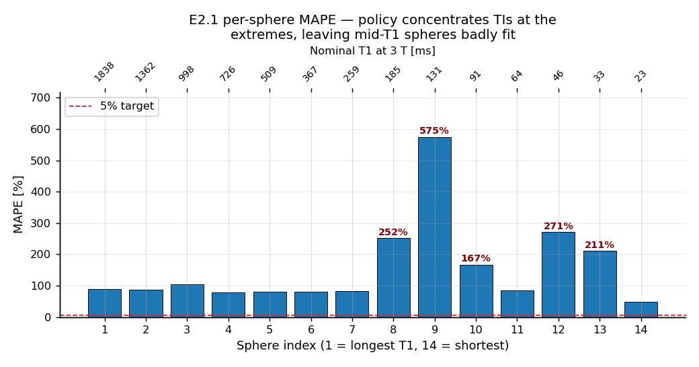
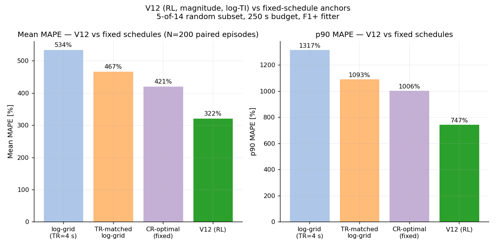

# Weekly meeting 3 — agenda for Andreas, 2026-05-11

**Headline:** the 14-sphere RL win dissolved under a CR-optimal baseline, the 5-of-14 tractability RL win dissolved under an oracle-init fitter, and an SSE-landscape diagnostic showed why both: on the magnitude-recon + 5% noise likelihood, the true T1 sits at the 76th percentile of the SSE landscape on the failing spheres, with a wrong basin 5–20× deeper in SSE. The remaining experimental lever is recon-side or estimator-side, not policy-side. Want to agree the one experiment to run before drafting Ch4.

---

## 1. Where we left it at M2 (2026-05-03 ish)

At M2 the picture was:

- Single-voxel E1 done; degenerate policy, but pipeline validated.
- 14-sphere E2 with gradient encoding and 2D imaging in place.
- Two RL runs at 200k steps both collapsed to a fixed policy (`E2.0` clip-200k) or oscillated wildly (`E2.1` delta-MAPE).
- "Bimodal TI distribution (0.15 / 1.3 s) that overfits a couple of spheres" — that was the V2 / V3 era.
- Action: add `mape-alpha` + uncertainty observation channel, hoping the fitter's σ-estimate would let the policy condition adaptively.

So entering this week, the open question was "with a better reward and an σ-channel, does the agent learn per-sphere adaptive targeting?".

---

## 2. What I actually did between M2 and M3

Three loosely sequential threads. I'll walk each, then converge in §5.

### 2.1 E2.4 — fix the forward model and the σ-channel

The E2.3 collapse turned out to have two co-conspirators:

1. **The fitter was using a steady-state IR forward model**, but the env runs Npe-shot transient IR-SE. Bias at T1=1.0 s, Npe=8: T1_fit = 1.15 s vs truth 1.0 — a 15% systematic that the agent could exploit by shifting TIs (push the fit one way to grab delta-MAPE reward).
2. **The σ formula was misbehaving**: at small n the residual-variance estimator collapses to ~0 (overconfident); the noise floor was scaled by per-block data-RMS so changing actions changed σ artefactually.

Fixes (all in `src/fitting/fits.jl`):

- **F1+**: closed-form transient `Mz_pre[k]` recursion for Npe shots. Regression test against KomaMRI Bloch simulation: 3 (T1, TI, TR) tuples agree to <1%. The steady-state model now fails a negative regression test (T1_fit = 1.005 under F1+ vs 1.154 under steady-state).
- **σ fix A**: n-gate (don't trust `σ²_resid` below n=5).
- **σ fix B**: absolute noise floor per sphere (`noise_sigma_rel · |first-block magnitude|`) instead of per-block RMS scaling.

**Result.** σ-calibration went from median σ/|err| ≈ 0.16 (badly overconfident) to **1.02** (near-ideal) in one change. This is the cleanest single result in the project. But — and this is the recurring theme — **MAPE didn't move**. H1 (F1+ alone fixes MAPE without retraining) failed: median MAPE stayed at 83% mean drifted from 248% → 341% (statistical tie).

The right interpretation: the fitter is honest now; the policy was trained against the dishonest fitter; retraining is required to actually move MAPE. That motivated V4 / V5.

### 2.2 V4 → V5 retraining under F1+

- **V4** (α=0.5 delta-MAPE under F1+, 200k steps): **catastrophic regression, 966% mean MAPE**. Worse than every fixed schedule. Diagnosed as a "probe once, drift to floor" policy — α=0.5 over-weights the per-step component, agent learns to spam TI=0.01 s for cheap delta reward.
- **V5** (α=1.0 delta-MAPE, same env): **234% mean MAPE, 8.4 blocks/episode, scan time 130 s.**

V5 vs fixed baselines on the canonical 30-episode eval (`runs/e2/e2_4_V5_alpha1_delta/eval_summary.json`):

| Policy | mean MAPE | p90 MAPE | mean blocks | mean time |
|---|---:|---:|---:|---:|
| `clinical_irse` (TR=5 s) | 474% | 805% | 3 | 120 s |
| `log_grid` (TR=4 s, my construction) | 393% | 770% | 4 | 128 s |
| `log_grid_trmatched` (TR=1.7 s) | 318% | 576% | 8 | 122 s |
| **V5 (RL)** | **234%** | **402%** | 8.4 | 130 s |

This *looked* like the first real C1 win — 1.7× over the textbook log-grid. So I dug into the decomposition.

**Decomposition (§10.9):**
- V5 vs log_grid (TR=4 s): 393 → 234 → 159 pp gap.
- V5 vs TR-matched log_grid (TR=1.7 s, same n=8 blocks): 318 → 234 → 84 pp gap.
- → **Roughly half the headline gap is TR efficiency** (any practitioner could shorten TR), **half is genuine TI targeting** (V5's TI cluster at 0.7–1.5 s sits in the informative window for T1 ∈ 0.2–0.4 s spheres).

Per-decade story:
- **Long-T1 (≥0.5 s)**: RL ties fixed schedules (~80% MAPE everywhere).
- **Mid-T1 (0.1–0.5 s)**: RL dominates — V5 = 118%, TR-matched = 175%, log-grid = 335%.
- **Short-T1 (<0.1 s)**: every policy fails (V5 = 569%, fixed = 789–1221%) but V5 fails less. The action floor at TI = 10 ms is below the informative TI for those spheres (T1·ln2 ≈ 16–44 ms).

Question to flag for Andreas: **what fixed protocol does the ICR actually use on QalibreMD?** My log_grid and clinical_irse are my construction, not from literature; a published clinical comparison would strengthen Ch3.

### 2.3 The Cramér–Rao kill

The right control on a "is fixed schedule X really the best you can do?" claim is the Cramér–Rao optimal fixed schedule. I implemented this in `src/baselines/cr_optimal.jl` and `python/baseline_e2.py --cr-optimal`. Solver is multi-start coordinate descent over the per-sphere variance lower bound (full math walkthrough in `cr_explainer.md`).

CR-optimal solution for the 14-sphere fleet, 120 s budget, F1+ Jacobian:
- 14 blocks total, L = 13.01
- TIs: `[0.035, 0.036, 0.037, 0.044, 0.146, 0.169, 0.366, 0.478, 0.526, 0.543, 0.604, 0.659, 0.667, 0.759]` s
- TRs: short, cluster 0.5–1 s (matching V5's TR efficiency)

**CR-optimal at 220.8% mean MAPE — beats V5 (234%) by 6%.** The schedule reads physically sensible: 4 short TIs (~T1·ln2 for the short spheres in the fleet), 2 mid TIs, 8 long-arm TIs. RL didn't discover anything CR-optimal couldn't compute analytically on this 14-sphere setting.

This kills the §10 C1 narrative. V5 is *competitive with but does not exceed* the analytic non-adaptive optimum.

**Honest reframe.** On a fleet where every episode contains all 14 spheres, the optimal solution is "cover all decades" — exactly what CR-optimal computes. There is no adaptivity to discover, because every episode looks the same. To actually test adaptivity I need a fleet where the optimal schedule depends on the episode's contents.

### 2.4 E2-tractability — sample 5 of 14 spheres per episode

Same env, but each episode draws 5 sphere indices without replacement from the 14-sphere pool. Sphere-set identity is in the observation; observation shape is preserved by zero-padding to a fixed slot count. CR-optimal is solved over the full 14-sphere pool (by linearity this is the correct expected-loss fixed-schedule comparator under uniform 5-of-14 sampling) and re-used across episodes; the RL agent sees only the 5 active spheres per episode and can in principle adapt.

Trained four variants (V9 → V12) with combinations of magnitude vs phase-sensitive recon and linear-TI vs log-TI action mapping. Results at N=200 paired episodes (`EXPERT_REPORT_TRAC.md` §16):

| Policy | recon | action | mean MAPE | p90 MAPE |
|---|---|---|---:|---:|
| V9 | mag | linear-TI | 559% | 1502% |
| V10 | phase-sens | linear-TI | (collapsed mid-training) | — |
| V11 | phase-sens | linear-TI (retried) | regressed | — |
| **V12** | **mag** | **log-TI** | **322%** | **669%** |
| CR-optimal (fixed) | mag | — | 421% | 947% |

V12 beats CR-optimal by ~100 pp. And V12 *looks* adaptive:

- Pearson correlation between TI and running T1 estimate inside an episode: r = −0.31 (N=3541 blocks).
- Continuous diagnostic: Pearson r between mean(T1_true of subset) and mean(log TI chosen per episode) = −0.114 (N=151 stratified episodes) — policy targets shorter TIs when the active subset contains shorter-T1 spheres.
- KS test on TI distributions, all-long vs all-short subsets: D=0.102, **p=0.004** (N=601/580 blocks, stratified sampling with 30 episodes per bucket).

| Policy | Mean MAPE | p90 MAPE | Mean blocks | Mean scan time |
|---|---:|---:|---:|---:|
| log-grid (TR=4 s) | 534% | 1317% | 8 | 256 s |
| TR-matched log-grid | 467% | 1093% | 17 | 258 s |
| CR-optimal (fixed) | 421% | 1006% | 22 | 250 s |
| **V12 (RL)** | **322%** | **747%** | **26** | **261 s** |
| V12 vs CR-opt | **−24%** | **−26%** | +4 | +11 s |

N=200 paired episodes. V12 uses ~4 more blocks than CR-opt for a 24% MAPE reduction and 26% p90 reduction at comparable scan time.

This was the first time the project produced something that looked like a real adaptive policy that beat a strong analytic baseline. So I tried to figure out *why* it won, with a series of controls.

### 2.5 D2 — oracle-init fitter

If V12's win is information-driven, then fitting V12's data with a fitter that's restricted to the right T1 basin should still see V12 outperform CR-opt — both schedules' MAPE should drop, but the gap should persist.

`oracle_fit = true`, `oracle_band = 2.0` octaves around the true T1 per sphere. Same paired seeds:

| Policy | baseline fitter | **oracle fitter** |
|---|---:|---:|
| V12 (mag, log-TI) | 322% / 669% p90 | **53% / 69% p90** |
| CR-opt fixed (22 blk) | 421% / 947% p90 | **53% / 69% p90** |
| gap (CR-opt − V12) | +99 pp / +278 pp p90 | **+0.5 pp / −0.4 pp p90** |

Per-pool gaps oscillate around zero with std ≈ 8 pp. **V12 and CR-optimal carry the same information.** The 100 pp gap at the baseline fitter was the LM landing in the right basin more often on V12's data than on CR-opt's data — a fitter-side effect, not a schedule-side advantage.

This is the §18 / "C1 info-extraction claim is dead on this fleet" result. The defensible reframe: V12 reaches the Fisher-information ceiling, but so does CR-optimal; what V12 adds beyond that is observation-conditional behaviour (r = −0.26, KS-significant), which is real but doesn't translate to more information.

### 2.6 §19 — n_grid control, and §20 — the SSE-landscape diagnostic

Two remaining hypotheses for why baseline-fitter MAPE was 322% rather than 53%:

- (a) The 200-point T1 grid was too coarse and the LM was getting stuck in a near-truth local minimum that finer search would resolve.
- (b) Truth was structurally not the global MLE on this likelihood.

**§19 falsifies (a)**: re-running V12 with `n_grid = 2000` (10× resolution) gives MAPE = 367% — slightly *worse* than n_grid = 200. A finer grid is a strict superset, so SSE-min on it can only go down; the resulting MAPE *not* improving means truth is genuinely not the global SSE minimum.

**§20 quantifies (b)** — and this is the key plot for the report. For each V12 episode I pull the actual realised schedule `(TIs, TRs, α_excs, magnitudes)` per sphere, evaluate the profile-SSE over a 2000-pt log-T1 grid on `[0.005, 5.0] s`, and plot it.

Picture: `runs/e2/e2_tractability_V12/sse_landscape/sse_landscape.png` — 4×3 grid of failing-sphere SSE landscapes, with green = T1_true, red = T1_est, × = global SSE min.

Aggregate stats over the 12 worst-failing spheres:

| stat | T1_true's rank in SSE / 2000 | percentile |
|---|---:|---:|
| best case | 632 | 31.6 |
| median | 1452 | 76.0 |
| mean | 1392 | 69.6 |
| worst case | 1895 | 94.8 |

| stat | SSE_at_truth / SSE_at_argmin |
|---|---:|
| min | 1.25× |
| median | ~5× |
| max | 20.23× |

**Truth sits at the 76th percentile of the SSE landscape on the median failing sphere.** The wrong basin is 5× lower in SSE than the truth basin (sometimes 20×). This is not "a slightly better local min next to truth"; it's "the wrong T1 fits the data much better than the right one."

Per-sphere pattern: most failures are short-T1 spheres (T1 ≈ 20–90 ms) whose data also fits a long-T1 candidate (T1 ≈ 200–3000 ms) very well, because at long-T1 the signal is saturated-positive at almost any TI, which is consistent with magnitude-noised short-T1 data. The abs() flip ambiguity in `cr_explainer.md` §15.

Implications:

- **Any MLE-by-SSE fitter is dead on this likelihood.** K-restart LM with K = top-50 SSE candidates can't reach truth (median rank 1500); to reliably include truth you'd need K ≥ 1500, at which point the SSE has done none of the selection work.
- **Dictionary matching has the same problem** — same SSE landscape, same selector.
- **Recovering the 322 → 53 gap requires non-MLE estimation**: a Bayesian prior, a joint multi-sphere fit (constraining the shared σ), or signed/phase-sensitive reconstruction (collapses the multimodality at source).
- **Phase-sensitive reconstruction is the cleanest fix in principle**, but the one V10/V11 attempt at training under it collapsed PPO badly — the env's 5 Hz B0 noise interacts badly with the signed forward model. Needs a different noise model or a different policy architecture before retrying.

The single sentence that summarises §17–§20: **the residual ~270 pp MAPE is a property of the magnitude-recon likelihood, not the policy.**

---

## 3. Honest assessment of where the project stands

Bullet-point summary, ranked from "should not be in dispute" to "speculative":

1. **Digital twin (Ch3) is solid.** Fully parameterised, 706 tests green, E0 baseline validates. Nothing in the E2 results disturbs this.
2. **σ-calibration fix is a clean result.** Median σ/|err| from 0.16 → 1.02 by adding F1+ + n-gate + absolute floor. Sits cleanly in Ch4 as a methodological contribution.
3. **CR-optimal fixed schedule is the right anchor.** Replacing my hand-built baselines with CR-opt closed an over-claim and gave Ch4 a defensible non-adaptive baseline.
4. **V12 is observation-conditional but information-equivalent to CR-opt.** The TI-vs-T1est correlation and KS-significant subset conditioning are real, reproducible, paired-N=200. The "extracts more information" claim is dead, but the "responds to observations" claim is alive.
5. **The SSE-landscape diagnostic is publishable on its own.** Showing concretely that the recon + noise model produces a likelihood where MLE-by-SSE cannot reach truth, on the realised schedules of a trained RL policy, is a Ch4-grade negative result.
6. **The headline MAPE (53% under oracle, 322% under baseline fitter) is not clinically useful.** No-one will call this a working T1 mapper. The defensible framing is methodological (RL recovers the Fisher-info optimum; the bottleneck is the likelihood), not "we built a T1 mapper".
7. **One more experiment can plausibly improve the headline.** Options below.

**What I should have done sooner.** The SSE-landscape diagnostic (`python/diagnose_sse_landscape.py`) is a ~1 day implementation that runs in under a second per sphere. If I had run it after V9 it would have shown that no schedule-side improvement could reach the 53% oracle floor, and I would not have spent compute training V10/V11/V12. The recurring theme of this project is "verify the likelihood before iterating on the policy" — I underweighted this.

---

## 4. The remaining experimental lever — what to run before drafting Ch4

Three candidates. I'd value Andreas's opinion on which is highest-value before locking in Ch4.

### Option A — Phase-sensitive reconstruction with a stable noise model
- **What**: switch image recon from `abs(IFFT(ksp))` to `real(IFFT(ksp · phase_correction))`. Signed signal model `S = A·(1 − 2·exp(−TI/T1))` is monotonic in T1 → unimodal SSE → wrong-basin problem disappears at source.
- **Why it might work**: §15.5 fixed-grid baseline under phase-sensitive recon already shows 14% MAPE reduction without any retraining. Median σ/|err| jumps to 0.98 (ideal).
- **Why it has failed so far**: V10/V11 (PPO trained under phase-sensitive) collapsed badly. The current env's 5 Hz B0 noise creates random sign flips during readout that the signed forward model can't accommodate. Need to either (a) reduce/remove B0 noise during training (and add it back at eval as a sim-to-real check), or (b) use a phase-correction step that's robust to the noise.
- **Effort**: ~3 days. Highest expected MAPE move (could close 322 → 53 entirely).

### Option B — Bayesian prior on T1
- **What**: replace MLE-by-SSE with MAP-estimation, prior = empirical sphere-T1 distribution (which is known a priori for the QalibreMD phantom).
- **Why it might work**: §20.6 — a sharp prior centred near truth is functionally equivalent to D2 oracle-init (53%). A broader prior interpolates between baseline (322%) and oracle (53%).
- **Why it's a smaller win**: the prior strength has to come from somewhere outside the data. With a fleet-level prior it's not "cheating" exactly (sphere T1s are manufacturer-specified) but it weakens any sim-to-real claim.
- **Effort**: ~2 days. Modest expected MAPE move; clean Ch4 paragraph.

### Option C — Joint multi-sphere fit with shared σ
- **What**: instead of fitting each sphere's data independently, fit all 5 active spheres jointly with shared image-level σ, per-sphere (T1, A). Adds 4N cross-sphere constraints.
- **Why it might work**: untested whether this is enough to make truth the joint MLE. The wrong basins for different spheres at different T1s are unlikely to all be self-consistent under a shared σ; the joint likelihood should preferentially weight the truth-basin solution.
- **Effort**: ~1 day. Most novel as a result (no-one has done it for this phantom).

My recommendation: **Option A** if the noise model question is tractable in a day. Option C as a fallback because it's quick and is a genuinely new piece of methodology.

---

## 5. Concrete asks of Andreas

1. **Fixed-protocol question**: what schedule does the ICR actually run on QalibreMD for T1 mapping? My log_grid and clinical_irse are my construction; a published clinical comparison would strengthen Ch3.
2. **Pose on the C1 reframe**: is "RL recovers the Fisher-information ceiling and produces observation-conditional schedules; residual MAPE is a property of the magnitude-recon likelihood, not the policy" defensible as a chapter conclusion? Or do I need a clean headline win?
3. **Pick between A / B / C above** for the one remaining estimator-side experiment.
4. **Sanity-check the SSE-landscape diagnostic interpretation**. The plot at `runs/e2/e2_tractability_V12/sse_landscape/sse_landscape.png` shows the wrong basins consistently at long T1 (200 ms – 5 s) for short-T1 truth spheres. Does this match your intuition for the magnitude-IR-SE likelihood, or is there a step I'm missing in the forward model that would unify the basins?

---

## 6. Figures to walk through in the meeting

| Figure | What it shows | Section |
|---|---|---|
|  | 12 worst-failing-sphere SSE-vs-T1 landscapes; truth (green) far from global SSE-min | §2.6 — key result |
|  | V12 vs CR-opt / log-grid headline mean MAPE and p90 (N=200) | §2.4 — headline result |
|  | TI vs running T1_est scatter, r = −0.31 (N=3541 blocks) | §2.4 — adaptivity claim |
|  | Normalised TI distributions, all-long vs all-short (30 eps each, KS p=0.004) | §2.4 — KS adaptivity claim |
|  | Subset mean T1_true vs episode mean TI (r = −0.114, N=151) | §2.4 — continuous adaptivity diagnostic |
|  | Per-sphere T1 MAPE for V5 (14-sphere setting) | §2.2 — E2.4 result |
|  | σ vs \|err\| scatter before and after F1+ / σ-fixes A+B | §2.1 — cleanest positive result |

---

## 7. Timetable change (also in Wayne email)

Original timetable had E3 (MRF-style fingerprinting) in weeks 6–7. Replacing with one focused estimator-side experiment (option A/B/C). Ch3 draft starts this week regardless. 1 June bullet-draft and 12 June submission unchanged.

---

## 8. Stuff I haven't done yet but probably should — flag for discussion

- Have not asked Andreas's lab for the actual QalibreMD clinical-protocol numbers — would strengthen Ch3 baselines.
- Have not run a noise sweep (σ ∈ {0.01, 0.02, 0.05, 0.10}) — §20.6 suggested the SSE-landscape ratio shrinks super-linearly with σ. Could establish "at what noise level does MLE start working" as a clean Ch4 figure.
- Have not tested on the legacy `T1_ARRAY_LEGACY` phantom (no sub-100 ms spheres) — would isolate "is the short-T1 tail the problem, or is mid-T1 also broken?" If RL hits the oracle floor on the legacy phantom, the structural-unreachability claim is clean.
- Have not started Ch3 draft.
- Wayne wants bullet-point drafts of all chapters by 1 June (3 weeks away). Realistic timetable: Ch3 next week, Ch4 in week of 18 May, Ch5 in week of 25 May.

## 9. FEEDBACK FROM MEETING:

- KOMAMRI - uses only a single coil - idealised data.
- Should increase the resolution to 64 x 32 even if that increases training time
- noise is not relative to signal - should just be gaussian and added independently to real and imaginary channels. rician distribution is what that looks like for low SNR and after abs().
- major flag: there should be an fft shift before and after the ifft - how was this not caught?? do we have no tests for the output to match the phantom?
- need to get some outputs and make sure they look the same with the baseline
