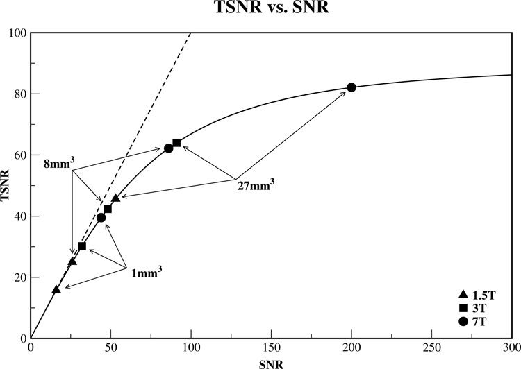
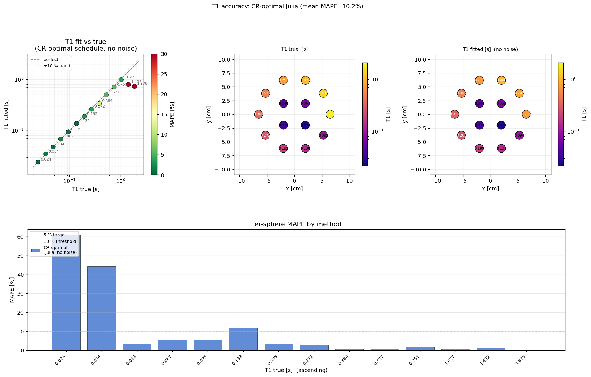

# Last meeting:

I had found and fixed KomaMRI bug. Was continuing with tests to make sure simulation environment was accurate.

# What have I done since our last meeting?

Trying to make sure the simulation environment is accurate and will work. Ran some experimental sweeps across different hyperparams before running a simulation.

The params being sweeped:

- Npe - y aixs phase encoding. Params tried: (8, 16, 32) 
- Nfe - x axis gradient / number of readings during ADC window. Params tried: (32, 64, 128)
- SNR - std ($\sigma$) of gaussian noise added to k-space readings - real and imaginary seperately. (Absolute value not relative to signal)
- Time Budget (experimented with 80, 120, 160, 240)
- Voxel size - tried 3.0mm
- field strength (shouldn't matter kept at 1.5T)

To sweep I used a Cramer-Rao optimised sequence given the time budget. TODO: understand implementation and compare with: https://ecat.github.io/adbs.html

## Sweep of Npe, Nfe and Voxel Size

Used recon_vs_phantom.jl and recon_vs_phantom.py to plot phantom spins vs image signal and plotting the k-space - they are visually good so fft shifts work.

This was done with no water and single x,y sheet with 1.5mm thickness in z axis.

Findings:
- Use Npe = 33, Nfe = 65 with voxel size = 1.0mm^3
- Use odd Npe and Nfe to have single DC row and column
- IR-SE sequence works well as r > 0.9 

Best findings:

Questions:
- Streaking on this image - what is that from?

Notes:
- The higher spin count in center is because of z-axis - they are spheres so highest height in middle. This does change the amplitude - is that an issue? I don't think so since M0 is free and T1 is the decay so starting point doesn't matter.
- Sampled at .5mm^3, not worth extra spins
- Sampled at 3.0mm^3 and Nfe=129 and Npe=65, worse results

## Noise investigation

Initially assumed noise should be added relative to signal strength - e.g. 5%. Then was told more accurate to add gaussian noise with mean 0 and std being a hyperparam. What to set std to?

Looked into what were usual SNR values for clinical MRI:
20-50 very rough estimate as couldn't find any papers that are T1 mapping specific.

Papers looked at:
- https://pmc.ncbi.nlm.nih.gov/articles/PMC2223273/ - study of SNR. E.g.:

Shows voxel size varying since we use 3mm^3 the 20-50 range is approximately right.

- https://pmc.ncbi.nlm.nih.gov/articles/PMC2799645/ - inversion recovery paper for brain matter: SNR ~20. Range from: 16 (LB) - 30 (UB) for 1.5T and 12 - 35 for 3T

So would like to stay within that range for experiments.

How to improve SNR: https://radiopaedia.org/articles/signal-to-noise-ratio-mri?lang=gb 

### Calculating SNR
 - https://www.nema.org/docs/default-source/standards-document-library/ms1-2008-r2014-watermarked.pdf?sfvrsn=2101f7b9_2 

Used methods 4 and 2

Things i need to report according to NEMA:

Pixel bandwidth Hz per pixel
Voxel dimensions millimeters
Receiver channel 3dB bandwidth kHz
Phantom filler specific conductance (or phantom filler composition) Siemens per meter
Phantom dimensions millimeters
Sequence repetition time (TR) milliseconds
Echo delay time (TE) milliseconds
Number of signals averaged (NSA) ….
Data acquisition matrix size ….
Field of view millimeters
Pulse sequence name ….
Software version ….
Receive/Transmit coil(s) used …
Statement of geometric distortion correction algorithm …
Statement of RF receive coil correction algorithm …
Type of signal filters used (time and/or image domain) …
Scan room temperature ºC
Phantom temperature ºC

### Rough internal estimate
SNR_ksp = sqrt(mean(|ksp|²)) / σ

## How I calculate σ

Run a reference sequence

## Field Strength issues

Made sure all scanners had same B0 as phantom that was being passed in.

## t1_fit_vs_true

Wanted to test E2Env pipeline fully before comitting to another training run. Found some strange results - the longer the time budget the worse the MAPE was?

I also wanted to double check what the lower bound was for accuracy so tried a manual sequence on the 14 spheres, with unlimited time budget and a large range of TIs and no noise. Confusignly, this led to worse accuracy than budgeted TIs.

This is my main question/problem.

# 240s results

55% error is from inversion issue - see top right.

# Manual results

## Best results

So there is noise coming from somewhere in the system and I don't know where. Let me understand what is being plotted.

Use M zero and T one values 

Looking at the noise stats for bMANUAL_nonoise:

- snr_dual_per_sphere - massive ten to the fifteen
- zero temporal instability - these are the same 

## Problems:

Can't get it to go predictably below about ten percent MAPE. Can't figure out why manual is worse...

Added noise and built that out.

Is more spins the issue - probably not, or is sequence the issue - it probably is. 

## Key takeaways from meeting:

- For SNR: use variance so doesn't need to be just 2 images could be multiple - not as important as already averaging over pixels but depends how many pixels you have. Also inspect the output image visually - blurry artifacts like in just spins image is roughly right. SNR depends on too much (pixel bandwidth, coils, etc.) so don't overoptimise it.
- Convention is actually -16 to +15 not 33 shots. This could be useful for 
- Still want to investigate Brewsters angle

- If i want to look into other sequences I should look at Pulseq - their github has examples
- Read the KomaMRI sequence guides. Understand what a gradient echo sequence is.

- If i add water should take a z slice as since no gradient taking full z into account not just a slice.
- Look into the Block dict simulation method if I can't get this way working. Would actually just be a good comparison in general.
- Whatever the acquired resolution is it can be increased by extending k space with a bunch of zero value entries - nearly doubling - not sure why this would be useful
- Hamming window and gibbs ringing was brought but he said not to worry about that.
- 

To understand:
- He thought there could have been more than one line per inversion for the sequence - whatever that means??

Next steps:
- Check the transverse spoiling - make sure there is no residual as not sure what the T two values are rn need to be sensible. As longer the simulation runs the worse it gets - also can be seen by artifacts in k-space at higher Npe.
- Try with all same T1 (i.e. same spin) to see the effects and go back to E1 basically and make sure that actually works
- Double check fitting tests and images.

TODO:
- Pick a z-slice with water - say one mm thick
- Send Wayne email