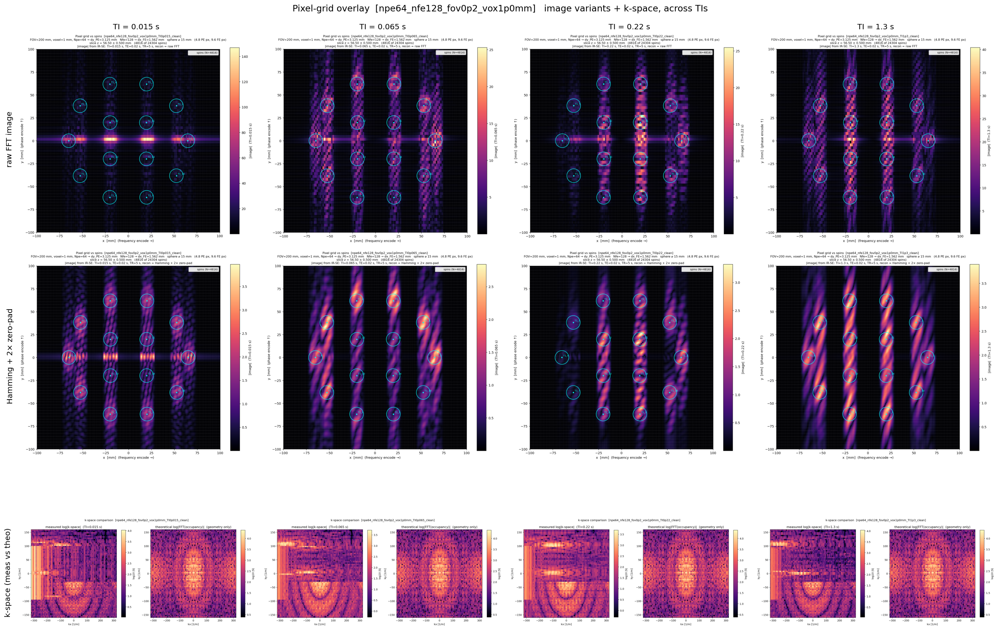
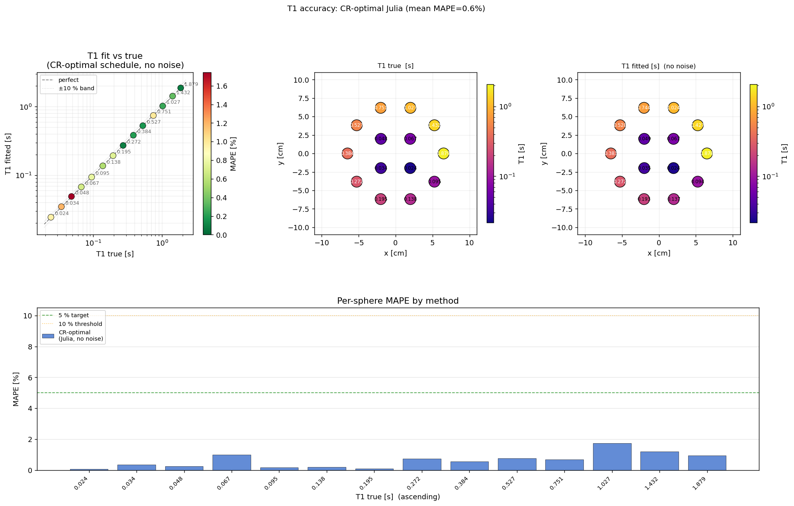
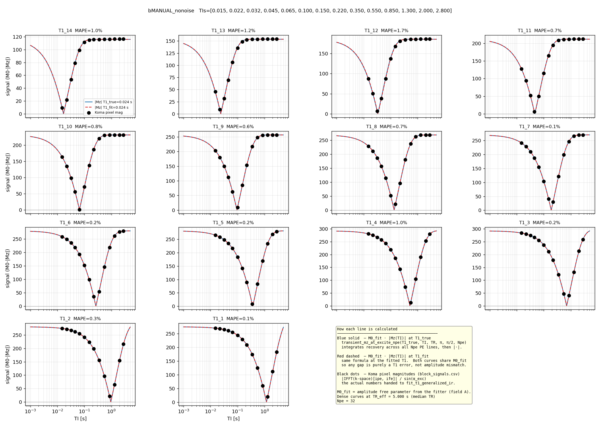

# Where we left off last week

I was getting results I still couldn't explain.

## Same bug, different place

### Theory vs simulated k-space:

k-space was the real unlock realised it was drifiting again and only with time. But did go down the rabbit holes of adding gradient spoiling and cleaning via hamming window plus zero padding as thought it could be Gibbs ringing?

https://github.com/JuliaHealth/KomaMRI.jl/issues/788
With fix (unmerged): https://github.com/JuliaHealth/KomaMRI.jl/pull/789 

TODO: check where else MIN_RISE_TIME is being used or any 10^-X constants are used. Now gradients and RF working up to 1500 seconds.

Finally got some nice images:

## First good news of project

Results I can actually explain. Yay!

Got MAPE down to 0.6% for a manual run (no water):

For CR optimal baseline at 240 seconds with water 32x128:

4 shots is not a lot...

## Noise investigation:

SNR sweeps at 1mm voxel:

Scales with voxel 

Have done a lot of snr sweeps:

With sigma = 100 with water:

## Running some RL:

Now (finally) ready to run some RL. Booted a 14 sphere just TI, TR run with water and single slice phantom - abuot 50k spins at voxel_mm = 1.0mm^3 and each step (i.e. simulation) takes about 4 seconds. For a typical training run with 200k steps becomes 9 days. That is not going to work.

## Sols for the speedup
Realised i was not running threads (I have 16 core CPU)

### Culprits for the slow down
- Npe raised from 8 to 32 - 4x slowdown as main blocker is the simulation of bloch equations.
- Increased spin count from water + voxel size at 1mm^3 vs 3mm^3

42,638 spins with water → 4,816 without (spheres only) — water is ~90% of the spin count that is the main issue right now but water does make a difference.

### Questions:
1. Should i run with water or without water?
2. What are the most interesting runs i should prioritise?
3. Vary alpha straight away?
Should i vary alpha? TE? - currently only select a single pizel in the z axis. Time budget wise? 160, 240, more?

## Future work planned:
1. Try running on GPU to see the speed up (I have 100 hours)

Vary alpha, don't vary TE. 

Try and make all water the same calculation? main issue is that the gradient changes - but that just affects the k-space reading right? so could have a mask of some sort? and just add water to k-space?? or look into bloch dict - precompute the values MRF kind of vibe:

supervisor email:

A full MRI pulse sequence typically runs a few minutes, exceeding 120s is normal. Your example with a 90 deg hard (non-selective) pulse is likely the worst possible case. If the RF pulse is slice- or volume-selective, it would usually start with zero amplitude (some sort of sinc shape convolved with a window function) and then missing out the first segment of the RF pulse is not the end of the world - still it should be accurate 🙂. Another way to mitigate the issue is to split the whole sequence into parts and simulate each one on its own (taking the last magnetization state as an input to the next block). 

There could be some potential for accelerating the simulations, if the sequence is long and uses a lot of identical / similar RF pulses, one could pre-calculate the effect of such an RF pulse (without having to write it out explicitly in the sequence) - however then some of the features of KomaMRI, such as simulating the effect of basically arbitrary motions of the spins during the sequence are lost / less accurate.

In this context another thing that came to my mind is (if the image reconstruction poses issues) that you could use the BlochDict simulation option in KomaMRI, which basically returns the magnetisation evolution for each spin in the phantom - in that case you wouldn't need to do the ifft / fftshift (of course adding the complex noise and performing the image reconstruction is closer to the real scenario).

Plan response to this:

TODO: COARSER VOXEL SIZE FOR WATER

I've now got the full picture, including a key find: src/forward_model.jl already contains a band-limited analytic IR-SE forward
  model (ir_se_theory_image). That's ~80% of the machinery for the best lever. Here's my read.

  The economics (from M5 + your runtime memory)

  Per-step cost ≈ Npe · TR · n_spins. Water is 42,638 / 47,454 ≈ 90% of spins but carries zero contrast information — it's one
  material (T1=2.8s, T2=2.2s, ρ=1, Δw=0), identical for every spin. You're paying 90% of the Bloch solve to image a uniform blob.

  The levers split into two independent stacks that multiply: (1) throughput (same physics, more cores/GPU) and (2) spin reduction
  (exploit water uniformity). Do both.

  Ranked options

  ┌─────┬─────────────────────────────────┬──────────────────────┬────────────────────────┬───────────────────────────────────┐
  │  #  │              Lever              │       Speedup        │      Realism cost      │              Effort               │
  ├─────┼─────────────────────────────────┼──────────────────────┼────────────────────────┼───────────────────────────────────┤
  │ 1   │ Threads (JULIA_NUM_THREADS, 16  │ ~4–8×                │ none                   │ trivial — thread_probe.py already │
  │     │ cores)                          │                      │                        │  exists                           │
  ├─────┼─────────────────────────────────┼──────────────────────┼────────────────────────┼───────────────────────────────────┤
  │ 2   │ --n-envs SubprocVecEnv          │ ~Nx wall-clock       │ none                   │ already wired                     │
  ├─────┼─────────────────────────────────┼──────────────────────┼────────────────────────┼───────────────────────────────────┤
  │ 3   │ GPU (--use-gpu, 100h budget)    │ large at high spin   │ none                   │ already wired                     │
  │     │                                 │ counts               │                        │                                   │
  ├─────┼─────────────────────────────────┼──────────────────────┼────────────────────────┼───────────────────────────────────┤
  │ 4   │ Analytic/hybrid water (the big  │ ~10× on the solve    │ near-zero*             │ medium — half-built               │
  │     │ one)                            │                      │                        │                                   │
  ├─────┼─────────────────────────────────┼──────────────────────┼────────────────────────┼───────────────────────────────────┤
  │ 5   │ Coarser water-only voxel size   │ ∝ spin drop          │ mild k-space sampling  │ small                             │
  │     │                                 │                      │ error                  │                                   │
  ├─────┼─────────────────────────────────┼──────────────────────┼────────────────────────┼───────────────────────────────────┤
  │ 6   │ BlochDict (Andreas)             │ ~0 for speed         │ n/a                    │ skip — it cuts recon, not spins   │
  └─────┴─────────────────────────────────┴──────────────────────┴────────────────────────┴───────────────────────────────────┘

  *near-zero given static, on-resonance, well-spoiled water — which is exactly your phantom.

  Why hybrid water is the right answer (and capitalises on "all the same spin")

  Because water is one material with Δw = 0, every water spin has an identical magnetization envelope; gradients only impose
  position-dependent phase. So water's entire k-space contribution factorises exactly:

  S_water(k) = m_w(TI, TR, α, T1_w)  ·  W(k)
               └─ one Bloch scalar ─┘    └─ FFT of water occupancy mask ─┘

  - W(k) (water geometry) is fixed per episode → compute the FFT once at reset, cache it.
  - m_w is one scalar per step — exactly the transient ir_se_theory_image already computes from transient_mz_at_excite_npe.
  - KomaMRI sums spins linearly, so ksp = ksp_spheres_simulated + m_w · W_cached is exact superposition, not an approximation of
  the recon.

  Net: full Bloch sim runs on 4,816 sphere spins only; water collapses to a cached array scaled by a scalar. Per-step water cost ≈
  0. And critically — varying α only changes the scalar m_w, never W — so this is fully compatible with your alpha-as-DoF action
  space.

  The only things you give up for water: slice-profile variation, shot-to-shot Mxy carryover, and per-spin off-resonance (breaks if
   you turn on B0_sigma_Hz augmentation). All negligible for a static, spoiled, on-resonance water bath. This is also a clean C2 
  ("scalable simulation-in-the-loop") contribution for the report, not just an engineering hack.

  Making it a package feature (your follow-up)

  Rather than bolt it onto train_e2, put it in QalibreMDPhantom as a phantom/sim-time concern:

  1. WaterModel knob in PhantomConfig: :sim (current), :analytic (hybrid), :none. Any experiment (E2/E3) toggles it.
  2. Separate water_voxel_size_mm from sphere voxel_size_mm. Today builder.jl:251 uses one global delta_x for both. Decoupling lets
   you:
    - keep spheres at 1 mm (contrast detail matters),
    - coarsen simulated water (option 5) — with the caveat that going below the recon pixel pitch FOV/Npe aliases the water mask;
    - for analytic water, voxel size just sets the occupancy fine-grid and stays cheap regardless.
  3. build_water_kspace_template(cfg, Npe, Nfe, FOV) helper next to build_background_water — returns the cached W(k). The hybrid
  step does ksp_spheres .+ m_w .* W.

  Suggested order

  1. Today, free: run thread_probe.py, set threads, add --n-envs. Re-price with bench_e2.py. This alone may get 9 days → ~1–2 days
  with zero risk.
  2. Validate the factorisation: sphere-only sim k-space vs sphere-only analytic — confirm amplitude/phase match (forward_model
  docstring claims intensity is conserved; verify).
  3. Build hybrid water, gate behind WaterModel=:analytic, validate full hybrid vs full sim on a few (TI, α) points (target: image
  MAPE diff < noise floor).
  4. GPU as the backstop for any remaining heavy runs.

  Want me to start with step 1 (wire threads + re-benchmark) so you get an immediate number, or go straight to prototyping the
  hybrid-water template (step 2–3)?