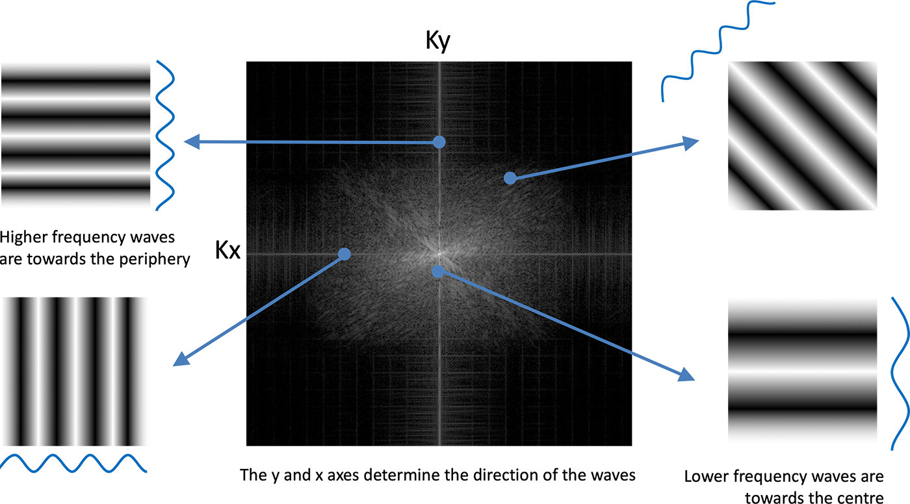

# k-space, FFT shift 

TODO: explain why FFT shift is needed

SEE notes.md before writing this section

just notation no? expects the (0,0) value to be centre of k-space (i.e. 0 y freq, 0 x frequency) then wants a wraparound - once you reach max pos next val should be most min and then back up to -one. so need to shift everything around:

A typical k-space diagram looks like:

> Image space and k-space. Any magnetic resonance image can be equivalently represented as a matrix of intensities I(x,y) or a matrix of spatial frequency amplitudes S(kx,ky). The central portion of k-space describes the low-spatial-frequency components, and the outer edges describe the high frequencies, which determine image resolution. (Only the magnitude images are shown, and there is a corresponding phase map in each space.)
> Source: Buxton RB. Mapping the MR signal. In: Introduction to Functional Magnetic Resonance Imaging: Principles and Techniques. Cambridge: Cambridge University Press; 2009. p. 205–31.

> Effect on the image of individual k-space values. Each point in k-space represents a sine wave pattern across the image plane (illustrated for the two circled points), and the k-space amplitude is the amplitude of that wave in the image. The wavelength gets shorter moving away from the center of k-space, and the angle of the point in k-space determines the angle of the wave pattern in image space.
> Source: Buxton RB. Mapping the MR signal. In: Introduction to Functional Magnetic Resonance Imaging: Principles and Techniques. Cambridge: Cambridge University Press; 2009. p. 205–31.

<!--  -->
<!-- OLD FIGURE from: https://www.radiologycafe.com/frcr-physics-notes/mr-imaging/k-space/ -->

% TODO: MOVE THIS VIEW TO DIAGNOSING THE KOMA-MRI BUG? %
Couple of different ways of reading k-space diagrams. Firstly, each horizontal row is one signal acquisition (at least for traditional sequences such as IR-SE) at a specific phase encoding. So time up the y-axis and so harder to get higher pixel resolution in that direction as increases scan time. While across each is a different x gradient - which is done by adding a Gx during ADC and a pre-winder to acquire a signal across all gradients.

Another way of thinking of k-space: is that each pixel has a weighting and an x,y value. This [x,y] vector uniquely describes a wave across the FOV - in the same orientation as the vector with spatial frequency magnitude of vector. This means a couple of things:

- The further out you go in k-space the higher the spatial frequency i.e. the finer details
- The center row was acquired with Gx=0 i.e. no gradient so this is the sum of that row in the image - so brightest and where most information is
- The center (0,0) pixel has neither gradient - sets overall average signal strength and is called the DC shot.

- Acquisition convention - go from -N, -N+1, ..., 0, ..., +N-1 - so one more negative shot. E.g. for 32: -16, .., 0, .., 15

K-space is spatial frequency encoding of pixels (an image) to get there you had to do a Fourier Transform:

Gibbs ringing, Hamming window, K-space padding

Finite sampling of an infinite sequence:

-> We sample frequencies which we then use to reconstruct the image using an inverse fourier transform - i.e. go from k-space to image space. However, we only sample a limited range/band of frequencies (Npe x Nfe) so there will be some inacurracies in the reconstructed images.

To properly understand these it helps to think of sampling a limited range of frequencies as the same as knowing exact, infinite K-space and then multiplying by a box function - one that is 1 if [x,y] < [Nfe, Npe] and 0 outside as this would similarly restrict our sampling. We then can properly quantify what this box function multiplication will do to our reconstructed image.

It turns out the K-space multiplication is equivalent to image space convolution - by the convolution theorem. A useful intuition for why this is true is multiplication of two polynomial functions, which is pointwise multiplication if you multiply pointwise each of the two curves. However, to combine the actual polynomials: that is a convolution. With polynomials with their powers being a similar decomposition or fourier transform into discrete powers of x if you will.

%TODO: INCLUDE CONVOLUTION THEOREM FORMULA %

This means multiplying by bin is equivalent to convolving by the fourier transform of the bin function - this turns out is a famous result called the dirilecht kernel. And this will be done for every pixel and the resulting spread that pixel will have is called the PSF function - which is governed by this equation:
%TODO: INCLUDE PSF EQUATION - 1D only %
Side note on scaling with N: as you can this is periodic with cycle = FOV, but there are N lobes - with the first lobe being at 21\% of main lobe strength and then down from there. This is usually fine in uniform areas - two neighbouring pixels if they have the same signal intensity will cancel each other out - negative lobe will constructively intefere with positive lobe of other pixel. The issue is at boundaries/discontinuities where on pixels value is higher than another - that pixel will leak its signal to the other ones - creating lobes and waves.

% CAMBRIDGE DIAGRAM (visual diagram including 2D convolution saved as psf.png) %

> Original caption: Fig. 9.15. The point spread function. The production of a blurred image is shown as equivalent operations in the image domain (A) and in k-space (B). The limited extent of sampling in k-space is described by multiplying the full k-space distribution by a windowing function that cuts out the high spatial frequencies. The resulting image is the convolution of the true image with the Fourier transform (FT) of the windowing function, the point spread function PSF(x). The full two-dimensional (2D) version of the PSF is shown at the bottom.
> Buxton RB. Mapping the MR signal. In: Introduction to Functional Magnetic Resonance Imaging: Principles and Techniques. Cambridge: Cambridge University Press; 2009. p. 205–31.

How do you reduce this? 

Natural question: lets just increase N - bigger box surely helps? Depends what the convolution of a bigger box is? Turns out its same function but the lobes are closer together - so don't actually remove the ringing - you just make it die down in less distance by having more pixels in that distance.

One solution is to not use a discrete box but instead use something with softer edges, there are many possible functions: see here for comparison: https://www.gaussianwaves.com/2020/09/window-function-figure-of-merits/ but a popular one is called a hamming window.

## Hamming window

  - as the fourier transform (so PSF) of that will have side lobes that are much smaller, still decreasing by 1/x i think. One example is the hamming window:

% HAMMING EQUATION - bring up diagram next to it %

Which is a trade-off though as you can see those edges are properly dimmed and edge of k-space is that finer detail so you lose resolution - blurrier image - but also reduce ringing.

You can also round neighbouring pixels - smooth the image by using an average - e.g. ROI of 3x3 vs 1x1 equivalent of smoothing and so the lobes cancel each other out - even at edges - but you slightly remove the edges.

Unsure about:
1. Those lobes are each pixel somehow? The top denominator has N peaks/troughs for each FOV - so therefore yes is neighbouring pixels.

> The point spread function. The production of a blurred image is shown as equivalent operations in the image domain (A) and in k-space (B). The limited extent of sampling in k-space is described by multiplying the full k-space distribution by a windowing function that cuts out the high spatial frequencies. The resulting image is the convolution of the true image with the Fourier transform (FT) of the windowing function, the point spread function PSF(x). The full two-dimensional (2D) version of the PSF is shown at the bottom.
> Buxton RB. Mapping the MR signal. In: Introduction to Functional Magnetic Resonance Imaging: Principles and Techniques. Cambridge: Cambridge University Press; 2009. p. 205–31.

> *Figure X. Hamming apodisation:* window weights and their point‑spread response. (a) k‑space weighting applied before reconstruction (N = 32 phase‑encode lines). The box "window" (no apodisation) weights every line equally at 1.0; the Hamming window 0.54 − 0.46 cos(2πn/(N−1)) tapers smoothly to 0.08 at the k‑space edges, retaining its full weight only near the centre (DC). (b) Corresponding point‑spread functions, shown as magnitude in decibels (normalised to the main‑lobe peak at 0 dB) versus offset in image pixels. The box window's abrupt truncation produces −13 dB side‑lobes that ring across neighbouring pixels, the source of Gibbs ringing at sharp edges; the Hamming taper suppresses these to −43 dB (dotted lines) at the cost of a ~2× wider main lobe (≈ ±2 px vs ±1 px), i.e. reduced spatial resolution. Side‑lobe nulls fall on integer pixel offsets, so each side‑lobe spans roughly one pixel.

> **Figure X. Why finite k‑space sampling rings, and how Hamming apodisation suppresses it.** One‑dimensional reconstruction from a finite acquisition of N = 32 phase‑encode lines, comparing no window (box truncation, blue) with a Hamming window (red). **(a)** Point‑source response — the reconstruction point‑spread function (PSF). The box truncation yields a Dirichlet (sinc‑like) PSF whose zero‑crossings fall exactly on integer pixel offsets (open markers): an on‑grid point leaks nothing into neighbouring pixels at the sample points. The Hamming PSF has a ~2× wider main lobe, nonzero at ±1 px, so it blurs adjacent pixels, and a lower peak reflecting the window's DC attenuation. **(b)** The same two PSFs convolved with a step edge (true edge dashed). The box PSF's −13 dB side‑lobes fail to cancel across the discontinuity, producing Gibbs ringing (~9% overshoot) on both sides; the Hamming window's −43 dB side‑lobes suppress this ringing, at the cost of a softer, wider edge transition. Equivalently, panel (a) is the PSF and panel (b) is that PSF convolved with an edge — the point‑spread function explains the edge artefact.