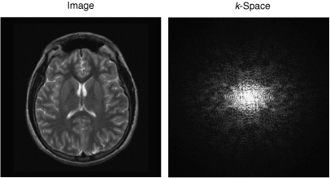
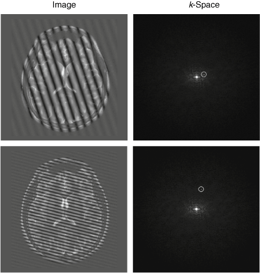
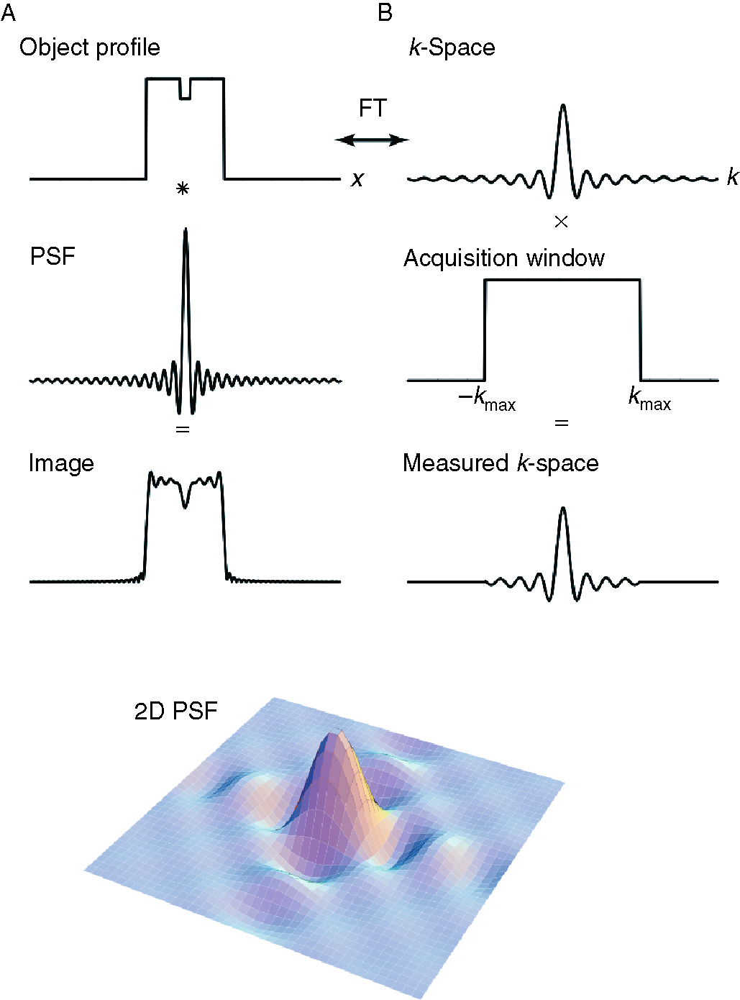
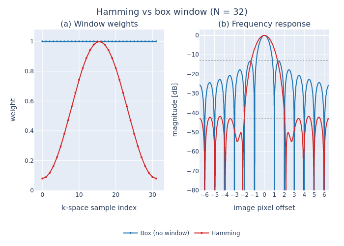
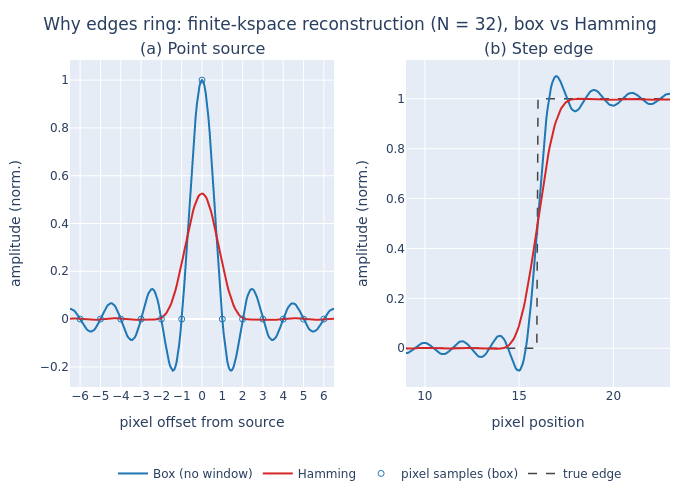

# k-space, Reconstruction, and Truncation Artefacts

The previous section established how gradients encode position: a gradient $G$ makes the precession frequency position-dependent, so the acquired signal at gradient moment $\mathbf{k}(t) = \gamma\int_0^t \mathbf{G}(\tau)\,d\tau$ is

$$
S(\mathbf{k}) = \int m(\mathbf{r})\,e^{-i2\pi\,\mathbf{k}\cdot\mathbf{r}}\,d\mathbf{r},
$$

the Fourier transform of the transverse spin density $m(\mathbf{r})$. The set of all sampled $S(\mathbf{k})$ is **k-space**, and the image is recovered by an inverse Fourier transform. This section explains how to read that k-space, the index bookkeeping (the *fftshift*) needed to invert it correctly, and the artefacts that arise because only a finite patch of k-space is ever sampled — culminating in Gibbs ringing and its suppression with a Hamming window, which the phantom library (§2.3) leans on directly.

## Reading k-space


> Image space and k-space. Any magnetic resonance image can be equivalently represented as a matrix of intensities $I(x,y)$ or a matrix of spatial-frequency amplitudes $S(k_x,k_y)$. The central portion of k-space describes the low-spatial-frequency components, and the outer edges the high frequencies, which determine image resolution.
> Source: Buxton RB. Mapping the MR signal. In: Introduction to Functional Magnetic Resonance Imaging: Principles and Techniques. Cambridge: Cambridge University Press; 2009. p. 205–31.

There are two complementary ways to read a k-space matrix.

**As an acquisition record.** For a conventional Cartesian sequence (such as IR-SE) each *row* is one signal acquisition at a fixed phase encoding. Within a row, the readout gradient is on during the ADC, so the `Nfe` samples sweep $k_x$ from $-k_{\max}$ to $+k_{\max}$ in a single shot. Moving *down* the rows steps the phase-encode amplitude, so the vertical axis of k-space is effectively acquisition time: each new row costs a full repetition, which is why phase-encode resolution is the dominant time cost of an image.

**As a basis of spatial-frequency waves.** Equivalently, each k-space sample $(k_x, k_y)$ is the amplitude of a single 2-D sinusoidal pattern laid across the field of view — a wave whose orientation matches the vector $(k_x, k_y)$ and whose spatial frequency is its magnitude (Fig. below). The image is the weighted sum of all these waves. This view makes three facts immediate:

- The **further out** in k-space, the higher the spatial frequency, i.e. the finer the image detail. The edges of k-space set resolution.
- The **centre row** ($G_x = 0$ at readout) carries no frequency modulation, so it is the brightest and most information-dense — the bulk contrast of the image.
- The **centre sample $(0,0)$** has no gradient on either axis: it is the integral of the whole image, the mean signal, conventionally called the DC term.


> Effect on the image of individual k-space values. Each point in k-space represents a sine-wave pattern across the image plane (illustrated for the two circled points), and the k-space amplitude is the amplitude of that wave in the image. The wavelength shortens moving away from the centre of k-space, and the angle of the point in k-space sets the angle of the wave pattern in image space.
> Source: Buxton RB. Mapping the MR signal. In: Introduction to Functional Magnetic Resonance Imaging: Principles and Techniques. Cambridge: Cambridge University Press; 2009. p. 205–31.

Two design numbers follow directly from the sampling geometry. The k-space **sample spacing** sets the field of view, $\text{FOV} = 1/\Delta k$. The object aliases (wraps back around) if it exceeds this. The k-space **extent** sets the pixel size, $\text{resolution} = \text{FOV}/N = 1/(2k_{\max})$. The standard acquisition convention samples one extra negative line, running $-N/2,\,-N/2+1,\,\dots,\,0,\,\dots,\,+N/2-1$ — for $N=32$ this is $-16,\dots,0,\dots,15$ — which places DC at index $N/2+1$ rather than the array centre.

## The fftshift: putting DC where the FFT expects it

The simulator (KomaMRI) returns ADC profiles in *acquisition order*: after stacking the phase-encode rows, the resulting matrix has DC (k = 0) at its **centre**, index $(N_{pe}/2+1,\,N_{fe}/2+1)$. A standard FFT (Fast Fourier Transform) implementation, e.g. Julia's `FFTW.ifft` instead assumes the DFT convention, in which index $(1,1)$ is DC, the array corners are low frequency, and the array centre is the Nyquist frequency. Feeding centre-DC data straight into `ifft` is therefore wrong: it multiplies the true image pointwise by a $(-1)^{i+j}$ chequerboard *and* wraps it by half a field of view in each direction.

The fix is to shift DC to the corner before the transform and shift the image centre back afterwards:

```
ksp_acquired   (DC at centre)
      │ ifftshift     ← move DC from centre to (1,1)
      ▼
ksp_dftorder   (DC at (1,1))
      │ ifft          ← reconstruct, image centre at (1,1)
      ▼
img_dftorder   (image centre at (1,1), corners at edges)
      │ fftshift      ← move image centre back to the middle
      ▼
img_centred    (phantom-aligned image)
```

i.e. `img = fftshift(ifft(ifftshift(ksp)))`. The `ifftshift`/`fftshift` pair differs only for odd $N$; pairing them this way is the safe choice for arbitrary matrix sizes. Getting this wrong is silent — for a centred, roughly isotropic object the chequerboard leaves the central pixel about right, so a smoke test can pass while every off-centre region is sampled half an FOV away from where its signal actually lands.

## Finite sampling: why reconstruction blurs and rings

The Fourier relation above is exact only for *infinite* k-space. In practice we acquire a finite $N_{pe}\times N_{fe}$ window, so the reconstructed image is not the true spin density $\rho(\mathbf{r})$ but a degraded version of it. The cleanest way to quantify the degradation is to model finite sampling as the *full, infinite* k-space multiplied by a rectangular box function — equal to 1 inside the sampled window and 0 outside.

The consequence follows from the **convolution theorem**: multiplication in one domain is convolution in the other. For a Fourier pair (image space $\leftrightarrow$ k-space),

$$
\mathcal{F}\{f \cdot g\} = \mathcal{F}\{f\} * \mathcal{F}\{g\}.
$$

So multiplying the true k-space by a box is equivalent, in the image domain, to **convolving** the true image with the Fourier transform of that box. That transform is the system's **point-spread function (PSF)**: each ideal point in the object is smeared into a little PSF-shaped blob, and where the object has a sharp edge those blobs fail to add up cleanly, producing oscillations — Gibbs ringing.

> *Intuition for the convolution theorem.* A convolution is "slide, multiply, integrate." Under a Fourier transform each shift becomes a phase factor $e^{-ikx}$, the integral collapses the slide, and only a pointwise product survives. (This is also why FFT-based convolution is fast: transform, multiply, transform back.)


> Fig. 9.15. The point-spread function. The production of a blurred image is shown as equivalent operations in the image domain (A) and in k-space (B). The limited extent of sampling in k-space is described by multiplying the full k-space distribution by a windowing function that cuts out the high spatial frequencies. The resulting image is the convolution of the true image with the Fourier transform of the windowing function, the PSF$(x)$. The full 2-D version of the PSF is shown at the bottom.
> Source: Buxton RB. Mapping the MR signal. In: Introduction to Functional Magnetic Resonance Imaging: Principles and Techniques. Cambridge: Cambridge University Press; 2009. p. 205–31.

For a rectangular window of $N$ samples the PSF is the **Dirichlet kernel** (the periodic sinc):

$$
\text{PSF}(x) = \frac{\sin(\pi N x/\text{FOV})}{N\,\sin(\pi x/\text{FOV})}.
$$

Reading it as numerator-over-denominator explains its shape, with pixel spacing $\Delta = \text{FOV}/N$:

- **Unit peak at $x=0$.** Both numerator and denominator vanish; L'Hôpital gives the ratio $\to 1$, so the centre pixel passes through at full weight (the kernel is normalised — no rescaling of $\rho$).
- **Zeros one pixel apart.** The numerator vanishes when $\pi N x/\text{FOV} = m\pi$, i.e. at $x = m\,\text{FOV}/N = m\Delta$. The main lobe is always exactly one pixel wide.
- **Fixed side-lobes.** The first negative side-lobe is $\approx -21\%$ of the peak ($\approx -13$ dB) with a $1/x$ decay, set purely by the rectangular shape.
 
A useful consequence: because the zeros sit on integer pixel offsets, an *on-grid* point source leaks nothing into its neighbours at the sample points. Ringing only becomes visible at a **discontinuity**, where the contributions either side of the edge no longer cancel and the side-lobes ring across neighbouring pixels — the classic $\approx 9\%$ Gibbs overshoot on each side of a sharp edge.

### Increasing the matrix does not fix it

The natural reflex is to sample more of k-space — a bigger box. But the table below (read off the Dirichlet kernel) shows that a larger $N$ only *rescales* the ringing, it does not remove it:

| Quantity | Scaling with $N$ |
|---|---|
| Main-lobe width (physical) | $\text{FOV}/N$ — shrinks $\propto 1/N$ |
| Main-lobe width (pixels) | **1 pixel, always** |
| First side-lobe height | **$\approx -21\%$, always** |
| Side-lobe decay | $1/x$, always |
| Number of side-lobes across the FOV | grows $\propto N$ |

In pixel units the PSF shape barely changes: a larger $N$ packs the same ringing into a finer physical scale (better resolution), and as $N\to\infty$ the main lobe collapses towards a delta function, recovering the ideal image. But the $-21\%$ side-lobe is intrinsic to the rectangular window. To actually *suppress* ringing one must change the window **shape**, not its size — apodisation.

## Apodisation: the Hamming window

If a hard rectangular cut is what produces the strong side-lobes, then softening the edge of the k-space window should reduce them. This is **apodisation**: weighting k-space by a function that tapers smoothly to zero at the edges rather than truncating abruptly. Many window functions exist; a standard choice is the **Hamming window**,

$$
w(n) = 0.54 - 0.46\cos\!\left(\frac{2\pi n}{N-1}\right),
$$

which retains full weight near the centre (DC) and tapers to $0.08$ at the k-space edges. Because the high spatial frequencies live at those edges, down-weighting them trades resolution for smoothness: the Fourier transform of the Hamming window has a main lobe roughly twice as wide (a blurrier image) but side-lobes suppressed from $-13$ dB to $-43$ dB (far less ringing).


> *Hamming apodisation: window weights and their point-spread response.* (a) k-space weighting applied before reconstruction ($N = 32$ phase-encode lines). The box "window" (no apodisation) weights every line equally at 1.0; the Hamming window $0.54 - 0.46\cos(2\pi n/(N-1))$ tapers smoothly to 0.08 at the k-space edges, retaining full weight only near the centre (DC). (b) Corresponding point-spread functions, shown as magnitude in decibels (normalised to the main-lobe peak at 0 dB) versus offset in image pixels. The box window's abrupt truncation produces $-13$ dB side-lobes that ring across neighbouring pixels — the source of Gibbs ringing at sharp edges; the Hamming taper suppresses these to $-43$ dB (dotted lines) at the cost of a $\approx 2\times$ wider main lobe ($\approx \pm 2$ px vs $\pm 1$ px), i.e. reduced spatial resolution. Side-lobe nulls fall on integer pixel offsets, so each side-lobe spans roughly one pixel.

The effect on an actual edge — the case that matters for the phantom, whose water/sphere boundaries are the sharpest features in the scene — is shown below. The box PSF's side-lobes fail to cancel across the step and produce the $\approx 9\%$ Gibbs overshoot; the Hamming PSF's far weaker side-lobes suppress it, at the price of a softer, wider edge transition.


> **Why finite k-space sampling rings, and how Hamming apodisation suppresses it.** One-dimensional reconstruction from a finite acquisition of $N = 32$ phase-encode lines, comparing no window (box truncation, blue) with a Hamming window (red). **(a)** Point-source response — the reconstruction PSF. The box truncation yields a Dirichlet (sinc-like) PSF whose zero-crossings fall exactly on integer pixel offsets (open markers): an on-grid point leaks nothing into neighbouring pixels at the sample points. The Hamming PSF has a $\approx 2\times$ wider main lobe, nonzero at $\pm 1$ px, so it blurs adjacent pixels, and a lower peak reflecting the window's DC attenuation. **(b)** The same two PSFs convolved with a step edge (true edge dashed). The box PSF's $-13$ dB side-lobes fail to cancel across the discontinuity, producing Gibbs ringing ($\approx 9\%$ overshoot) on both sides; the Hamming window's $-43$ dB side-lobes suppress this ringing, at the cost of a softer, wider edge transition. Equivalently, panel (a) is the PSF and panel (b) is that PSF convolved with an edge — the point-spread function explains the edge artefact.

Two practical remarks close the loop. First, apodisation is a **reconstruction-side** operation: it is an element-wise multiply applied to the acquired k-space *before* the inverse FFT, costing a fraction of a millisecond and entirely independent of the (expensive) Bloch simulation — so it can be toggled freely without re-acquiring or re-simulating. Second, it must not be confused with **zero-padding**: padding k-space with zeros before the FFT interpolates the image onto a finer grid but adds no new measured frequencies, so it does *not* remove ringing — it only resamples the same Dirichlet PSF more densely. Genuine suppression requires changing the window shape, which is exactly what the phantom library's Hamming option does, and the mechanism here is what underpins its use against the coarse-water truncation artefact in §2.3.

<!-- Refs: https://www.cambridge.org/core/books/introduction-to-functional-magnetic-resonance-imaging/mapping-the-mr-signal/F413C9EE825D91200EF76090B32BA97D#c89995-3597, https://mriquestions.com/gibbs-artifact.html, https://www.researchgate.net/figure/The-one-dimensional-point-spread-function-PSF-for-phase-encoded-MRSI-with-16-points-A_fig5_332043110 - figure i didn't end up using but could cite paper  -->
