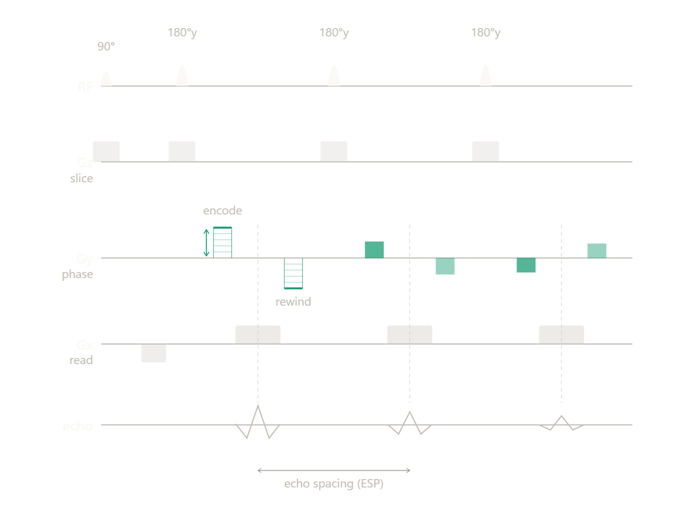

Contents:

Bloch equations

Deriving fitter equations

Transient vs steady state

k-space, FFT shift 

Spatial localisation using gradients and phase encoding

T1 measuring sequences:
- Gradient Echo sequence
- Spin Echo sequences (inversion recovery)
- Turbo spin echo (IR-TSE) — multi-echo readout, Meiboom-Gill, joint T1/T2

T2 measuring sequences:
- Multi-TE spin echo / CPMG

Gradient spoilers

Gibbs ringing, Hamming window, K-space padding

Ernst angle

Brewsters angle


# NOTES

# Bloch equations

The one primer everything else rests on. (Full algebra → fit formulas lives in `report/qalibre_phantom/fits.md §0`; this is the physics summary.)

Magnetisation vector $\mathbf{M} = (M_x, M_y, M_z)$. In the frame rotating at the Larmor frequency $\omega_0 = \gamma B_0$, with equilibrium $M_0$ along $+z$:

$$
\frac{dM_z}{dt} = -\frac{M_z - M_0}{T_1}
\qquad
\frac{dM_{xy}}{dt} = -\frac{M_{xy}}{T_2}\;(+\, i\,\Delta\omega\, M_{xy})
$$

- γ = gyromagnetic ratio. **KomaMRI convention: γ = 42.577e6 Hz/T (no 2π).** This bit me in the gradient code — see `ir_se_2d_sequence`: k = γ∫G dt with γ in Hz/T, not rad/s. Using γ_rad = 2π·γ made gradients 2π× too weak and collapsed the FOV.
- **T1** (spin-lattice): Mz recovers to M0 as energy leaks to surroundings. Slow (~0.05–2 s in the phantom).
- **T2** (spin-spin): Mxy dephases as spins lose mutual coherence. T2 ≤ T1 always.
- **T2\*** ≤ T2: the *observed* transverse decay including reversible static dephasing (T2′ — B₀ inhomogeneity, susceptibility). $1/T_2^* = 1/T_2 + 1/T_2'$. A 180° refocus cancels T2′ → recovers pure T2.

**Free-precession solutions** (between pulses, the two components decouple — first-order linear ODEs):

$$
M_z(t) = M_0 + \bigl(M_z(0) - M_0\bigr)\,e^{-t/T_1}
\qquad
|M_{xy}(t)| = |M_{xy}(0)|\,e^{-t/T_2}
$$

These two exponentials are the entire physical content of the fits.

**RF pulse = instantaneous rotation** by flip angle α about a transverse axis (hard-pulse approximation):
- Longitudinal survivor: `Mz → cos(α)·Mz`.
- Tipped into transverse: `sin(α)·Mz` → this is what the coil reads, `S ∝ sin(α_exc)·Mz⁻` (Mz⁻ = longitudinal just before excitation).
- α = 90° dumps all Mz into the plane (max signal, zero Mz left); α = 180° inverts (Mz → −Mz); small α barely perturbs Mz (the GRE/Ernst regime).

**Spoiling assumption** (used everywhere here): residual transverse magnetisation is crushed (gradient spoiler) or decayed (short T2) before the next block, so only the *scalar* Mz is carried shot-to-shot. This collapses the 3-vector dynamics to a scalar recurrence — why the forward models are one-liners, not matrix exponentials. Without it you'd need EPG/PDG-style coherence-pathway bookkeeping.

# k-space, FFT shift 

My first bug: not doing an FFT shift

Notes: Fix SIM-PLAN 1 - 1.4
### 1.1 What KomaMRI returns

`simulate(phantom, seq, Scanner())` returns ADC profiles in **acquisition
order**. For a Cartesian readout, that is one row of k-space per PE shot, with
samples ordered from `-k_max` to `+k_max` along the readout direction. After
stacking PE rows in shot order, the resulting `ksp` matrix has DC (k=0) at the
**centre** of the array — index `(Npe÷2+1, Nfe÷2+1)` — not at index `(1,1)`.

### 1.2 What `ifft` expects

Julia's `FFTW.ifft` (and NumPy's, and MATLAB's) uses the standard DFT
convention: input index `(1,1)` is DC; the corners of the array are low
frequency; the centre of the array is the Nyquist frequency. To reconstruct
an image correctly from acquired k-space, the pipeline must be:

```
ksp_acquired                       (DC at centre)
        │ ifftshift               ← move DC from centre to (1,1)
        ▼
ksp_dftorder                       (DC at (1,1))
        │ ifft                    ← reconstruct image, DC at (1,1)
        ▼
img_dftorder                       (image centre at (1,1), corners at edges)
        │ fftshift                ← move image centre from (1,1) to centre
        ▼
img_centred                        (image centred — phantom-aligned)
```

The current code is `img_complex = ifft(ksp, (1, 2))` with no shifts at all.
That is equivalent to feeding DC-at-centre data into a DFT routine that
believes DC is at `(1,1)`. The result is the true image multiplied pointwise
by `(-1)^(i+j)` (a chequerboard) **and** wrapped half-FOV in both directions.

### 1.3 The visible consequence in E2

`_e2_build_episode_phantom` (`e2.jl:313–320`) computes ROI pixels from sphere
positions in metres using `mod(round(cx · Nfe / FOV), Nfe) + 1`. That formula
assumes the **phantom centre lands at image pixel `(1,1)`** — i.e. an
unshifted reconstruction. Today, the phantom is at the origin of physical
space (`x=y=0` after the random translation), so `round(0 · Nfe / FOV) + 1 = 1`,
and the ROI for a centre-of-FOV sphere is pixel `(1,1)`.

Two facts then collide:

1. With the buggy recon (no shifts), pixel `(1,1)` happens to receive the
   half-FOV-wrapped, chequerboard-modulated DC signal. For an isotropic
   phantom this is **roughly the right amplitude** for the centre sphere —
   which is exactly why a smoke-test "the agent learns something" never
   tripped on it.
2. For **off-centre spheres**, the wrap collapses the alias: a sphere at
   `(+FOV/4, 0)` lands at image-domain pixel `(Nfe÷4+Nfe÷2, ·)` after the
   correct shift, but at `(Nfe÷4, ·)` under the current ROI formula — i.e.
   half-FOV away from where the magnitude actually peaks. The ROI samples
   either zero, noise, or another sphere's tail.

The agent has been training against a corrupted measurement function where
the per-sphere signal is partly the right sphere, partly the diagonally-opposite
sphere, and partly background. That this still produced a plausible-looking
TI-vs-T1 correlation (§2.4 of M3.md) is a (small) miracle and probably a
testament to the chequerboard-modulated centre pixel still being roughly
correct for the highest-T1 sphere on the plate.

### 1.4 The fix

Replace `e2.jl:399–400` with:

```julia
img_complex = fftshift(ifft(ifftshift(ksp, (1, 2)), (1, 2)), (1, 2))
```

And change the ROI mapping in `_e2_build_episode_phantom` to centred indexing:

```julia
ife = mod(round(Int, cx * env.Nfe / env.FOV) + env.Nfe ÷ 2, env.Nfe) + 1
ipe = mod(round(Int, cy * env.Npe / env.FOV) + env.Npe ÷ 2, env.Npe) + 1
```

`ifftshift` and `fftshift` differ only for odd `N`; since defaults are even
(`Nfe=64`, `Npe=32` after item §3), either is fine in the most common path,
but `ifftshift`-then-`fftshift` is the safe pairing for arbitrary `N`.


# Sequences


## Spatial localisation using gradients and phase encoding

A gradient $G$ makes the precession frequency position-dependent: $\omega(\mathbf{r}) = \gamma(B_0 + \mathbf{G}\cdot\mathbf{r})$. So a spin's phase records where it is. The trajectory traced through k-space is

$$
\mathbf{k}(t) = \gamma\int_0^t \mathbf{G}(\tau)\,d\tau
\qquad (\gamma\text{ in Hz/T, Koma convention})
$$

and the acquired signal is the Fourier transform of the spin density: $S(\mathbf{k}) = \int m(\mathbf{r})\,e^{-i2\pi \mathbf{k}\cdot\mathbf{r}}\,d\mathbf{r}$. Image = inverse FFT of the sampled k-space (with the fftshift dance above). Two design numbers fall straight out:

- $\text{FOV} = 1/\Delta k$ — the k-space *sample spacing* sets the field of view. Alias if the object exceeds it.
- $\text{resolution} = \text{FOV}/N = 1/(2k_{\max})$ — the k-space *extent* sets the pixel size.

### X-axis: frequency encoding during ADC (Nfe)

The readout gradient `Gx_ro` is on *during* the ADC, so the `Nfe` samples sweep kx from −kmax to +kmax in one shot (the echo sits at kx = 0, mid-readout). A **prewinder** before the readout walks kx out to one edge first.
- In `ir_se_2d_sequence`: positive Gx prewinder pushes kx → +kmax, then the 180° conjugates it to −kmax, then the positive readout sweeps back through 0 to +kmax.
- In `gre_2d_sequence`: no 180°, so the prewinder is *negative* (straight to −kmax).
- Relatively free — bump Nfe / kmax as high as the physical boundary or is informative. Make sure the recon pixel grid matches the sphere-ROI pixel mapping or readings blur (see the k-space-shift bug above).
- Cost is ~free: one extra readout gradient, all `Nfe` points in a single ADC window.

### Y-axis: phase encoding (Npe)

There is no second readout axis, so ky is stepped one line per shot: a brief `Gy` blip of a different amplitude before each readout parks the shot at a different ky row. `Npe` rows ⇒ `Npe` separate shots.
- `ky_steps = (k − 1 − Npe/2)·Δky`, Δky = 1/FOV — the even-N layout that puts DC at index `Npe/2+1`.
- **This is the dominant time cost.** Total scan ≈ `Npe × (TR + small PE-blip time)`. Halving Npe roughly halves runtime; this is the main lever for the E2 cost model (cost ∝ Npe·TR·spins).
- The phase-encode blip is folded into the prewinder block (`x=Grad(...), y=Grad(...)` together) so it costs no extra time.

# T1 measuring sequences

These can be found at: src/sequences/blocks.jl in QalibrePhantom

## Gradient Echo sequence

Code: `gre_2d_sequence`. The echo is formed by **gradient reversal alone** — no 180° refocus pulse.

Sequence (per shot):
- α excitation (small flip — typically 5–20°, *not* 90°)
- Negative Gx prewinder + Gy phase-encode blip (walks kx → −kmax directly)
- TE delay
- ADC readout with positive Gx (echo at kx = 0, mid-readout)
- TR spoiler (gradient crusher to kill residual Mxy) + TR recovery

Params: TE, TR, α, FOV, Nfe, Npe. No TI, no inversion — T1 contrast comes from the steady-state Mz under repeated short-TR small-α excitation.

Pros:
- **Fast.** No 180° (saves time + SAR), short TR feasible, small α leaves most of Mz for the next shot.
- The small-flip steady state is the most signal-efficient regime per unit time — see Ernst angle below.

Cons:
- **T2\* decay, not T2.** Without a refocus pulse the echo is weighted by T2\*, which includes reversible B₀-inhomogeneity dephasing (T2′) — faster and less predictable than the clean T2 a spin echo gives. Acceptable in a homogeneous digital phantom, problematic on real hardware.
- Needs spoiling to behave. The TR spoiler here is gradient-only; a *fully* spoiled GRE (FLASH) also increments RF phase quadratically per shot to scramble coherence pathways. Not yet implemented — residual stimulated-echo / banding contamination possible at very short TR.

### Ernst angle

For a spoiled GRE at repetition time TR, the flip angle that maximises steady-state signal for a given T1 is the **Ernst angle**:

$$
\cos(\alpha_E) = e^{-\mathrm{TR}/T_1}
\qquad\Longrightarrow\qquad
\alpha_E = \arccos\!\bigl(e^{-\mathrm{TR}/T_1}\bigr)
$$

- Short TR or long T1 → small $\alpha_E$. This is why GRE runs at small flips.
- It is T1-dependent, so a *fixed* α is only Ernst-optimal for one T1 — directly relevant to C1 (no fixed-protocol optimum): the agent could in principle learn to ride the Ernst angle adaptively as it narrows its T1 estimate. (The `test_cr_optimal_alpha` testset already shows the single-sphere optimum sitting away from a flat 90°.)

## Spin Echo sequences (inversion recovery)

Code: `ir_se_2d_sequence`. This is the T1 workhorse — a 180° inversion sets up T1 contrast, a spin echo reads it out cleanly.

Params:
- TI - Inversion time
- TE - Echo time
- TR - Repetition time
- $\alpha$ - Excitation angle (Usually $90^{\circ}$)
- $\theta$ - Inversion angle ($180^{\circ}$)

Sequence:
T1 is the *longitudinal* magnetisation recovery back towards equilibrium M0, governed by thermal effects — the spin returns to thermal equilibrium as it loses energy to its surroundings. (Transverse decay is T2; don't conflate.) To measure:

- 180 inversion (theta) using RF pulse. (roughly 10ms)
- TI delay
- RF Excitation pulse (alpha)
- TE/2 delay
- 180 inversion
- TE/2 delay
- ADC readout (Nfe readings)
- TR - above timings delay

So total shot = TR. Therefore for Npe grid = Npe * (TR + Gy phase encoding pulse time (small))

Cons:
- Long and requires precise 180 inversion (otherwise Mz and Mxy that are unaccounted for and cause measurement error) and alpha degree rotation
- Assumes complete Mxy relaxation between each shot if using a simple fitter - this means TR >> T1 (usually about 5x) as then e^-5 = 1% left so fully decayed.

Pros:
- 180 deg inversion removes T2' decay so only more stable T2 decay constant - as long as TE kept constant this is not an issue - fitter's Amplitude absorbs this constant.

Variants:
- Multiple Acquisition - Multi spin echo for more data in less time.

## Turbo spin echo (IR-TSE) — multi-echo T1 readout

Code: `ir_tse_2d_sequence`. The single-echo IR above reads **one** k-space line per excitation, so a full image needs `Npe` shots — `Npe·TR` of scan time. IR-TSE reads an **echo train** of length `etl` after each excitation (one inversion + excitation, then `etl` 180° refocuses, each filling a *different* phase-encode line), so the image needs only `Npe ÷ etl` shots — ≈`etl`× faster. `etl = 1` reproduces the single-echo IR.

Sequence (per shot): `180° inv → TI → 90° → Gx prewinder → [180° → ky blip → readout → ky rewind]·etl → TR`.

Two things make the train behave:
- **Meiboom–Gill condition.** The refocus pulses are 180°_y (90° RF phase) while the excitation is 90°_x. With 180°_x instead, successive echoes alternate sign; since echo `e` fills ky line `e`, an alternating sign *per ky line* is a **half-FOV shift** of the reconstructed image in the phase-encode direction. (This bit us — KomaMRI's `RF(amp, dur)` defaults to the x-axis, so the refocus pulses must be given an explicit imaginary B1.)
- **ky blip + rewind.** Each echo's phase-encode is a blip *after* the 180° (so the 180° doesn't conjugate it) and a rewind back to `ky = 0` *after* the readout (so the next refocus sees `ky = 0` and the train stays coherent). The ADC still runs with `Gy = 0` — clean Cartesian lines.

Cons:
- **T2 blurring.** Lines acquired later in the train have decayed more (`exp(−e·esp/T2)`), so the k-space weighting varies across the train → a point-spread broadening. The image carries an *effective TE* set by whichever echo fills the central k line. This is the speed-vs-blur trade an adaptive agent could learn: long T2 tolerates a long train, short T2 blurs.

Bonus — **joint T1/T2.** Because the train deliberately varies TE across echoes, the `exp(−TE/T2)` factor is no longer a constant the fit amplitude absorbs (see `fits.md §0.6`): a single IR-TSE acquisition can be fit for **both** T1 and T2 with `fit_t1_t2_generalized_ir` (a 2-D `(T1, T2)` grid; T2 falls out of the echo-train decay, T1 from the TI dependence). Hold TE constant and it reduces to the plain T1 fit.



# T2 measuring sequences

T2 is fit from the *transverse* decay, so the sequence sweeps **TE** (echo time) at fixed/long TR instead of sweeping TI. Code: `se_sequence` (single-spin E0 readout); the 2D imaging version reuses the spin-echo machinery of `ir_se_2d_sequence` with the inversion dropped.

## Multi-TE spin echo

Sequence (per shot): `90° → TE/2 → 180° → TE/2 → echo (ADC)`, repeated for several TE values.
- The 180° refocuses static dephasing (T2′), so the echo decays as the clean **T2**, not T2\*. This is the whole point of using a spin echo rather than a gradient echo for T2.
- Signal: $|S(\mathrm{TE})| = S_0\,e^{-\mathrm{TE}/T_2}$. Fit is log-linear (`fit_t2_se`): $\log|S| = \log S_0 - \mathrm{TE}/T_2$.
- TR ≫ T1 (≈5×) so each shot starts from a fully recovered M0 and the T1 weighting drops out — only T2 remains in the TE dependence.

Params: TE (swept), TR (long, fixed), α = 90°, θ_refocus = 180°.

Cons:
- One TE per shot is slow (like phase encoding, it multiplies scan time).
- Imperfect 180° pulses leave stimulated-echo pathways that bias T2 — real scanners use a **CPMG** train (a string of 180°s with the right phase) to refocus a whole T2 decay curve in one shot and cancel pulse-imperfection errors. Faster *and* more robust, at the cost of needing coherence-pathway modelling (EPG/PDG) rather than the simple scalar fit.

Variants:
- **Multi-echo / CPMG** — many 180° refocuses after one excitation, sampling the T2 curve in a single TR. The fast-and-cheap way to get a full T2 fit; the analogue of the "Multiple Acquisition" trick noted above for IR.
- **Multi-acquisition** — repeat for SNR (averages), or interleave TEs to amortise the long TR.

