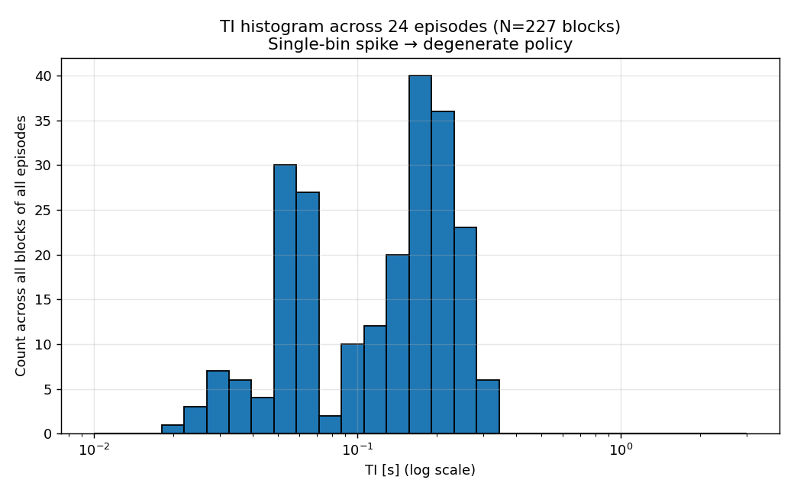
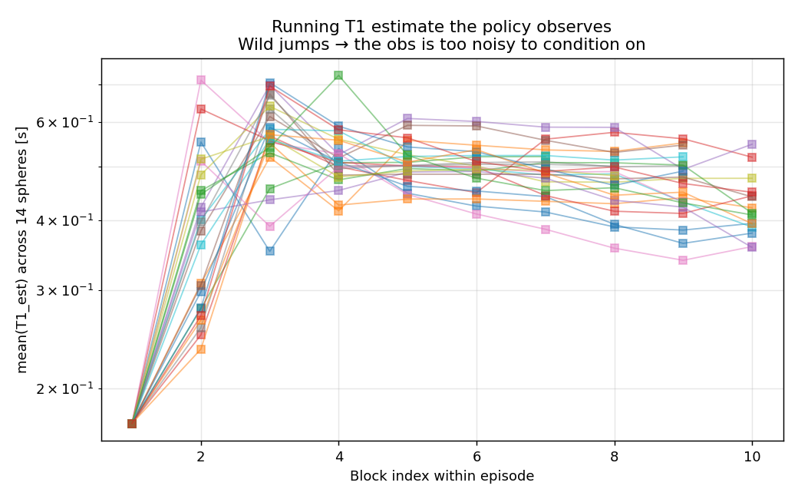
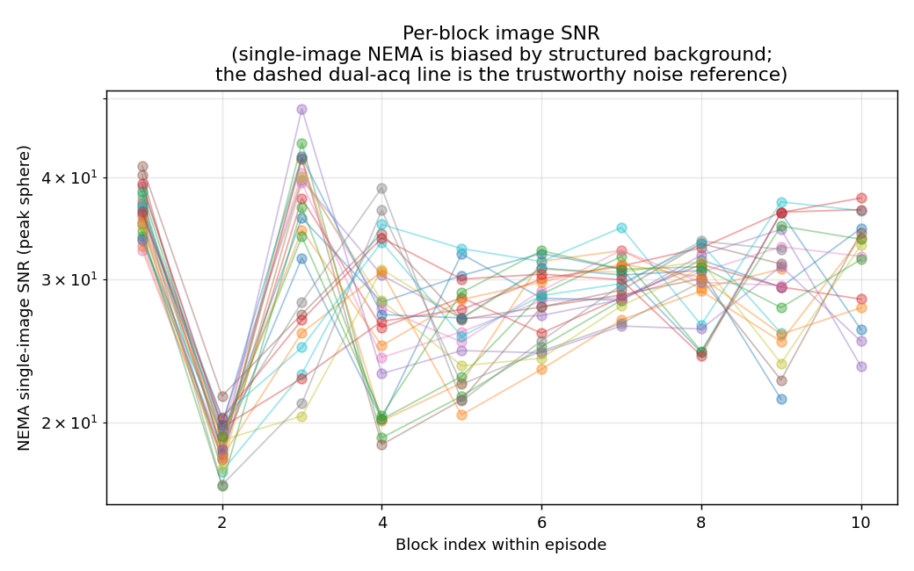
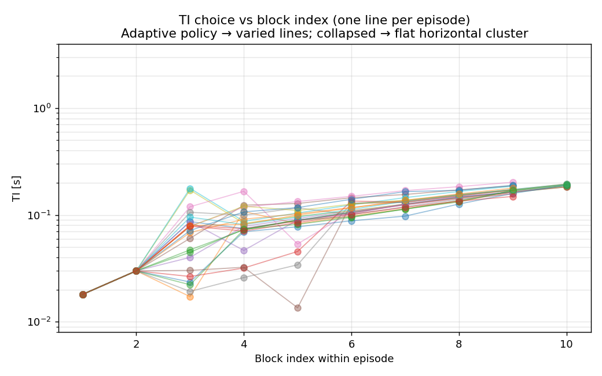
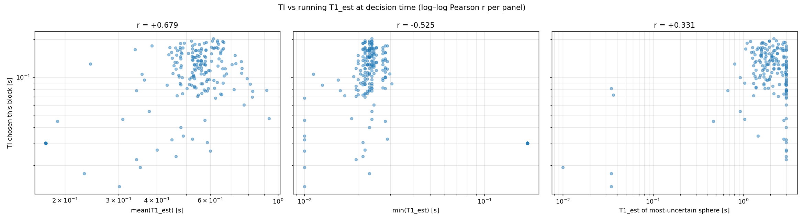
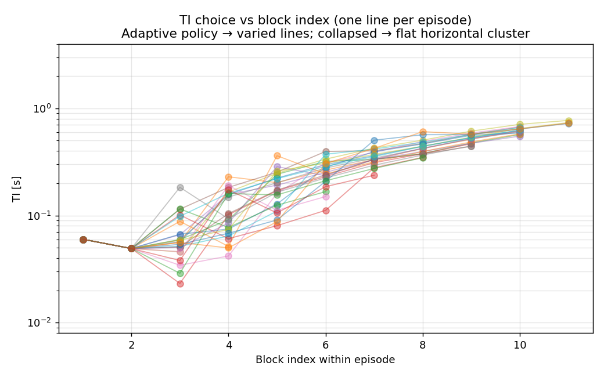
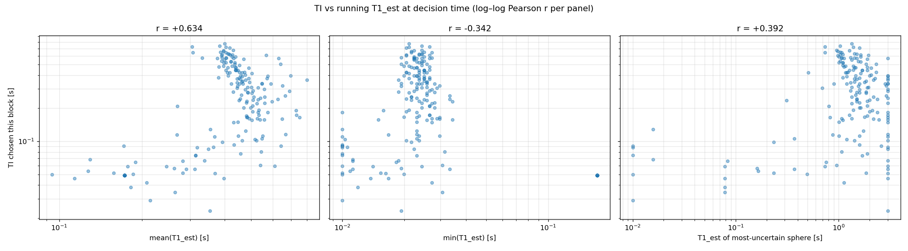

# Run A — Multi-Fidelity Curriculum Results (`mf_v2_runA_cpu_9h`)

> **Challenge:** C2 — *scalable simulation-in-the-loop RL*. This is the first
> end-to-end run of the V2 multi-fidelity curriculum (`analytic → cached3 →
> full3 → full`) under a fixed 9 h CPU budget. See
> [`multi_fidelity.md`](multi_fidelity.md) for the algorithm and
> [`mf_v2_implementation_plan.md`](mf_v2_implementation_plan.md) for the design.

**Artifacts analysed:** `runs/e2/mf_v2_runA_cpu_9h/`
(policy `policy.zip` + `vecnorm.pkl`, `fidelity_history.json`, four per-stage
`eval_history.json`, `run.log`).
**Scripts:** `python/eval_e2.py` and `python/diagnose_e2.py`, both run on the
**final** policy at the run config (`T15`, 64×32, 1 mm voxels, full-Bloch water,
σ=50, `delta_log_mape`, `learn_alpha`, `fix_te`, `log_ti_action`), 24 held-out
episodes (seed 500 000). Raw outputs: `eval_final.txt`, `diagnose_final.txt`,
`diagnostics/`.

---

## 1. Headline

- The curriculum spent **9.0 h / 79.5k steps** and finished at **12.26 %
  held-out full-Bloch MAPE** (the run's own end-of-stage probe). Independent
  re-evaluation of the saved policy gives **10.16 % MAPE (p90 14.4 %)** over 24
  fresh episodes.
- **The cheap stages did essentially all the useful work.** Re-evaluated on the
  same full-Bloch held-out set, the **`cached3`-best checkpoint (30k steps,
  ≈ 2.7 h) scores 8.36 % MAPE / p90 9.96 %** — the **best policy of the whole
  run**, beating the final saved policy (10.16 % / 14.42 %). The two expensive
  stages (`full3`, `full`, ≈ 5.6 h combined) did **not** improve on this —
  `full3` actually *regressed* to 14 %, and the final policy concretely lost the
  long-TI behaviour the cached stage had found (§8).
- The policy is **adaptive, not collapsed** (contrast E1): it conditions its TI
  choice on its running uncertainty (log–log Pearson **r = +0.64**). But it
  leaves the flip angle pinned at the 90° bound, and it systematically fails on
  **long-T1 spheres** (40.8 % MAPE at T1 = 1.88 s) because its TI choices never
  reach the inversion null those spheres need.
- The `eval_e2.py` fixed-TI baseline reported **100 % MAPE** — a broken
  comparator, **not** a real 9.8× win. See §5; do **not** cite the speedup
  number.

---

## 2. Run configuration & stage budget

| Stage | Steps | Wall | sec/step (median) | Water model | End-of-stage full-Bloch MAPE |
|---|---|---|---|---|---|
| `analytic` | 0 → 8 192 (8.2k) | 0.08 h | **0.034 s** | n/a (closed form) | 16.60 % |
| `cached3` | 8 192 → 40 960 (32.8k) | 3.28 h | 0.338 s | cached, 3 mm | **10.37 %** |
| `full3` | 40 960 → 73 728 (32.8k) | 3.94 h | 0.416 s | full Bloch, 3 mm | 14.03 % |
| `full` | 73 728 → 79 499 (5.8k) | 1.64 h | ~1.03 s | full Bloch, 1 mm | 12.26 % |

The observed cost ladder (~0.03 → 0.34 → 0.42 → 1.03 s/step) spans **~30×**, so
the cheap stages are genuinely cheap: the whole `analytic` + `cached3` phase
(41k steps) cost less wallclock per step than a *single* `full` step buys, yet
produced the run's best held-out accuracy.

All four stage switches were taken; the schedule criteria fired as:
`analytic` → `rank_breakdown` (8.2k), `cached3` → `target_plateau` (41k),
`full3` → `budget_reserve` (74k, i.e. forced by the 20 % full-stage reserve),
`full` → global budget exhausted.

---

## 3. Curriculum dynamics — the money plot


*Held-out full-Bloch MAPE (log y) against cumulative wallclock. Dashed lines =
stage switches.*

Reading the curve:

1. **`analytic` (0–0.1 h):** collapses from ~42 % to ~10 % almost immediately —
   the closed-form surrogate is enough to learn the gross TI structure for free.
2. **`cached3` (0.1–3.4 h):** the productive stage. The held-out probe descends
   into an **~8–10 % basin** and plateaus there. This is the best the run ever
   achieves.
3. **`full3` (3.4–7.3 h):** **regression.** On the switch to true Bloch water
   (still 3 mm) the held-out MAPE jumps back to **17–19 %** and never fully
   recovers within the stage, ending at 14 %. The `full3` decisions show rank
   correlation between cheap and full fidelity sitting at only **0.6** and bias
   swinging ±5 %, i.e. the 3 mm-water Bloch optimum is not the 1 mm optimum the
   probe measures.
4. **`full` (7.3–9.0 h):** partial recovery to **12.26 %** in the 5.8k steps the
   reserve allowed — better than `full3`, still worse than the `cached3` basin.

**Interpretation.** The "when to switch" controller behaved sensibly on the
cheap→cheap boundary (plateau detection promoted out of `cached3` correctly),
but the run exposes a real weakness: **the final saved policy (12.26 %) is worse
than a checkpoint the run had already passed through (~8.4 % during `cached3`).**
The best-checkpoint machinery exists per stage (`stage*/best/`) but the
*globally* best policy across the whole curriculum was discarded. The expensive
stages spent ~5.6 h of the 9 h budget to end up *behind* where the cheap stages
left off.

---

## 4. Final-policy evaluation (`eval_e2.py`, 24 episodes)

```
MAPE       = 10.16 %     p90 MAPE = 14.42 %
Success<5% = 4.2 %       Mean scan time = 232 s
```

### Per-sphere MAPE — a clean T1-dependent gradient

| Pool | T1 (s) | MAPE | | Pool | T1 (s) | MAPE |
|---|---|---|---|---|---|---|
| 1 | 1.879 | **40.8 %** | | 8 | 0.195 | 3.0 % |
| 2 | 1.432 | 28.4 % | | 9 | ~0.14 | 2.3 % |
| 3 | 1.027 | 17.9 % | | 10 | ~0.10 | **1.5 %** |
| 4 | 0.751 | 12.1 % | | 11 | ~0.07 | 2.4 % |
| 5 | 0.527 | 7.6 % | | 12 | ~0.05 | 2.4 % |
| 6 | 0.384 | 5.9 % | | 13 | ~0.024 | 4.8 % |
| 7 | 0.272 | 5.2 % | | 14 | ~0.017 | 7.8 % |

Accuracy is excellent in the mid-T1 band (T1 ≈ 0.05–0.4 s, MAPE 1.5–6 %) and
degrades sharply at **long T1**: the 1.88 s sphere is off by 41 %. This is
mechanistically explained by the action space (§5): the agent's TIs cluster at
0.05–0.6 s, well short of the ~1.3 s inversion null needed to characterise a
1.9 s T1, so long-T1 recovery is incomplete and systematically biased. The
aggregate 10 % MAPE is dominated by the three longest-T1 spheres.

---

## 5. Adaptivity diagnostics (`diagnose_e2.py`)

The agent is **not** the degenerate E1 policy. Summary statistics over 227
blocks / 24 episodes:

| Signal | Value | Reading |
|---|---|---|
| TI intra-episode log-σ | 0.281 | TI varies *within* an episode |
| TI inter-episode log-σ | 0.290 | …and *across* episodes |
| Modal-bin share | 11.9 % | no single-TI spike (vs ~100 % if collapsed) |
| r(TI, mean running T1_est) | **+0.50** | TI tracks the running estimate |
| r(TI, T1_est of most-uncertain sphere) | **+0.64** | TI tracks *uncertainty* |


The positive correlation in the left/right panels is the key evidence for
adaptivity: when the running estimate (or the most-uncertain sphere's estimate)
is high, the agent picks a longer TI — the qualitatively correct response.


The within-episode structure is a **fixed two-block probe** (blocks 1–2 are
identical across all episodes: TI ≈ 0.05 → 0.07 s), a **fan-out at block 3–4**
where the policy diverges per phantom, then a converging **rising ramp**. So the
policy is "open with a fixed probe, then adapt" — partially adaptive, with a
hand-learned warm-up.



Bimodal (the fixed 0.05–0.07 s probe + the adaptive 0.1–0.3 s ramp); spread, not
collapsed. The script's auto-caption ("single-bin spike → degenerate") does
**not** apply here.



The running fit stabilises by ~block 5 (≈ 0.4–0.55 s mean across spheres) and is
stable enough for the policy to condition on — not the noisy mush the caption
warns about.


**The `learn_alpha` degree of freedom collapsed to its bound:** every chosen α
sits at ~90° regardless of TR or running T1. The agent did not learn to drop α
toward the Ernst angle for long-T1 / short-TR regimes. This DoF added cost
without benefit in this run.



Peak-sphere single-image NEMA SNR sits ~20–40 across blocks, consistent with the
σ=50 calibration (target_snr ≈ 2.5 → NEMA dual-acq ≈ 30, clinical range).

---

## 6. Honest caveats

1. **Fixed-TI baseline is broken (100 % MAPE).** `eval_e2.py`'s `evaluate_fixed_grid`
   returned 100 % MAPE / "9.8× speedup". A 100 % MAPE means the fitter returned a
   ~zero (or clamped) estimate for the cycling-grid action — almost certainly a
   units/action-conversion or fitter-failure bug in the baseline path, **not** a
   real result. **Do not quote the speedup.** A credible baseline (E0
   conventional IR-TSE, or a properly-formed fixed grid) must be wired in before
   any "agent beats fixed protocol" claim. *Action item.*
2. **Final ≠ best.** The globally-best policy (`cached3` basin, ~8.4 %) was not
   the one saved as the run's final `policy.zip` (10–12 %). The curriculum should
   track and emit a *global* best-across-stages checkpoint, not just per-stage.
3. **`full3` regression is real and informative.** The 3 mm-water Bloch optimum
   differs from the 1 mm full-Bloch optimum the probe scores (rank-corr ~0.6,
   bias ±5 %). Either `full3` is the wrong intermediate fidelity, or the probe
   should match the training fidelity, or the stage needs many more steps to
   re-converge than the budget allowed.
4. **Budget shape.** 5.6 h (62 % of wallclock) went to the two expensive stages
   for no net accuracy gain over the cheap basin. Under this controller, a larger
   `cached3` allocation (or skipping `full3`) would likely have produced a better
   final policy at the same cost.
5. **Single run, 24 eval episodes.** p90 and per-sphere numbers are noisy at
   N=24; treat ±2–3 % as the resolution. Diagnose and eval agree to 0.00 % on
   mean MAPE (both 10.16 %), which is reassuring.

---

## 7. Recommendations for Run B

- **Fix or replace the fixed-grid baseline** (highest priority — it's the
  quantified-benefit claim for C2/Ch4).
- **Emit a global best-checkpoint** across the whole curriculum, selected on the
  full-Bloch probe.
- **Re-balance the budget:** more `cached3`, and either drop `full3` or make its
  water fidelity match the probe's (1 mm). Test whether `cached3` alone +
  short `full` polish beats the 4-stage ladder.
- **Reconsider `learn_alpha`:** it collapsed to 90°. Either fix α=90° (one fewer
  action dim) or add a reward/shaping reason to use the Ernst angle.
- **Extend the TI action range** (or add a long-TI/long-TR regime) so long-T1
  spheres get an informative inversion null — this is where the 40 % errors live.

---

## 8. Checkpoint comparison — what each stage discovered

To see *what the policy had learned by each point in the curriculum*, the
**analytic** end-of-stage policy (`stage0_analytic/`, 8.2k steps) and the
**cached-best** policy (`stage1_cached3/best/`, the 30k-step checkpoint that
scored best on cached water) were re-evaluated on the **same full-Bloch held-out
set** as the final policy (24 episodes, identical config). This is a transfer
test: each policy was trained at a *cheaper* fidelity but is scored on the true
target. Outputs: `stage0_analytic/{eval,diagnose}_fullbloch.txt`,
`stage1_cached3/best/{eval,diagnose}_fullbloch.txt` + per-checkpoint
`diagnostics/`.

| Metric (full-Bloch held-out) | `analytic` (8k) | **`cached-best` (30k)** | `full` final (79.5k) |
|---|---|---|---|
| **MAPE** | 15.89 % | **8.36 %** | 10.16 % |
| **p90 MAPE** | 22.93 % | **9.96 %** | 14.42 % |
| r(TI, mean running T1_est) | **+0.68** | +0.63 | +0.50 |
| r(TI, most-uncertain sphere) | +0.33 | +0.39 | **+0.64** |
| TI intra-episode log-σ | 0.33 | **0.38** | 0.28 |
| Max TI reached (ramp top) | ~0.18 s | **~0.8 s** | ~0.3–0.6 s |
| α: mean / std / min (deg) | 89.0 / 2.4 / 79.5 | 89.8 / 1.6 / 75.1 | 90.0 / **0.00** / 90.0 |
| Pool 2 MAPE (T1 = 1.43 s) | 60.7 % | **14.5 %** | 28.4 % |
| Pool 3 MAPE (T1 = 1.03 s) | 61.4 % | **10.3 %** | 17.9 % |
| Pool 1 MAPE (T1 = 1.88 s) | 43.0 % | 42.2 % | 40.8 % |

*(Pools 5–14, T1 ≤ 0.53 s, are 1.5–7.7 % for all three checkpoints — the short/
mid-T1 band is essentially solved from the analytic stage onward.)*

### Four findings

**(a) The adaptive strategy was discovered for free, on the analytic model.**
The 8.2k-step analytic policy already conditions its TI on its running estimate
*more strongly* than the final policy (r = **+0.68** vs +0.50), with the same
"fixed two-block probe → fan-out → rising ramp" structure. The expensive stages
did not *teach* adaptivity — they inherited it.




**(b) The cached stage is where accuracy was actually won — and it is the run's
best policy.** `cached-best` reaches **8.36 % / p90 9.96 %**, clearly better than
the final saved policy (10.16 % / 14.42 %). The gain came from the **TI range**:
its ramp climbs to **~0.8 s** (histogram mass out to 0.77–0.89 s), long enough to
characterise the mid-long-T1 spheres. That collapses Pool 2/3 error from ~61 %
(analytic) to **14.5 % / 10.3 %**. The analytic policy simply never proposed TIs
long enough — its ramp tops out at ~0.18 s.




**(c) The expensive stages made it worse, and we can see how.** Between the
cached-best checkpoint and the final policy, the TI ramp *shrank back* from
~0.8 s to ~0.3–0.6 s and intra-episode exploration dropped (log-σ 0.38 → 0.28).
That re-inflated the mid-long-T1 errors (Pool 2: 14.5 % → 28.4 %; Pool 3: 10.3 %
→ 17.9 %). The `full3` regression in §3 is therefore not just a number wobble —
the policy concretely **lost the long-TI behaviour** that the cached stage had
found, most likely because `full3`'s 3 mm-water Bloch optimum pulled the policy
off the 1 mm optimum before the budget ran out. The only DoF that moved *toward*
the final policy was uncertainty-tracking (r(TI, unc) 0.39 → 0.64), but it did
not pay for the lost TI range.

**(d) No checkpoint varied the flip angle — and the DoF *degraded* over
training.** Across all 24-episode rollouts, α is pinned at the 90° upper action
bound: `analytic` 89.0° ± 2.4° (min 79.5°), `cached-best` 89.8° ± 1.6° (min
75.1°), `final` **90.0° ± 0.00°** (every block, exactly). The small early spread
(a handful of blocks at 75–80°) is exploration noise, not a learned policy — it
vanishes entirely by the end. So the curriculum drove the agent *harder* onto
the α ceiling rather than teaching it to exploit the Ernst angle (cf. the
`alpha_vs_tr_vs_t1.png` figure in §5, where every point sits at 90° regardless
of TR or running T1). A pinned 90° is near-optimal in the long-TR / short-T1
corner but is exactly wrong for the long-T1 spheres that dominate the error,
which want a shorter-TR / reduced-α (or, more relevantly here, a longer-TI)
trade. **`learn_alpha` added an action dimension that bought nothing in this
run.** For Run B, either fix α = 90° (one fewer action dim, cleaner credit
assignment) or add a scan-time reward term that makes the SNR/time trade the
Ernst angle enables actually worth taking.

**Pool 1 (T1 = 1.88 s) is unsolved by every checkpoint (~42 %)** — even the
0.8 s TIs of cached-best fall well short of the ~1.3 s inversion null a 1.9 s T1
needs. This is an action-space ceiling, not a training-time problem, and
reinforces the §7 recommendation to extend the TI/TR range.

### Bottom line for the curriculum

This run is, in effect, an unintended ablation showing that **the cheap stages
delivered the result and the expensive stages eroded it**. The single highest-
value change for Run B is to **emit and keep the global-best checkpoint**
(`cached-best`, 8.36 %) rather than the last policy (10.16 %) — that alone turns
this run from "12 %, regressed" into "8.4 %, best-in-run", at *zero* extra
compute. Reinforces §6 items 2–4.

---

*Generated 2026-06-01 from `mf_v2_runA_cpu_9h`. Reproduce with:*

```bash
source .venv/bin/activate
export PYTHON_JULIAPKG_OFFLINE=yes
R=runs/e2/mf_v2_runA_cpu_9h
python python/eval_e2.py    --policy $R/policy.zip --vecnorm $R/vecnorm.pkl \
  --episodes 24 --field T15 --nfe 64 --npe 32 --max-blocks 20 --time-budget 240 \
  --noise-sigma-abs 50 --reward-mode delta_log_mape --terminal-bonus 0.0 --mape-alpha 1.0 \
  --fix-te --learn-alpha --log-ti-action --water-model bloch
python python/diagnose_e2.py --policy $R/policy.zip --vecnorm $R/vecnorm.pkl \
  --episodes 24 --field T15 --nfe 64 --npe 32 --max-blocks 20 --time-budget 240 \
  --noise-sigma-abs 50 --reward-mode delta_log_mape --terminal-bonus 0.0 --mape-alpha 1.0 \
  --fix-te --learn-alpha --log-ti-action --water-model bloch --out $R/diagnostics
python python/plot_mf_curriculum.py "$R:MF curriculum (runA, 9h CPU)" \
  --out report/e2_runs/figs/mf_runA_moneyplot.png

# §8 checkpoint comparison — same flags, different --policy/--vecnorm/--out:
#   analytic:    $R/stage0_analytic/policy.zip          $R/stage0_analytic/vecnorm.pkl
#   cached-best: $R/stage1_cached3/best/best_policy.zip $R/stage1_cached3/best/best_vecnorm.pkl
```
