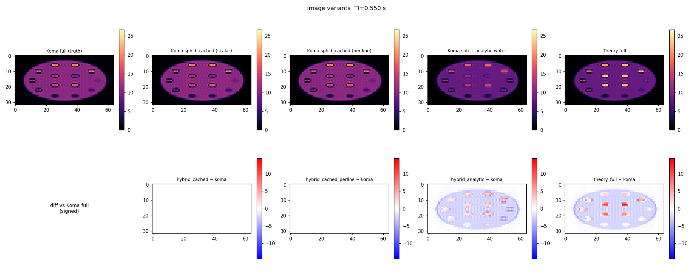
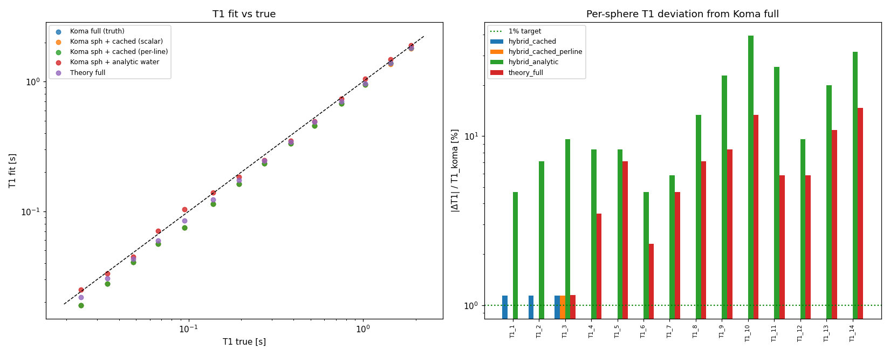
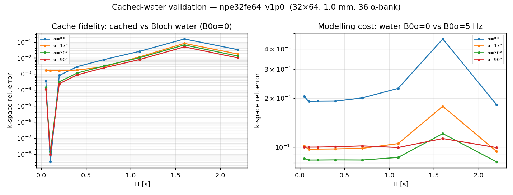
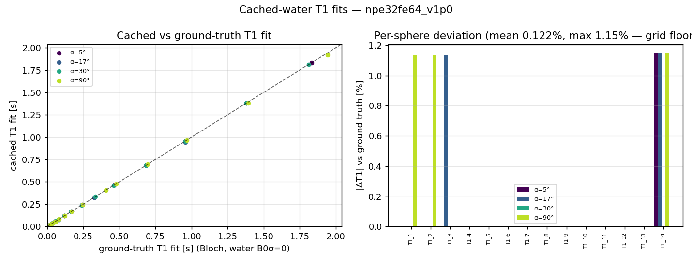
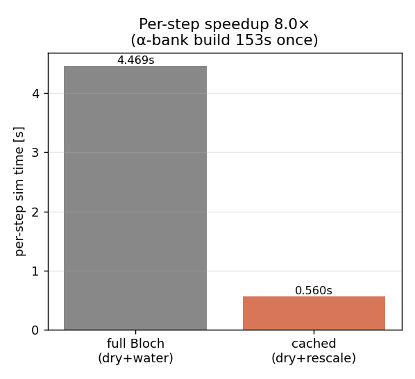
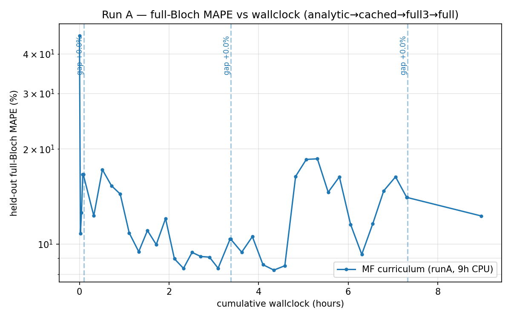
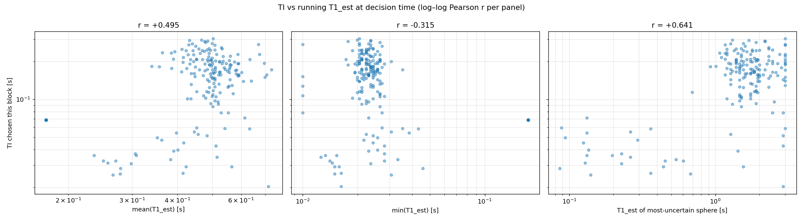
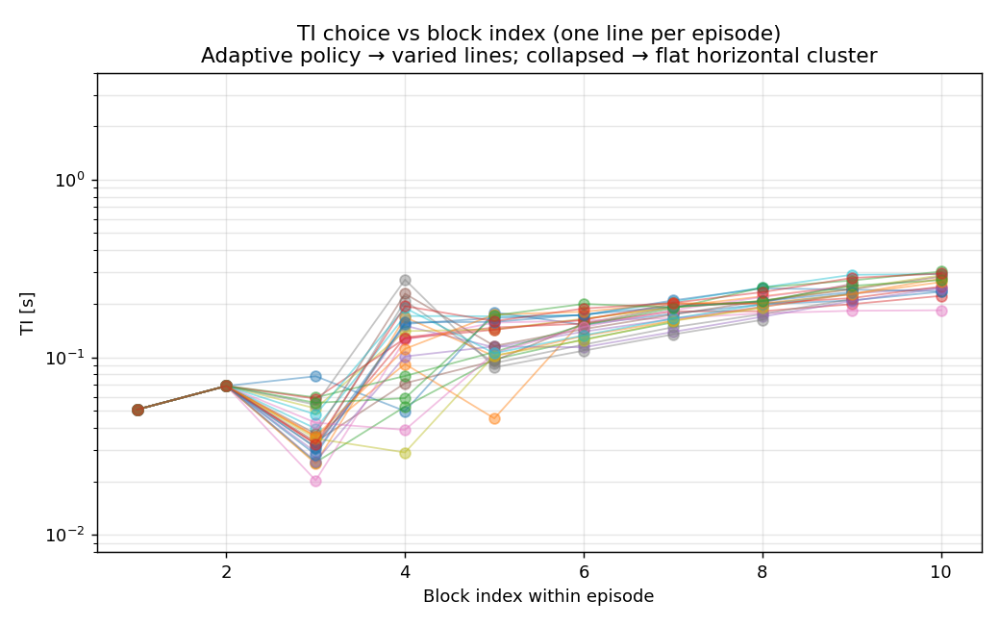
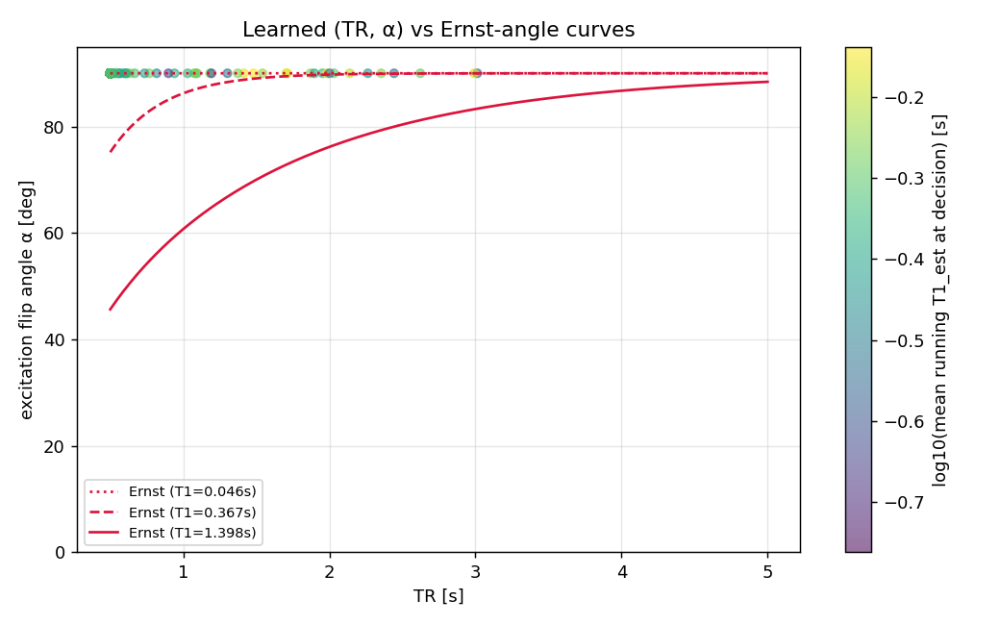

# Multi-Fidelity Curriculum Training for E2

> **Challenge addressed (C2):** *scalable simulation-in-the-loop RL.* Training a
> PPO agent with a Bloch solver in the loop is dominated by the cost of the
> simulator, not the learner.
> **Novelty:** a literature-grounded, *bias-aware* rule for deciding **when** to
> switch simulator fidelity during on-policy RL, specialised to adaptive qMRI
> sequence design.
> **Quantified result:** the multi-fidelity ladder made training feasible and
> produced an adaptive, non-collapsed policy, but the current 14-sphere policy is
> beaten by strong fixed schedules (§6.6). The useful learning happened at cheap
> fidelities; the expensive stages mainly revealed where the curriculum/controller
> needs improvement.

---

## 1. Motivation — the cost wall

E2 trains a PPO agent with the KomaMRI Bloch solver *in the loop*: every action
(a choice of TI/TE/TR/α) triggers a full multi-shot simulation and 2-D
reconstruction before the fitter returns an updated T1 estimate and the reward.
The per-step cost scales as `Npe · TR · n_spins`. At the 1 mm / 64×32 evaluation
configuration Run A measured **~1.0 s/step on CPU**, so a 300k-step full-Bloch
run is **roughly 3.6 days** before evaluation/probe overheads. Earlier E2 timing
probes were closer to 4 s/step, which is where the old "about 8 days for 200k
steps" estimate came from. Either way, a conventional single-fidelity curriculum
— training everything on the full simulator — is too expensive for the project
compute budget.

The simulator, however, is not one thing. We expose a **ladder of fidelities** of
the *same* forward model, trading bias against cost:

| Fidelity | What it computes | Per-step cost (Run A) | Bias vs full Bloch |
|---|---|---|---|
| `analytic` | per-sphere signal from the closed form the fitter inverts; no Koma | **0.034 s** | noise-limited only; no recon, no water, no B0 crosstalk |
| `cached` | Bloch on the spheres + cached-Koma water template (§4) | **0.34 s** | water approximated to the T1-grid floor (0.24% T1) |
| `full` (coarse water) | full Bloch on spheres + 3 mm water voxels | **0.42 s** | reduced water spin count; spatial discretisation bias |
| `full` | full Bloch on spheres + 1 mm water — the target | **1.03 s** | ground truth |

Each fidelity has a physical **accuracy floor**: the analytic model bottoms out
at its noise floor, cached water can reproduce the matched Bloch-water template
to the T1-grid floor, and the full model is limited by the true noise and
discretisation. The curriculum idea is to *learn cheaply at low fidelity, then warm-
start up the ladder*, spending expensive full-Bloch steps only where they buy
accuracy a cheaper model cannot. The observed cost ladder spans **~30×**, so the
incentive is large.

<!-- REVIEW NOTE (Arthur): the old multi_fidelity.md also listed a `dry` fidelity
(full Bloch on spheres only, no water, ≈ +2.4% MAPE crosstalk). It was never used
in a real run, so I've dropped it from the main table to avoid implying we ran a
4th rung we didn't. Mention in passing only if you want the "water crosstalk is
~2.4% MAPE" number for the discussion. -->

## 2. The hard part — *when* to switch

Warm-starting between fidelities is mechanically trivial (carry the policy
weights). The research question is **when** to promote. The naive answer —
"train N steps per stage" — wastes budget and is impossible to justify.

The central design decision is:

> **The signal that triggers a switch must be improvement in held-out
> *full-simulator* validation, not improvement in the current cheap simulator.**

A biased cheap model can keep improving its *own* score long after the real
(full-sim) score has plateaued — indeed, it can improve its own score by
*exploiting its bias*. This is exactly the failure mode observed in E1, where the
agent collapsed to a degenerate fixed policy that exploited the noiseless fitter
rather than designing informative sequences (`docs/E1_RESULTS.md`). We therefore
probe the **full-Bloch** environment periodically *even during the cheap stages*
— bounded to a few episodes at a coarse cadence, this is the honest price of a
bias-aware switch.

## 3. Literature basis

The switch rule adapts two ideas:

- **Sifaou & Simeone (2025), *Multi-Fidelity Hybrid RL via Information Gain
  Maximization*** (arXiv:2509.14848). Their principle: select the fidelity with
  the best *expected information gain about the target policy per unit simulation
  cost*, gated by a budget-adaptive threshold that pushes toward high fidelity as
  cheap-sim information stops being worth its bias. Their full machinery (a
  CQL/bootstrap-ensemble posterior over policies) is an offline-online algorithm
  too heavy for our on-policy PPO setting, so we borrow the *principle*, not the
  estimator.
- **Cutler, Walsh & How (2015), *RL with Multi-Fidelity Simulators*.** The
  classic switch-up/switch-down rule: train at low fidelity until the policy is
  good enough; if the low-fidelity optimum is *invalid at higher fidelity*, that
  fidelity is exhausted.

**Honesty note (important for the assessment):** we do **not** implement the
paper's posterior information gain. The quantity our code computes is named
`target_slope_per_cost` — the improvement in the full-sim score per second of
wallclock at the current fidelity. We describe it as an *IG-per-cost–inspired
heuristic*, never as "the information gain."

## 4. Implementation — the fidelity ladder

### 4.1 Water coarsening

Roughly **90% of the spins in the phantom are background water** (18,919 of
23,735 at 1 mm / 64×32 / T15). Because k-space signal is a linear sum over spins,
the cheapest physically-meaningful saving is to voxelise the water on a coarser
grid and rescale proton density to conserve total signal. This required
generalising the phantom builder so that water has its own `water_voxel_mm`
independent of the sphere grid:

1. Slicing was generalised from "z-axis only" to **any plane** (centre point +
   normal), with the centre as the grid origin so a 1 mm slice always contains
   water samples.
2. Within a plane, water spins sit `water_voxel_mm` apart; the proton density
   `ρ` is scaled by a water-weighting constant to compensate for the lower count.
3. Slice thickness is built by stacking planes `water_throughplane_mm` apart —
   the realism/cost trade is explicit in these two knobs.
4. Spins are pre-filtered by axis bounds during initialisation to stay memory-
   efficient.

At T15 / 64×32 / 1 mm spheres, **3 mm water = 6,919 spins vs 23,735 at 1 mm (71%
reduction)**; water-only spins drop 18,919 → 2,103 (89%). 2 mm water = 9,565
spins. The sphere-only (no water) floor is 4,816 spins.

<!-- REVIEW NOTE (Arthur): from M6 TODO — we *assumed* the 3mm-water discretisation
bias was negligible. Run A shows it is NOT (the full3 stage regressed; rank-corr
to the 1mm target was only ~0.6). Worth a sentence in the discussion: coarse water
is a real bias source, not a free speedup. The "visualise different voxelisations
& quantify k-space difference" investigation is still outstanding. -->

### 4.2 Water caching

A larger saving exploits the linearity of the simulator directly. KomaMRI is
linear in spins, so the full k-space factorises exactly as

```
S_full = S_spheres + S_water
```

Water is a single homogeneous material, so its k-space row `k` (acquired on shot
`k`) factorises further:

```
S_water[k, :] = Mz_shot[k](TI, TR, α) · sin(α) · W_α[k, :]
```

- `Mz_shot[k]` — the longitudinal magnetisation at excitation for shot `k`,
  depending only on `T1_water, TI, TR, α, k`. **Fully analytic**
  (`transient_mz_at_excite_npe`).
- `W_α[k, :]` — the geometric template: spin positions → Fourier encoding, T2
  echo decay at `TE_ref`, static B0 phase. Obtained once by dividing the
  `Mz·sin(α)` factor out of a *single* real Bloch simulation of the water.

**This makes TI and TR free.** To evaluate a new (TI, TR) you recompute the
analytic `Mz_shot[k]` (O(Npe) arithmetic) and rescale each cached template row —
no new simulation. Only the spheres are re-simulated. This is what the `cached`
rung buys: ~8× faster per step than full Bloch while reproducing full-sim T1 to
**0.24%** (the T1-grid floor; see `water_cache.md`).




*Why cached and not purely analytic water: the analytic water model is too crude
(visible recon/crosstalk error), whereas the cached-Koma template recovers the
full-sim T1 fit. The cached model is the accuracy/speed sweet spot.*





**Implementation constraint (for the planned 5-sphere reruns):** the cache is
keyed on spin *positions*. Reusing it across a curriculum requires holding the
phantom pose fixed — if we coarsen toward 5 spheres we must keep the same
positions or the water cache has to be rebuilt.

<!-- REVIEW NOTE (Arthur): the α dependence is the real caveat for caching. Two
coupled effects were measured in M6:
 (1) Mz_shot[k] does not rescale across α: at 90° cos(α)=0 so every shot starts
     from thermal equilibrium (flat transient); at 30° residual Mz carries between
     shots, building a row-by-row gradient. Koma/analytic ratio runs 1.01 (row 1)
     → 1.40 (row 16) at 30° vs 90°.
 (2) W_α itself changes with α (spoiling/echo formation), giving 7–21% spatial
     variation between a 30° and 90° template; using the wrong template biases
     every water pixel and the error is TI-independent so TI-rescaling can't fix it.
The current `water_cache.jl` addresses this with an α-template bank spanning the
action range and interpolating between matched-α templates, so it is no longer a
single 90° cache. ACTION: still verify the full fitter/action pipeline for α≠90°
before drawing a strong conclusion about `learn_alpha`, because Run A's learned
policy collapsed to 90° despite the extra action dimension. -->

### 4.3 The switch rule (as implemented)

At each decision point (every `mf_decision_rollouts` PPO rollouts) we probe the
policy on the current-fidelity env and the full-Bloch env (each capped at
`mf_probe_episodes_full = 4`). Define the full-sim score

```
P_H = −log₁₀(clamp(MAPE_full, floor, 1))
```

(higher is better; the clamp models the floor and gives a usable sub-1%
gradient). After a `min_steps` gate we **promote** out of the current cheap
fidelity when **any** of the following holds:

1. **Target plateau** *(primary).* `P_H` has stopped improving over the last
   `plateau_window` decision points — the cheap sim has given what it can.
2. **Ranking breakdown** *(Cutler switch-down).* The Spearman correlation between
   cheap-sim and full-sim MAPE across recent checkpoints falls below a guardrail
   (0.7 `analytic`, 0.8 `cached`) — the cheap sim no longer *ranks* policies like
   the target. Evaluated only once ≥4 checkpoints exist.
3. **Bias intolerance.** The mean (or p90) MAPE gap between cheap and full
   exceeds a tolerance (1% / 2% absolute).
4. **Budget reserve.** Remaining wallclock has fallen to the fraction reserved
   for the final full stage (`mf_full_reserve_frac`, 20% in Run A), overriding
   everything to guarantee the target fidelity gets compute.

On every promotion we record the **fidelity gap** — the full-sim MAPE of the
warm-started policy *before* any training at the new stage, minus the previous
stage's final full-sim MAPE — as the transfer diagnostic. Decision logic is
isolated in `python/mf_switch.py` (pure, unit-tested); the PPO/Julia
orchestration is in `python/train_e2_mf.py`.

### 4.4 V2 — the slope-per-cost lookahead

V1 used only plateau/rank/bias/reserve, leaving the logged
`target_slope_per_cost = ΔP_H / wallclock` unused in the decision. **V2 (used in
Run A) makes it operational.** When the recent current-fidelity slope *collapses*
relative to its own earlier value (below `mf_slope_collapse_frac × max prior
slope`), or the relative plateau is near firing, the trainer **clones the policy,
trains it briefly at the next fidelity, and re-scores it on the same full-Bloch
probe seeds.** It then promotes on slope grounds only if

```
s_next > mf_lookahead_margin · s_current     (margin 1.15 in Run A)
```

The clone never mutates the real model or its `VecNormalize` stats; reward
normalisation is reset; a wall-budget cap stops the lookahead eating the final
full reserve. The old plateau rule remains the fallback, and switch reasons are
logged distinctly (`lookahead_better`, `target_plateau`, `rank_breakdown`,
`bias_intolerance`, `budget_reserve`) so the history shows *why* each switch
fired. This grounds the decision in Sifaou & Simeone's IG-per-cost principle
without importing their posterior machinery.

---

## 5. Run A — configuration

**Run:** `runs/e2/mf_v2_runA_cpu_9h` — first end-to-end V2 curriculum,
`analytic → cached3 → full3 → full`, under a fixed **9 h CPU** budget.
Config (`run_config.json`): T15, 64×32, 1 mm voxels, full-Bloch water, σ=50,
`delta_log_mape`, `learn_alpha`, `fix_te`, `log_ti_action`, 20% full reserve,
margin 1.15, slope-collapse-frac 0.25.

<!-- REVIEW NOTE (Arthur): log_ti_action was carried over from earlier (buggy-sim)
runs where a log-TI grid helped the bottom spheres' high error. We did NOT
re-verify that on the fixed simulator — flag as a design choice inherited, not
re-validated. An ablation (linear vs log TI grid) is a cheap candidate run. -->

| Stage | Steps | Wall | sec/step | Water model | End-of-stage full-Bloch MAPE |
|---|---|---|---|---|---|
| `analytic` | 0 → 8.2k | 0.08 h | 0.034 s | closed form | 16.60 % |
| `cached3` | 8.2k → 41k | 3.28 h | 0.338 s | cached, 3 mm | **10.37 %** |
| `full3` | 41k → 74k | 3.94 h | 0.416 s | full Bloch, 3 mm | 14.03 % |
| `full` | 74k → 79.5k | 1.64 h | 1.03 s | full Bloch, 1 mm | 12.26 % |

Switch reasons (from `fidelity_history.json`): `analytic → rank_breakdown`
(8.2k); `cached3 → target_plateau` (41k); `full3 → budget_reserve` (74k, forced
by the 20% reserve); `full →` global budget exhausted.

**The lookahead fired exactly once — and gave the right warning.** At the cached3→full3
boundary (41k) the slope had collapsed, triggering a lookahead: a full3 clone was
trained for ~230 s and its full-Bloch MAPE got **worse** (10.37% → 11.69%), so
`s_next ≈ 0` and the rule **declined to promote on slope grounds**
(`lookahead_promote = false`); the plateau fallback promoted instead. That
negative lookahead was **consistent with the later full3 regression** that then
played out over the whole stage (§6). This is the cleanest single piece of
evidence that the V2 signal is meaningful: it saw, in 230 s, that the next rung
was not immediately helping. What it lacked was an action for "skip this rung /
rollback to global best and go straight to full".

---

## 6. Run A — results & evaluation

> **Version note.** §§6.1–6.5 report the original Run A analysis generated on
> **2026-06-01**. After this, the sibling digital twin changed on **2026-06-08/09**
> (`random-phantom` config sampler, SO3 pose sampler, builder/augment changes, and
> manifest re-resolves). Re-evaluating the same saved policy on the current
> simulator gives **11.68%** rather than **10.16%** MAPE (§6.6). The qualitative
> findings below still hold, but do not mix the old 10.16% / 8.36% checkpoint
> numbers with current-simulator baselines unless the checkpoints are re-run.

### 6.1 The money plot



*Held-out full-Bloch MAPE (log y) vs cumulative wallclock; dashed lines = stage
switches.*

1. **`analytic` (0–0.1 h):** collapses ~42% → ~10% almost immediately — the
   closed-form surrogate learns the gross TI structure essentially for free.
2. **`cached3` (0.1–3.4 h):** the productive stage; the held-out probe descends
   into an **~8–10% basin** and plateaus. This is the best the run ever achieves.
3. **`full3` (3.4–7.3 h):** **regression.** Switching to true Bloch water (still
   3 mm) jumps the held-out MAPE back to **17–19%**, ending at 14%. The 3 mm-water
   optimum is not the 1 mm optimum the probe measures (rank-corr ≈ 0.6, bias ±5%).
4. **`full` (7.3–9.0 h):** partial recovery to **12.26%** in the 5.8k steps the
   reserve allowed — better than `full3`, still worse than the cached basin.

**Interpretation.** The controller behaved sensibly on the cheap→cheap boundary,
but the run exposes a real weakness: **the final saved policy (12.26%) is worse
than a checkpoint the run had already passed through (~8.4% during `cached3`).**
Per-stage best checkpoints exist (`stage*/best/`) but the *globally* best policy
was discarded. The two expensive stages spent ~5.6 h (62% of budget) to end up
*behind* the cheap basin.

### 6.2 Final-policy evaluation (`eval_e2.py`, 24 episodes; pre-rework)

Original 2026-06-01 re-evaluation of the saved policy on 24 fresh held-out episodes
(seed 500 000):

```
MAPE = 10.16 %    p90 MAPE = 14.42 %    Success<5% = 4.2 %    Mean scan = 232 s
```

Per-sphere MAPE shows a clean T1-dependent gradient:

| Pool | T1 (s) | MAPE | | Pool | T1 (s) | MAPE |
|---|---|---|---|---|---|---|
| 1 | 1.879 | **40.8 %** | | 8 | 0.195 | 3.0 % |
| 2 | 1.432 | 28.4 % | | 9 | ~0.14 | 2.3 % |
| 3 | 1.027 | 17.9 % | | 10 | ~0.10 | **1.5 %** |
| 4 | 0.751 | 12.1 % | | 11 | ~0.07 | 2.4 % |
| 5 | 0.527 | 7.6 % | | 12 | ~0.05 | 2.4 % |
| 6 | 0.384 | 5.9 % | | 13 | ~0.024 | 4.8 % |
| 7 | 0.272 | 5.2 % | | 14 | ~0.017 | 7.8 % |

Accuracy is excellent in the mid/short-T1 band (1.5–6%) and degrades sharply at
**long T1**: the 1.88 s sphere is off by 41%. This is mechanistically explained
by the action space (§6.3): the agent's TIs cluster at 0.05–0.6 s, well short of
the ~1.3 s inversion null a 1.9 s T1 needs, so long-T1 recovery is incomplete and
biased. The aggregate 10% MAPE is dominated by the three longest-T1 spheres.

### 6.3 Adaptivity diagnostics (`diagnose_e2.py`)

The agent is **not** the degenerate E1 policy. Over 227 blocks / 24 episodes:

| Signal | Value | Reading |
|---|---|---|
| TI intra-episode log-σ | 0.281 | TI varies *within* an episode |
| TI inter-episode log-σ | 0.290 | …and *across* episodes |
| Modal-bin share | 11.9 % | no single-TI spike (vs ~100% if collapsed) |
| r(TI, mean running T1_est) | **+0.50** | TI tracks the running estimate |
| r(TI, T1_est of most-uncertain sphere) | **+0.64** | TI tracks *uncertainty* |



The positive correlation is the key evidence for adaptivity: when the running
estimate (or the most-uncertain sphere's estimate) is high, the agent picks a
longer TI — the qualitatively correct response.



The within-episode structure is a **fixed two-block probe** (blocks 1–2 identical
across episodes, TI ≈ 0.05 → 0.07 s), a **fan-out at block 3–4** where the policy
diverges per phantom, then a converging **rising ramp** — "open with a fixed
probe, then adapt."



**The `learn_alpha` DoF collapsed to its bound:** every chosen α sits at ~90°
regardless of TR or running T1. The agent did not learn to drop α toward the
Ernst angle for long-T1 / short-TR regimes. This DoF added cost without benefit
in this run.

<!-- REVIEW NOTE (Arthur): two figures omitted from the report cut but available
for review: ti_histogram.png (bimodal — fixed probe + adaptive ramp; the script's
"single-bin → degenerate" auto-caption does NOT apply) and snr_vs_block.png
(peak-sphere NEMA SNR ~20–40, consistent with the σ=50 calibration → NEMA dual-acq
≈ 30, clinical). Also t1est_trajectory.png shows the running fit stabilising by
~block 5. Pull any of these in if §6.3 needs more support. CAVEAT on the
learn_alpha claim: see the §4.2 caching note — the cache now supports an α-bank,
but we still need to verify the full fitter/action pipeline for α≠90°. The "α
bought nothing" reading may be partly a fitter/objective/search-space confound,
not purely a policy finding. -->

### 6.4 Checkpoint comparison — what each stage discovered

The `analytic` end-of-stage policy and the `cached-best` checkpoint (30k steps)
were re-evaluated on the **same full-Bloch held-out set** as the final policy — a
transfer test (trained cheap, scored on the true target):

| Metric (full-Bloch held-out) | `analytic` (8k) | **`cached-best` (30k)** | `full` final (79.5k) |
|---|---|---|---|
| **MAPE** | 15.89 % | **8.36 %** | 10.16 % |
| **p90 MAPE** | 22.93 % | **9.96 %** | 14.42 % |
| r(TI, mean running T1_est) | +0.68 | +0.63 | +0.50 |
| r(TI, most-uncertain sphere) | +0.33 | +0.39 | +0.64 |
| TI intra-episode log-σ | 0.33 | **0.38** | 0.28 |
| Max TI reached | ~0.18 s | **~0.8 s** | ~0.3–0.6 s |
| α: mean / std / min (deg) | 89.0 / 2.4 / 79.5 | 89.8 / 1.6 / 75.1 | 90.0 / **0.00** / 90.0 |
| Pool 2 MAPE (T1 = 1.43 s) | 60.7 % | **14.5 %** | 28.4 % |
| Pool 3 MAPE (T1 = 1.03 s) | 61.4 % | **10.3 %** | 17.9 % |
| Pool 1 MAPE (T1 = 1.88 s) | 43.0 % | 42.2 % | 40.8 % |

*(Pools 5–14, T1 ≤ 0.53 s, are 1.5–7.7% for all three — the short/mid-T1 band is
essentially solved from the analytic stage onward.)*

**Four findings:**

**(a) The adaptive strategy was discovered for free, on the analytic model.** The
8.2k-step analytic policy already conditions TI on its running estimate *more*
strongly than the final policy (r = +0.68 vs +0.50), with the same probe →
fan-out → ramp structure. The expensive stages did not *teach* adaptivity — they
inherited it.

**(b) The cached stage is where accuracy was won, and it is the run's best
policy.** `cached-best` reaches **8.36% / p90 9.96%**, clearly better than the
final saved policy. The gain came from **TI range**: its ramp climbs to ~0.8 s,
long enough to characterise mid-long-T1 spheres, collapsing Pool 2/3 error from
~61% (analytic) to 14.5% / 10.3%. The analytic policy's ramp topped out at ~0.18 s.

**(c) The expensive stages made it worse, and we can see how.** Between
cached-best and the final policy the TI ramp *shrank* from ~0.8 s back to
~0.3–0.6 s and intra-episode exploration dropped (log-σ 0.38 → 0.28),
re-inflating mid-long-T1 errors (Pool 2: 14.5% → 28.4%; Pool 3: 10.3% → 17.9%).
The full3 regression is therefore not a number wobble — the policy concretely
**lost the long-TI behaviour** the cached stage had found, most likely because
full3's 3 mm-water optimum pulled it off the 1 mm optimum before the budget ran
out.

**(d) No checkpoint varied the flip angle, and the DoF *degraded* over training**
(α std 2.4° → 1.6° → 0.00°). The curriculum drove the agent *harder* onto the 90°
ceiling rather than teaching it to exploit the Ernst angle. `learn_alpha` added an
action dimension that bought nothing here.

**Pool 1 (T1 = 1.88 s) is unsolved by every checkpoint (~42%)** — even cached-best's
0.8 s TIs fall short of the ~1.3 s inversion null. This is an action-space
ceiling, not a training-time problem.

<!-- REVIEW NOTE (Arthur): per-checkpoint diagnostic figures live at
runs/e2/mf_v2_runA_cpu_9h/stage0_analytic/diagnostics/ and
stage1_cached3/best/diagnostics/ (ti_per_episode.png, ti_vs_t1est.png). The
analytic and cached-best ti_per_episode plots make finding (a)/(b) visually
obvious — include one or two if the chapter has room. -->

### 6.5 Bottom line

This run is, in effect, an unintended ablation: **the cheap stages delivered the
result and the expensive stages eroded it.** On the 2026-06-01 simulator, the
single highest-value change would have been to **emit and keep the global-best
checkpoint** (`cached-best`, 8.36%) rather than the last policy (10.16%) — turning
the run from "12%, regressed" into "8.4%, best-in-run" at *zero* extra compute.
That exact 8.36% value is now stale after the 2026-06-08/09 simulator changes;
rerun `stage1_cached3/best` under the current simulator before citing it against
the new baseline table.

---

## 6.6 Baseline comparison — the fixed protocol currently wins

A non-adaptive fixed protocol is the yardstick for the C2 "adaptive beats fixed"
claim. Evaluated at the **same current simulator/config** as the policy (T15,
64×32, 1 mm, σ=50, full-Bloch water; `baseline_e2.py --match-run
runs/e2/mf_v2_runA_cpu_9h`), over 24 held-out episodes:

| Policy (24 ep, full-Bloch held-out) | Mean MAPE | 95% CI | p90 | mean time |
|---|---|---|---|---|
| **`cr_optimal_alpha`** (joint CR-opt TI/TR/α; solved α = 90° for all blocks) | **4.70 %** | **[4.42, 5.00]** | **5.68 %** | 240 s / 6 blk |
| **`log_grid_trmatched`** (fixed 7-pt log-TI grid, TR=1.7 s, α=90°) | **5.80 %** | **[5.24, 6.40]** | 8.06 % | 218 s / 5 blk |
| `cr_optimal` (CR-opt TI/TR, α fixed at 90°) | 7.64 % | [6.14, 9.25] | 12.54 % | 239 s / 4 blk |
| `ernst_fixed` (CR-opt timing, α = Ernst angle at fleet-median T1) | 8.69 % | [7.33, 10.00] | 12.12 % | 239 s / 4 blk |
| **Run A final policy, re-evaluated after 2026-06-08/09 sim changes** | **11.68 %** | **[10.42, 13.03]** | 15.22 % | ~232 s |
| Run A final policy, original 2026-06-01 eval | 10.16 % | *(stale; pre-rework)* | 14.42 % | 232 s |
| Run A `cached-best` checkpoint, original 2026-06-01 eval | 8.36 % | *(stale; pre-rework)* | 9.96 % | — |
| `log_grid` (TR=4 s) | 100.00 % | [100.00, 100.00] | 100.00 % | 128 s / 2 blk |
| `clinical_irse` (TR=5 s) | 100.00 % | [100.00, 100.00] | 100.00 % | 160 s / 2 blk |

**The fixed schedules decisively beat the adaptive agent on the 14-sphere pool.**
The clean current-simulator comparison is `cr_optimal_alpha` **4.70%**
([4.42, 5.00]) and `log_grid_trmatched` **5.80%** ([5.24, 6.40]) versus the saved
agent **11.68%** ([10.42, 13.03]). The confidence intervals are separated by a
large margin, so this is not sampling noise. **Therefore "adaptive beats fixed"
does not hold for this 14-pool setting.** The result is still valuable: it shows
that the multi-fidelity curriculum can learn a non-collapsed adaptive policy, but
the environment rewards robust global experimental design more than per-episode
adaptation when every episode contains all 14 T1 spheres.

The two `100%` rows are now understood and should not be used as performance
baselines. They are **budget-incompatible schedules** under this E2 acquisition
model: with `Npe=32`, TR=4 s costs 128 s per block and TR=5 s costs 160 s per
block, so the 240 s episode allows too few useful measurements for the T1 fitter.
They are useful only as a failure-mode note for why budget matching matters.

The most meaningful simple baseline is `log_grid_trmatched`: it keeps a fixed
log-TI grid but shortens TR to 1.7 s so multiple blocks fit in the same scan-time
budget. Its 5.80% MAPE shows that much of the agent's apparent problem is not
"lack of adaptivity" but **poor coverage of the informative timing range**. A
fixed design that covers the full T1 ladder is already strong when all 14 pools
are present every episode.

The CR baselines require careful wording:

- `cr_optimal` optimises `(TI, TR)` with α fixed at 90° using a local F1+
  Cramér-Rao objective. It does include a generic observation-noise scale
  `σ_obs`, but because the objective is normalised and `σ_obs` is constant across
  measurements, the absolute noise level cancels. Its weakness is not simply
  "it ignores noise"; it is that the local Fisher objective, nominal T1 fleet,
  finite multi-start search, and subsequent nonlinear magnitude fitting do not
  perfectly predict empirical MAPE under the full simulator. In this run it
  sacrifices the longest-T1 pool badly (Pool 1 = 52.5%), giving 7.64%.
- `cr_optimal_alpha` is not the same schedule as `cr_optimal` even though it
  ultimately chooses α=90° for every block. It solves a larger optimisation over
  `(TI, TR, α)` and, in this run, selected **6 blocks** rather than 4:
  TIs ≈ `[0.0276, 0.0283, 0.0354, 0.1491, 0.1561, 0.5452]`, TRs ≈
  `[0.5587, 0.5912, 0.6677, 0.7444, 0.8404, 4.0882]`. The extra blocks and
  different timing are what improve empirical MAPE to 4.70%, not use of a
  non-90° flip angle.
- `ernst_fixed` reuses the 4-block `cr_optimal` timing and replaces α with the
  Ernst angle for the fleet-median T1. It is worse than both CR schedules here,
  reinforcing the observation that flip-angle freedom did not buy much in this
  F1+/fixed-budget setup.

Per-sphere pattern: the agent's current-sim error is still dominated by long and
mid-long T1 pools (Pool 1 41.2%, Pool 2 28.2%, Pool 3 23.8%, Pool 4 19.0%). The
best fixed schedule reduces the same region substantially (`cr_optimal_alpha`:
Pool 1 13.7%, Pool 2 5.2%, Pool 3 5.9%, Pool 4 5.5%), showing that the fixed
schedule is not just improving short-T1 averages; it solves much of the hard end
of the ladder too.

**Artifacts:** full current-simulator baseline results are in
`runs/e2/baseline_runA_match/baseline_summary.json`; schedules are in
`runs/e2/baseline_runA_match/cr_optimal_schedule.json` and
`runs/e2/baseline_runA_match/cr_optimal_alpha_schedule.json`. The stale original
policy/checkpoint results are in `runs/e2/mf_v2_runA_cpu_9h/eval_summary.json`,
`stage0_analytic/eval_summary.json`, and `stage1_cached3/best/eval_summary.json`.

<!-- REVIEW NOTE (Arthur): for the final report, decide whether to keep the stale
checkpoint comparison as a "pre-rework Run A diagnostic" or rerun the analytic
and cached-best checkpoints under the current simulator. Do not cite 8.36% beside
the 4.70/5.80% baselines unless it is explicitly labelled pre-2026-06-08/09. -->

---

## 7. Honest caveats

1. **The old "100% MAPE / 9.8× speedup" baseline was bogus — now fixed.** Two
   compounding causes: (a) TR/budget starvation — the grid used TR=4–5 s, which at
   Npe=32 / 240 s fits only *one* block, so the fitter never gets its ≥2 samples
   and MAPE is forced to 1.0; (b) a latent action-channel-misalignment bug in the
   baseline's normalisation. Both fixed (`physical_to_norm_action`; budget-matched
   TR). **Do not cite the old speedup.** With the fix the fixed schedules score
   4.70–5.80% (§6.6) — and currently *beat* the agent, so the quantified-benefit
   claim must come from the 5-sphere task or from the multi-fidelity speedup
   mechanism, not from "14-pool RL beats fixed".
2. **Simulator version drift changed the policy number.** Run A was analysed on
   2026-06-01 as 10.16% MAPE; the same saved policy re-evaluated after the
   2026-06-08/09 digital-twin changes is 11.68% [10.42, 13.03]. This is expected:
   the random-phantom sampler, pose/augmentation code, manifest/Koma numerics, or
   all of these changed the held-out episode distribution. Going forward, every
   eval/baseline JSON must stamp both repo SHAs and manifest hashes.
3. **Final ≠ best.** The globally-best policy was not saved as the final
   `policy.zip`; the curriculum should emit a *global* best-across-stages checkpoint.
4. **`full3` regression is real and informative.** The 3 mm-water optimum differs
   from the 1 mm optimum the probe scores (rank-corr ~0.6, bias ±5%). Either
   `full3` is the wrong intermediate, or the probe should match the training
   fidelity, or the stage needs more steps than the budget allowed.
5. **Budget shape.** 62% of wallclock went to the two expensive stages for no net
   gain over the cheap basin. A larger `cached3` allocation (or skipping `full3`)
   would likely have produced a better final policy at the same cost.
6. **Single run, 24 eval episodes — but the mean MAPE is well-resolved for today's
   simulator.** The current baseline/policy CIs are non-overlapping by a wide
   margin, so 24 episodes is enough to separate the 4.70/5.80% fixed schedules
   from the 11.68% agent. It does **not** protect against code/version drift; only
   pinned SHAs and manifests do that. p90 and per-sphere numbers are noisier and
   should be treated as diagnostic rather than exact.

---

## 8. TODO — next runs (launch first; they cost more than writing)

- [x] **Fix the fixed-grid baseline** — done (TR/budget + action-conversion bugs;
      now `log_grid_trmatched` = 5.80% [5.24–6.40], `cr_optimal_alpha` = 4.70%
      [4.42–5.00], §6.6). Fixed schedules beat the current 14-pool policy.
- [ ] **Re-evaluate the C2 claim on a task where adaptivity pays.** Fixed beats the
      agent on the 14-sphere pool (§6.6); the quantified-benefit must come from the
      5-sphere task below (one shared TI per block can't exploit a 14-sphere fleet).
- [ ] **Version-stamp all future eval artifacts.** Add RLxMRI git SHA, dirty flag,
      MRISystemPhantom git SHA, dirty flag, `Manifest.toml` hash, and
      `python/julia_runtime/Manifest.toml` hash to `eval_summary.json` and
      `baseline_summary.json`. Current local reference while drafting:
      RLxMRI `4a900cd` (dirty), MRISystemPhantom `ed7288c` (working tree appeared
      clean when checked), manifest hashes `1f5df9e6cec63945` and
      `613dd84df4a6ab85`.
- [ ] **Rerun stale checkpoint evals if citing them.** The old `cached-best` 8.36%
      and analytic 15.89% numbers predate the 2026-06-08/09 simulator rework; rerun
      `stage0_analytic` and `stage1_cached3/best` on the current simulator before
      using them beside §6.6.
- [ ] **Emit a global best-checkpoint** across the whole curriculum, selected on
      the full-Bloch probe.
- [ ] **5-sphere adaptivity run.** Reduce 14 → 5 spheres so the task genuinely
      rewards adaptivity (the current 14-sphere policy sacrifices the long-T1
      sphere to 40% error). Keep phantom positions fixed so the water cache is
      reusable (§4.2).
- [ ] **Confidence vs no-confidence ablation** on the 5 spheres — does passing the
      fitter uncertainty into the observation improve accuracy? Natural follow-up:
      *which* confidence estimate (and where does it come from — needs the fitter
      σ source documented).
- [ ] **ROI ablation.** During the Gibbs-ringing investigation we switched to
      ROI = 1 (vs 0); this was never ablated. Cheap candidate run.
- [ ] **Re-balance budget:** more `cached3`; either drop `full3` or match its water
      fidelity to the probe's (1 mm). Test whether `cached3` + short `full` polish
      beats the 4-stage ladder.
- [ ] **`learn_alpha` decision:** confirm the fitter works for α≠90° (caching
      confound, §4.2), then either fix α = 90° or add a scan-time reward term that
      makes the Ernst-angle trade worthwhile.
- [ ] **Extend the TI/TR range** so long-T1 spheres reach an informative inversion
      null — where the 40% errors live.

<!-- REVIEW QUESTIONS FOR ARTHUR (raised in plan.md, not yet resolved):
 - Investigate WHY the switch mechanism let the run save a worse final policy —
   is it just "final ≠ best" or did the controller mis-time the cached3→full3
   promotion? (The plateau was real, but full3 was the wrong rung.)
 - fidelity_history.json wall_s is an absolute epoch timestamp (1.78e9), not a
   relative time — the old multi_fidelity.md "20,000 days for the smoke test"
   TODO was a misreading of that. Confirm plot_mf_curriculum.py subtracts the
   stage-0 start before plotting.
 - Cadence: how often do we probe full-Bloch? (mf_decision_rollouts=4.) Could we
   probe the layer below full instead of full itself to cut probe cost? Open. -->

---

## 9. Future work (broader changes)

- **Pareto curve (accuracy vs scan-time).** Add a scan-time weight to the reward
  and sweep it to trace the accuracy/time frontier; compare against the E0
  conventional protocol. The 5-sphere adaptive policy should sit better on this
  frontier than the all-14 policy.
- **Joint T1/T2 estimation.** Add T2 plates and mix T1/T2 readings.
- **Expanded action space / multiple DoF.** Let the agent choose the *sequence
  family* (spin echo vs turbo spin echo vs gradient echo), not just timings — this
  would require keying the water cache on shot type as well.
- **End-to-end (skip the fitter).** Let the policy regress T1 directly rather than
  through the LM fitter.

<!-- ============================================================================
     DEFERRED V2+ EXTENSION PLAN (Phases B & C) — kept for Arthur's reference,
     NOT for the report body. Full detail in mf_v2_implementation_plan.md.

     Phase A (lookahead slope-per-cost) is DONE and was used in Run A (§4.4).

     Phase B — pooled multi-fidelity samples. Rather than stagewise warm-starting,
     use samples from multiple fidelities together: (1) off-policy/replay learner
     labelled by fidelity with full-Bloch transitions most trusted; (2) control-
     variate advantage = cheap_estimate + learned(full − cheap); (3) PPO weighted
     mixed-fidelity batches (least clean — breaks on-policy assumption). Comparison
     arm vs Phase A, not a replacement. A negative result is publishable (justifies
     the simpler curriculum). Refs: Khairy & Balaprakash 2024; Liu et al. 2025.

     Phase C — BO-informed controller. Fit a GP surrogate over decision-level
     records (stage, fidelity, P_H, slope, bias, p90 gap, rank_corr, sec/step,
     remaining budget) → predicted ΔP_H + uncertainty per fidelity; choose lookaheads
     by value-of-information per cost. Distinguishes "low slope because near optimum"
     from "low slope because another fidelity would help more". Build offline
     (replay old fidelity_history.json) before going online. Ref: Song, Chen & Yue
     (AISTATS 2019), MF-MI-Greedy — inspiration only, not a faithful implementation.
     ============================================================================ -->

---

## 10. Reproduce

```bash
source .venv/bin/activate
export PYTHON_JULIAPKG_OFFLINE=yes
R=runs/e2/mf_v2_runA_cpu_9h

# Final-policy eval + diagnostics (24 held-out episodes)
python python/eval_e2.py    --policy $R/policy.zip --vecnorm $R/vecnorm.pkl \
  --episodes 24 --field T15 --nfe 64 --npe 32 --max-blocks 20 --time-budget 240 \
  --noise-sigma-abs 50 --reward-mode delta_log_mape --terminal-bonus 0.0 --mape-alpha 1.0 \
  --fix-te --learn-alpha --log-ti-action --water-model bloch
python python/diagnose_e2.py --policy $R/policy.zip --vecnorm $R/vecnorm.pkl \
  [same flags] --out $R/diagnostics
python python/plot_mf_curriculum.py "$R:MF curriculum (runA, 9h CPU)" \
  --out report/e2_runs/figs/mf_runA_moneyplot.png

# Current-simulator matched baselines (§6.6)
python python/baseline_e2.py --match-run "$R" \
  --episodes 24 --cr-optimal --cr-optimize-alpha --ernst-baseline \
  --out runs/e2/baseline_runA_match

# §6.4 checkpoint comparison — same flags, different --policy/--vecnorm/--out:
#   analytic:    $R/stage0_analytic/policy.zip          $R/stage0_analytic/vecnorm.pkl
#   cached-best: $R/stage1_cached3/best/best_policy.zip $R/stage1_cached3/best/best_vecnorm.pkl
```

**Reproducibility note.** The exact current baseline numbers are already stored
in `runs/e2/baseline_runA_match/baseline_summary.json`; do not rerun unless the
simulator version is intentionally changing. The corresponding fixed schedules
are stored in `cr_optimal_schedule.json` and `cr_optimal_alpha_schedule.json`.
For future runs, persist:

- RLxMRI git SHA + dirty flag.
- MRISystemPhantom git SHA + dirty flag.
- `Manifest.toml` SHA256 (or short hash).
- `python/julia_runtime/Manifest.toml` SHA256.
- The full `run_config.json` / env kwargs and eval seed range.

Without these, bootstrap CIs only bound sampling noise for *one simulator
version*; they do not explain shifts caused by digital-twin or package changes.

<!-- Full training launch command (CPU, V2 lookahead) — see mf_v2_implementation_plan.md:
PYTHON_JULIAPKG_OFFLINE=yes PYTHON_JULIACALL_HANDLE_SIGNALS=yes \
PYTHON_JULIACALL_THREADS=6 JULIA_NUM_THREADS=6 \
PYTHON_JULIAPKG_EXE=~/.julia/juliaup/julia-1.11.9+0.x64.linux.gnu/bin/julia \
  PYTHONUNBUFFERED=1 python -u python/train_e2_mf.py \
    --out runs/e2/mf_v2_runA_cpu --multi-fidelity \
    --mf-plan analytic,cached3,full3,full \
    --reward-mode delta_log_mape --mape-alpha 1.0 --fix-te --learn-alpha \
    --n-envs 2 --field T15 --time-budget 240 --max-blocks 20 \
    --mf-budget-hours 9 --mf-min-steps 0 --mf-max-steps 200000 \
    --n-steps 512 --batch-size 64 \
    --mf-use-lookahead --mf-lookahead-rollouts 1 \
    --mf-lookahead-margin 1.15 --mf-slope-collapse-frac 0.25
NOTE: Run A used --mf-budget-hours 9 (the dir name) not 24 as some old docs say. -->

---

*Generated 2026-06-09 by consolidating `multi_fidelity.md`, `mf_runA_results.md`,
`mf_v2_implementation_plan.md`, M6 notes, and the `rl.md` background, all
re-grounded against `runs/e2/mf_v2_runA_cpu_9h/{run_config,fidelity_history}.json`.*
