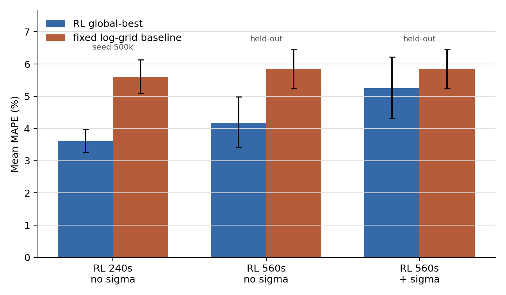
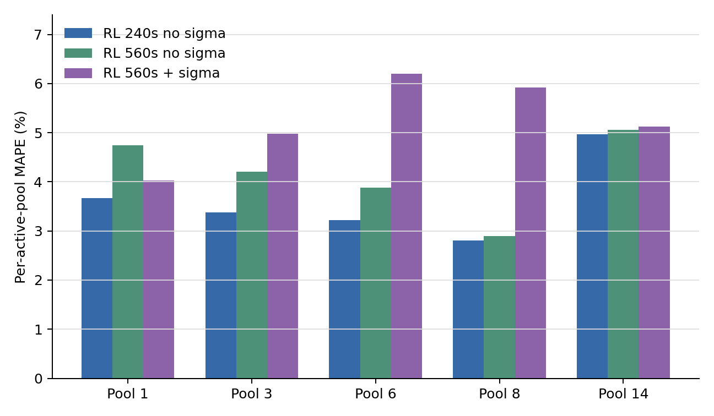
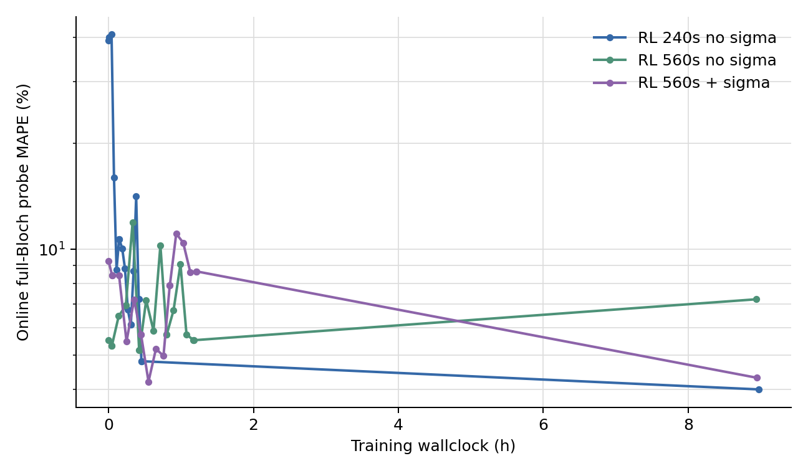
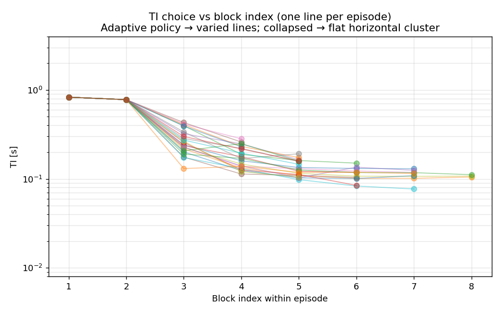
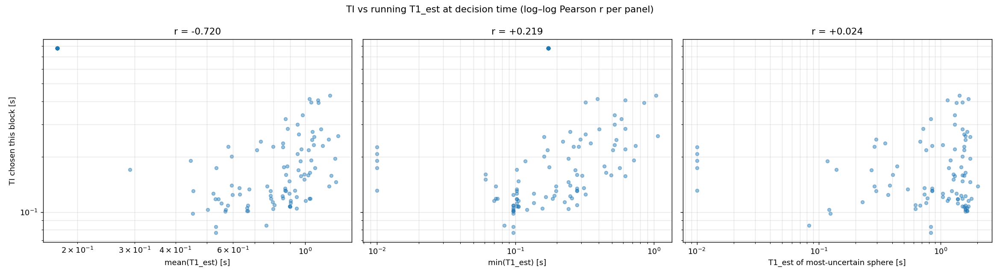
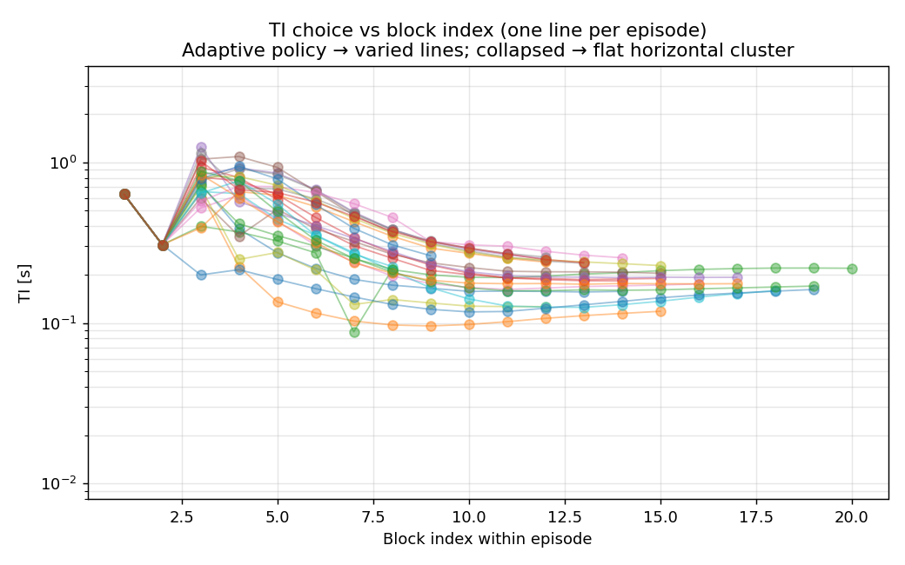
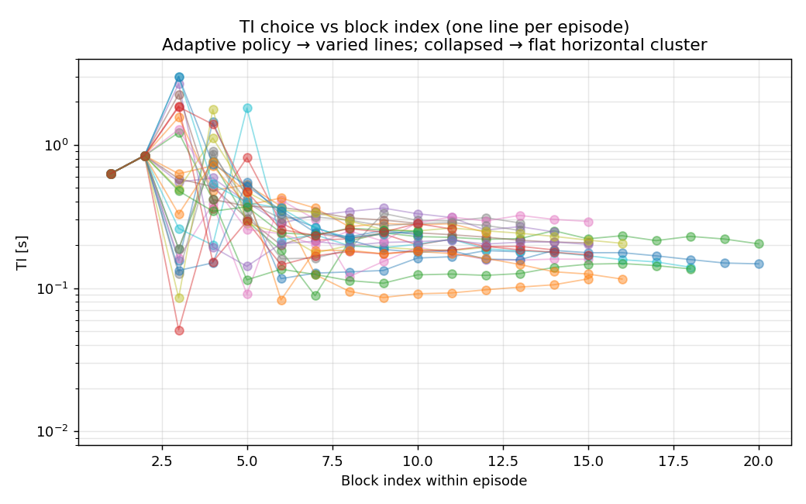

# Multi-Fidelity Curriculum Training for E2

> **Challenge addressed (C2):** *scalable simulation-in-the-loop RL.* Training a
> PPO agent with a Bloch solver in the loop is dominated by the cost of the
> simulator, not the learner.
> **Novelty:** a literature-grounded, *bias-aware* rule for deciding **when** to
> switch simulator fidelity during on-policy RL, specialised to adaptive qMRI
> sequence design.
> **Quantified result:** the multi-fidelity ladder made training feasible and
> produced adaptive, non-collapsed policies. On the full 14-sphere task the best
> fixed schedules still win (§6.6), but on the controlled five-sphere continuous
> T1 probe the global-best RL policies beat the fixed log-grid comparator at
> both 240 s and 560 s (§8). The useful learning often happened at cheap or
> early full-Bloch fidelities; global-best checkpointing is therefore essential.

---

## 1. Motivation — the cost wall

E2 trains a PPO agent with the KomaMRI Bloch solver *in the loop*: every action
(a choice of TI/TE/TR/α) triggers a full multi-shot simulation and 2-D
reconstruction before the fitter returns an updated T1 estimate and the reward.
The per-step cost scales as `Npe · TR · n_spins`. At the 1 mm / 64×32 evaluation
configuration Run A measured **~4.0 s/step on CPU**, so a 200k-step full-Bloch
run is **roughly 8 days** before evaluation/probe overheads. A conventional single-fidelity curriculum
— training everything on the full simulator — is too expensive for the project
compute budget.

The simulator, however, is not one thing. We expose a **ladder of fidelities** of
the *same* forward model, trading bias against cost:

| Fidelity | What it computes | Per-step cost (Run A) | Bias vs full Bloch |
|---|---|---|---|
| `analytic` | per-sphere signal from the closed form the fitter inverts; no Koma | **0.034 s** | noise-limited only; no recon, no water, no B0 crosstalk |
| `cached` | Bloch on the spheres + cached-Koma water template (§4) | **0.34 s** | water approximated to the T1-grid floor (0.24% T1) |
| `full` (coarse water) | full Bloch on spheres + 3 mm water voxels | **0.42 s** | reduced water spin count; spatial discretisation bias |
| `full` | full Bloch on spheres + 1 mm water — the target | **1.03 s** | ground truth |

Each fidelity has a physical **accuracy floor**: the analytic model bottoms out
at its noise floor, cached water can reproduce the matched Bloch-water template
to the T1-grid floor, and the full model is limited by the true noise and
discretisation. The curriculum idea is to *learn cheaply at low fidelity, then warm-
start up the ladder*, spending expensive full-Bloch steps only where they buy
accuracy a cheaper model cannot. The observed cost ladder spans **~30×**, so the
incentive is large.

<!-- REVIEW NOTE (Arthur): the old multi_fidelity.md also listed a `dry` fidelity
(full Bloch on spheres only, no water, ≈ +2.4% MAPE crosstalk). It was never used
in a real run, so I've dropped it from the main table to avoid implying we ran a
4th rung we didn't. Mention in passing only if you want the "water crosstalk is
~2.4% MAPE" number for the discussion. -->

## 2. The hard part — *when* to switch

Warm-starting between fidelities is mechanically trivial (carry the policy
weights). The research question is **when** to promote. The naive answer —
"train N steps per stage" — wastes budget and is impossible to justify.

The central design decision is:

> **The signal that triggers a switch must be improvement in held-out
> *full-simulator* validation, not improvement in the current cheap simulator.**

A biased cheap model can keep improving its *own* score long after the real
(full-sim) score has plateaued — indeed, it can improve its own score by
*exploiting its bias*. This is exactly the failure mode observed in E1, where the
agent collapsed to a degenerate fixed policy that exploited the noiseless fitter
rather than designing informative sequences (`docs/E1_RESULTS.md`). We therefore
probe the **full-Bloch** environment periodically *even during the cheap stages*
— bounded to a few episodes at a coarse cadence, this is the honest price of a
bias-aware switch.

## 3. Literature basis

The switch rule adapts two ideas:

- **Sifaou & Simeone (2025), *Multi-Fidelity Hybrid RL via Information Gain
  Maximization*** (arXiv:2509.14848). Their principle: select the fidelity with
  the best *expected information gain about the target policy per unit simulation
  cost*, gated by a budget-adaptive threshold that pushes toward high fidelity as
  cheap-sim information stops being worth its bias. Their full machinery (a
  CQL/bootstrap-ensemble posterior over policies) is an offline-online algorithm
  too heavy for our on-policy PPO setting, so we borrow the *principle*, not the
  estimator.
- **Cutler, Walsh & How (2015), *RL with Multi-Fidelity Simulators*.** The
  classic switch-up/switch-down rule: train at low fidelity until the policy is
  good enough; if the low-fidelity optimum is *invalid at higher fidelity*, that
  fidelity is exhausted.

**Honesty note (important for the assessment):** we do **not** implement the
paper's posterior information gain. The quantity our code computes is named
`target_slope_per_cost` — the improvement in the full-sim score per second of
wallclock at the current fidelity. We describe it as an *IG-per-cost–inspired
heuristic*, never as "the information gain."

## 4. Implementation — the fidelity ladder

### 4.1 Water coarsening

Roughly **90% of the spins in the phantom are background water** (18,919 of
23,735 at 1 mm / 64×32 / T15). Because k-space signal is a linear sum over spins,
the cheapest physically-meaningful saving is to voxelise the water on a coarser
grid and rescale proton density to conserve total signal. This required
generalising the phantom builder so that water has its own `water_voxel_mm`
independent of the sphere grid:

1. Slicing was generalised from "z-axis only" to **any plane** (centre point +
   normal), with the centre as the grid origin so a 1 mm slice always contains
   water samples.
2. Within a plane, water spins sit `water_voxel_mm` apart; the proton density
   `ρ` is scaled by a water-weighting constant to compensate for the lower count.
3. Slice thickness is built by stacking planes `water_throughplane_mm` apart —
   the realism/cost trade is explicit in these two knobs.
4. Spins are pre-filtered by axis bounds during initialisation to stay memory-
   efficient.

At T15 / 64×32 / 1 mm spheres, **3 mm water = 6,919 spins vs 23,735 at 1 mm (71%
reduction)**; water-only spins drop 18,919 → 2,103 (89%). 2 mm water = 9,565
spins. The sphere-only (no water) floor is 4,816 spins.

<!-- REVIEW NOTE (Arthur): from M6 TODO — we *assumed* the 3mm-water discretisation
bias was negligible. Run A shows it is NOT (the full3 stage regressed; rank-corr
to the 1mm target was only ~0.6). Worth a sentence in the discussion: coarse water
is a real bias source, not a free speedup. The "visualise different voxelisations
& quantify k-space difference" investigation is still outstanding. -->

### 4.2 Water caching

A larger saving exploits the linearity of the simulator directly. KomaMRI is
linear in spins, so the full k-space factorises exactly as

```
S_full = S_spheres + S_water
```

Water is a single homogeneous material, so its k-space row `k` (acquired on shot
`k`) factorises further:

```
S_water[k, :] = Mz_shot[k](TI, TR, α) · sin(α) · W_α[k, :]
```

- `Mz_shot[k]` — the longitudinal magnetisation at excitation for shot `k`,
  depending only on `T1_water, TI, TR, α, k`. **Fully analytic**
  (`transient_mz_at_excite_npe`).
- `W_α[k, :]` — the geometric template: spin positions → Fourier encoding, T2
  echo decay at `TE_ref`, static B0 phase. Obtained once by dividing the
  `Mz·sin(α)` factor out of a *single* real Bloch simulation of the water.

**This makes TI and TR free.** To evaluate a new (TI, TR) you recompute the
analytic `Mz_shot[k]` (O(Npe) arithmetic) and rescale each cached template row —
no new simulation. Only the spheres are re-simulated. This is what the `cached`
rung buys: ~8× faster per step than full Bloch while reproducing full-sim T1 to
**0.24%** (the T1-grid floor; see `water_cache.md`).


*Why cached and not purely analytic water: the analytic water model is too crude
(visible recon/crosstalk error), whereas the cached-Koma template recovers the
full-sim T1 fit. The cached model is the accuracy/speed sweet spot.*


**Implementation constraint (for the planned 5-sphere reruns):** the cache is
keyed on spin *positions*. Reusing it across a curriculum requires holding the
phantom pose fixed — if we coarsen toward 5 spheres we must keep the same
positions or the water cache has to be rebuilt.

<!-- REVIEW NOTE (Arthur): the α dependence is the real caveat for caching. Two
coupled effects were measured in M6:
 (1) Mz_shot[k] does not rescale across α: at 90° cos(α)=0 so every shot starts
     from thermal equilibrium (flat transient); at 30° residual Mz carries between
     shots, building a row-by-row gradient. Koma/analytic ratio runs 1.01 (row 1)
     → 1.40 (row 16) at 30° vs 90°.
 (2) W_α itself changes with α (spoiling/echo formation), giving 7–21% spatial
     variation between a 30° and 90° template; using the wrong template biases
     every water pixel and the error is TI-independent so TI-rescaling can't fix it.
The current `water_cache.jl` addresses this with an α-template bank spanning the
action range and interpolating between matched-α templates, so it is no longer a
single 90° cache. ACTION: still verify the full fitter/action pipeline for α≠90°
before drawing a strong conclusion about `learn_alpha`, because Run A's learned
policy collapsed to 90° despite the extra action dimension. -->

### 4.3 The switch rule (as implemented)

At each decision point (every `mf_decision_rollouts` PPO rollouts) we probe the
policy on the current-fidelity env and the full-Bloch env. In Run A this used
`mf_probe_episodes_full = 4`: cheap enough to run during training, but too noisy
to be a report-grade estimate. Treat these four-episode probes as **screening
signals** for switching, not as final statistical claims. Define the full-sim
score

```
P_H = −log₁₀(clamp(MAPE_full, floor, 1))
```

(higher is better; the clamp models the floor and gives a usable sub-1%
gradient). After a `min_steps` gate we **promote** out of the current cheap
fidelity when **any** of the following holds:

1. **Target plateau** *(primary).* `P_H` has stopped improving over the last
   `plateau_window` decision points — the cheap sim has given what it can.
2. **Ranking breakdown** *(Cutler switch-down).* The Spearman correlation between
   cheap-sim and full-sim MAPE across recent checkpoints falls below a guardrail
   (0.7 `analytic`, 0.8 `cached`) — the cheap sim no longer *ranks* policies like
   the target. Evaluated only once ≥4 checkpoints exist.
3. **Bias intolerance.** The mean (or p90) MAPE gap between cheap and full
   exceeds a tolerance (1% / 2% absolute).
4. **Budget reserve.** Remaining wallclock has fallen to the fraction reserved
   for the final full stage (`mf_full_reserve_frac`, 20% in Run A), overriding
   everything to guarantee the target fidelity gets compute.

On every promotion we record the **fidelity gap** — the full-sim MAPE of the
warm-started policy *before* any training at the new stage, minus the previous
stage's final full-sim MAPE — as the transfer diagnostic. Decision logic is
isolated in `python/mf_switch.py` (pure, unit-tested); the PPO/Julia
orchestration is in `python/train_e2_mf.py`.

For future runs, global-best checkpointing is deliberately stricter than the
switch rule: a four-episode full-Bloch probe can identify a candidate, but
`<run>/global_best/` is only overwritten after a separate larger confirmation
eval (`--mf-global-best-episodes`, default 12, using independent seeds). Final
report numbers should still come from a fresh 24-episode eval with CIs.

### 4.4 V2 — the slope-per-cost lookahead

V1 used only plateau/rank/bias/reserve, leaving the logged
`target_slope_per_cost = ΔP_H / wallclock` unused in the decision. **V2 (used in
Run A) makes it operational.** When the recent current-fidelity slope *collapses*
relative to its own earlier value (below `mf_slope_collapse_frac × max prior
slope`), or the relative plateau is near firing, the trainer **clones the policy,
trains it briefly at the next fidelity, and re-scores it on the same full-Bloch
probe seeds.** It then promotes on slope grounds only if

```
s_next > mf_lookahead_margin · s_current     (margin 1.15 in Run A)
```

The clone never mutates the real model or its `VecNormalize` stats; reward
normalisation is reset; a wall-budget cap stops the lookahead eating the final
full reserve. The old plateau rule remains the fallback, and switch reasons are
logged distinctly (`lookahead_better`, `target_plateau`, `rank_breakdown`,
`bias_intolerance`, `budget_reserve`) so the history shows *why* each switch
fired. This grounds the decision in Sifaou & Simeone's IG-per-cost principle
without importing their posterior machinery.

---

## 5. Run A — configuration

**Run:** `runs/e2/mf_v2_runA_cpu_9h` — first end-to-end V2 curriculum,
`analytic → cached3 → full3 → full`, under a fixed **9 h CPU** budget.
Config (`run_config.json`): T15, 64×32, 1 mm voxels, full-Bloch water, σ=50,
`delta_log_mape`, `learn_alpha`, `fix_te`, `log_ti_action`, 20% full reserve,
margin 1.15, slope-collapse-frac 0.25.

<!-- REVIEW NOTE (Arthur): log_ti_action was carried over from earlier (buggy-sim)
runs where a log-TI grid helped the bottom spheres' high error. We did NOT
re-verify that on the fixed simulator — flag as a design choice inherited, not
re-validated. An ablation (linear vs log TI grid) is a cheap candidate run. -->

| Stage | Steps | Wall | sec/step | Water model | End-of-stage full-Bloch MAPE |
|---|---|---|---|---|---|
| `analytic` | 0 → 8.2k | 0.08 h | 0.034 s | closed form | 16.60 % |
| `cached3` | 8.2k → 41k | 3.28 h | 0.338 s | cached, 3 mm | **10.37 %** |
| `full3` | 41k → 74k | 3.94 h | 0.416 s | full Bloch, 3 mm | 14.03 % |
| `full` | 74k → 79.5k | 1.64 h | 1.03 s | full Bloch, 1 mm | 12.26 % |

Switch reasons (from `fidelity_history.json`): `analytic → rank_breakdown`
(8.2k); `cached3 → target_plateau` (41k); `full3 → budget_reserve` (74k, forced
by the 20% reserve); `full →` global budget exhausted.

**The lookahead fired exactly once — and gave the right warning.** At the cached3→full3
boundary (41k) the slope had collapsed, triggering a lookahead: a full3 clone was
trained for ~230 s and its full-Bloch MAPE got **worse** (10.37% → 11.69%), so
`s_next ≈ 0` and the rule **declined to promote on slope grounds**
(`lookahead_promote = false`); the plateau fallback promoted instead. That
negative lookahead was **consistent with the later full3 regression** that then
played out over the whole stage (§6). This is the cleanest single piece of
evidence that the V2 signal is meaningful: it saw, in 230 s, that the next rung
was not immediately helping. What it lacked was an action for "skip this rung /
rollback to global best and go straight to full".

---

## 6. Run A — results & evaluation

> **Version note.** §§6.1–6.3 and the money plot report the original Run A analysis generated on
> **2026-06-01**. After this, the sibling digital twin changed on **2026-06-08/09**
> (`random-phantom` config sampler, SO3 pose sampler, builder/augment changes, and
> manifest re-resolves). Re-evaluating the same saved policy on the current
> simulator gives **11.68%** rather than **10.16%** MAPE (§6.6). The checkpoint
> comparison in §6.4 has now been re-run on the current simulator and includes CIs.
> The qualitative findings below still hold, but old text logs from June 1 should
> not be used as the source of truth beside the current baseline table.

> **How to frame this in the report:** this is not "the same experiment sampled
> twice"; Run A exposed weaknesses in the digital twin/sampling path, and the
> simulator was then improved. The post-rework numbers are the fair comparison to
> the current fixed baselines; the pre-rework numbers are historical evidence for
> the curriculum behaviour, not directly comparable performance claims.

### 6.1 The money plot


*Held-out full-Bloch MAPE (log y) vs cumulative wallclock; dashed lines = stage
switches.*

1. **`analytic` (0–0.1 h):** collapses ~42% → ~10% almost immediately — the
   closed-form surrogate learns the gross TI structure essentially for free.
2. **`cached3` (0.1–3.4 h):** the productive stage; the held-out probe descends
   into an **~8–10% basin** and plateaus. This is the best the run ever achieves.
3. **`full3` (3.4–7.3 h):** **regression.** Switching to true Bloch water (still
   3 mm) jumps the held-out MAPE back to **17–19%**, ending at 14%. The 3 mm-water
   optimum is not the 1 mm optimum the probe measures (rank-corr ≈ 0.6, bias ±5%).
4. **`full` (7.3–9.0 h):** partial recovery to **12.26%** in the 5.8k steps the
   reserve allowed — better than `full3`, still worse than the cached basin.

**Interpretation.** The controller behaved sensibly on the cheap→cheap boundary,
but the run exposes a real weakness: **the final saved policy (12.26%) is worse
than a checkpoint the run had already passed through (~8.4% during `cached3`).**
Per-stage best checkpoints exist (`stage*/best/`) but the *globally* best policy
was discarded. The two expensive stages spent ~5.6 h (62% of budget) to end up
*behind* the cheap basin.

### 6.2 Final-policy evaluation (`eval_e2.py`, 24 episodes; pre-rework)

Original 2026-06-01 re-evaluation of the saved policy on 24 fresh held-out episodes
(seed 500 000):

```
MAPE = 10.16 %    p90 MAPE = 14.42 %    Success<5% = 4.2 %    Mean scan = 232 s
```

Per-sphere MAPE shows a clean T1-dependent gradient:

| Pool | T1 (s) | MAPE | | Pool | T1 (s) | MAPE |
|---|---|---|---|---|---|---|
| 1 | 1.879 | **40.8 %** | | 8 | 0.195 | 3.0 % |
| 2 | 1.432 | 28.4 % | | 9 | ~0.14 | 2.3 % |
| 3 | 1.027 | 17.9 % | | 10 | ~0.10 | **1.5 %** |
| 4 | 0.751 | 12.1 % | | 11 | ~0.07 | 2.4 % |
| 5 | 0.527 | 7.6 % | | 12 | ~0.05 | 2.4 % |
| 6 | 0.384 | 5.9 % | | 13 | ~0.024 | 4.8 % |
| 7 | 0.272 | 5.2 % | | 14 | ~0.017 | 7.8 % |

Accuracy is excellent in the mid/short-T1 band (1.5–6%) and degrades sharply at
**long T1**: the 1.88 s sphere is off by 41%. This is mechanistically explained
by the action space (§6.3): the agent's TIs cluster at 0.05–0.6 s, well short of
the ~1.3 s inversion null a 1.9 s T1 needs, so long-T1 recovery is incomplete and
biased. The aggregate 10% MAPE is dominated by the three longest-T1 spheres.

### 6.3 Adaptivity diagnostics (`diagnose_e2.py`)

The agent is **not** the degenerate E1 policy. Over 227 blocks / 24 episodes:

| Signal | Value | Reading |
|---|---|---|
| TI intra-episode log-σ | 0.281 | TI varies *within* an episode |
| TI inter-episode log-σ | 0.290 | …and *across* episodes |
| Modal-bin share | 11.9 % | no single-TI spike (vs ~100% if collapsed) |
| r(TI, mean running T1_est) | **+0.50** | TI tracks the running estimate |
| r(TI, T1_est of most-uncertain sphere) | **+0.64** | TI tracks *uncertainty* |


The positive correlation is the key evidence for adaptivity: when the running
estimate (or the most-uncertain sphere's estimate) is high, the agent picks a
longer TI — the qualitatively correct response.


The within-episode structure is a **fixed two-block probe** (blocks 1–2 identical
across episodes, TI ≈ 0.05 → 0.07 s), a **fan-out at block 3–4** where the policy
diverges per phantom, then a converging **rising ramp** — "open with a fixed
probe, then adapt."


**The `learn_alpha` DoF collapsed to its bound:** every chosen α sits at ~90°
regardless of TR or running T1. The agent did not learn to drop α toward the
Ernst angle for long-T1 / short-TR regimes. This DoF added cost without benefit
in this run.

<!-- REVIEW NOTE (Arthur): two figures omitted from the report cut but available
for review: ti_histogram.png (bimodal — fixed probe + adaptive ramp; the script's
"single-bin → degenerate" auto-caption does NOT apply) and snr_vs_block.png
(peak-sphere NEMA SNR ~20–40, consistent with the σ=50 calibration → NEMA dual-acq
≈ 30, clinical). Also t1est_trajectory.png shows the running fit stabilising by
~block 5. Pull any of these in if §6.3 needs more support. CAVEAT on the
learn_alpha claim: see the §4.2 caching note — the cache now supports an α-bank,
but we still need to verify the full fitter/action pipeline for α≠90°. The "α
bought nothing" reading may be partly a fitter/objective/search-space confound,
not purely a policy finding. -->

### 6.4 Checkpoint comparison — what each stage discovered (current sim)

The `analytic` end-of-stage policy and the `cached-best` checkpoint (30k steps)
were re-evaluated on the **same current-simulator full-Bloch held-out set** as
the final policy — a transfer test (trained cheap, scored on the true target):

| Metric (full-Bloch held-out, 24 ep) | `analytic` (8k) | **`cached-best` (30k)** | `full` final (79.5k) |
|---|---|---|---|
| **MAPE** | 16.03 % | **9.44 %** | 11.68 % |
| **95% CI** | [13.97, 18.56] | **[8.18, 10.94]** | [10.42, 13.03] |
| **p90 MAPE** | 20.87 % | **14.11 %** | 15.22 % |
| r(TI, mean running T1_est) | +0.68 | +0.63 | +0.50 |
| r(TI, most-uncertain sphere) | +0.33 | +0.39 | +0.64 |
| TI intra-episode log-σ | 0.33 | **0.38** | 0.28 |
| Max TI reached | ~0.18 s | **~0.8 s** | ~0.3–0.6 s |
| α: mean / std / min (deg) | 89.0 / 2.4 / 79.5 | 89.8 / 1.6 / 75.1 | 90.0 / **0.00** / 90.0 |
| Pool 2 MAPE (T1 = 1.43 s) | 64.1 % | **18.7 %** | 28.2 % |
| Pool 3 MAPE (T1 = 1.03 s) | 58.2 % | **13.8 %** | 23.8 % |
| Pool 4 MAPE (T1 = 0.75 s) | 25.0 % | **10.7 %** | 19.0 % |
| Pool 1 MAPE (T1 = 1.88 s) | 41.4 % | 43.5 % | 41.2 % |

*(Pools 5–14, T1 ≤ 0.53 s, remain the easy band: roughly 1.5–9.5% across these
checkpoints. The persistent failures are the long and mid-long T1 pools.)*

**Four findings:**

**(a) The adaptive strategy was discovered for free, on the analytic model.** The
8.2k-step analytic policy already conditions TI on its running estimate *more*
strongly than the final policy (r = +0.68 vs +0.50), with the same probe →
fan-out → ramp structure. The expensive stages did not *teach* adaptivity — they
inherited it.

**(b) The cached stage is where accuracy was won, and it remains the run's best
checkpoint after the simulator rework.** `cached-best` reaches **9.44%**
([8.18, 10.94], p90 14.11%), better than the final saved policy's **11.68%**
([10.42, 13.03], p90 15.22%). The CIs slightly overlap, so phrase this as
"best measured checkpoint" rather than a formal statistical win. The gain came
from **TI range**: its ramp climbs to ~0.8 s, long enough to characterise
mid-long-T1 spheres, reducing Pool 2/3/4 error from 64.1% / 58.2% / 25.0%
(analytic) to 18.7% / 13.8% / 10.7%. The analytic policy's ramp topped out at
~0.18 s.

**(c) The expensive stages made it worse, and we can see how.** Between
cached-best and the final policy the TI ramp *shrank* from ~0.8 s back to
~0.3–0.6 s and intra-episode exploration dropped (log-σ 0.38 → 0.28),
re-inflating mid-long-T1 errors (Pool 2: 18.7% → 28.2%; Pool 3: 13.8% → 23.8%;
Pool 4: 10.7% → 19.0%).
The full3 regression is therefore not a number wobble — the policy concretely
**lost the long-TI behaviour** the cached stage had found, most likely because
full3's 3 mm-water optimum pulled it off the 1 mm optimum before the budget ran
out.

**(d) No checkpoint varied the flip angle, and the DoF *degraded* over training**
(α std 2.4° → 1.6° → 0.00°). The curriculum drove the agent *harder* onto the 90°
ceiling rather than teaching it to exploit the Ernst angle. `learn_alpha` added an
action dimension that bought nothing here.

**Pool 1 (T1 = 1.88 s) is unsolved by every checkpoint (~41–44%)** — even
cached-best's 0.8 s TIs fall short of the ~1.3 s inversion null. This is an
action-space / learned-timing-coverage ceiling, not just a training-time problem.

<!-- REVIEW NOTE (Arthur): per-checkpoint diagnostic figures live at
runs/e2/mf_v2_runA_cpu_9h/stage0_analytic/diagnostics/ and
stage1_cached3/best/diagnostics/ (ti_per_episode.png, ti_vs_t1est.png). The
analytic and cached-best ti_per_episode plots make finding (a)/(b) visually
obvious — include one or two if the chapter has room. -->

### 6.5 Bottom line

This run is, in effect, an unintended ablation: **the cheap stages delivered the
result and the expensive stages eroded it.** On the current simulator, the
single highest-value change would have been to **emit and keep the global-best
checkpoint** (`cached-best`, 9.44% [8.18, 10.94]) rather than the last policy
(11.68% [10.42, 13.03]). This does not beat the fixed schedules (§6.6), but it
does show that the curriculum controller should select the best full-Bloch
checkpoint globally rather than blindly returning the final stage.

---

## 6.6 Baseline comparison — the fixed protocol currently wins

A non-adaptive fixed protocol is the yardstick for the C2 "adaptive beats fixed"
claim. Evaluated at the **same current simulator/config** as the policy (T15,
64×32, 1 mm, σ=50, full-Bloch water; `baseline_e2.py --match-run
runs/e2/mf_v2_runA_cpu_9h`), over 24 held-out episodes:

| Policy (24 ep, full-Bloch held-out) | Mean MAPE | 95% CI | p90 | mean time |
|---|---|---|---|---|
| **`cr_optimal_alpha`** (joint CR-opt TI/TR/α; solved α = 90° for all blocks) | **4.70 %** | **[4.42, 5.00]** | **5.68 %** | 240 s / 6 blk |
| **`log_grid_trmatched`** (fixed 7-pt log-TI grid, TR=1.7 s, α=90°) | **5.80 %** | **[5.24, 6.40]** | 8.06 % | 218 s / 5 blk |
| `cr_optimal` (CR-opt TI/TR, α fixed at 90°) | 7.64 % | [6.14, 9.25] | 12.54 % | 239 s / 4 blk |
| `ernst_fixed` (CR-opt timing, α = Ernst angle at fleet-median T1) | 8.69 % | [7.33, 10.00] | 12.12 % | 239 s / 4 blk |
| Run A `cached-best` checkpoint, current-sim rerun | 9.44 % | [8.18, 10.94] | 14.11 % | 231 s |
| **Run A final policy, re-evaluated after 2026-06-08/09 sim changes** | **11.68 %** | **[10.42, 13.03]** | 15.22 % | ~232 s |
| Run A `analytic` checkpoint, current-sim rerun | 16.03 % | [13.97, 18.56] | 20.87 % | 223 s |
| Run A final policy, original 2026-06-01 eval | 10.16 % | *(stale; pre-rework)* | 14.42 % | 232 s |
| Run A `cached-best` checkpoint, original 2026-06-01 eval | 8.36 % | *(stale; pre-rework)* | 9.96 % | — |
| `log_grid` (TR=4 s) | 100.00 % | [100.00, 100.00] | 100.00 % | 128 s / 2 blk |
| `clinical_irse` (TR=5 s) | 100.00 % | [100.00, 100.00] | 100.00 % | 160 s / 2 blk |

**The fixed schedules decisively beat the adaptive agent on the 14-sphere pool.**
The clean current-simulator comparison is `cr_optimal_alpha` **4.70%**
([4.42, 5.00]) and `log_grid_trmatched` **5.80%** ([5.24, 6.40]) versus the best
measured RL checkpoint **9.44%** ([8.18, 10.94]) and final saved agent **11.68%**
([10.42, 13.03]). The fixed-vs-RL confidence intervals are separated by a large
margin, so this is not sampling noise. **Therefore "adaptive beats fixed" does
not hold for this 14-pool setting.** The result is still valuable: it shows that
the multi-fidelity curriculum can learn a non-collapsed adaptive policy, but the
environment rewards robust global experimental design more than per-episode
adaptation when every episode contains all 14 T1 spheres.

The two `100%` rows are now understood and should not be used as performance
baselines. They are **budget-incompatible schedules** under this E2 acquisition
model: with `Npe=32`, TR=4 s costs 128 s per block and TR=5 s costs 160 s per
block, so the 240 s episode allows too few useful measurements for the T1 fitter.
They are useful only as a failure-mode note for why budget matching matters.

The most meaningful simple baseline is `log_grid_trmatched`: it keeps a fixed
log-TI grid but shortens TR to 1.7 s so multiple blocks fit in the same scan-time
budget. Its 5.80% MAPE shows that much of the agent's apparent problem is not
"lack of adaptivity" but **poor coverage of the informative timing range**. A
fixed design that covers the full T1 ladder is already strong when all 14 pools
are present every episode.

The CR baselines require careful wording:

- `cr_optimal` optimises `(TI, TR)` with α fixed at 90° using a local F1+
  Cramér-Rao objective. It does include a generic observation-noise scale
  `σ_obs`, but because the objective is normalised and `σ_obs` is constant across
  measurements, the absolute noise level cancels. Its weakness is not simply
  "it ignores noise"; it is that the local Fisher objective, nominal T1 fleet,
  finite multi-start search, and subsequent nonlinear magnitude fitting do not
  perfectly predict empirical MAPE under the full simulator. In this run it
  sacrifices the longest-T1 pool badly (Pool 1 = 52.5%), giving 7.64%.
- `cr_optimal_alpha` is not the same schedule as `cr_optimal` even though it
  ultimately chooses α=90° for every block. It solves a larger optimisation over
  `(TI, TR, α)` and, in this run, selected **6 blocks** rather than 4:
  TIs ≈ `[0.0276, 0.0283, 0.0354, 0.1491, 0.1561, 0.5452]`, TRs ≈
  `[0.5587, 0.5912, 0.6677, 0.7444, 0.8404, 4.0882]`. The extra blocks and
  different timing are what improve empirical MAPE to 4.70%, not use of a
  non-90° flip angle.
- `ernst_fixed` reuses the 4-block `cr_optimal` timing and replaces α with the
  Ernst angle for the fleet-median T1. It is worse than both CR schedules here,
  reinforcing the observation that flip-angle freedom did not buy much in this
  F1+/fixed-budget setup.

Per-sphere pattern: the agent's current-sim error is still dominated by long and
mid-long T1 pools (Pool 1 41.2%, Pool 2 28.2%, Pool 3 23.8%, Pool 4 19.0%). The
best fixed schedule reduces the same region substantially (`cr_optimal_alpha`:
Pool 1 13.7%, Pool 2 5.2%, Pool 3 5.9%, Pool 4 5.5%), showing that the fixed
schedule is not just improving short-T1 averages; it solves much of the hard end
of the ladder too.

**Artifacts:** full current-simulator baseline results are in
`runs/e2/baseline_runA_match/baseline_summary.json`; schedules are in
`runs/e2/baseline_runA_match/cr_optimal_schedule.json` and
`runs/e2/baseline_runA_match/cr_optimal_alpha_schedule.json`. Current-simulator
checkpoint reruns are in `runs/e2/mf_v2_runA_cpu_9h/stage0_analytic/eval_summary.json`
and `runs/e2/mf_v2_runA_cpu_9h/stage1_cached3/best/eval_summary.json`. Note: the
adjacent `eval_fullbloch.txt` files were old captured stdout and were not
overwritten by the latest rerun; use the JSON summaries for current values.

<!-- REVIEW NOTE (Arthur): checkpoint JSONs are now current-sim reruns. If you want
matching human-readable logs, rerun eval_e2 with stdout redirected to fresh
*_current.txt files; the old eval_fullbloch.txt files still show June 1 values. -->

### 6.7 Baseline definitions and five-sphere CR-oracle status

The baseline names in `baseline_e2.py` are easy to misread, so the report should
define exactly what each one is:

- `log_grid`: a fixed log-spaced TI grid with TR = 4 s and α = 90°. Under the E2
  budget (`Npe=32`, 240 s), this is budget-starved and should be reported only
  as a failure mode.
- `clinical_irse`: a conventional long-TR IRSE-style schedule with TR = 5 s.
  Also budget-starved under the short E2 budget.
- `log_grid_trmatched`: the meaningful simple fixed-grid comparator. It keeps a
  broad log-TI grid, sets α = 90°, and uses TR = 1.7 s so several blocks fit
  inside 240 s. This is deliberately not adaptive, but it is robust.
- `cr_optimal`: a Cramer-Rao schedule over `(TI, TR)` with α fixed at 90°. It is
  solved using the analytic F1+ signal model and a local Fisher-information
  objective, then evaluated through the full E2 simulator/fitter.
- `ernst_fixed`: the `cr_optimal` timing with α replaced by the Ernst angle at a
  fleet-median T1. In this IR spin-echo T1 objective it was worse than α = 90°;
  the spoiled-GRE Ernst intuition is not directly predictive here.
- `cr_optimal_alpha`: a larger CR search over `(TI, TR, α)`. It often still
  chooses α = 90°, but it is not the same as `cr_optimal` because the search can
  choose a different number of blocks and different timing.
- `cr_oracle`: an intentionally unfair diagnostic lower bound for the five-sphere
  task. For each evaluation episode it reads the active subset's true sampled
  `T1_true` values from `QalibreMDE2Env.reset`, solves a fresh CR schedule for
  that truth vector, and then evaluates that one-shot schedule. With
  `t1_sampler=linear_uniform_range`, almost every episode has a distinct truth
  vector, so `n_unique_subsets_solved` should be close to the episode count. This
  is not a deployable baseline because it sees the answer before acquisition; it
  is a sanity check on how much the local CR surrogate can do with perfect prior
  knowledge.

**Important CR feasibility fix (2026-06-09).** E2's action space has
`TR ∈ [0.5, 5.0]` and the step function enforces

```
TR >= max(0.5, (TI + TE) / 0.90)
```

with `TE = 20 ms` in `--fix-te` mode. The `0.5 s` term is the RL action-space
floor, not a physical constant; the `(TI + TE)/0.90` term is the E2 sequence
headroom rule. These values belong in the E2 baseline wrapper, not inside the
generic CR library: `baseline_e2.py` now constructs a live `QalibreMDE2Env` and
reads the CR timing dict from the E2 wrapper (`tr_lo_floor` from
`e2_action_lo`, fixed `te_s` from the fixed-TE action mode, and `tr_headroom`
from `e2_tr_headroom`). It then passes those values into MRISystemPhantom's
generic timing-constraint keywords. The old CR run used `max(0.5, TI + 0.05)`,
which was looser than the environment for some long-TI blocks. The result was a
near-budget CR schedule that looked feasible to the optimiser but was silently
lengthened by the evaluator and could lose its final block.

The first pulled five-sphere oracle run exposed the mismatch. It reported
`n_unique_subsets_solved = 24`, so the oracle was already using each episode's
true sampled T1 values correctly, but `mean_ep_len = 3.75` showed that some
nominal four-block schedules were truncated. Static inspection found **11/24**
oracle schedules that were nominally under 240 s but over budget after applying
the E2 TR lift (worst excess ≈ 2.7 s). That stale oracle number was
`MAPE = 12.93%`, p90 `25.13%`, success<5% `29.2%`.

After the timing-bound fix, the rerun in `runs/e2/baseline_5sphere_runB` is
mechanically valid:

| Check | Rerun value |
|---|---:|
| `n_unique_subsets_solved` | 24 / 24 |
| `n_blocks` selected | 4 for all 24 schedules |
| `mean_ep_len` | 4.0 blocks |
| `mean_scan_time_s` | 239.22 s |
| Nominal schedule time | min 238.86 / mean 239.42 / max 239.85 s |
| Env-adjusted schedule time | identical to nominal |
| Over-budget after E2 timing adjustment | 0 / 24 |
| Saved timing constraints | `tr_lo_floor=0.5`, `te_s=0.02`, `tr_headroom=0.9` |

The oracle metric improved but remains poor:

| Run | MAPE | p90 MAPE | Success<5% | Mean blocks |
|---|---:|---:|---:|---:|
| stale oracle before TR-bound fix | 12.93 % | 25.13 % | 29.2 % | 3.75 |
| rerun after TR-bound fix | **11.51 %** | **19.41 %** | 29.2 % | 4.00 |

Per-active-sphere MAPE on the valid rerun:

| Active label | Mean MAPE | p90 MAPE | n |
|---:|---:|---:|---:|
| 1 | 11.99 % | 31.45 % | 24 |
| 3 | 7.47 % | 13.05 % | 24 |
| 6 | 12.58 % | 30.99 % | 24 |
| 8 | 10.67 % | 12.16 % | 24 |
| 14 | 14.85 % | 49.27 % | 24 |

The conclusion is important: the rerun validates the mechanics, but **not** the
CR oracle as a strong empirical comparator. The local analytic CR objective is a
weak surrogate for the actual noisy full-Bloch + reconstruction + ROI + magnitude
fitter objective. It chooses only four blocks, and its schedules still under-cover
long T1s. Across the 24 oracle schedules, `max(TI)` was only min/mean/max
`0.521 / 0.732 / 0.878 s`; for T1 ≈ 1.8 s, the inversion null is around 1.25 s.
The hardest oracle schedule had true T1s `[1.305, 1.869, 1.549, 0.232, 1.517]`
but TIs `[0.010, 0.878, 0.171, 0.184]`, which is visibly information-starved for
the long-T1 end. The strongest non-adaptive comparator for this task is therefore
still the robust `log_grid_trmatched`-style schedule, not this CR oracle.

The lower TR floor does matter but does not dominate every CR schedule. In the
pre-fix artifacts, `cr_optimal` had 0/4 TRs exactly at 0.5 s,
`cr_optimal_alpha` had 0/6, and the stale oracle schedules had 6/96. In the valid
rerun, 0/96 oracle TRs were exactly at the 0.5 s floor, but 12/96 were exactly at
the active minimum `max(0.5, (TI + 0.020)/0.90)`. The old `TI + 0.05` lower bound
was more active (19/96 stale oracle TRs), which is why the feasibility mismatch
mainly hurt the first oracle run.

Artifact note: `run_oracle.log` says the summary path is
`baseline_summary.json`, but the committed artifact is
`baseline_summary_oracle.json`; use the JSON file currently present in the run
directory as the source of truth, and clean the filename mismatch before adding
automation around these runs.

**Five-sphere scan-time budget sweep.** Two GPU baseline sweeps from the VM test
whether the five-sphere task is scan-time limited once the robust fixed schedule
has enough shots. Both use the same forced labels (`1,3,6,8,14`), `Npe=32`,
`Nfe=64`, `noise=50`, fixed TE, fixed α=90°, log-TI action mapping, ROI=1,
in-plane pose jitter, and 24 held-out seeds (`500000..500023`). Artifacts:
`runs/e2/baseline_5sphere_420s_gpu/baseline_summary.json` and
`runs/e2/baseline_5sphere_560s_gpu/baseline_summary.json`.

| Budget | Schedule | MAPE | 95% CI | p90 | Success<5% | Mean time / blocks |
|---:|---|---:|---:|---:|---:|---:|
| 420 s | `log_grid_trmatched` | **5.63 %** | [4.98, 6.32] | 7.88 % | 37.5 % | 326.6 s / 7.0 |
| 420 s | `cr_optimal` | 7.19 % | [6.17, 8.31] | 11.08 % | 20.8 % | 418.5 s / 10.0 |
| 420 s | `cr_optimal_alpha` | 7.24 % | [6.27, 8.24] | 10.75 % | 20.8 % | 418.4 s / 10.0 |
| 420 s | `cr_oracle` | 7.11 % | — | 8.62 % | 25.0 % | 418.8 s / 5.5 |
| 560 s | `log_grid_trmatched` | **5.71 %** | [5.04, 6.41] | 7.49 % | 33.3 % | 542.8 s / 10.0 |
| 560 s | `cr_optimal` | 7.34 % | [6.51, 8.20] | 10.17 % | 12.5 % | 557.5 s / 10.0 |
| 560 s | `cr_oracle` | 7.05 % | — | 8.24 % | 20.8 % | 558.8 s / 6.8 |

The result is decisive: **the best fixed five-sphere comparator is not scan-time
limited in the 240--560 s range.** `log_grid_trmatched` stays essentially flat
(`5.60%` at 240 s in the earlier run, `5.63%` at 420 s, `5.71%` at 560 s), so
adding more shots does not reduce its empirical error. The remaining error is
more likely set by noise, reconstruction/ROI statistics, magnitude fitting, and
model mismatch than by insufficient block count. CR improves sharply relative to
the 240 s oracle failure because the larger budget gives it 6--10 blocks, but it
then saturates around 7% and remains worse than the fixed log schedule. The
`cr_optimal` and `ernst_fixed` schedules are identical at 420 s, and
`cr_optimal_alpha` again chooses only 90° flip angles, reinforcing the decision
to fix α for the RL ablations.

Implication for the overnight RL runs: a 420/560 s confidence-channel run is a
useful *ceiling probe* for the current IR-SE action family, but it should not be
sold as a cleaner main comparison than 240 s. If RL beats the 420/560 s fixed
log schedule, that is strong evidence of useful adaptivity. If it only beats CR,
the honest conclusion is that RL beats the analytic CR surrogate but not the
robust empirical fixed schedule. If it plateaus near 5--6%, the current action
family is probably saturated and the next publishable step is more DOF: variable
`Npe`, explicit stop/Pareto, or sequence-family / joint T1-T2 control.

**Action repair vs rejection.** E2 currently repairs infeasible timing actions
rather than rejecting them: if the agent asks for a TR too short to contain
`TI + TE`, the environment executes the same TI but lifts TR to the feasible
minimum. This was a pragmatic PPO choice. Hard rejection would be cleaner
semantically, but early random policies would spend many episodes proposing
invalid timing tuples, receiving terminal penalties or no-op penalties before
learning any MRI structure. That burns rollout slots, episode seeds and training
wallclock on action-space geometry rather than sequence design, and it tends to
push PPO toward overly conservative high-TR choices. A cleaner future design would
parameterise feasibility directly, e.g. choose `(TI, TE, recovery_margin)` and
set `TR = (TI + TE)/headroom + recovery_margin`, so invalid actions cannot be
sampled.

For the current code, the important change is auditability: `e2_step!` now emits
both requested and executed timings:

```
TI_requested, TE_requested, TR_requested
TI_executed,  TE_executed,  TR_executed
TR_min_required, TR_lifted, TR_lift_amount
TE_max_allowed,  TE_clamped, TE_clamp_amount
action_repaired
```

`eval_e2.py` and `diagnose_e2.py` summarise these as repair rates and mean/max
TR lift. This makes action repair a measurable property of a policy rather than
a hidden environment side effect. If a policy has near-zero repair rate, the
repair rule is only a guardrail; if it relies on repair often, requested-action
plots are misleading and the report should discuss executed timings instead.

---

## 7. Honest caveats

1. **The old "100% MAPE / 9.8× speedup" baseline was bogus — now fixed.** Two
   compounding causes: (a) TR/budget starvation — the grid used TR=4–5 s, which at
   Npe=32 / 240 s fits only *one* block, so the fitter never gets its ≥2 samples
   and MAPE is forced to 1.0; (b) a latent action-channel-misalignment bug in the
   baseline's normalisation. Both fixed (`physical_to_norm_action`; budget-matched
   TR). **Do not cite the old speedup.** With the fix the fixed schedules score
   4.70–5.80% (§6.6) — and currently *beat* the agent, so the quantified-benefit
   claim must come from the 5-sphere task or from the multi-fidelity speedup
   mechanism, not from "14-pool RL beats fixed". Separately, the five-sphere
   CR-oracle rerun is now mechanically valid after the TR-bound fix, but still
   scores 11.51% MAPE (§6.7), showing that the analytic CR objective is not a
   strong empirical surrogate under the full noisy E2 evaluator.
2. **Simulator version drift changed the policy number.** Run A was analysed on
   2026-06-01 as 10.16% MAPE; the same saved policy re-evaluated after the
   2026-06-08/09 digital-twin changes is 11.68% [10.42, 13.03]. This is expected:
   the random-phantom sampler, SO3 pose sampler, pose/augmentation code,
   manifest/Koma numerics, or all of these changed the held-out episode
   distribution. These were legitimate simulator improvements motivated by the
   previous runs, but they make old and new metrics different experiments.
   Going forward, every eval/baseline JSON must stamp both repo SHAs and manifest
   hashes.
3. **Final ≠ best.** Run A did not save the globally-best policy as the final
   `policy.zip`; future runs now emit a confirmed *global*
   best-across-stages checkpoint.
4. **`full3` regression is real and informative.** The 3 mm-water optimum differs
   from the 1 mm optimum the probe scores (rank-corr ~0.6, bias ±5%). Either
   `full3` is the wrong intermediate, or the probe should match the training
   fidelity, or the stage needs more steps than the budget allowed.
5. **Budget shape.** 62% of wallclock went to the two expensive stages for no net
   gain over the cheap basin. A larger `cached3` allocation (or skipping `full3`)
   would likely have produced a better final policy at the same cost.
6. **CIs are useful, but their scope is narrow.** The current baseline/policy CIs
   are non-overlapping by a wide margin, so 24 episodes is enough to separate the
   4.70/5.80% fixed schedules from the 11.68% agent on today's simulator. They do
   **not** protect against code/version drift; only pinned SHAs and manifests do
   that. Four-episode online probes can have CIs too, but they are usually so wide
   that they should drive only conservative training decisions. p90 and per-sphere
   numbers are noisier and should be treated as diagnostic rather than exact.

---

## 8. Run B — five-sphere continuous-T1 results

Run B is the controlled adaptivity probe that the 14-sphere task could not be.
The active physical labels are fixed (`1,3,6,8,14`) so the ROI geometry is
stable, but each active sphere samples T1 continuously across the T15 phantom
range every episode. This removes the "serve all 14 pools every time" advantage
of a global fixed schedule and gives the policy a reason to use the first blocks
as probes before allocating later blocks to the realised episode.

Three completed multi-fidelity runs are relevant:

| Run folder | Budget | Observation | α | Reporting checkpoint |
|---|---:|---|---|---|
| `runs/e2/mf_runB_cached3_cached_full3_full_gpu` | 240 s | T1 estimates only | learned | `global_best/best_policy.zip` |
| `runs/e2/mf_runB_5sphere_560s_gpu` | 560 s | T1 estimates only | fixed 90° | `global_best/best_policy.zip` |
| `runs/e2/mf_runB_5sphere_sigma_560s_gpu` | 560 s | T1 estimates + fitter σ proxy | fixed 90° | `global_best/best_policy.zip` |

<!-- REVIEW NOTE (Arthur): the 240 s run is not a pure scan-time ablation against
the 560 s runs because it still had `learn_alpha=true`; the 560 s pair fixed
alpha at 90 deg to isolate the confidence-channel question. The CR baselines and
the learned 14-pool policy both preferred the 90 deg bound, so this is defensible,
but do not claim "only the time budget changed" between 240 and 560. -->



The headline result is that **multi-fidelity RL now beats the robust fixed
log-grid comparator on the controlled five-sphere task**, whereas it did not on
the full 14-sphere task. The cleanest held-out result is the 560 s no-confidence
control: **4.16% MAPE** ([3.41, 4.99]) versus the same-eval fixed log grid at
**5.86%** ([5.24, 6.45]). The confidence-channel treatment is weaker on the
strict held-out seed: **5.25%** ([4.32, 6.22]) versus **5.86%** ([5.24, 6.45]),
so it is at best marginal and its p90 is worse.

| Policy / comparator | Eval seed status | Mean MAPE | 95% CI | p90 | Success<5% | Mean time / blocks |
|---|---|---:|---:|---:|---:|---:|
| **RL 240 s no-σ, global best** | seed 500000; baseline-comparable, not strict held-out | **3.61 %** | **[3.26, 3.98]** | **4.55 %** | **91.7 %** | 229.7 s / 5.92 |
| Fixed log-grid baseline at 240 s | same eval call | 5.60 % | [5.09, 6.13] | 7.08 % | — | — |
| RL 240 s no-σ, final policy | seed 500000 | 4.19 % | [3.82, 4.58] | 5.26 % | 83.3 % | ~230 s |
| **RL 560 s no-σ, global best** | strict held-out seed 600000 | **4.16 %** | **[3.41, 4.99]** | **6.64 %** | **66.7 %** | ~540 s / 13.96 |
| Fixed log-grid baseline at 560 s | same held-out eval call | 5.86 % | [5.24, 6.45] | 8.02 % | — | — |
| RL 560 s no-σ, final policy | seed 500000 selection stream | 7.12 % | [5.82, 8.54] | 10.47 % | 29.2 % | ~545 s |
| RL 560 s +σ, global best | strict held-out seed 600000 | 5.25 % | [4.32, 6.22] | 9.34 % | 58.3 % | ~547 s / 14.17 |
| Fixed log-grid baseline at 560 s | same held-out eval call | 5.86 % | [5.24, 6.45] | 8.02 % | — | — |
| RL 560 s +σ, final policy | seed 500000 selection stream | 4.44 % | [3.63, 5.48] | 6.62 % | 83.3 % | ~545 s |

<!-- Source notes:
- 240 s global-best eval: `runs/e2/mf_runB_cached3_cached_full3_full_gpu/eval_globalbest_24ep.log`
  and `global_best/eval_summary.json`.
- 240 s final eval: `runs/e2/mf_runB_cached3_cached_full3_full_gpu/eval_final_24ep.log`.
- 560 s no-sigma strict held-out eval: `runs/e2/mf_runB_5sphere_560s_gpu/eval_globalbest_24ep_heldout.log`;
  this overwrote `global_best/eval_summary.json`.
- 560 s sigma strict held-out eval: `runs/e2/mf_runB_5sphere_sigma_560s_gpu/eval_globalbest_24ep_heldout.log`;
  this overwrote `global_best/eval_summary.json`.
- The plain `eval_globalbest_24ep.log` files for the 560 s runs use seed 500000,
  which was also the training screening/eval stream. They are useful diagnostics
  (no-sigma 3.81%, sigma 3.88%) but should not be the headline claim.
-->

Two conclusions follow. First, the "adaptive beats fixed" claim should be made
only for this controlled five-sphere task, not for the 14-sphere mapping task.
Second, the global-best checkpoint is the correct reporting object. In both the
240 s and 560 s no-confidence runs the final policy is worse than the global
best; blindly returning the last policy would have hidden the positive result.



The per-pool breakdown shows that the RL improvement is not just a single easy
sphere. At 240 s the global-best policy is below 5% MAPE on every active pool
except the shortest-T1 label 14, which is still only 4.97%. At 560 s, the
no-confidence policy remains balanced (2.90--5.06% across the five labels on the
strict held-out eval). The σ-channel policy shifts the error pattern: it improves
Pool 1 relative to the no-confidence arm but worsens Pools 6 and 8, which is why
the mean and p90 do not support a strong confidence-channel claim.



The online full-Bloch probes explain why global-best selection matters. All three
runs improve during the final full stage, but the probe curves are noisy and the
last policy is not always the best policy. The 240 s run ends with a full-stage
probe around **4.00%** after ~316k total steps, while the 24-episode global-best
re-evaluation gives **3.61%**. The 560 s no-confidence run's final stage later
drifts to a **7.21%** stage-end probe, despite an earlier confirmed global best
near **3.45%** on the 12-episode confirmation eval. This is exactly the failure
mode Run A exposed, now fixed by emitting `<run>/global_best/`.

### 8.1 Adaptivity diagnostics

The 240 s global-best policy is compact and decisive: it uses **5.92 blocks** on
average, no timing repairs, and a high-TI two-block opening probe around
0.78--0.83 s followed by shorter adaptive refinements. Its diagnostics report
TI intra-episode log-σ **0.323**, inter-episode log-σ **0.361**, and modal-bin
share **33.8%**. The log-log correlation with T1 estimate is **negative**
(`r = -0.720` for `T1_est_at_decision`), so unlike Run A it is not simply
"larger estimated T1 → longer TI"; it appears to open with a long inversion
probe, then shorten TI once the estimate has stabilised.




The 560 s policies use the longer budget very differently: both execute about
14 blocks on average. The no-confidence arm has lower TI spread (intra log-σ
**0.209**, inter log-σ **0.260**) and a low repair rate (**0.3%**). The σ-channel
arm has more TI spread (intra log-σ **0.272**, inter log-σ **0.301**) and a
higher but still small repair rate (**1.8%**, max TR lift 0.268 s on the
diagnostic seed). More spread did not translate into better held-out accuracy.




<!-- REVIEW NOTE (Arthur): diagnose summaries do not currently save the Pearson
correlations into `diagnose_summary.json`; they are in the logs. For the 240 s
run the relevant log values are r(T1_est_at_decision) = -0.720,
r(T1_est_min_at_decision) = +0.219, and r(T1_est_unc_at_decision) = +0.024. If
you want these in tables later, patch `diagnose_e2.py` to write them to JSON. -->

### 8.2 Confidence-channel verdict

The σ channel should **not** be presented as a positive result. On the seed-500000
screening/eval stream it looked good (global-best **3.88%**, final **4.44%**),
but on the strict seed-600000 held-out eval the same global-best checkpoint fell
to **5.25%**, with p90 **9.34%**. The no-confidence control generalised better
at **4.16%**, p90 **6.64%**. The likely explanation is that the bootstrap/profile
σ proxy is useful but noisy in these short episodes: it changes the learned
timing distribution, yet it is not a calibrated posterior and can overfit the
global-best selection stream.

This is still a useful negative ablation. It says the adaptive gain in Run B
does not require handing the policy an explicit uncertainty channel; the running
T1 estimates and scan-budget state are enough for the current five-sphere task.

### 8.3 Baseline and scan-time interpretation

The fixed baseline sweep remains important context:

| Budget | Best fixed schedule | MAPE | 95% CI | p90 | Mean time / blocks |
|---:|---|---:|---:|---:|---:|
| 240 s | `log_grid_trmatched` | 5.60 % | [5.09, 6.13] | 7.08 % | ~230 s |
| 420 s | `log_grid_trmatched` | 5.63 % | [4.98, 6.32] | 7.88 % | 326.6 s / 7 |
| 560 s | `log_grid_trmatched` | 5.71 % | [5.04, 6.41] | 7.49 % | 542.8 s / 10 |

The fixed schedule is essentially flat from 240--560 s. Extra scan time alone
does not reduce its error, so the 560 s RL improvement is not just "more blocks
than the baseline had"; it comes from a different closed-loop allocation of the
blocks. Conversely, the 240 s RL result is the stronger efficiency story: it
beats the fixed schedule while using only ~230 s and ~6 blocks.

### 8.4 Updated caveats

- **Do not mix eval streams.** The 560 s `eval_globalbest_24ep.log` files are
  useful but optimistic because seed 500000 was used during training evaluation.
  The fair headline is the `_heldout.log` seed-600000 rerun.
- **The 240 s run still needs a strict seed-600000 rerun** if it becomes a thesis
  table headline. The current 24-episode result is strong and baseline-matched,
  but not fully independent of the training eval stream.
- **This is a controlled subtask, not the full phantom mapping problem.** The
  active sphere identities and positions are fixed; only their T1 values vary.
  That is exactly why adaptivity can pay here, but the report should call it an
  adaptivity probe rather than claim full 14-pool superiority.
- **The confidence channel is negative or inconclusive.** It should be discussed
  as a failed ablation that exposed overfitting/noisy-uncertainty issues, not as
  an improvement.
- **Global-best checkpointing is part of the method.** Without it, both Run A and
  Run B can return a worse final policy than the best target-fidelity checkpoint
  found during training.

### 8.5 Source checklist and follow-ups

- [x] **Fix the fixed-grid baseline** — done (TR/budget + action-conversion bugs;
      now `log_grid_trmatched` = 5.80% [5.24–6.40], `cr_optimal_alpha` = 4.70%
      [4.42–5.00], §6.6). Fixed schedules beat the current 14-pool policy.
- [x] **Rerun the five-sphere CR oracle after the TR-bound fix.** Done:
      `n_unique=24`, all schedules execute 4 blocks, zero schedules overrun after
      E2 timing adjustment. Result is 11.51% MAPE / 19.41% p90, which is a valid
      diagnostic of the current CR surrogate but not a strong fixed baseline.
- [x] **Re-evaluate the C2 claim on a task where adaptivity pays.** Fixed beats the
      agent on the 14-sphere pool (§6.6); the quantified-benefit must come from the
      five-sphere task above (one shared TI per block can't exploit a 14-sphere
      fleet). Done: no-σ RL beats fixed log-grid at 240 s and 560 s (§8).
- [ ] **Version-stamp all future eval artifacts.** Add RLxMRI git SHA, dirty flag,
      MRISystemPhantom git SHA, dirty flag, `Manifest.toml` hash, and
      `python/julia_runtime/Manifest.toml` hash to `eval_summary.json` and
      `baseline_summary.json`. Current local reference while drafting:
      RLxMRI `4a900cd` (dirty), MRISystemPhantom `ed7288c` (working tree appeared
      clean when checked), manifest hashes `1f5df9e6cec63945` and
      `613dd84df4a6ab85`.
- [x] **Rerun stale checkpoint evals if citing them.** Done with 24 held-out
      episodes on the current simulator: analytic = 16.03% [13.97, 18.56],
      cached-best = 9.44% [8.18, 10.94]. JSON summaries are current; old
      `eval_fullbloch.txt` logs are not.
- [x] **Emit a global best-checkpoint** across the whole curriculum, selected on
      the full-Bloch target. Implemented in `python/train_e2_mf.py` as
      `GlobalBestFullSim`: future MF runs write
      `<run>/global_best/best_policy.zip`, `best_vecnorm.pkl`, and
      `best_meta.json`. Four-episode switch/stage probes only screen candidates;
      an independent confirmation eval (`--mf-global-best-episodes`, default 12)
      must beat the previous confirmed best before the checkpoint is overwritten.
- [x] **5-sphere adaptivity run.** Reduce 14 → 5 active spheres so the task
      genuinely rewards adaptivity (the current 14-sphere policy sacrifices the
      long-T1 sphere to 40% error). Keep the active sphere labels/positions fixed,
      but sample their T1 values continuously across the phantom T1 range each
      episode. Done for 240 s no-σ and 560 s no-σ/+σ; the no-σ policies beat the
      matched fixed log-grid comparator.
- [x] **Confidence vs no-confidence ablation** on the 5 spheres. Done at 560 s:
      the σ channel did not improve strict held-out performance (§8.2).
- [ ] **ROI ablation.** During the Gibbs-ringing investigation we switched to
      ROI = 1 (vs 0); this was never ablated. Cheap candidate run.
- [ ] **Rerun the 240 s global-best policy at strict seed 600000** before using it
      as the main thesis table row. The current 24-episode result is
      baseline-comparable but not fully independent of the stage eval stream.
- [ ] **Re-balance budget:** the five-sphere runs spend most useful improvement in
      the final full stage; test whether `analytic → cached → full` without
      `full3` gives the same global best with less controller noise.

### Run B plan — water-resolution ladder with fixed five-sphere identities

**Goal.** Separate "cheap stage found the right policy" from "coarse-water bias
destroyed it" by making the fidelity ladder smoother:

```
analytic → cached3 → cached → full3 → full
```

Here `cached3` is cached-water with 3 mm water voxels, `cached` is cached-water
with 1 mm water voxels, `full3` is full Bloch with 3 mm water, and `full` is the
1 mm full-Bloch target. The important addition vs Run A is the `cached` stage:
before paying for full Bloch, we ask whether the policy can transfer from cheap
coarse cached water to cheap target-resolution cached water. If `full3` is still
harmful, the new global-best checkpoint protects the best cached policy.

**Five-sphere task definition.** The agent observes fitted T1 estimates and
budget state, not image pixels. Therefore the scientific point of this run is
not localisation generalisation; it is to make the adaptive sequence-design
problem small enough that one shared block can help all active targets. The
planned active sphere labels are:

```text
1, 3, 6, 8, 14
```

These labels cover the long, mid and short ends of the T1 plate while keeping the
physical positions fixed. The material sampler is not the old nominal-value
lognormal jitter. Instead, each active sphere samples T1 from a continuous linear
uniform distribution over the field-specific phantom T1 range, with T2 and T2*
preserving their nominal ratios to T1:

```julia
MaterialDistributionSampler(
    T1  = Uniform(minimum(T1_ARRAY[field]), maximum(T1_ARRAY[field])),
    T2  = PreserveNominalRatio(:T2, :T1),
    T2s = PreserveNominalRatio(:T2s, :T1),
)
```

This deliberately makes the task easier than the full 14-sphere problem: the
policy only has to serve five ROIs and the physical layout is stable. The benefit
is that adaptivity has a fairer chance to emerge, because the same action budget
is no longer spread across fourteen heterogeneous targets. The risk is that the
result is a controlled subtask, not a direct replacement for the 14-pool phantom
headline; the report should label it as an adaptivity probe.

**Pose / cache constraint.** Add only small in-plane jitter after slice selection:
`translation_sigma_mm = 2.0`, `rotation_sigma_rad = 0.05`, with no out-of-plane
tilt or z-translation. This guards against brittle centre-pixel / ROI extraction
without turning the run into a localisation experiment. In cached-water stages
with T1-only observations, the implementation still pins pose to zero so the
global water cache is valid. In full-Bloch stages and full-Bloch probes,
`--pose-mode inplane_jitter` applies the small jitter above. This is a fidelity
compromise: cached stages optimise under fixed geometry, while target-fidelity
checks include mild geometry variation.

**Budget / switch parameters.** Keep the min-step gates much smaller than Run A
because steps are not comparable across fidelities (`analytic` ≈0.03 s/step,
`cached3` ≈0.34 s/step, `full` ≈1.0 s/step). The switch rule already measures
target progress per wallclock; hard min-steps should only prevent obviously noisy
one-probe switches.

### Confidence-channel ablation (`include_sigma`)

**Question.** Does giving the policy the fitter's own uncertainty estimate make
the five-sphere adaptive task easier? The current observation always contains the
per-sphere running T1 estimates. With `--include-sigma`, it additionally appends
one value per active sphere:

```
log10(σ_T1 / T1_est), clamped to [-3, 0]
```

where `0` is the "no estimate / fully uncertain" sentinel at episode start. The
source is `fit_t1_generalized_ir(...).T1_sigma`, stored in `env.T1_sigma` after
each block. For the planned runs the σ method is the default
`--sigma-method bootstrap`; the fitted noise floor is the absolute image/signal
noise after the existing `1/sin(α)` magnitude-correction. This means the channel
is not an oracle: it is a confidence estimate from the same data and same fitter
the policy already uses.

**Important caveat.** With only a few measurements, this is not a well-calibrated
statistical uncertainty. The T1 fitter estimates `(T1, A)`, so before two blocks
there is no valid fit and the σ channel is the sentinel. The code explicitly
guards the residual variance estimate: `fit_t1_generalized_ir` can fit from two
samples, but `_sigma_eff` only uses `best_sse/(n-2)` when `n > 4`; for `n <= 4`
it falls back to the supplied absolute noise floor. Thus the usual four-block
episode does not provide a data-calibrated residual σ. The channel can still
carry useful geometry information through the local/profile fit shape, but it is
best framed as a **fitter-confidence proxy** or **ill-conditioning signal**, not
a trustworthy posterior standard deviation. It can only influence decisions
after the first valid fit: in a four-block episode, mainly blocks 3 and 4. If the
policy usually executes more than four short-TR blocks, the channel has more room
to matter and the residual part of the uncertainty estimate becomes meaningful.

**Design.** Run two otherwise identical five-sphere multi-fidelity trainings:

| Arm | Observation | CLI difference |
|---|---|---|
| no-confidence control | running T1 estimates + budget | no `--include-sigma` |
| confidence treatment | running T1 estimates + σ channel + budget | add `--include-sigma` |

Keep the same `--train-seed`, `--eval-seed`, forced sphere labels, T1 sampler,
pose jitter, ROI, reward, fidelity ladder, and global-best settings. Because the
observation dimensionality changes, this should be an independent paired run, not
a warm-start from the no-confidence policy. Fix α at 90° for this ablation:
current evidence shows the α-aware CR schedule also chooses 90° everywhere, so
learning α adds a search dimension without testing the confidence-channel
question.

**Baselines.** The fixed baselines do **not** change. `log_grid_trmatched`,
`cr_optimal`, `cr_optimal_alpha`, `ernst_fixed`, and `cr_oracle` ignore the
policy observation entirely; adding an uncertainty channel only changes what the
RL policy can condition on. Therefore compare both RL arms against the same
five-sphere baseline table (`runs/e2/baseline_5sphere_runB`). Rerun baselines
only if the environment dynamics change, not merely because the observation
vector changes.

**Decision criterion.** Evaluate each arm's `<run>/global_best/best_policy.zip`
on 24 held-out full-Bloch episodes using `eval_e2.py --from-run <run>`. Report
MAPE, p90, success<5%, mean block count, action-repair rate, and adaptivity
diagnostics. A useful confidence channel should reduce p90/error on episodes
where one or two spheres remain poorly determined after the probe blocks, not
merely improve the mean by luck. If both arms execute only ~4 blocks, treat a null
result cautiously: the channel may simply arrive too late to change much.

For the 420 s and 560 s runs, rerun fixed baselines at the same scan-time budget
before interpreting RL. The longer budget gives both the policy and the fixed
schedules more samples, so the 240 s baseline table is not the number to beat.
Each training eval uses 20 episodes to reduce the chance that an 8-episode noisy
estimate drives `global_best` by luck. The commands below do **not** pass the
optional final-stage early-stop flags; let the overnight runs spend their full
wall budget and use `global_best` for the reporting checkpoint.

GPU no-confidence control:

```bash
PYTHON_JULIAPKG_PROJECT="$PWD/python/julia_runtime_gpu" \
PYTHON_JULIAPKG_OFFLINE=yes PYTHON_JULIACALL_HANDLE_SIGNALS=yes \
PYTHON_JULIACALL_THREADS=3 JULIA_NUM_THREADS=3 \
PYTHONUNBUFFERED=1 python -u python/train_e2_mf.py \
  --out runs/e2/mf_runB_5sphere_nosigma_gpu \
  --multi-fidelity --mf-plan analytic,cached3,cached,full3,full \
  --reward-mode delta_log_mape --mape-alpha 1.0 \
  --fix-te --log-ti-action \
  --n-envs 1 --field T15 --time-budget 240 --max-blocks 20 \
  --subset-size 5 --forced-sphere-indices 1,3,6,8,14 \
  --t1-sampler linear_uniform_range \
  --pose-mode inplane_jitter --translation-sigma-mm 2.0 \
  --rotation-sigma-rad 0.05 --roi-radius 1 \
  --use-gpu \
  --train-seed 0 --eval-seed 500000 \
  --mf-budget-hours 9 --mf-full-reserve-frac 0.20 \
  --mf-min-steps 4096,8192,8192,8192,0 \
  --mf-max-steps 20000,160000,160000,80000,300000 \
  --n-steps 512 --batch-size 64 \
  --eval-interval 10000 --eval-episodes 20 \
  --mf-decision-rollouts 4 --mf-probe-episodes-full 4 \
  --mf-global-best-episodes 12 \
  --mf-use-lookahead --mf-lookahead-rollouts 1 \
  --mf-lookahead-margin 1.15 --mf-slope-collapse-frac 0.25 \
  2>&1 | tee runs/e2/mf_runB_5sphere_nosigma_gpu/run.log
```

GPU confidence treatment:

```bash
PYTHON_JULIAPKG_PROJECT="$PWD/python/julia_runtime_gpu" \
PYTHON_JULIAPKG_OFFLINE=yes PYTHON_JULIACALL_HANDLE_SIGNALS=yes \
PYTHON_JULIACALL_THREADS=3 JULIA_NUM_THREADS=3 \
PYTHONUNBUFFERED=1 python -u python/train_e2_mf.py \
  --out runs/e2/mf_runB_5sphere_sigma_gpu \
  --multi-fidelity --mf-plan analytic,cached3,cached,full3,full \
  --reward-mode delta_log_mape --mape-alpha 1.0 \
  --fix-te --log-ti-action --include-sigma \
  --n-envs 1 --field T15 --time-budget 240 --max-blocks 20 \
  --subset-size 5 --forced-sphere-indices 1,3,6,8,14 \
  --t1-sampler linear_uniform_range \
  --pose-mode inplane_jitter --translation-sigma-mm 2.0 \
  --rotation-sigma-rad 0.05 --roi-radius 1 \
  --use-gpu \
  --train-seed 0 --eval-seed 500000 \
  --mf-budget-hours 9 --mf-full-reserve-frac 0.20 \
  --mf-min-steps 4096,8192,8192,8192,0 \
  --mf-max-steps 20000,160000,160000,80000,300000 \
  --n-steps 512 --batch-size 64 \
  --eval-interval 10000 --eval-episodes 20 \
  --mf-decision-rollouts 4 --mf-probe-episodes-full 4 \
  --mf-global-best-episodes 12 \
  --mf-use-lookahead --mf-lookahead-rollouts 1 \
  --mf-lookahead-margin 1.15 --mf-slope-collapse-frac 0.25 \
  2>&1 | tee runs/e2/mf_runB_5sphere_sigma_gpu/run.log
```

GPU 420 s fixed baselines:

```bash
mkdir -p runs/e2/baseline_5sphere_420s_gpu
PYTHON_JULIAPKG_PROJECT="$PWD/python/julia_runtime_gpu" \
PYTHON_JULIAPKG_OFFLINE=yes PYTHON_JULIACALL_HANDLE_SIGNALS=yes \
PYTHON_JULIACALL_THREADS=3 JULIA_NUM_THREADS=3 \
PYTHONUNBUFFERED=1 python -u python/baseline_e2.py \
  --episodes 24 --field T15 --nfe 64 --npe 32 \
  --time-budget 420 --max-blocks 20 \
  --noise 50 --fix-te --log-ti-action \
  --subset-size 5 --forced-sphere-indices 1,3,6,8,14 \
  --t1-sampler linear_uniform_range \
  --pose-mode inplane_jitter --translation-sigma-mm 2.0 \
  --rotation-sigma-rad 0.05 --roi-radius 1 \
  --use-gpu \
  --cr-optimal --cr-optimize-alpha --ernst-baseline --cr-oracle \
  --out runs/e2/baseline_5sphere_420s_gpu \
  2>&1 | tee runs/e2/baseline_5sphere_420s_gpu/run.log
```

GPU 420 s no-confidence control:

```bash
PYTHON_JULIAPKG_PROJECT="$PWD/python/julia_runtime_gpu" \
PYTHON_JULIAPKG_OFFLINE=yes PYTHON_JULIACALL_HANDLE_SIGNALS=yes \
PYTHON_JULIACALL_THREADS=3 JULIA_NUM_THREADS=3 \
PYTHONUNBUFFERED=1 python -u python/train_e2_mf.py \
  --out runs/e2/mf_runB_5sphere_nosigma_420s_gpu \
  --multi-fidelity --mf-plan analytic,cached3,cached,full3,full \
  --reward-mode delta_log_mape --mape-alpha 1.0 \
  --fix-te --log-ti-action \
  --n-envs 1 --field T15 --time-budget 420 --max-blocks 20 \
  --subset-size 5 --forced-sphere-indices 1,3,6,8,14 \
  --t1-sampler linear_uniform_range \
  --pose-mode inplane_jitter --translation-sigma-mm 2.0 \
  --rotation-sigma-rad 0.05 --roi-radius 1 \
  --use-gpu \
  --train-seed 0 --eval-seed 500000 \
  --mf-budget-hours 9 --mf-full-reserve-frac 0.20 \
  --mf-min-steps 4096,8192,8192,8192,0 \
  --mf-max-steps 20000,160000,160000,80000,300000 \
  --n-steps 512 --batch-size 64 \
  --eval-interval 10000 --eval-episodes 20 \
  --mf-decision-rollouts 4 --mf-probe-episodes-full 4 \
  --mf-global-best-episodes 12 \
  --mf-use-lookahead --mf-lookahead-rollouts 1 \
  --mf-lookahead-margin 1.15 --mf-slope-collapse-frac 0.25 \
  2>&1 | tee runs/e2/mf_runB_5sphere_nosigma_420s_gpu/run.log
```

GPU 420 s confidence treatment:

```bash
PYTHON_JULIAPKG_PROJECT="$PWD/python/julia_runtime_gpu" \
PYTHON_JULIAPKG_OFFLINE=yes PYTHON_JULIACALL_HANDLE_SIGNALS=yes \
PYTHON_JULIACALL_THREADS=3 JULIA_NUM_THREADS=3 \
PYTHONUNBUFFERED=1 python -u python/train_e2_mf.py \
  --out runs/e2/mf_runB_5sphere_sigma_420s_gpu \
  --multi-fidelity --mf-plan analytic,cached3,cached,full3,full \
  --reward-mode delta_log_mape --mape-alpha 1.0 \
  --fix-te --log-ti-action --include-sigma \
  --n-envs 1 --field T15 --time-budget 420 --max-blocks 20 \
  --subset-size 5 --forced-sphere-indices 1,3,6,8,14 \
  --t1-sampler linear_uniform_range \
  --pose-mode inplane_jitter --translation-sigma-mm 2.0 \
  --rotation-sigma-rad 0.05 --roi-radius 1 \
  --use-gpu \
  --train-seed 0 --eval-seed 500000 \
  --mf-budget-hours 9 --mf-full-reserve-frac 0.20 \
  --mf-min-steps 4096,8192,8192,8192,0 \
  --mf-max-steps 20000,160000,160000,80000,300000 \
  --n-steps 512 --batch-size 64 \
  --eval-interval 10000 --eval-episodes 20 \
  --mf-decision-rollouts 4 --mf-probe-episodes-full 4 \
  --mf-global-best-episodes 12 \
  --mf-use-lookahead --mf-lookahead-rollouts 1 \
  --mf-lookahead-margin 1.15 --mf-slope-collapse-frac 0.25 \
  2>&1 | tee runs/e2/mf_runB_5sphere_sigma_420s_gpu/run.log
```

GPU 560 s no-confidence control:

```bash
PYTHON_JULIAPKG_PROJECT="$PWD/python/julia_runtime_gpu" \
PYTHON_JULIAPKG_OFFLINE=yes PYTHON_JULIACALL_HANDLE_SIGNALS=yes \
PYTHON_JULIACALL_THREADS=3 JULIA_NUM_THREADS=3 \
PYTHONUNBUFFERED=1 python -u python/train_e2_mf.py \
  --out runs/e2/mf_runB_5sphere_560s_gpu \
  --multi-fidelity --mf-plan analytic,cached3,cached,full3,full \
  --reward-mode delta_log_mape --mape-alpha 1.0 \
  --fix-te --log-ti-action \
  --n-envs 1 --field T15 --time-budget 560 --max-blocks 20 \
  --subset-size 5 --forced-sphere-indices 1,3,6,8,14 \
  --t1-sampler linear_uniform_range \
  --pose-mode inplane_jitter --translation-sigma-mm 2.0 \
  --rotation-sigma-rad 0.05 --roi-radius 1 \
  --use-gpu \
  --train-seed 0 --eval-seed 500000 \
  --mf-budget-hours 9 --mf-full-reserve-frac 0.20 \
  --mf-min-steps 4096,8192,8192,8192,0 \
  --mf-max-steps 20000,160000,160000,80000,300000 \
  --n-steps 512 --batch-size 64 \
  --eval-interval 10000 --eval-episodes 20 \
  --mf-decision-rollouts 4 --mf-probe-episodes-full 4 \
  --mf-global-best-episodes 12 \
  --mf-use-lookahead --mf-lookahead-rollouts 1 \
  --mf-lookahead-margin 1.15 --mf-slope-collapse-frac 0.25 \
  2>&1 | tee runs/e2/mf_runB_5sphere_560s_gpu/run.log
```

GPU 560 s confidence treatment:

```bash
PYTHON_JULIAPKG_PROJECT="$PWD/python/julia_runtime_gpu" \
PYTHON_JULIAPKG_OFFLINE=yes PYTHON_JULIACALL_HANDLE_SIGNALS=yes \
PYTHON_JULIACALL_THREADS=3 JULIA_NUM_THREADS=3 \
PYTHONUNBUFFERED=1 python -u python/train_e2_mf.py \
  --out runs/e2/mf_runB_5sphere_sigma_560s_gpu \
  --multi-fidelity --mf-plan analytic,cached3,cached,full3,full \
  --reward-mode delta_log_mape --mape-alpha 1.0 \
  --fix-te --log-ti-action --include-sigma \
  --n-envs 1 --field T15 --time-budget 560 --max-blocks 20 \
  --subset-size 5 --forced-sphere-indices 1,3,6,8,14 \
  --t1-sampler linear_uniform_range \
  --pose-mode inplane_jitter --translation-sigma-mm 2.0 \
  --rotation-sigma-rad 0.05 --roi-radius 1 \
  --use-gpu \
  --train-seed 0 --eval-seed 500000 \
  --mf-budget-hours 9 --mf-full-reserve-frac 0.20 \
  --mf-min-steps 4096,8192,8192,8192,0 \
  --mf-max-steps 20000,160000,160000,80000,300000 \
  --n-steps 512 --batch-size 64 \
  --eval-interval 10000 --eval-episodes 20 \
  --mf-decision-rollouts 4 --mf-probe-episodes-full 4 \
  --mf-global-best-episodes 12 \
  --mf-use-lookahead --mf-lookahead-rollouts 1 \
  --mf-lookahead-margin 1.15 --mf-slope-collapse-frac 0.25 \
  2>&1 | tee runs/e2/mf_runB_5sphere_sigma_560s_gpu/run.log
```

Candidate 9 h command:

```bash
PYTHON_JULIAPKG_OFFLINE=yes PYTHON_JULIACALL_HANDLE_SIGNALS=yes \
PYTHON_JULIACALL_THREADS=3 JULIA_NUM_THREADS=3 \
PYTHONUNBUFFERED=1 python -u python/train_e2_mf.py \
  --out runs/e2/mf_runB_cached3_cached_full3_full \
  --multi-fidelity --mf-plan analytic,cached3,cached,full3,full \
  --reward-mode delta_log_mape --mape-alpha 1.0 \
  --fix-te --learn-alpha --log-ti-action \
  --n-envs 1 --field T15 --time-budget 240 --max-blocks 20 \
  --subset-size 5 --forced-sphere-indices 1,3,6,8,14 \
  --t1-sampler linear_uniform_range \
  --pose-mode inplane_jitter --translation-sigma-mm 2.0 \
  --rotation-sigma-rad 0.05 --roi-radius 1 \
  --mf-budget-hours 9 --mf-full-reserve-frac 0.20 \
  --mf-min-steps 4096,8192,8192,8192,0 \
  --mf-max-steps 20000,160000,160000,80000,300000 \
  --n-steps 512 --batch-size 64 \
  --eval-interval 10000 --eval-episodes 8 \
  --mf-decision-rollouts 4 --mf-probe-episodes-full 4 \
  --mf-global-best-episodes 12 \
  --mf-use-lookahead --mf-lookahead-rollouts 1 \
  --mf-lookahead-margin 1.15 --mf-slope-collapse-frac 0.25 \
  2>&1 | tee runs/e2/mf_runB_cached3_cached_full3_full/run.log
```

GPU variant to try the same run with KomaMRI GPU simulation enabled:

```bash
PYTHON_JULIAPKG_PROJECT="$PWD/python/julia_runtime_gpu" \
PYTHON_JULIAPKG_OFFLINE=yes PYTHON_JULIACALL_HANDLE_SIGNALS=yes \
PYTHON_JULIACALL_THREADS=3 JULIA_NUM_THREADS=3 \
PYTHONUNBUFFERED=1 python -u python/train_e2_mf.py \
  --out runs/e2/mf_runB_cached3_cached_full3_full_gpu \
  --multi-fidelity --mf-plan analytic,cached3,cached,full3,full \
  --reward-mode delta_log_mape --mape-alpha 1.0 \
  --fix-te --learn-alpha --log-ti-action \
  --n-envs 1 --field T15 --time-budget 240 --max-blocks 20 \
  --subset-size 5 --forced-sphere-indices 1,3,6,8,14 \
  --t1-sampler linear_uniform_range \
  --pose-mode inplane_jitter --translation-sigma-mm 2.0 \
  --rotation-sigma-rad 0.05 --roi-radius 1 \
  --use-gpu \
  --mf-budget-hours 9 --mf-full-reserve-frac 0.20 \
  --mf-min-steps 4096,8192,8192,8192,0 \
  --mf-max-steps 20000,160000,160000,80000,300000 \
  --n-steps 512 --batch-size 64 \
  --eval-interval 10000 --eval-episodes 8 \
  --mf-decision-rollouts 4 --mf-probe-episodes-full 4 \
  --mf-global-best-episodes 12 \
  --mf-use-lookahead --mf-lookahead-rollouts 1 \
  --mf-lookahead-margin 1.15 --mf-slope-collapse-frac 0.25 \
  2>&1 | tee runs/e2/mf_runB_cached3_cached_full3_full_gpu/run.log
```

The CLI `--forced-sphere-indices` uses 1-based pool labels, matching Julia and
the report tables. The lower-level Python `reset(..., forced_sphere_indices=...)`
path remains eval-only and historically used 0-based indices internally; do not
mix the two conventions in report commands.

**Run B GPU — eval & diagnose after the run finished.** The GPU run
`runs/e2/mf_runB_cached3_cached_full3_full_gpu` is complete. The reporting
checkpoint is `global_best/best_policy.zip` (selected on the full-Bloch target by
the 12-episode confirmation eval, which scored 4.31% MAPE / p90 6.26% / 75%
success — re-confirm on 24 held-out episodes below). Both `eval_e2.py` and
`diagnose_e2.py` now take `--from-run`, which inherits the exact env config from
`run_config.json` (field, `fix_te`, `learn_alpha`, `log_ti_action`,
`forced_sphere_indices=1,3,6,8,14`, `t1_sampler=linear_uniform_range`,
`pose_mode=inplane_jitter`, `roi_radius=1`, σ=50, …) so the eval can't drift from
training. Note: `eval_e2 --from-run` overlays `roi_radius` from the `--roi-radius`
arg (default 0), so re-pass `--roi-radius 1`; `diagnose_e2 --from-run` inherits
`roi_radius` directly. `use_gpu=true` is baked into the config, but this is
harmless on a CPU-only box: with the plain `julia_runtime` project, `using CUDA`
fails, `_ensure_julia` warns once, and KomaMRI's `sim_params["gpu"]=true`
falls back to the CPU automatically — no override needed. Only use the
`julia_runtime_gpu` project when an NVIDIA/CUDA GPU is actually present. The three
commands (global-best eval, final-policy eval for the "final ≠ best" comparison,
and global-best diagnostics) are identical between the two variants; only the
runtime project and thread counts differ.

> **Run these on Linux/WSL or the GPU VM, not on a local macOS box.** Two
> macOS-specific blockers (seen 2026-06-10 on macOS 26 / Apple M-series):
> (1) `PYTHON_JULIACALL_HANDLE_SIGNALS=yes` makes Julia 1.11 attach a mach
> exception port at init, which macOS 26 kills with `EXC_GUARD`
> (`thread_set_exception_ports`); set `PYTHON_JULIACALL_HANDLE_SIGNALS=no` on
> macOS to avoid it. (2) PythonCall.jl requires Python ≥ 3.10, but the macOS
> system Python is 3.9. The repo's working env is Linux/WSL, so the commands
> below keep `HANDLE_SIGNALS=yes`.

**Linux/WSL CPU variant** (5 threads, plain runtime, `use_gpu` falls back):

```bash
source .venv/bin/activate
export PYTHON_JULIAPKG_PROJECT="$PWD/python/julia_runtime"
export PYTHON_JULIAPKG_OFFLINE=yes
export PYTHON_JULIACALL_HANDLE_SIGNALS=yes
export PYTHON_JULIACALL_THREADS=5
export JULIA_NUM_THREADS=5
R=runs/e2/mf_runB_cached3_cached_full3_full_gpu

# Global-best checkpoint — strictly held-out seed (never seen in training)
PYTHONUNBUFFERED=1 python -u python/eval_e2.py --from-run "$R" \
  --policy "$R/global_best/best_policy.zip" \
  --vecnorm "$R/global_best/best_vecnorm.pkl" \
  --episodes 24 --seed 600000 --roi-radius 1 \
  2>&1 | tee "$R/eval_globalbest_24ep_heldout.log"

# Fixed-schedule baselines on the same held-out seed
PYTHONUNBUFFERED=1 python -u python/baseline_e2.py --match-run "$R" \
  --episodes 24 --seed 600000 --roi-radius 1 \
  --cr-optimal \
  --out "$R/baselines_heldout" \
  2>&1 | tee "$R/baseline_heldout.log"

# Final-stage policy (the "final ≠ best" comparison) — defaults to $R/policy.zip
PYTHONUNBUFFERED=1 python -u python/eval_e2.py --from-run "$R" \
  --episodes 24 --seed 500000 --roi-radius 1 \
  2>&1 | tee "$R/eval_final_24ep.log"

# Adaptivity diagnostics on the global-best checkpoint
PYTHONUNBUFFERED=1 python -u python/diagnose_e2.py --from-run "$R" \
  --policy "$R/global_best/best_policy.zip" \
  --vecnorm "$R/global_best/best_vecnorm.pkl" \
  --episodes 24 --seed 500000 \
  --out "$R/global_best/diagnostics" \
  2>&1 | tee "$R/diagnose_globalbest.log"
```

**GPU variant** (NVIDIA/CUDA box; 3 threads, GPU runtime):

```bash
source .venv/bin/activate
export PYTHON_JULIAPKG_PROJECT="$PWD/python/julia_runtime_gpu"
export PYTHON_JULIAPKG_OFFLINE=yes
export PYTHON_JULIACALL_HANDLE_SIGNALS=yes
export PYTHON_JULIACALL_THREADS=3
export JULIA_NUM_THREADS=3
R=runs/e2/mf_runB_cached3_cached_full3_full_gpu

# Global-best checkpoint — strictly held-out seed (never seen in training)
PYTHONUNBUFFERED=1 python -u python/eval_e2.py --from-run "$R" \
  --policy "$R/global_best/best_policy.zip" \
  --vecnorm "$R/global_best/best_vecnorm.pkl" \
  --episodes 24 --seed 600000 --roi-radius 1 \
  2>&1 | tee "$R/eval_globalbest_24ep_heldout.log"

# Fixed-schedule baselines on the same held-out seed
PYTHONUNBUFFERED=1 python -u python/baseline_e2.py --match-run "$R" \
  --episodes 24 --seed 600000 --roi-radius 1 \
  --cr-optimal \
  --out "$R/baselines_heldout" \
  2>&1 | tee "$R/baseline_heldout.log"

# Final-stage policy (the "final ≠ best" comparison) — defaults to $R/policy.zip
PYTHONUNBUFFERED=1 python -u python/eval_e2.py --from-run "$R" \
  --episodes 24 --seed 500000 --roi-radius 1 \
  2>&1 | tee "$R/eval_final_24ep.log"

# Adaptivity diagnostics on the global-best checkpoint
PYTHONUNBUFFERED=1 python -u python/diagnose_e2.py --from-run "$R" \
  --policy "$R/global_best/best_policy.zip" \
  --vecnorm "$R/global_best/best_vecnorm.pkl" \
  --episodes 24 --seed 500000 \
  --out "$R/global_best/diagnostics" \
  2>&1 | tee "$R/diagnose_globalbest.log"
```
The completed 240 s eval/diagnose results are summarised in §8 and the source
logs remain in `runs/e2/mf_runB_cached3_cached_full3_full_gpu/`. The key
diagnostic values from this command block are: 3.61% MAPE, 5.92 blocks, no action
repairs, TI intra/inter log-σ 0.323/0.361, and the negative
`r(T1_est_at_decision) = -0.720` timing correlation discussed in §8.1.

**560 s GPU runs — eval & diagnose after the runs finished.** Both 560 s runs are
complete: the no-confidence control `runs/e2/mf_runB_5sphere_560s_gpu`
(global best at step 188673: **3.45% MAPE / p90 6.03% / 75% success**, mean scan
539 s) and the confidence treatment `runs/e2/mf_runB_5sphere_sigma_560s_gpu`
(global best at step 198673: **4.04% / p90 6.94% / 75%**, mean scan 547 s). Those
numbers are the 12-episode confirmation evals at seed 510000; re-confirm on 24
episodes below. Same `--from-run` mechanics as the 240 s block above (re-pass
`--roi-radius 1` to `eval_e2`). One honesty caveat: these runs trained with
`--eval-seed 500000`, so seed-500000 episodes were the *screening* set used to
select the global-best checkpoint — eval at 500000 is the baseline-comparable
number, not a strictly held-out one. (The same applies to the 240 s run above,
which used the default `--eval-seed` 500000; its "held-out" wording overstates
it.) The `seed 600000` variants below are the unbiased held-out check; report
both if they disagree.

```bash
source .venv/bin/activate
export PYTHON_JULIAPKG_PROJECT="$PWD/python/julia_runtime_gpu"
export PYTHON_JULIAPKG_OFFLINE=yes
export PYTHON_JULIACALL_HANDLE_SIGNALS=yes
export PYTHON_JULIACALL_THREADS=3
export JULIA_NUM_THREADS=3

for R in runs/e2/mf_runB_5sphere_560s_gpu \
         runs/e2/mf_runB_5sphere_sigma_560s_gpu; do
  # Global-best checkpoint — baseline-comparable seed (= 560 s baseline tables)
  PYTHONUNBUFFERED=1 python -u python/eval_e2.py --from-run "$R" \
    --policy "$R/global_best/best_policy.zip" \
    --vecnorm "$R/global_best/best_vecnorm.pkl" \
    --episodes 24 --seed 500000 --roi-radius 1 \
    2>&1 | tee "$R/eval_globalbest_24ep.log"

  # Global-best checkpoint — strictly held-out seed (never seen in training)
  PYTHONUNBUFFERED=1 python -u python/eval_e2.py --from-run "$R" \
    --policy "$R/global_best/best_policy.zip" \
    --vecnorm "$R/global_best/best_vecnorm.pkl" \
    --episodes 24 --seed 600000 --roi-radius 1 \
    2>&1 | tee "$R/eval_globalbest_24ep_heldout.log"

  # Final-stage policy (the "final ≠ best" comparison) — defaults to $R/policy.zip
  PYTHONUNBUFFERED=1 python -u python/eval_e2.py --from-run "$R" \
    --episodes 24 --seed 500000 --roi-radius 1 \
    2>&1 | tee "$R/eval_final_24ep.log"

  # Adaptivity diagnostics on the global-best checkpoint
  PYTHONUNBUFFERED=1 python -u python/diagnose_e2.py --from-run "$R" \
    --policy "$R/global_best/best_policy.zip" \
    --vecnorm "$R/global_best/best_vecnorm.pkl" \
    --episodes 24 --seed 500000 \
    --out "$R/global_best/diagnostics" \
    2>&1 | tee "$R/diagnose_globalbest.log"
done
```

Seed-500000 results compare against the 560 s fixed baselines (§6.6):
`log_grid_trmatched` 5.71%, `cr_optimal` 7.34%, `cr_oracle` 7.05%.

The completed 560 s eval/diagnose results are summarised in §8. The important
distinction is that the seed-500000 evals are selection-stream diagnostics,
whereas the `_heldout.log` seed-600000 evals are the report-grade comparison.

**ROI=1 / clean recon branch.** I think `ROI=1` is worth testing before spending a
full Run B budget. The current training hot path samples a single centre pixel
from each sphere (`ROI=0`) in `_e2_sphere_signals`; SNR diagnostics already
support `roi_radius`, and earlier clean-recon scripts use Hamming + zero-pad +
3×3 ROI averaging. A 3×3 ROI should reduce Gibbs/partial-volume sensitivity and
make the fitter less dependent on the exact sphere-centre pixel. This is likely
more defensible than adding Hamming immediately because it changes only the
measurement extraction, not the k-space point-spread function.

Suggested order:

1. Add an env knob `roi_radius` and use `roi_mean(image_mag, ipe, ife; r=roi_radius)`
   instead of the centre pixel in `_e2_sphere_signals`. Done.
2. Run a cheap eval-only ablation on the existing final/cached-best policies with
   `ROI=0` vs `ROI=1` if possible. Rough 8-episode closed-loop check:
   final policy `ROI=1` = **10.22%** [8.71, 11.77], p90 13.02; cached-best
   `ROI=1` = **8.03%** [7.39, 8.64], p90 8.93. Compare only cautiously against
   the 24-episode `ROI=0` references (final 11.68%, cached-best 9.44%), because
   this is not a paired 24-episode ablation and ROI changes the fitted T1 state
   seen by the policy. The useful signal is qualitative: ROI averaging did not
   break the loop and appears to stabilise the mid-long pools, especially for the
   cached-best checkpoint.
3. Keep Hamming/zero-pad as a second ablation (`--clean-recon` or
   `--hamming-recon`) because it changes the effective image resolution and signal
   amplitude. If used, it should be applied consistently in training, baselines,
   and CR/fixed-schedule evaluation.

**Decision criterion for Run B.**

- Primary: current-sim full-Bloch eval of `<run>/global_best/best_policy.zip`.
  During training this checkpoint is selected by a larger confirmation eval, not
  by the four-episode switch probe; after the run, still re-evaluate it on 24
  held-out episodes for the report table and CI.
- Compare against `log_grid_trmatched` 5.80% and `cr_optimal_alpha` 4.70% for the
  14-pool run; for 5-sphere, rerun baselines with the same forced subset.
- Inspect `fidelity_history.json`: if `cached` improves over `cached3` and
  `full3` regresses again, report that coarse full-Bloch water is a biased rung
  and should be skipped. If `full3` is harmless only after `cached`, report that
  the missing target-resolution cached stage was the Run A ladder bug.
- [ ] **`learn_alpha` decision:** confirm the fitter works for α≠90° (caching
      confound, §4.2), then either fix α = 90° or add a scan-time reward term that
      makes the Ernst-angle trade worthwhile.
      Follow-up check: the α-aware CR baseline also chooses 90° for every block.
      For the printed 14-pool CR timing, sweeping constant α gives objective
      `L(15°,30°,45°,60°,75°,90°) = 32.52, 31.82, 30.78, 29.53, 28.25, 27.10`;
      for active labels `1,3,6,8,14`, the same timing gives
      `16.51, 16.00, 15.23, 14.33, 13.43, 12.63`. This is not just PPO
      saturation: the current IR-SE CR objective prefers the 90° bound. Ernst
      theory applies directly to spoiled GRE, not necessarily to this finite-Npe
      IR spin-echo T1 objective without SAR/flip-cost penalties.
- [ ] **Extend the TI/TR range** so long-T1 spheres reach an informative inversion
      null — where the 40% errors live.

### Next-step options for testing real adaptivity

The 14-sphere E2 task rewards robust global design: every episode contains the
whole T1 ladder, so a well-covered fixed schedule is naturally strong. The next
experiment should make the *right* action depend more sharply on what has already
been measured.

1. **Five-sphere continuous-T1 adaptivity probe.** Keep labels `1,3,6,8,14` fixed
   for stable geometry, but sample their T1 values continuously across the full
   phantom range each episode. This is the smallest defensible task where
   adaptivity can matter: after a short probe, the policy can spend later blocks
   on the episode's realised long/mid/short T1 distribution rather than serving
   all 14 pools simultaneously. Compare against `log_grid_trmatched` and the
   rerun `cr_oracle`.
2. **Many-DoF sequence-family task.** Give the agent a choice among acquisition
   families, not just `(TI, TR, α)` inside one IR-SE block. Candidate actions:
   IRSE block, conventional spin echo, multi-spin-echo/CPMG train, and possibly a
   spoiled-GRE-like readout. This tests a more publishable adaptivity claim:
   choose *which contrast mechanism* to deploy based on current uncertainty.
   The current fitters do not support an arbitrary mixture of signal models:
   `fit_t1_generalized_ir` assumes one generalized IR spin-echo family, while
   `fit_t1_t2_generalized_ir` adds TE-dependent mono-exponential T2 decay under
   that same family. Simple SE / IR-SE samples with varying TE can be made to fit
   this model, but realistic CPMG/TSE echo trains with imperfect refocusing need
   an EPG or Bloch/dictionary forward model, and spoiled GRE needs its own
   steady-state GRE equation. A mixed-family task therefore needs a heterogeneous
   per-sample forward model before the fitter can be trusted.
3. **Joint T1/T2 or T1/T2-family estimation.** Add multi-spin-echo reads where
   echo spacing, echo train length, and TE allocation are controllable. Adaptivity
   should matter more when the agent must decide whether the next acquisition
   should reduce T1 uncertainty or T2 uncertainty.
4. **Variable spatial budget (`Npe`) as an action.** Let the policy trade scan
   time/SNR/resolution by choosing `Npe` or a small set of PE budgets per block.
   This is attractive because it introduces a genuine resource-allocation choice,
   but it needs careful normalisation: changing `Npe` changes scan time, noise,
   image quality, and the finite-Npe transient model. Conceptually this is closer
   to the current fitter than mixed sequence families because the IR forward model
   already has an `Npe` argument. The implementation currently passes one scalar
   `Npe` for all samples, so a variable-`Npe` policy would need per-sample `Npe`
   support in the fitter and observation logs. The learning signal is otherwise
   natural: each block costs approximately `Npe * TR`, so the policy must learn
   whether extra phase encodes are worth the lost opportunity for another
   contrast measurement.
5. **Accuracy-time Pareto objective.** Add a scan-time penalty or stop action and
   report a Pareto curve instead of one fixed 240 s point. A fixed log-grid may be
   hard to beat at exactly 240 s, but an adaptive policy may reach "good enough"
   accuracy earlier.

<!-- REVIEW QUESTIONS FOR ARTHUR (raised in plan.md, not yet resolved):
 - Investigate WHY the switch mechanism let the run save a worse final policy —
   is it just "final ≠ best" or did the controller mis-time the cached3→full3
   promotion? (The plateau was real, but full3 was the wrong rung.)
 - Cadence: how often do we probe full-Bloch? (mf_decision_rollouts=4.) Could we
   probe the layer below full instead of full itself to cut probe cost? Open. -->

<!-- RESOLVED: fidelity_history.json wall_s is an absolute epoch timestamp
(~1.78e9), not a relative duration. python/plot_mf_curriculum.py subtracts the
first recorded event timestamp (the stage-0 wallclock origin for existing
histories) before plotting cumulative hours. -->

---

## 9. Memory-mechanism ablation — action history vs recurrence (560 s)

*Full execution plan, risk register and schedule: `E2_HISTORY_ABLATION.md`.
Implemented and launched 10 June 2026; results pending.*

### 9.1 Motivation

The E2 environment is a POMDP. The observation the agent acts on,

```
[ log10(T1_est) per sphere ; (optional σ-channel) ; t_frac, n_frac, 1 ]
```

contains the *running fit* but not the *acquisition history*: the per-sphere
T1 estimates are a lossy summary of which (TI, TR) blocks have been spent.
Two very different sampled-TI sets can produce similar T1_est vectors, while
the information value of the next TI depends precisely on which TIs the
agent has already bought. A policy that cannot see its own history can only
learn open-loop schedules modulated by the current estimate.

The 560 s confidence-channel experiment was the first attempt to close this
gap, exposing the fitter's own uncertainty (`log10(σ_T1/T1_est)` per sphere)
as a learned-estimator *summary* of history. It did not help. On the strict
24-episode held-out eval, the σ-run's global best scored **5.25%** MAPE
against the no-σ control's **4.16%**. The earlier 12-episode confirmation
evals were also not favourable to σ (4.04% vs 3.45%, seed 510000), but the
held-out numbers are the report-grade comparison. A plausible mechanism is
that the Levenberg-Marquardt σ is degenerate early in the episode — undefined
below two measurements, noisy just above — so the channel injects noise
exactly when the agent most needs guidance.

This section therefore completes a three-way ablation of *memory mechanisms*
for sequential experiment design, all at a fixed 560 s scan budget on the
5-sphere task:

| Mechanism | What carries the history | Run |
|---|---|---|
| Estimator summary | fitter σ-channel in the obs | `mf_runB_5sphere_sigma_560s_gpu` (done: 5.25% held-out; 4.04% confirmation) |
| Task-informed sufficient statistic | executed-TI coverage histogram in the obs | `mf_runB_5sphere_hist_560s_gpu` (R1) |
| Learned summary | LSTM hidden state (RecurrentPPO) | `mf_runB_5sphere_lstm_560s_gpu` (R2) |

The no-memory control is `mf_runB_5sphere_560s_gpu` (4.16% held-out; 3.45%
confirmation). The comparison is informative in every outcome: if neither new
arm beats the control, the honest conclusion is that `[T1_est; budget]` is
already a sufficient statistic at this task scale.

### 9.2 Arm 1 (R1) — executed-TI coverage histogram, plain PPO

State augmentation: make the POMDP (approximately) Markov by putting the raw
history into the observation, keeping the PPO architecture identical to the
control. The encoding exploits a structural fact: the T1 fitter consumes the
*set* of (TI, magnitude) pairs per sphere — order-invariant — so a
permutation-invariant encoding matches the estimator's true sufficient
statistic and is far more compact than a padded action sequence (12 dims vs
20×2).

Design (`julia/rl/e2.jl::_e2_ti_histogram`, flag `--include-ti-history`):

- **Bins:** 12, uniform in the agent's own log-TI action coordinate
  `u = log(TI/lo)/log(hi/lo)` over the live action bounds TI ∈ [0.010, 3.0] s
  (≈ 0.21 decades/bin over the 2.48-decade range).
- **Value:** count of *executed* blocks per bin, divided by `max_blocks`
  (20), so each bin lies in [0, 1]. Executed (post-repair) TIs are taken
  from the env's recorded history, so the channel stays truthful when the
  TR-lift/TE-clamp repair changes what was actually played.
- TR history is deliberately not encoded: `t_frac` already carries spent
  scan time, and TI coverage dominates the fit information.

The channel also sharpens the adaptivity diagnostic: with coverage in the
obs, "does the policy avoid re-sampling already-covered bins?" becomes a
directly plottable question (TI choice vs current bin occupancy), giving
behavioural evidence of history-conditioning that MAPE alone cannot.

### 9.3 Arm 2 (R2) — RecurrentPPO (LSTM), base observation

Recurrence: keep the control's observation (no σ, no histogram) and let an
LSTM hidden state learn its own history summary. `--recurrent` swaps
`PPO("MlpPolicy")` for sb3-contrib's `RecurrentPPO("MlpLstmPolicy")` with
otherwise identical hyperparameters (same `[256, 256]` torso, default
256-unit LSTM, same lr/γ/λ/entropy settings). Running R2 *without* the
histogram keeps the ablation clean — memory via recurrence *instead of*
state augmentation, so any difference between R1 and R2 is attributable to
the mechanism, not to stacked channels.

The policy network trains on the CPU in both arms (`device="cpu"`), as in
all E2 runs: the network is tiny relative to transfer overhead, the gradient
update is a rounding error next to the per-step Bloch simulation, and the
GPU is owned by KomaMRI/CUDA.jl inside the same process — co-locating torch
on it would invite memory contention for a <1% throughput gain.

Implementation notes (for reproducibility): `build_model(recurrent=)`,
class-aware `load_policy()`, and an LSTM-state-threading `rollout_eval` live
in `e2_train_common.py`; plain PPO accepts and ignores the `state` /
`episode_start` kwargs, so a single predict loop serves both classes across
every trainer eval site (screening, global-best confirmation, stage
probes, lookahead clones). `run_config.json` records `"recurrent": true`,
so `eval_e2.py`/`diagnose_e2.py --from-run` load the correct class with no
extra flags. Validated by unit test (build → learn → weights-only stage
clone incl. LSTM tensors → save/load → stateful rollout) and by a small
end-to-end trainer smoke that crossed a real analytic→cached3 fidelity
switch.

### 9.4 Evaluation protocol and comparison set

Identical to the §8 560 s block: 24 episodes, `--roi-radius 1`, on the
global-best checkpoint, at **seed 500000** (baseline-comparable; overlaps
the training screening seed — same caveat as all 560 s runs) and **seed
600000** (strictly held-out), plus adaptivity diagnostics. Comparison set
(560 s, 5-sphere):

| Policy | Eval stream | MAPE | p90 | success |
|---|---|---:|---:|---:|
| no-memory control (global best) | strict held-out seed 600000 | **4.16 %** | **6.64 %** | 66.7 % |
| σ-channel | strict held-out seed 600000 | 5.25 % | 9.34 % | 58.3 % |
| no-memory control (global best) | 12-ep confirmation seed 510000 | 3.45 % | 6.03 % | 75 % |
| σ-channel | 12-ep confirmation seed 510000 | 4.04 % | 6.94 % | 75 % |
| `log_grid_trmatched` | seed 500000 baseline table | 5.71 % | 7.49 % | 33.3 % |
| `cr_optimal` | seed 500000 baseline table | 7.34 % | 10.17 % | 12.5 % |
| R1: TI-coverage histogram | pending | | | |
| R2: LSTM | pending | | | |

```bash
# ── Run once R1/R2 finish: eval + diagnose, GPU box ──────────────────────
# (same protocol as the 240 s / 560 s blocks in §8; --from-run inherits the
#  env config AND the recurrent flag, so the commands are identical for both)
source .venv/bin/activate
export PYTHON_JULIAPKG_PROJECT="$PWD/python/julia_runtime_gpu"
export PYTHON_JULIAPKG_OFFLINE=yes
export PYTHON_JULIACALL_HANDLE_SIGNALS=yes
export PYTHON_JULIACALL_THREADS=3
export JULIA_NUM_THREADS=3

for R in runs/e2/mf_runB_5sphere_hist_560s_gpu \
         runs/e2/mf_runB_5sphere_lstm_560s_gpu; do
  # Global-best checkpoint — strictly held-out seed (never seen in training)
  PYTHONUNBUFFERED=1 python -u python/eval_e2.py --from-run "$R" \
    --policy "$R/global_best/best_policy.zip" \
    --vecnorm "$R/global_best/best_vecnorm.pkl" \
    --episodes 24 --seed 600000 --roi-radius 1 \
    2>&1 | tee "$R/eval_globalbest_24ep_heldout.log"

  # Final-stage policy (the "final ≠ best" comparison) — defaults to $R/policy.zip
  PYTHONUNBUFFERED=1 python -u python/eval_e2.py --from-run "$R" \
    --episodes 24 --seed 500000 --roi-radius 1 \
    2>&1 | tee "$R/eval_final_24ep.log"

  # Adaptivity diagnostics on the global-best checkpoint (for the hist run,
  # check: does the policy avoid re-sampling already-covered TI bins?)
  PYTHONUNBUFFERED=1 python -u python/diagnose_e2.py --from-run "$R" \
    --policy "$R/global_best/best_policy.zip" \
    --vecnorm "$R/global_best/best_vecnorm.pkl" \
    --episodes 24 --seed 500000 \
    --out "$R/global_best/diagnostics" \
    2>&1 | tee "$R/diagnose_globalbest.log"
done

# Fixed-schedule baselines on the held-out seed — run once (both runs share the same env config)
PYTHONUNBUFFERED=1 python -u python/baseline_e2.py \
  --match-run runs/e2/mf_runB_5sphere_hist_560s_gpu \
  --episodes 24 --seed 600000 --roi-radius 1 \
  --cr-optimal \
  --out runs/e2/baselines_heldout_560s \
  2>&1 | tee runs/e2/baselines_heldout_560s/baseline_heldout.log
```

For the report chapter: this section addresses **C1** (the optimal next
measurement depends on what has already been measured — memory is the
mechanism that lets a policy exploit that), with the quantified benefit (or
honest null) read directly off the table above against both the no-memory RL
control and the fixed-protocol baselines.

---

## 10. Future work (broader changes)

- **Pareto curve (accuracy vs scan-time).** Add a scan-time weight to the reward
  and sweep it to trace the accuracy/time frontier; compare against the E0
  conventional protocol. The 5-sphere adaptive policy should sit better on this
  frontier than the all-14 policy.
- **Joint T1/T2 estimation.** Add T2 plates and mix T1/T2 readings.
- **Expanded action space / sequence-family choice.** The present E2 action space
  only tunes one IR-SE-style block (`TI, TR, α`, with TE fixed in Run A). A richer
  adaptive protocol should let the agent choose the acquisition family at each
  block — e.g. inversion-recovery spin echo, multi-spin-echo trains, turbo spin
  echo, gradient echo / spoiled GRE — plus the relevant parameters for that
  family (`TI`, `TE`, echo train length, echo spacing, `TR`, flip angle, etc.).
  This is a larger and more realistic action space, and would test whether RL's
  advantage comes from choosing *which contrast mechanism* to deploy, not merely
  choosing timings inside one sequence family. It would require sequence-specific
  forward models, fitting/state updates that can combine heterogeneous
  measurements, and water-cache keys that include sequence family and echo train
  structure.
- **End-to-end (skip the fitter).** Let the policy regress T1 directly rather than
  through the LM fitter.

<!-- ============================================================================
     DEFERRED V2+ EXTENSION PLAN (Phases B & C) — kept for Arthur's reference,
     NOT for the report body. Full detail in mf_v2_implementation_plan.md.

     Phase A (lookahead slope-per-cost) is DONE and was used in Run A (§4.4).

     Phase B — pooled multi-fidelity samples. Rather than stagewise warm-starting,
     use samples from multiple fidelities together: (1) off-policy/replay learner
     labelled by fidelity with full-Bloch transitions most trusted; (2) control-
     variate advantage = cheap_estimate + learned(full − cheap); (3) PPO weighted
     mixed-fidelity batches (least clean — breaks on-policy assumption). Comparison
     arm vs Phase A, not a replacement. A negative result is publishable (justifies
     the simpler curriculum). Refs: Khairy & Balaprakash 2024; Liu et al. 2025.

     Phase C — BO-informed controller. Fit a GP surrogate over decision-level
     records (stage, fidelity, P_H, slope, bias, p90 gap, rank_corr, sec/step,
     remaining budget) → predicted ΔP_H + uncertainty per fidelity; choose lookaheads
     by value-of-information per cost. Distinguishes "low slope because near optimum"
     from "low slope because another fidelity would help more". Build offline
     (replay old fidelity_history.json) before going online. Ref: Song, Chen & Yue
     (AISTATS 2019), MF-MI-Greedy — inspiration only, not a faithful implementation.
     ============================================================================ -->

---

## 11. Reproduce

```bash
source .venv/bin/activate
export PYTHON_JULIAPKG_OFFLINE=yes
R=runs/e2/mf_v2_runA_cpu_9h

# Final-policy eval + diagnostics (24 held-out episodes)
python python/eval_e2.py    --policy $R/policy.zip --vecnorm $R/vecnorm.pkl \
  --episodes 24 --field T15 --nfe 64 --npe 32 --max-blocks 20 --time-budget 240 \
  --noise-sigma-abs 50 --reward-mode delta_log_mape --terminal-bonus 0.0 --mape-alpha 1.0 \
  --fix-te --learn-alpha --log-ti-action --water-model bloch
python python/diagnose_e2.py --policy $R/policy.zip --vecnorm $R/vecnorm.pkl \
  [same flags] --out $R/diagnostics
python python/plot_mf_curriculum.py "$R:MF curriculum (runA, 9h CPU)" \
  --out report/e2_runs/figs/mf_runA_moneyplot.png

# Current-simulator matched baselines (§6.6)
python python/baseline_e2.py --match-run "$R" \
  --episodes 24 --cr-optimal --cr-optimize-alpha --ernst-baseline \
  --out runs/e2/baseline_runA_match

# §6.4 checkpoint comparison — same flags, different --policy/--vecnorm/--out:
#   analytic:    $R/stage0_analytic/policy.zip          $R/stage0_analytic/vecnorm.pkl
#   cached-best: $R/stage1_cached3/best/best_policy.zip $R/stage1_cached3/best/best_vecnorm.pkl
```

**Reproducibility note.** The exact current baseline numbers are already stored
in `runs/e2/baseline_runA_match/baseline_summary.json`; do not rerun unless the
simulator version is intentionally changing. The corresponding fixed schedules
are stored in `cr_optimal_schedule.json` and `cr_optimal_alpha_schedule.json`.
For future runs, persist:

- RLxMRI git SHA + dirty flag.
- MRISystemPhantom git SHA + dirty flag.
- `Manifest.toml` SHA256 (or short hash).
- `python/julia_runtime/Manifest.toml` SHA256.
- The full `run_config.json` / env kwargs and eval seed range.

Without these, bootstrap CIs only bound sampling noise for *one simulator
version*; they do not explain shifts caused by digital-twin or package changes.

<!-- Full training launch command (CPU, V2 lookahead) — see mf_v2_implementation_plan.md:
PYTHON_JULIAPKG_OFFLINE=yes PYTHON_JULIACALL_HANDLE_SIGNALS=yes \
PYTHON_JULIACALL_THREADS=6 JULIA_NUM_THREADS=6 \
PYTHON_JULIAPKG_EXE=~/.julia/juliaup/julia-1.11.9+0.x64.linux.gnu/bin/julia \
  PYTHONUNBUFFERED=1 python -u python/train_e2_mf.py \
    --out runs/e2/mf_v2_runA_cpu --multi-fidelity \
    --mf-plan analytic,cached3,full3,full \
    --reward-mode delta_log_mape --mape-alpha 1.0 --fix-te --learn-alpha \
    --n-envs 2 --field T15 --time-budget 240 --max-blocks 20 \
    --mf-budget-hours 9 --mf-min-steps 0 --mf-max-steps 200000 \
    --n-steps 512 --batch-size 64 \
    --mf-use-lookahead --mf-lookahead-rollouts 1 \
    --mf-lookahead-margin 1.15 --mf-slope-collapse-frac 0.25
NOTE: Run A used --mf-budget-hours 9 (the dir name) not 24 as some old docs say. -->
<!--
optional before the below
export PYTHON_JULIAPKG_EXE=~/.julia/juliaup/julia-1.11.9+0.x64.linux.gnu/bin/julia
-->

<!-- Five-sphere CR-oracle rerun only (GPU; after 2026-06-09 TR-bound fix):
source .venv/bin/activate
export PYTHON_JULIAPKG_PROJECT="$PWD/python/julia_runtime_gpu"
export PYTHON_JULIAPKG_OFFLINE=yes
export PYTHON_JULIACALL_HANDLE_SIGNALS=yes
mkdir -p runs/e2/baseline_5sphere_runB_gpu
rm -f runs/e2/baseline_5sphere_runB_gpu/baseline_summary.json \
      runs/e2/baseline_5sphere_runB_gpu/cr_oracle_schedules.json \
      runs/e2/baseline_5sphere_runB_gpu/run_oracle.log
PYTHONUNBUFFERED=1 python -u python/baseline_e2.py \
  --episodes 24 --field T15 --nfe 64 --npe 32 \
  --time-budget 240 --max-blocks 20 \
  --noise 50 --fix-te --learn-alpha --log-ti-action \
  --subset-size 5 --forced-sphere-indices 1,3,6,8,14 \
  --t1-sampler linear_uniform_range \
  --pose-mode inplane_jitter --translation-sigma-mm 2.0 \
  --rotation-sigma-rad 0.05 --roi-radius 1 \
  --use-gpu --cr-only --cr-oracle \
  --out runs/e2/baseline_5sphere_runB_gpu \
  2>&1 | tee runs/e2/baseline_5sphere_runB_gpu/run_oracle.log
Expected sanity checks: `n_unique_subsets_solved ≈ 24`, mean blocks close to
the designed oracle `n_blocks` (no systematic truncation), and all saved
`TRs[k] >= max(0.5, (TIs[k] + 0.020)/0.90)`. -->

<!-- Five-sphere baseline sweep for Run B / adaptivity probe:
source .venv/bin/activate
export PYTHON_JULIAPKG_OFFLINE=yes
export PYTHON_JULIACALL_HANDLE_SIGNALS=yes
mkdir -p runs/e2/baseline_5sphere_runB
PYTHONUNBUFFERED=1 python -u python/baseline_e2.py \
  --episodes 24 --field T15 --nfe 64 --npe 32 \
  --time-budget 240 --max-blocks 20 \
  --noise 50 --fix-te --learn-alpha --log-ti-action \
  --subset-size 5 --forced-sphere-indices 1,3,6,8,14 \
  --t1-sampler linear_uniform_range \
  --pose-mode inplane_jitter --translation-sigma-mm 2.0 \
  --rotation-sigma-rad 0.05 --roi-radius 1 \
  --cr-optimal --cr-optimize-alpha --ernst-baseline --cr-oracle \
  --out runs/e2/baseline_5sphere_runB \
  2>&1 | tee runs/e2/baseline_5sphere_runB/run.log
NOTE: --cr-optimal / --cr-optimize-alpha solve against the legacy 14-pool
fleet and then evaluate on the fixed five active labels. --cr-oracle solves
the exact active five-sphere subset and is the lower-bound fixed-schedule
comparator for this adaptivity probe. -->

<!-- Five-sphere baseline sweep, GPU variant:
source .venv/bin/activate
export PYTHON_JULIAPKG_PROJECT="$PWD/python/julia_runtime_gpu"
export PYTHON_JULIAPKG_OFFLINE=yes
export PYTHON_JULIACALL_HANDLE_SIGNALS=yes
mkdir -p runs/e2/baseline_5sphere_runB_gpu
PYTHONUNBUFFERED=1 python -u python/baseline_e2.py \
  --episodes 24 --field T15 --nfe 64 --npe 32 \
  --time-budget 240 --max-blocks 20 \
  --noise 50 --fix-te --learn-alpha --log-ti-action \
  --subset-size 5 --forced-sphere-indices 1,3,6,8,14 \
  --t1-sampler linear_uniform_range \
  --pose-mode inplane_jitter --translation-sigma-mm 2.0 \
  --rotation-sigma-rad 0.05 --roi-radius 1 \
  --use-gpu \
  --cr-optimal --cr-optimize-alpha --ernst-baseline --cr-oracle \
  --out runs/e2/baseline_5sphere_runB \
  2>&1 | tee runs/e2/baseline_5sphere_runB_gpu/run.log
NOTE: this needs the CUDA-enabled Julia runtime project. Keep it separate from
the CPU output dir so the summaries and CR schedule files do not overwrite each
other. -->

---

*Generated 2026-06-09 by consolidating `multi_fidelity.md`, `mf_runA_results.md`,
`mf_v2_implementation_plan.md`, M6 notes, and the `rl.md` background, all
re-grounded against `runs/e2/mf_v2_runA_cpu_9h/{run_config,fidelity_history}.json`.*
