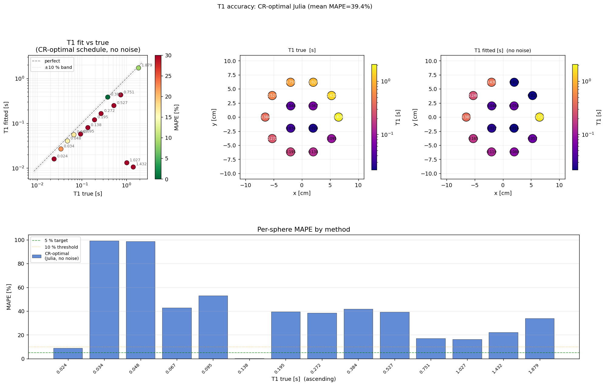
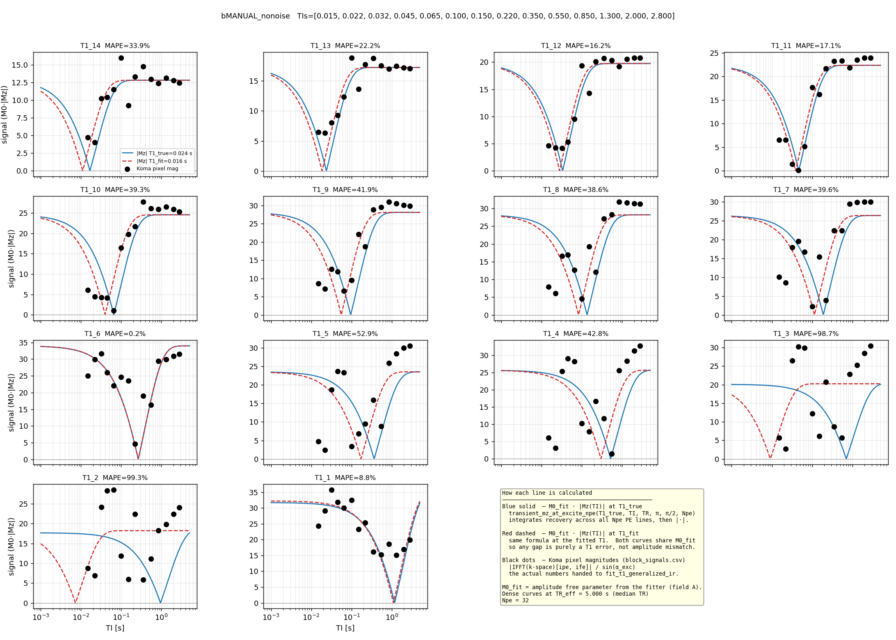
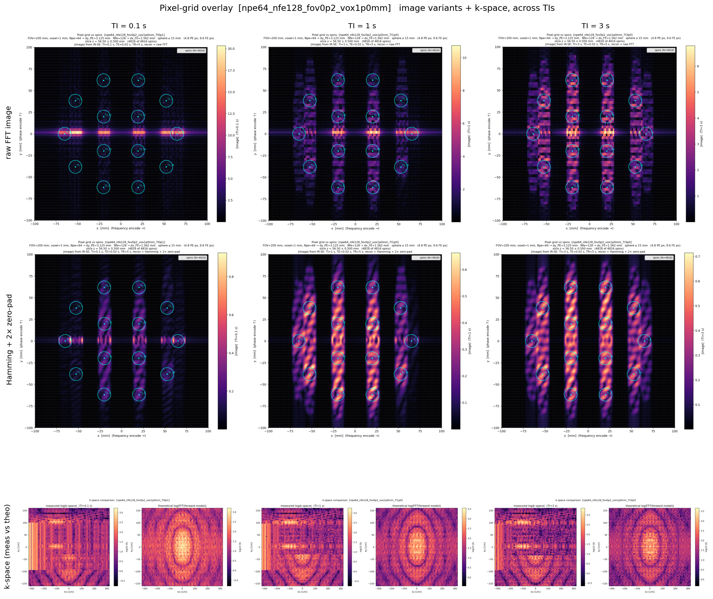
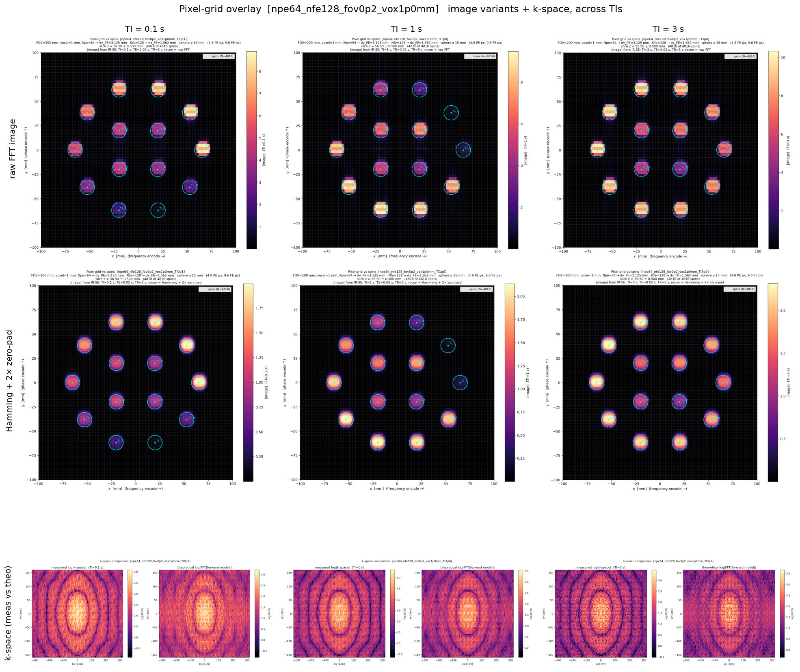
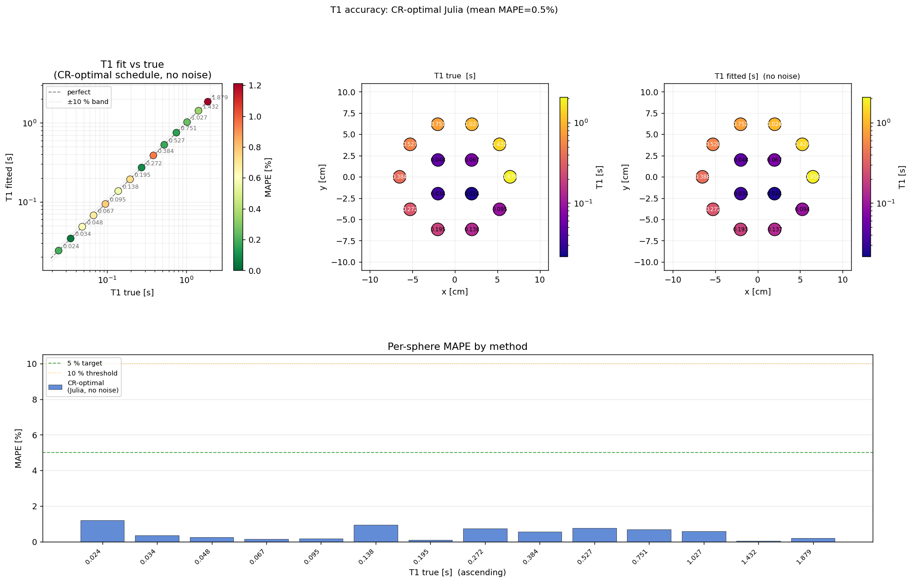
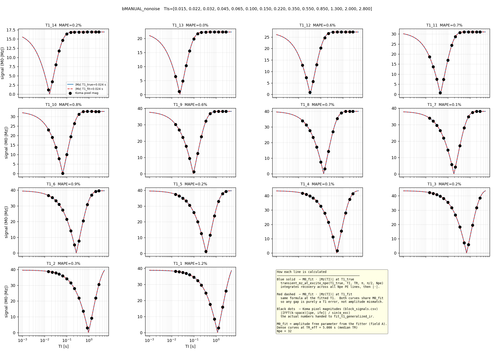

<!--
fp_bugs_final_2.md

What I improved relative to fp_bugs_final.md:
- Tightened the narrative from "debug diary" into a report section: motivation,
  validation failure, hypothesis elimination, root cause, fix, outcome.
- Matched the MRISystemPhantom chapter style more closely: direct paragraphs,
  explicit design/validation rationale, compact technical explanation, and
  quantified claims near the relevant figures.
- Corrected the emphasis around bug #2: the final diagnosis is the same
  absolute-epsilon / rebasing failure mode, not Float32 magnetisation drift.
- Reduced implementation detail that belongs in an appendix or PR discussion,
  while keeping enough mechanism to show engineering depth.
- Added a short "report integration notes" block at the end saying where this
  should sit and what can be cut if space is tight.

Source checks used:
- report/komaMRI/fp_bugs.md
- report/komaMRI/fp_bugs_final.md
- scripts/koma_investigations/first_bug/*
- scripts/koma_investigations/second_bug/00_NOTES.md and bug.md
- report/komaMRI/figs/*/t1_fit_vs_true/*/t1_fit_vs_true.csv
- live GitHub status for JuliaHealth/KomaMRI.jl issues #779, #788 and PRs
  #780, #789 as of 2026-06-07.
-->

# Validating KomaMRI: Two Floating-Point Bugs in Long Sequences

<!-- TODO for LaTeX: cite the KomaMRI paper/package here and move GitHub star /
maintenance claims to a footnote. -->
KomaMRI is the simulation environment that all RL agents in this project
interact with, so simulator validation is a prerequisite for every result in
this project. Although KomaMRI is an open-source, actively maintained project with
over 200 GitHub stars, my validation experiments found two floating-point
time-discretisation bugs. Both were triggered by long cumulative sequence time.
The failures were reduced to minimal reproducers and fixes were contributed upstream:
<!-- TODO for LaTeX: convert issue/PR links to footnotes or bibliography-style
software references to avoid cluttering the main prose. -->
[issue #779](https://github.com/JuliaHealth/KomaMRI.jl/issues/779) /
[PR #780](https://github.com/JuliaHealth/KomaMRI.jl/pull/780), now merged, and
[issue #788](https://github.com/JuliaHealth/KomaMRI.jl/issues/788) /
[PR #789](https://github.com/JuliaHealth/KomaMRI.jl/pull/789), open at the time
of writing.

This work is part of A1, the validated digital twin and simulator pipeline, and
directly addresses C1: simulator validation for qMRI.
For A1, the key contribution is the validation of the simulation pipeline rather
than the bug reports alone. The two failures were reduced to minimal
reproducers, traced to specific floating-point timing mechanisms, fixed
upstream, and then verified by recovering the phantom's known $T_1$ values in
the full qMRI pipeline.

## KomaMRI simulation model

KomaMRI simulates the magnetization of each spin of a `Phantom` for variable
magnetic fields given by a `Sequence`. All `Phantom` objects used in this
project were produced by `MRISystemPhantom.jl`. Each `Phantom` is a cloud of
spin isochromats: groups of nearby nuclei that are assumed to share a single
position $(x,y,z)$ and one set of tissue parameters
$(T_1,T_2,T_2^*,\rho,\Delta\omega)$. Here $\rho$ is proton density and
$\Delta\omega$ is off-resonance: the offset of that isochromat's Larmor
frequency from the nominal scanner frequency. Each isochromat is therefore
represented by a magnetisation vector $(M_x,M_y,M_z)$ evolving according to the
Bloch equations.

The user-facing interface is:

```julia
raw = simulate(phantom, sequence, scanner; sim_params)
```

Here `scanner` defines the scanner hardware used to play the sequence. In these
experiments it is an idealised hardware model: eddy currents and field
inhomogeneities are not modelled. This means RF pulses are treated as exact, although
in reality a 180 degree refocus pulse can vary by a couple of degrees across
the excited volume.

A `Sequence` is made
up of RF pulses, which rotate the magnetisation vector, as well as gradients,
delays, and ADC readouts. Internally, `simulate` represents the continuous
sequence on a discretised time grid. Gradient events use a time step
$\Delta t$, while RF pulses are sampled more finely using
$\Delta t_\mathrm{rf}$. These time points are then split into blocks. In
excitation blocks, where RF is active, KomaMRI integrates the full
magnetisation rotation. In precession blocks, where RF is off, the update
reduces to relaxation and phase accrual, which can be computed analytically
with exponentials and is cheaper to evaluate. At each ADC sample, the simulator
sums the transverse magnetisation over all spins to form the complex received
signal $\mathrm{sig}[t]$.

The key computational assumption is that spins evolve independently and only
interact through the final signal sum. This is a standard MRI simulation
approximation and is less restrictive than the hardware idealisations above.
It is also what makes KomaMRI practical for this project: spins can be
partitioned across CPU threads or GPU kernels, then summed only at the
receiver. This parallelism motivated the use of KomaMRI and helps overcome C2,
the cost of simulation. KomaMRI also models bulk $T_2^*$ decay rather than
microscopic spin-spin interaction. Overall, these are standard MRI simulator
assumptions that model the relevant physics to an acceptable error, so learned
policies should plausibly generalise to real hardware.

## Initial validation failure

The first validation test was deliberately simple. With no added noise, the test
simulated an inversion-recovery sweep across the 14 T1 spheres and fitted the
standard monoexponential recovery model:

$$
M_z(\mathrm{TI}) = M_0 \left(1 - 2e^{-\mathrm{TI}/T_1}\right).
$$

In a noise-free digital phantom, this should be almost exact. Instead, the
fitted $T_1$ values had a mean absolute percentage error (MAPE) of 39.4%, with
some spheres close to 100% error. The recovery points did not lie on a
monoexponential curve. Either the simulator, sequence, reconstruction, or
fitting pipeline was wrong, or there was relevant MRI physics not captured by
the simple recovery model.



**Figure 1. Noise-free $T_1$ recovery before the KomaMRI fixes.** The fitted
values should lie on the diagonal. Instead the mean MAPE is 39.4%, with only two out of the 14 spheres in the +/-10% band.



**Figure 2. Recovery points before the KomaMRI fixes.** The simulated samples
do not lie on the best-fit monoexponential curves. The deviation is structured,
not random, so it points to a repeatable simulation or analysis error.

The first step was to rule out plausible MRI explanations. Imperfect transverse
spoiling was the most likely candidate: residual $M_{xy}$ can survive one shot,
be refocused by later RF pulses, and contaminate the next echo. The standard
way to suppress this is to add spoiler gradients, typically around the end of
the shot and around refocusing pulses, to dephase any remaining transverse
magnetisation. However, when implemented this did not remove the error; it changed mean MAPE from 39.4% to 44.0%. Increasing TR also made the fit worse, even though longer recovery
time should reduce both residual transverse coherence and incomplete
longitudinal recovery. This was the first strong clue that the failure was
driven by total simulated time, not by the physical state at the start of each
shot.

Reconstruction explanations were also tested. Hamming-window filtering and ROI
masking did not remove the error, making ordinary Gibbs ringing unlikely. A
phase-sensitive reconstruction was also checked to ensure the magnitude image
was not hiding a sign or phase convention error. These tests changed details of
the images, but not the failure mode.

The decisive diagnostic was to inspect k-space directly. Rather than showing
random fitting error, the measured k-space collapsed after a fixed amount of
simulated time, even though the acquisition should have remained symmetric.
This shifted the investigation away from missing MRI physics and toward the
simulator's handling of long absolute times.



**Figure 3. Image-space symptom of the bug.** The figure shows an IR-SE
acquisition at three inversion times (TI = 0.1, 1.0, and 3.0 s). The first row
shows the reconstructed image, the second row applies a Hamming window, and the
bottom row compares theoretical and measured k-space. Because the phase-encode
direction ($k_y$) is acquired shot by shot, moving along $k_y$ corresponds to
advancing in simulated time. The early phase-encode lines reconstruct
correctly, but later lines collapse into horizontal streaks after a fixed
cumulative time. This is too large and structured to be ordinary ringing, and
is not removed by the Hamming window. Generated by `pixel_grid_overlay.jl`.

## Bug 1: RF edge markers collapse at large absolute time

The first minimal reproducer was `koma_bug_minimal.jl`. It removed the phantom
geometry and reconstruction and repeated the same simple shot at increasing
absolute simulation times. The expected result was a constant per-shot signal.
Instead, sharp jumps appeared once cumulative simulated time reached roughly
70--150 s. For example, with TR = 15 s the signal jumped at shot 6
(~90 s) by 21%; with TR = 8 s it jumped at shot 9 (~72 s) by 19%;
and with TR = 30 s it jumped at shot 4 (~120 s) by 21%. This showed that
the threshold was time-driven, not shot-count-driven, and raised the next
question: was KomaMRI discretising the same RF pulse differently at large
absolute time?

The RF-edge investigation revealed that the first bug was caused by the way
KomaMRI represents sharp RF edges on its simulation time grid. Tracing the RF
pulse discretisation led to `points_from_key_times`, and then to the
edge-handling logic inside `get_variable_times`. In `get_variable_times`,
KomaMRI creates a small set of key times around each RF pulse:

```julia
points_from_key_times(sort([t1, t1 + MIN_RISE_TIME, tc,
                            t2 - MIN_RISE_TIME, t2]); dt=Δt_rf)
```

where `t1` and `t2` are the start and end of the pulse, `tc` is the centre, and
`MIN_RISE_TIME = 1e-14` s. The pair `(t1, t1 + MIN_RISE_TIME)` is used to
encode the rising edge of the RF pulse. At `t1`, interpolation should return
zero RF amplitude; immediately after the edge, at `t1 + MIN_RISE_TIME`, it
should return the full RF amplitude. This creates a near-discontinuous step
while still letting KomaMRI store the RF waveform using a small number of key
points, with interpolation filling in the values between them.

The problem is that `MIN_RISE_TIME` is a fixed absolute time, but Float64
precision is relative. The spacing between $t$ and the next representable
Float64 number, calculated by `eps(t)` in Julia, grows with the magnitude of
$t$: $\mathrm{eps}(t) \approx t\cdot2^{-52}$. Once
`eps(t)/2 > 1e-14` (`MIN_RISE_TIME`), adding `MIN_RISE_TIME` no longer produces
a distinct Float64 value. In practice this happens at about $t \gtrsim 128$ s.
Beyond this point, `t1 + MIN_RISE_TIME == t1` bit-for-bit. The two key times
that should define the rising edge therefore collapse onto the same value.
When the time vector is sorted and deduplicated, one of them is removed.

The isolated test `koma_bug_isolate.jl` backed this up by asking whether the
same 1 ms RF pulse is converted into the same time points at different absolute
times:

```text
t0 [s]   nraw  nunique   eps(t0)
0.0       24      23     5.0e-324
3.0       24      23     4.44e-16
67.0      24      23     1.42e-14
99.0      24      23     1.42e-14
200.0     26      21     2.84e-14
1000.0    26      21     1.14e-13
```

The table shows the collapse directly: early pulses retain 23 unique time points, but at $t_0=200$ s this falls to 21 as $\frac{\mathrm{eps}(t_0)}{2}$ exceeds `MIN_RISE_TIME`. This confirms that the RF edge markers have collapsed before simulation.

The collapsed points are not redundant: they represent the two sides of the RF
step. At `t1`, RF is zero; at `t1 + MIN_RISE_TIME`, RF has reached the pulse
amplitude. Deduplicating them removes the edge, so the Bloch integrator applies
the wrong RF value for one full $\Delta t_\mathrm{rf}$ sample.

For KomaMRI's default $\Delta t_\mathrm{rf}=5\times10^{-5}$ s and
$T_\mathrm{RF}=1$ ms, one missing sample is 5% of the RF area. The $10^{-14}$ s timing collapse therefore becomes a 5% flip-angle error, producing a 20-25% signal jump and later a biased $T_1$ fit.

<!-- Detail if needed: the IR signal scales approximately with
cos(alpha_180) * sin(alpha_90), so the 5% flip-angle error explains the
observed ~22% per-shot shift. -->

The fix in [PR #780](https://github.com/JuliaHealth/KomaMRI.jl/pull/780) made
the edge markers adaptive:

```julia
next_time(t) = max(t + MIN_RISE_TIME, nextfloat(t))
prev_time(t) = min(t - MIN_RISE_TIME, prevfloat(t))
```

`nextfloat` and `prevfloat` step to the adjacent representable Float64 value,
so the marker remains distinct even at large absolute time. At small times the
original spacing is preserved; at large times the marker becomes one floating
point step away rather than collapsing. This fixed the first failure and was
merged into KomaMRI.

## Bug 2: closing knots collapse after time rebasing

After [PR #780](https://github.com/JuliaHealth/KomaMRI.jl/pull/780) the direct
checks all passed: the isolated RF-edge script was stable to 1000 s, the
minimal multi-shot reproducer no longer drifted over the tested shots, and the
new RF-area regression test showed that the discretised pulse area matched the
expected trapezium area at large absolute time. The original failure mechanism
had genuinely been fixed.

However, the full no-noise $T_1$ validation was still inaccurate. Further
investigation revealed another fixed-epsilon collapse, but at a different point
in the time pipeline. KomaMRI also separates a block's closing knot, or block
edge, using a fixed `1e-14` s offset in block-relative time. This is initially
safe because the local block times are small (e.g. 1ms RF pulses). Later, however,
`get_variable_times` and `get_samples` rebase these local times to absolute
sequence time:

```julia
T0 .+ t
```

where `T0` is the absolute start time of the block. This creates the same
floating-point problem as before: at large values of `T0`, the `1e-14` s gap is
below Float64 precision. The closing knot rounds onto the block-end knot, the
two times become bit-identical, and a later `unique!` step removes one of them.
The marker therefore disappears much later in the code than where it was first
created, which made this second bug harder to track down.

The reproducer showed that the remaining bug still mattered. It used one spin
and a gradient-free repeated inversion-recovery shot:

```text
180 deg inversion -> TI -> 90 deg excitation -> one ADC sample -> TR delay
```

Every shot is physically identical. At TR = 15 s, all 24 shots should return
the same signal. Instead, the first 17 shots were stable, shot 18 jumped by
52%, and later shots settled to a new wrong plateau:

```text
shot  1..17  (sim_time <= 255 s): |signal| = 0.476267 stable
shot 18      (sim_time  = 270 s): |signal| = 0.722479 +52%
shot 19..24  (sim_time >= 285 s): |signal| = 0.677159 new wrong plateau
```

The fix in [PR #789](https://github.com/JuliaHealth/KomaMRI.jl/pull/789)
re-separates the closing knot after rebasing, when the correct absolute-time
spacing is known:

```julia
_reseparate_closing_knot!(t) =
    t[end-1] = min(t[end-1], t[end] - max(MIN_RISE_TIME, eps(t[end])))
```

The new gap is adaptive: it remains `1e-14` s at small times, but widens when
Float64 spacing becomes larger. The re-separation is also idempotent: if the
closing knot is already distinct, it is left alone. The fix is applied at each
rebasing site: both RF sampling paths in `get_samples`, and the gradient timing
path in `get_variable_times`. The latter also re-applies an adaptive
`_strictly_increasing_knots!` check so gradient knots remain ordered after
rebasing. With this patch, the 24-shot reproducer is flat and the KomaMRI tests
still pass.

At the time of writing, [issue #779](https://github.com/JuliaHealth/KomaMRI.jl/issues/779)
is merged upstream via [PR #780](https://github.com/JuliaHealth/KomaMRI.jl/pull/780).
[Issue #788](https://github.com/JuliaHealth/KomaMRI.jl/issues/788) is fixed in
a project fork pinned by this repository, with
[PR #789](https://github.com/JuliaHealth/KomaMRI.jl/pull/789) still open.

## Validation after the fixes

With both fixes applied, the original no-noise phantom test behaves as expected.
The reconstructed images no longer develop time-driven streaks, the recovery
points lie on monoexponential curves, and the fitted $T_1$ values return to the
diagonal. Mean MAPE falls from 39.4% to 0.48%, with a maximum sphere error of
1.21%.



**Figure 4. Reconstructed images after both fixes.** The spheres remain
well-localised across the full phase-encode direction. The time-dependent
streaking in Figure 3 is removed.



**Figure 5. Noise-free $T_1$ recovery after both fixes.** Mean MAPE decreases
from 39.4% to 0.48%, and all spheres are within 1.21% of their true value.
This is the expected accuracy for the noise-free validation case.



**Figure 6. Recovery curves after both fixes.** The simulated samples now lie
on the fitted inversion-recovery curves.

## Evaluation of the fixes

The fixes were evaluated at multiple levels, from isolated timing behaviour to
the full qMRI validation task.

| Level | Test | Before fix | After fix |
|---|---|---|---|
| Timing representation | RF-edge discretisation at large absolute time | RF edge markers collapse once cumulative time reaches the 70--150 s regime | stable to 1000 s |
| Minimal signal reproducer | identical IR shots, no gradients (`koma_bug_minimal.jl`) | 19--21% signal jump once cumulative time reaches 72--120 s | flat over tested shots |
| Residual timing reproducer | 24 identical IR shots, no gradients (`koma_bug_residual.jl`) | +52% jump at shot 18 (270 s), then wrong plateau | flat over all 24 shots |
| Full qMRI validation | no-noise 14-sphere $T_1$ recovery | 39.4% mean MAPE | 0.48% mean MAPE (1.2% max MAPE) |
| Regression safety | KomaMRI test suite | new timing tests fail on buggy code | passes after both fixes |

The minimal reproducers show that the specific floating-point failures were removed, while the phantom validation shows that the corrected simulator produces accurate quantitative maps.

### Why this mattered for qMRI

The bug had likely gone unnoticed because it is triggered by long cumulative
sequence time, while most examples and tests are much shorter, never reaching
the $\sim128$ s absolute-time regime where Float64 spacing becomes comparable
to the fixed `1e-14` s marker. This threshold is still well within the duration
of many clinical MRI acquisitions, which often last several minutes. The
largest effect also appears for hard RF pulses with sharp edges: losing one
$\Delta t_\mathrm{rf}$ sample is a large fraction of a 1 ms rectangular pulse.
In practical slice-selective sequences, shaped RF pulses and gradient ramps
make the same timing error a smaller perturbation.

The other reason is that most MRI simulation checks are qualitative: a
reconstructed image can still look plausible when noise and contrast variation
hide small systematic signal errors. qMRI is stricter. The validation compares
fitted $T_1$ values against known phantom ground truth, so a systematic signal
error directly appears as parameter bias. This project exposed the bug because
RL training needs long sequences and qMRI validation needs quantitative
agreement, not just plausible images.

This validation covers the IR-SE sequence family used for the main experiments;
other sequence families would require the same timing and no-noise recovery
checks before being used for quantitative claims.

### Why spoiling was a convincing false lead

Although presented here as a single validation narrative, the investigation
happened in two stages. Before either fix, transverse spoiling looked plausible
because it reduced the catastrophic 924.5% MAPE failure to 92.6%, suggesting
that residual transverse magnetisation might be part of the problem. After the
first bug was fixed, the remaining error was smaller, around 30--40%, and
therefore more consistent with a possible sequence effect. Spoiling had to be
rechecked before the second timing bug was isolated. In the intermediate
simulator shown in Figures 1 to 3, however, spoiling increased mean MAPE from
39.4% to 44.0%. After both fixes, spoiled and unspoiled no-noise fits are both
sub-percent (0.43% and 0.48% mean MAPE respectively). Spoiling remains
important for realistic sequence design, but it was not the cause of this
validation failure.
