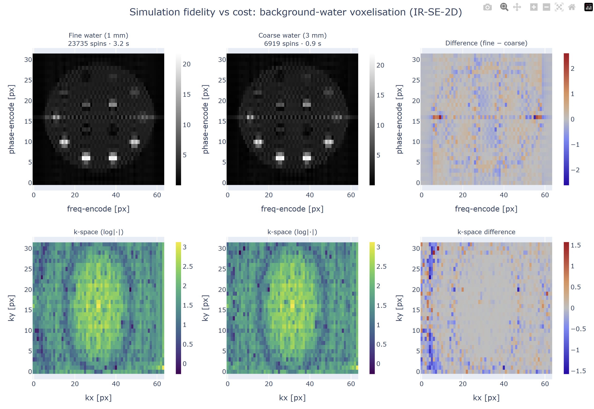
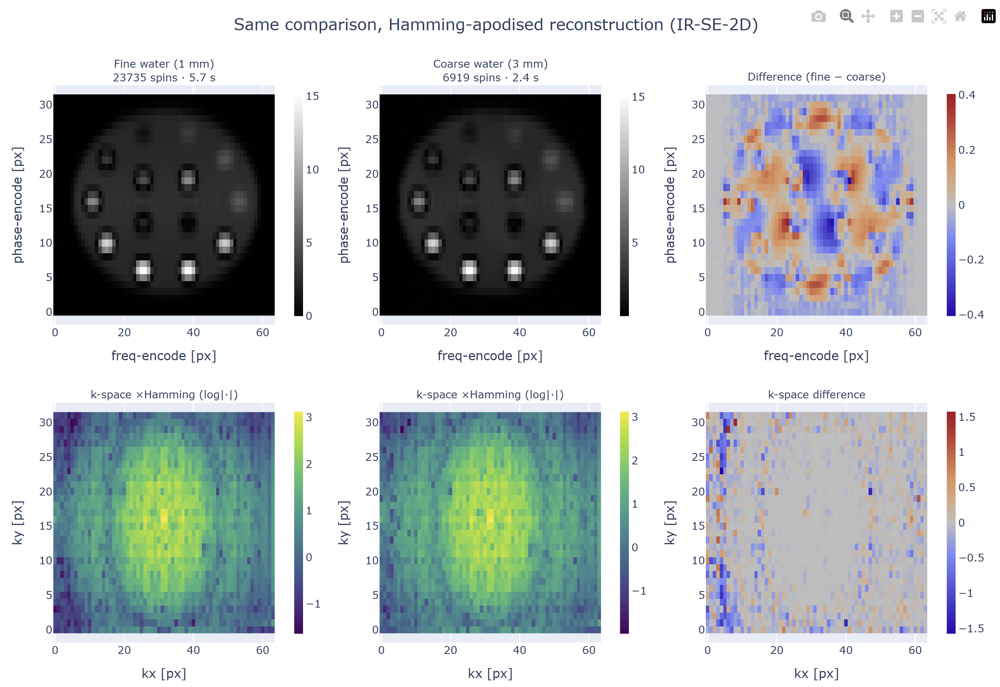
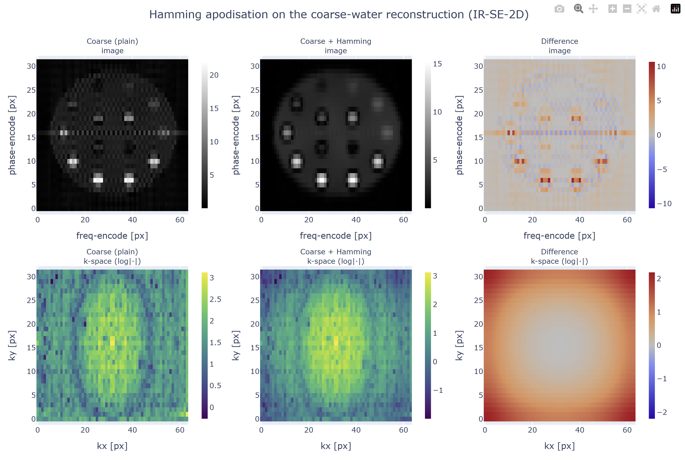

# MRISystemPhantom.jl — Digital Twin Library

## 0. The physical phantom

The QalibreMD NIST/ISMRM System Standard Model 130 (manufactured by Caliber MRI, formerly QalibreMD) is a hardware phantom designed to mimic the geometry of a human head and to provide a wide, calibrated range of quantitative MRI tissue parameters — T1, T2, and proton density — in a single, reproducible object. It is the standard reference device for quantitative MRI system validation in clinical and research settings, and its design is described in the *QalibreMD System Standard Model 130 User Manual*.

The phantom consists of a spherical water-filled housing (100 mm internal radius) containing four internal structures at fixed axial positions:

| Plate | z (mm) | Contents |
|-------|--------|----------|
| T1 array | +56.5 | 14 NiCl₂ spheres (15 mm radius), T1 range ~24 ms – 1.9 s at 3 T |
| T2 array | +16.5 | 14 MnCl₂ spheres (15 mm radius), T2 range ~87 ms – 2.8 s at 3 T |
| PD array | −23.5 | 14 spheres of varying proton density (15 mm radius) |
| Fiducial grid | distributed | 57 small spheres (5 mm radius) on a 40 mm cubic lattice, clipped to a 95 mm sphere |

Each contrast plate arranges its 14 spheres in two concentric rings: 10 on an outer ring of radius 65 mm and 4 on an inner ring of radius 28 mm. This geometry matches the phantom manual photographs but has not been verified against the physical device.

The relaxation values are field-strength-dependent (doped aqueous solutions do not follow a simple scaling law), so separate tables are provided for 1.5 T and 3 T. The library also distinguishes two serial classes: serial numbers ≥ 0042 use a revised recipe with significantly different T1 values compared to the legacy (0001–0041) class. For example, T1-sphere 1 at 3 T is 1.84 s on the current recipe versus 2.38 s on legacy. Larger range of lower T1 values reflecting a shift in their importance.

---

## 1. Design goals and architecture

A digital twin of this phantom is needed for two reasons. First, it provides a ground-truth environment for RL training: the agent needs to query a simulator that returns physically meaningful signals and can report the true tissue parameters for reward computation. Second, it must be **flexible** — the RL training loop needs to randomise pose, field strength, noise level, and sphere properties without modifying library code.

The library is structured around a single contract: a `PhantomConfig` struct that carries everything the builder needs, passed to a single function `build_phantom` that returns a `KomaMRI.Phantom`. The phantom can then be fed directly to `KomaMRI.simulate` with no further setup. This design was chosen deliberately over a mutable phantom object or a collection of keyword arguments: the config is serialisable, diffable, and reproducible (the RNG seed is embedded), and the builder has no hidden state.

The pipeline from config to simulation is:

```
PhantomConfig
    │
    ├─ sphere_descriptors(:T1, cfg)   ┐
    ├─ sphere_descriptors(:T2, cfg)   │ one SphereDescriptor per contrast sphere
    ├─ sphere_descriptors(:PD, cfg)   │ (geometry + material, no voxels yet)
    ├─ sphere_descriptors(:fiducials) ┘
    │
    ├─ voxelise_sphere(d, delta_x)    → KomaMRI.Phantom per sphere
    │
    ├─ build_background_water(cfg)    → KomaMRI.Phantom (water housing, sphere cutouts)
    │
    ├─ apply_transform!(obj, rotation, translation)
    │
    └─ apply_per_spin_noise!(obj, augment, rng)
                                      → KomaMRI.Phantom (ready for simulate())
```

The two-stage design — descriptors first, voxels second — means all geometry and material decisions happen before any memory is allocated for spin arrays. The descriptor layer is also directly useful for imaging: `sphere_descriptor_pixels` maps descriptor centres to image pixel indices, so ROI extraction after reconstruction does not require a separate geometry calculation.

---

## 2. Geometry

### 2.1 Sphere voxelisation

Each sphere is voxelised on a cubic grid at spacing `delta_x = voxel_size_mm × 1e-3` metres. A spin is included if its grid point falls within the sphere radius:

$$
(x_i - c_x)^2 + (y_i - c_y)^2 + (z_i - c_z)^2 \leq r^2
$$

The grid is constructed by iterating over the bounding box `[c − r, c + r]` on each axis. For a typical 15 mm radius sphere at 2 mm voxels this produces around 500 spins per sphere, which is small enough that the full set of 14 spheres per plate fits comfortably in memory and the per-step simulate call is fast.

### 2.2 Slicing

For 2D imaging experiments, including only the spins in a thin slab reduces simulation cost dramatically. A `Slab` is defined by a centre point, a unit normal, and a half-thickness. Voxelisation is gated on the signed distance from the slab midplane:

$$
|(\mathbf{p} - \mathbf{c}) \cdot \hat{n}| \leq t/2
$$

The normal defaults to $\hat{z}$ (axial slice), but any orientation is supported. A floating-point tolerance of 0.1 µm is applied to the boundary condition to avoid rejecting voxels that land exactly on the slab edge due to roundoff. The slice centre `slice_center_mm = (0, 0, PLATE_Z_MM.T1)` isolates the T1 plate axially; the RL environment uses this to reduce simulation cost by an order of magnitude without changing the imaging geometry visible to the agent.

### 2.3 Background water

The housing is voxelised as a 100 mm-radius sphere at a coarser grid spacing (`water_voxel_size_mm`, defaulting to `voxel_size_mm`) with all contrast and fiducial sphere volumes cut out. The cutout is a simple exclusion test on squared distance to each sphere centre — the same condition as the voxelisation but negated. The water proton density is reweighted by `(water_dx / sphere_dx)³` to conserve the total water spin count relative to what a uniform fine-grid voxelisation would give, so the bulk water signal amplitude is physically correct regardless of which coarsening factor is chosen.

When a through-plane slice is selected, the water housing is replaced by a stack of plane-sheets (one per `water_throughplane_voxel_size_mm` step through the slab) so that each sheet carries the signal from the column of water it represents. This avoids the artefact that would arise from using a single plane at the slab centre: the plane would carry the signal of one voxel but the actual water signal integrates over the full slice thickness.


> **Fidelity–cost trade-off of background-water voxelisation.** The same IR-SE-2D acquisition (TI/TE/TR = 400/80/1500 ms, 32×64, FOV 0.2 m) is simulated through two phantoms differing *only* in background-water discretisation. **Top row:** magnitude images; **bottom row:** log-magnitude k-space; **right column:** fine − coarse difference. The coarse 3 mm grid uses **6,919 vs 23,735 spins** (3.4× fewer) and is **~3.4× faster to simulate** (0.9 ± 0.1 s vs 3.2 ± 0.6 s, mean ± std over 20 runs), while the total integrated signal (k-space DC) changes by only **0.35%** — confirming the PD reweighting conserves the bulk water signal. The visible residual is confined to low-amplitude, high-spatial-frequency structure around the sphere edges. This figure and every number quoted in this section are reproduced by running `examples/compare_water_coarseness.jl`, which ships with the library; the timings are wall-clock means over 20 repeats and will vary with hardware.

Conserving the bulk water signal is necessary but not sufficient. The quantities the phantom exists to measure are the contrast spheres, not the water, so the relevant fidelity test is how much the *sphere* signal moves when the water grid is coarsened. Extracting the reconstructed ROI magnitude at each of the 14 T1-plate sphere centres (using the same `sphere_descriptor_pixels` mapping described in §1) and comparing fine vs coarse gives, at the 32×64 matrix used here, a normalised RMS error of **1.5%** across all spheres when each ROI is a 3×3 average over the sphere. The bright spheres are essentially unaffected (≤ 0.7%); the error is concentrated on the spheres sitting near their inversion null at this TI (T1-spheres 13 and 14, signal ≈ 1–2, change by ~9%), where the small ringing leaked from the blockier coarse-water edges is a large *fraction* of an already-near-zero signal. Taking a single centre pixel instead of a 3×3 ROI inflates the apparent error to 3.7% — but most of that is single-pixel Gibbs and sub-pixel rounding sensitivity rather than genuine signal change, which is why the 3×3 ROI is the more meaningful measure.

The artefact also grows with acquisition matrix size, which is itself diagnostic of its origin. Repeating the comparison at 64×64 raises the same metrics to **2.3%** (3×3) and **7.6%** (single pixel), with the worst near-null sphere moving by ~16% rather than ~9%, while the k-space DC and spin counts are unchanged (they are matrix-independent). This is exactly what a truncation (Gibbs) artefact should do: a larger matrix samples a wider k-space window, which captures more of the high-spatial-frequency edge content where the fine and coarse grids actually differ (the difference panel is almost entirely high-frequency), so more of that discrepancy is admitted into the image. The smaller 32×64 window simply does not measure as much of it. The practical conclusion is that the coarse grid is a faithful, ~3× cheaper drop-in for total signal and for the bright spheres — increasingly so at lower resolution — with the caveat that quantitative estimates on near-null spheres should use the fine grid, and the more so the higher the acquisition matrix.


> **The same comparison under Hamming-apodised reconstruction.** Identical layout and phantoms to the fidelity figure above, but every image is reconstructed with a 2-D Hamming window applied to k-space before the IFFT (the bottom row now shows the *windowed* k-space the IFFT actually sees). Apodisation suppresses the truncation side-lobes that carry the coarse-grid discrepancy, so the difference column (right) is markedly fainter than under the plain reconstruction: the coarse-vs-fine sphere-ROI error falls from 3.7% to 0.9% at a single pixel and from 1.5% to 1.1% over a 3×3 ROI (quantified in the text below). The price is resolution — the wider main lobe visibly blurs the spheres — while the compute cost is negligible, since the window is applied at reconstruction rather than in the simulation. Produced by the same `examples/compare_water_coarseness.jl`.

If the discrepancy is genuinely Gibbs side-lobe leakage, then suppressing those side-lobes at reconstruction should remove it — and it does (figure above). Reconstructing both grids with a 2-D Hamming window (`kspace_to_image(...; hamming=true)`, which lowers the side-lobes from −13 dB to −43 dB) cuts the single-pixel coarse-vs-fine NRMSE roughly four-fold, from **3.7% to 0.9%**, confirming that the single-pixel error was almost entirely truncation artefact. The 3×3-ROI figure improves only modestly (**1.5% to 1.1%**), because spatial averaging over the sphere already cancels most of the oscillating side-lobe — apodisation and ROI averaging are suppressing the same thing — and the residual ~1.1% is the genuine, non-Gibbs fidelity floor. Crucially the window is a reconstruction-side operation (an element-wise multiply before the IFFT), costing a fraction of a millisecond and leaving the ~3× simulation speed-up of the coarse grid entirely intact; the trade is the usual loss of spatial resolution from the wider main lobe, not compute.

### 2.4 Pose transforms

`apply_transform!` rotates and translates all spin positions by the Euler XYZ rotation and translation specified in `PhantomConfig.rotation` and `translation_mm`. The rotation matrix is built from three successive Rx, Ry, Rz multiplications. The transform is applied after voxelisation and before augmentation noise so that the sphere geometry is exact before any stochastic perturbation. This was designed to make it easy to reset the phantom and reduce overfitting. For my experiments, this was not necessary since I only ever passed in the T1 estimates and not image signal to the RL agent.

---

## 3. Material tables

The relaxation values are read from four module-level constants defined from the phantom manual:

| Constant | Spheres | Source |
|----------|---------|--------|
| `T1_ARRAY[:T3]` / `[:T15]` | 14 T1-plate spheres | NiCl₂ recipe, manual table, SN ≥ 0042 |
| `T1_ARRAY_LEGACY[:T3]` / `[:T15]` | same spheres | pre-0042 recipe (substantially different values) |
| `T2_OF_T1_ARRAY` | T2 companions for T1 plate | same manual table |
| `T2_ARRAY[:T3]` / `[:T15]` | 14 T2-plate spheres | MnCl₂ recipe |
| `T1_OF_T2_ARRAY` | T1 companions for T2 plate | same manual table |
| `PD_FRACTIONS` | 14 PD-plate spheres | proton density fractions |
| `BACKGROUND_WATER` | housing water | distilled water at 20 °C |

The T1 range at 3 T spans two decades: 23 ms to 1.84 s for the NiCl₂ plate, covering the full range of biological tissue T1 values from white matter to cerebrospinal fluid. The T2 range spans ~87 ms to 2.76 s. These wide ranges are why the phantom is used for system validation: a single acquisition must produce reliable estimates across the full physiological range.

The `serial_number_class` field switches the T1 table between current and legacy recipes. The difference is large enough to matter: the highest T1 sphere changes from 1.84 s (current) to 2.38 s (legacy) at 3 T. Using the wrong table introduces a systematic bias in all T1 estimates that no amount of RL optimisation can overcome.

---

## 4. Augmentation

`AugmentConfig` enables domain randomisation for RL training. All fields default to zero. When non-zero values are provided, `apply_per_spin_noise!` draws from the relevant distributions using the config's `rng_seed`:

| Field | Effect |
|-------|--------|
| `T1_sigma_rel` | Multiplies each sphere's T1 by `exp(σ·z)` where `z ~ N(0,1)`, drawn once per sphere |
| `T2_sigma_rel` | Same for T2 |
| `PD_sigma_abs` | Adds `N(0, σ²)` to each spin's proton density |
| `position_sigma_mm` | Adds `N(0, σ²)` to each spin's (x, y, z) position independently |
| `B0_sigma_Hz` | Adds `N(0, σ²)` per-spin off-resonance, stored in `Δw` (rad/s after ×2π) |
| `drop_sphere_p` | Drops each sphere independently with Bernoulli probability p before voxelisation |

The T1/T2 jitter is applied at the sphere level (one draw per sphere, not per spin) to simulate manufacturing variability in the doping concentration — a per-spin draw would be unphysical since all spins in a sphere are in the same solution. The position noise is per-spin and models rigid-body placement uncertainty at the sub-voxel scale.

The `rng_seed` is the only source of stochasticity: fixing it makes `build_phantom` deterministic, so the same configuration always produces the same phantom. Changing the seed between RL episodes provides statistically independent training samples without any global mutable state.

---

## 5. KomaMRI integration

`MRISystemPhantom.jl` is built entirely on top of `KomaMRI.jl` and returns standard `KomaMRI.Phantom` objects. The concatenation operator `+` on `Phantom` is used throughout to combine plates: each plate's voxelised spheres are concatenated into one `Phantom`, then the water housing is concatenated with the sphere stack. The result is a single flat spin array with heterogeneous relaxation values, which is exactly what `KomaMRI.simulate` expects.

The matching scanner is obtained from `scanner_for_field(cfg)`, which returns a `Scanner` with B0 set to 3.0 T for `:T3` or 1.5 T for `:T15`. Using any other `Scanner` with a phantom built at a different field would silently use the wrong relaxation values, so this helper is provided to make the coupling explicit.

### Known issue: floating-point accumulation in KomaMRI

During development two floating-point accumulation bugs were discovered in `KomaMRIBase.jl`. The first caused per-shot signal drift in long sequences (> ~270 s total duration) when the gradient moment accumulator overflowed. The second was the same root cause at a different accumulation site. Both were diagnosed, reported (GitHub issue #788), and fixed in a fork (`ArthurAllilaire/KomaMRI.jl`, branch `fix/grad-fp`, PR #789). The library currently depends on this fork at a pinned commit; the fix is awaiting upstream merge. This dependency is the only deviation from the registered Julia package registry.

---

## 6. Library availability

`MRISystemPhantom.jl` is developed as a standalone open-source Julia package at `github.com/ArthurAllilaire/MRISystemPhantom.jl` with API documentation hosted at `arthurallilaire.github.io/MRISystemPhantom.jl`. The package includes a complete test suite (~373 tests), example scripts for T1 mapping and SNR calibration, and documentation pages covering phantom construction, sequence design, parameter fitting, and SNR diagnostics. Making the library independently installable was a deliberate choice: the digital twin is a contribution in its own right, separable from the RL experiments it was built to support, and a public release allows the methodology to be reproduced and extended by other groups working on quantitative MRI system validation or simulation-based sequence optimisation.

---

<!-- TODO: relocate — physics explanation for the water-coarsening fidelity result, to be placed wherever the artefact discussion best fits. -->

## Why coarse background water perturbs the sphere ROIs

The fidelity result in §2.3 has a clean physical explanation: the residual is **Gibbs (truncation) ringing**, and coarsening the water grid changes the high-spatial-frequency content that this ringing redistributes.

**The reconstruction is band-limited.** A Cartesian acquisition samples a finite $N_{\text{pe}} \times N_{\text{fe}}$ window of k-space, so the reconstructed image is not the true spin density $\rho(\mathbf{r})$ but its convolution with the point-spread function of that window. For an unweighted rectangular window the PSF is a 2-D Dirichlet kernel (the periodic sinc),

$$
\text{PSF}(x) \;=\; \frac{\sin(\pi N x / \text{FOV})}{N\,\sin(\pi x / \text{FOV})},
$$

which has a main lobe one pixel wide and oscillating side-lobes with a first negative lobe of ≈ −21% and a $1/x$ decay. Any sharp edge in the object — and the water/sphere boundary is the sharpest edge in the scene — therefore produces ringing that oscillates across neighbouring pixels rather than a clean step. This happens for *both* grids; it is intrinsic to imaging a discontinuity with finite k-space.

**Coarsening the water changes the edge, not the bulk.** The PD reweighting by $(\Delta x_\text{water}/\Delta x_\text{sphere})^3$ conserves the total water magnetisation, which is why the k-space DC (the integral of the image) is unchanged to 0.35%. What it does *not* preserve is the exact shape of the water boundary: a 3 mm voxelisation tiles the spherical housing and the sphere cut-outs in blockier, stair-stepped steps that sit up to one voxel (~3 mm ≈ one image pixel) from the true surface. Those staircase edges carry *different* high-spatial-frequency content — visible directly as the structured, high-frequency pattern in the k-space difference panel of the figure, with the low frequencies essentially untouched. When this altered high-frequency edge content is passed through the same band-limited PSF, it lands as a slightly different ringing pattern in the image, concentrated around the sphere edges.

**Why the dim spheres are hit hardest.** The ringing that leaks into a given sphere's centre pixel is an approximately *additive* term whose magnitude is set by the surrounding bright water, independent of that sphere's own signal. For a bright sphere this leakage is a sub-percent perturbation. For a sphere sitting near its inversion null at the chosen TI (T1-spheres 13–14, whose magnitude is roughly an order of magnitude below the bright spheres) the *same absolute* leakage is a large *fraction* of an almost-zero signal — hence the largest relative changes fall on the near-null spheres (~9% at the 32×64 matrix of the figure, ~16% at 64×64) versus ≤ 1% on the bright ones. The change is also biased slightly positive because the dominant nearby structure is the bright background water ringing inward. This is a relative-error amplification near a signal null, not a failure of the coarse model per se.

**Why a single-pixel ROI overstates it.** Sampling one centre pixel maximally exposes the measurement to two effects that a 3×3 average suppresses: the sub-pixel rounding of the sphere centre to the nearest grid index (no interpolation), and the local sign of the ringing oscillation, which alternates pixel-to-pixel. Averaging over the sphere cancels much of the oscillation and is why the NRMSE falls from 7.6% (1 px) to 2.3% (3×3) — most of the single-pixel figure is artefact sensitivity rather than genuine signal change.

**Mitigations.** The artefact is reduced by: (i) using a finer water grid near the boundaries (the fidelity end of the trade-off this section quantifies); and (ii) k-space apodisation before reconstruction — the library exposes a 2-D Hamming window (`hamming_window_2d` / `kspace_to_image(...; hamming=true)`) that lowers the side-lobes from −13 dB to −43 dB at the cost of a wider main lobe (lower resolution).


> **What the Hamming window does to a single reconstruction.** One coarse-water phantom, reconstructed without (left) and with (centre) a 2-D Hamming window, and their difference (right); top row magnitude image, bottom row the (windowed) k-space. The window down-weights the outer k-space — visible as the darkened periphery of the centre k-space panel — which widens the PSF main lobe (the spheres blur slightly) but collapses the ringing side-lobes. The difference is confined to the sphere edges and to high-frequency k-space, i.e. exactly the truncation ringing the window removes; the smooth low-frequency core is untouched. Produced by `examples/hamming_apodisation.jl`. The mechanism is detailed below.

Apodisation works precisely because the discrepancy lives in the side-lobes (figure above). The coarse grid changes the high-frequency edge content; the band-limited reconstruction maps that into ringing through the PSF *side-lobes* specifically (the main lobe carries the low frequencies, which are conserved — hence the unchanged DC). A Hamming window down-weights the outer k-space before the IFFT, collapsing those side-lobes from −13 dB to −43 dB, so the differing high-frequency content is admitted with far less weight and the leakage into neighbouring pixels largely disappears. This is why the benefit is so uneven across ROI size: a single centre pixel sits on the full oscillating side-lobe pattern, so apodisation helps it dramatically (coarse-vs-fine NRMSE ~3.7% → ~0.9%, a four-fold reduction), whereas a 3×3 ROI has already averaged most of that oscillation away, leaving little for the window to remove (~1.5% → ~1.1%). The two operations — spatial averaging and apodisation — suppress the same side-lobe energy, so they do not stack. The cost is essentially zero: the window is an element-wise multiply applied at reconstruction, independent of the (expensive) Bloch simulation, so it does not affect the coarsening speed-up; the only price is resolution, from the wider main lobe.

Note, by contrast, that a *higher* acquisition matrix does the opposite of a mitigation: although it narrows the PSF main lobe, it also samples more of the high-frequency edge content where the two grids differ, so it *increases* the fine-vs-coarse discrepancy (§2.3) — the lower-resolution acquisition is the one most forgiving of a coarse water grid. Zero-padding (`pad_factor`) interpolates the image but does **not** remove ringing, since it adds no new k-space information.
