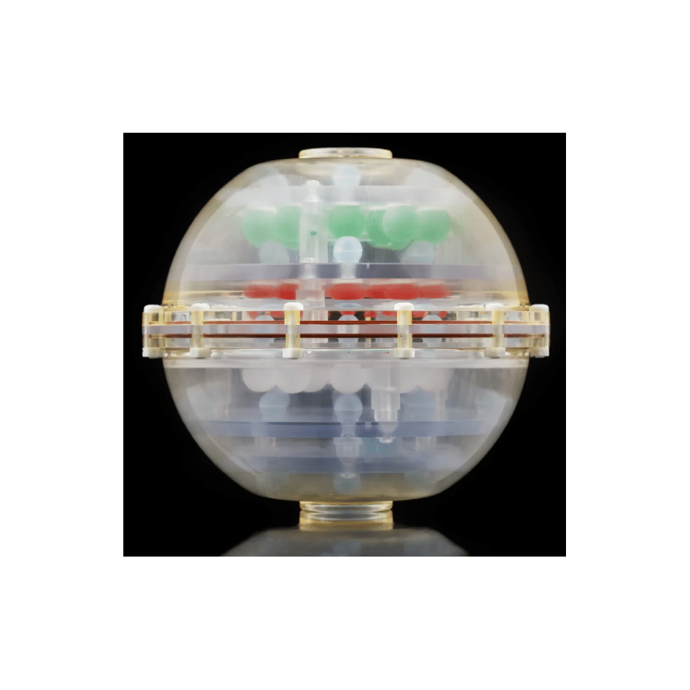

# MRISystemPhantom.jl — Digital Twin Library

## 0. The physical phantom

The QalibreMD NIST/ISMRM [System Standard Model 130](https://qmri.com/product/premium-system-phantom/) (manufactured by [Caliber MRI](https://qmri.com), formerly QalibreMD) is a hardware phantom designed to mimic the geometry of a human head and to provide a wide, calibrated range of quantitative MRI tissue parameters (T1, T2, and proton density). It is the standard reference device for quantitative MRI system validation in clinical and research settings, and its design is described in the *QalibreMD System Standard Model 130 User Manual* ([available here](https://github.com/ArthurAllilaire/RLxMRI/blob/main/QalibreMD_NIST_ISMRM_System_Standard_Model_130_T1_T2_PD_User_Manual.pdf)).

The phantom consists of a spherical water-filled housing (100 mm internal radius) containing four internal structures at fixed axial positions:

| Plate | z (mm) | Contents |
|-------|--------|----------|
| T1 array | +56.5 | 14 NiCl₂ spheres (15 mm radius), T1 range ~24 ms – 1.9 s at 3 T |
| T2 array | +16.5 | 14 MnCl₂ spheres (15 mm radius), T2 range ~87 ms – 2.8 s at 3 T |
| PD array | −23.5 | 14 spheres of varying proton density (15 mm radius) |
| Fiducial grid | distributed | 57 small spheres (5 mm radius) on a 40 mm cubic lattice |

Each contrast plate arranges its 14 spheres in two concentric rings: 10 on an outer ring of radius 65 mm and 4 on an inner ring of radius 28 mm. This geometry matches the phantom manual photographs but has not been verified against the physical device. The current digital twin models the contrast arrays and fiducial grid, but not the resolution insets or the two slice-profile wedges.


> **The QalibreMD NIST/ISMRM System Standard Model 130 hardware phantom.** The spherical water-filled housing (100 mm internal radius) contains T1, T2, and PD contrast arrays, each consisting of 14 doped-solution spheres arranged in concentric rings at fixed axial positions, plus a fiducial grid for registration. Its calibrated T1 (24 ms – 1.9 s) and T2 (87 ms – 2.8 s) ranges at 3 T span the full physiological tissue window, making it the standard reference device for quantitative MRI system validation. Image reproduced from [Caliber MRI](https://qmri.com/product/premium-system-phantom/).

The relaxation values are field-strength-dependent, so separate reference values are provided for 1.5 T and 3 T field strength. The user manual also distinguishes between two serial classes, a legacy vs modern class distinguished by serial number, both sets of reference values are included in the library.

<!-- extra info:  legacy = serial numbers < 0042 and modern phantoms (serial class ≥ 0042). For example, T1-sphere 1 at 3 T is 1.84 s on the current recipe versus 2.38 s on legacy. Larger range of lower T1 values reflecting a shift in their importance in qMRI. -->

---

## 1. Design goals and architecture

A digital twin of this phantom is needed for two reasons. First, it provides a ground-truth environment for RL training: the agent needs to query a simulator that returns physically meaningful signals and can report the true tissue parameters for reward computation. Second, it must be **flexible**: the RL training loop needs to randomise pose, inject noise, and jitter reference values across episodes without modifying library code. Different experiments also require different phantom sections or resolution.

The library is structured around a single contract: a `PhantomConfig` struct that carries everything the builder needs, passed to a single function `build_phantom` that returns a `KomaMRI.Phantom`. The phantom can then be fed directly to `KomaMRI.simulate`. This design was chosen deliberately over a mutable phantom object or a collection of keyword arguments as the config is serialisable, diffable, and reproducible (the RNG seed is embedded), and the builder has no hidden state. This is extremely useful for comparing different RL runs and results. The single contract is especially useful  this makes the python to Julia boundary very simple.

The pipeline from config to simulation is:

```
PhantomConfig
    │
    ├─ sphere_descriptors(:T1, cfg)   ┐
    ├─ sphere_descriptors(:T2, cfg)   │ one SphereDescriptor per contrast sphere
    ├─ sphere_descriptors(:PD, cfg)   │ (geometry + material, no voxels yet)
    ├─ sphere_descriptors(:fiducials) ┘
    │
    ├─ voxelise_sphere(d, delta_x)    → KomaMRI.Phantom per sphere
    │
    ├─ build_background_water(cfg)    → KomaMRI.Phantom (water housing, sphere cutouts)
    │
    ├─ apply_transform!(obj, rotation, translation)
    │
    └─ apply_per_spin_noise!(obj, augment, rng) → KomaMRI.Phantom (ready for simulate())
```

The two-stage design — descriptors first, voxels second — means all geometry and material decisions happen before any memory is allocated for spin arrays. Descriptors are also individually modifiable and removable: you can simulate only a subset of the 14 spheres per plate, with the water housing automatically filling the vacated volume. Because each descriptor carries its physical centre coordinate, `sphere_descriptor_pixels` can convert those centres directly to pixel indices in the reconstructed image — using the same DC-at-centre convention as `kspace_to_image` — simplifying ROI extraction after reconstruction.

---

## 2. Geometry

### 2.1 Sphere voxelisation

Each sphere is voxelised on a cubic grid at spacing `delta_x = voxel_size_mm × 1e-3` metres. A spin is included if its grid point falls within the sphere radius:

$$
(x_i - c_x)^2 + (y_i - c_y)^2 + (z_i - c_z)^2 \leq r^2
$$

The grid is constructed by iterating over the bounding box `[c − r, c + r]` on each axis. For a typical 15 mm radius sphere at 2 mm voxels this produces around 500 spins per sphere. Across all three contrast plates (42 spheres), the combined spin count at 2 mm voxels is ~9,100, occupying ~570 KB (8 Float64 fields per spin: $x, y, z, \rho, T_1, T_2, T_2^*, \Delta\omega$), small enough that the full set fits comfortably in memory and the per-step simulate call is fast.

### 2.2 Slicing

For 2D imaging experiments, only spins within a thin axial slab need to be simulated, reducing the spin count, and therefore simulation time, substantially. A `Slab` is defined by a centre point $\mathbf{c}$, a unit normal $\hat{n}$, and a thickness $t$. A spin at position $\mathbf{p}$ is included if its signed distance from the midplane satisfies:

$$
|(\mathbf{p} - \mathbf{c}) \cdot \hat{n}| \leq t/2
$$

The normal defaults to $\hat{z}$ but any orientation is supported. A 0.1 µm tolerance is applied at the boundary to avoid floating-point rejections of on-edge voxels. At 1 mm voxels, a 5 mm axial slab centred on the T1 plate retains ~33,000 of the full phantom's ~4.2 million spins, a **128× reduction**. This matches the excited volume of a slice-selective RF pulse without needing to encode one explicitly.

### 2.3 Pose transforms

`apply_transform!` rotates and translates all spin positions by the Euler XYZ rotation and translation specified in `PhantomConfig.rotation` and `translation_mm`. The rotation matrix is built from three successive Rx, Ry, Rz multiplications. The transform is applied after voxelisation and before augmentation noise so that the sphere geometry is exact before any stochastic perturbation. This was designed to make it easy to reset the phantom and reduce overfitting.


### 2.4 Background water

The housing is voxelised as a 100 mm-radius sphere with `water_voxel_size_mm` spacing (defaulting to `voxel_size_mm`), with all contrast and fiducial sphere volumes cut out by the negated form of the squared-distance test used for voxelisation. The water housing is by far the largest spin population, yet it is not a quantity the phantom exists to measure, so it is the natural place to trade fidelity for simulation speed. We do this by increasing `water_voxel_size_mm` to coarsen the grid, thus reducing the spin count. We then reweight each spin's proton density by `(water_dx / sphere_dx)³`. This conserves the total water magnetisation, so the bulk water signal amplitude is correct regardless of the coarsening factor.

This coarsening must also handle anisotropic resolution as slices are typically thick (3–8 mm) relative to the in-plane resolution (1–2 mm). So, when a slice is selected the housing is projected onto a grid of stacked plane-sheets (`water_throughplane_voxel_size_mm` apart). Again, these are re-weighted to conserve total magnetisation.

The figure below quantifies the fidelity–cost trade for an IR-SE-2D acquisition.


> **Fidelity–cost trade-off of background-water voxelisation.** The same IR-SE-2D acquisition (TI/TE/TR = 400/80/1500 ms, 32×64, FOV 0.2 m) is simulated through two phantoms differing *only* in background-water discretisation. **Top row:** magnitude images; **bottom row:** log-magnitude k-space; **right column:** fine − coarse difference. The coarse 3 mm grid uses **6,919 vs 23,735 spins** (3.4× fewer) and is **~3.4× faster to simulate** (0.9 ± 0.1 s vs 3.2 ± 0.6 s, mean ± std over 20 runs). The total integrated signal (k-space DC) changes by only **0.35%**, confirming the PD reweighting conserves the bulk water signal. The visible residual is low-amplitude and concentrated at high-spatial-frequencies. This figure and every number quoted in this section are reproduced by running `examples/compare_water_coarseness.jl`, which ships with the library; the timings are wall-clock means over 20 repeats and will vary with hardware.

Conserving the bulk water signal is necessary but not sufficient. The k-space DC term changes by only 0.35%, but the phantom is used to measure the sphere signals. Using the `sphere_descriptor_pixels` mapping from §1, the single centre-pixel coarse-vs-fine NRMSE at the 32×64 matrix is **3.7%**.

The larger single-pixel error reflects where the coarse grid differs from the fine one. Reweighting preserves the amount of water, but not the exact water/sphere boundary: the 3 mm water grid stair-steps the sphere cut-outs, changing high-spatial-frequency edge content while leaving low-frequency k-space essentially unchanged. The boundary error is on the scale of the reconstructed pixels here: for a 200 mm FOV and 32×64 matrix, the spacing is 6.25 mm in phase encode and 3.125 mm in frequency encode. After band-limited reconstruction, this boundary mismatch appears as a slightly different Gibbs-ringing pattern around the spheres.

Most of this error is concentrated in the near-null spheres at this inversion time, especially T1-spheres 13-14, whose signals move by about 9%, while the bright spheres change by ≤0.7%. This is expected because the ringing leakage is approximately additive, set mostly by the surrounding bright water.

If the sphere signal is measured as a small central ROI rather than a single point sample, the error falls to **1.5%** for a 3×3 ROI. This is the more relevant operational metric for an ROI-based phantom readout; the single-pixel value remains useful as a worst-case sensitivity measure because it exposes pixel-phase effects, Gibbs oscillation, and sub-pixel centre rounding.

The same pattern strengthens at 64×64: with unchanged spin counts and DC term, the errors rise to **7.6%** for a single centre pixel and **2.3%** for the 3×3 ROI, consistent with a wider k-space window admitting more of the edge mismatch.

Because the discrepancy is carried by truncation side-lobes, it can be suppressed at reconstruction. The library provides a 2-D Hamming window through `hamming_window_2d` and `kspace_to_image(...; hamming=true)`. As derived in the background chapter, this reduces the PSF side-lobes from -13 dB to -43 dB, at the cost of a wider main lobe.


> **Effect of Hamming apodisation on one reconstruction.** A coarse-water phantom reconstructed without a Hamming window (left), with a 2-D Hamming window (centre), and their difference (right). The top row shows magnitude images; the bottom row shows k-space after the corresponding reconstruction weighting. The window down-weights outer k-space, visible as the darkened periphery of the centre k-space panel. This widens the PSF main lobe, slightly blurring the spheres, but strongly suppresses ringing side-lobes. The difference is localised to sphere edges and high-frequency k-space, consistent with suppression of truncation ringing rather than a change in the smooth low-frequency signal. Produced by `examples/hamming_apodisation.jl`.

Reconstructing both grids with the Hamming window reduces the single-pixel coarse-vs-fine NRMSE by four-fold, from **3.7% to 0.9%**. This confirms that the single-pixel discrepancy was dominated by truncation ringing. The 3×3-ROI error improves more modestly, from **1.5% to 1.1%**, because ROI averaging already cancels much of the oscillatory side-lobe structure. Apodisation and spatial averaging therefore suppress largely the same error component, rather than providing independent gains. The remaining ≈1.1% is the non-Gibbs fidelity floor for this coarse-water measurement protocol.

The Hamming window is a reconstruction-side element-wise multiplication and costs only a fraction of a millisecond, so it does not affect the roughly 3× simulation speed-up from the coarse grid. Its cost is resolution, through the wider PSF main lobe. 

A natural future improvement is a boundary-aware water grid: keep the smooth water bulk coarse, but voxelise a thin shell around the housing surface and sphere cut-outs at fine resolution so that coarsening no longer changes the boundary geometry.

---

## 3. Material tables

The relaxation values are read from four module-level constants defined from the phantom manual:

| Constant | Spheres | Source |
|----------|---------|--------|
| `T1_ARRAY[:T3]` / `[:T15]` | 14 T1-plate spheres | NiCl₂ recipe, manual table, Serial Number ≥ 0042 |
| `T1_ARRAY_LEGACY[:T3]` / `[:T15]` | same spheres | manual table, SN pre-0042 (different values) |
| `T2_OF_T1_ARRAY` | T2 companions for T1 plate | same manual table |
| `T2_ARRAY[:T3]` / `[:T15]` | 14 T2-plate spheres | MnCl₂ recipe |
| `T1_OF_T2_ARRAY` | T1 companions for T2 plate | same manual table |
| `PD_FRACTIONS` | 14 PD-plate spheres | proton density fractions |
| `BACKGROUND_WATER` | housing water | distilled water at 20 °C |

The T1 range at 3 T spans two decades: 23 ms to 1.84 s for the NiCl₂ plate, covering the full range of biological tissue T1 values from white matter to cerebrospinal fluid. The T2 range spans ~87 ms to 2.76 s. These wide ranges are why the phantom is used for system validation and make it useful for RL training: to ensure the learned policies can produce reliable estimates across the full physiological range.

The `serial_number_class` field switches the T1 table between current and legacy recipes. All reference values are currently fixed at $20^{\circ}\text{C}$; the manual includes temperature-correction graphs, but these are not yet implemented.

**Accuracy caveats.** Two entries are approximate: PD-plate T1/T2 values (`pd_t1`, `pd_t2`) use bulk water regardless of proton-density fraction (the manual does not tabulate per-sphere relaxation for the PD plate), and fiducial relaxation values (`FIDUCIAL_PROPS`) are generic CuSO₄ placeholders not verified against any calibration record. Neither affects the T1- or T2-plate experiments, but both should be replaced before any simulation-to-real comparison involving the PD plate or fiducial grid.

---

## 4. Augmentation

`AugmentConfig` enables domain randomisation for RL training. All fields default to zero. When non-zero values are provided, `apply_per_spin_noise!` draws from the relevant distributions using the config's `rng_seed`:

| Field | Effect |
|-------|--------|
| `T1_sigma_rel` | Multiplies each sphere's T1 by `exp(σ·z)` where `z ~ N(0,1)`, drawn once per sphere |
| `T2_sigma_rel` | Same for T2 |
| `PD_sigma_abs` | Adds `N(0, σ²)` to each spin's proton density |
| `position_sigma_mm` | Adds `N(0, σ²)` to each spin's (x, y, z) position independently |
| `B0_sigma_Hz` | Adds `N(0, σ²)` per-spin off-resonance, stored in `Δw` (rad/s after ×2π) |
| `drop_sphere_p` | Drops each sphere independently with Bernoulli probability p before voxelisation |

The T1/T2 jitter is applied at the sphere level (one draw per sphere, not per spin) to simulate manufacturing variability in the doping concentration. Of the fields above, only `T1_sigma_rel` and `T2_sigma_rel` were used in the experiments of this work; the remaining fields are implemented for completeness but were not exercised.

The `rng_seed` is the only source of stochasticity: fixing it makes `build_phantom` deterministic, so the same configuration always produces the same phantom. Fixing the seed reproduces the exact same phantom, making evaluation runs reproducible. Incrementing it each training episode draws a statistically independent phantom, preventing the agent from memorising a fixed configuration.

---

## 5. KomaMRI integration

`MRISystemPhantom.jl` is built entirely on top of `KomaMRI.jl` and returns standard `KomaMRI.Phantom` objects. The whole phantom is assembled using a single operation: the concatenation operator `+` on `Phantom`. Each voxelised sphere becomes a small `Phantom`, the spheres of each T1, T2 and PD plate are concatenated into that plate, the three plates are concatenated into a sphere stack, and finally the water background is concatenated on top. The result is a single array of spins with heterogeneous relaxation values, which is exactly what `KomaMRI.simulate` expects.

Because the output is an ordinary `KomaMRI.Phantom`, existing KomaMRI features work out of the box, such as the interactive plotting tools which are used extensively in the example scripts.

The matching scanner is obtained from `scanner_for_field(cfg)`, which returns a `Scanner` with B0 set to 3.0 T for `:T3` or 1.5 T for `:T15`. Pairing a phantom with a `Scanner` of a different B0 silently produces the wrong relaxation values - a mistake the author made in practice - so this helper exists to make the coupling explicit.

---

## 6. Library availability

`MRISystemPhantom.jl` is developed as a standalone open-source Julia package at `github.com/ArthurAllilaire/MRISystemPhantom.jl` with API documentation hosted at `arthurallilaire.github.io/MRISystemPhantom.jl`. The package includes a complete test suite (~373 tests) and documentation pages covering phantom construction, sequence design, parameter fitting, and SNR diagnostics.

An independent, public library has several benefits:
1. It lets the methodology of these experiments be reproduced and extended by other groups working on quantitative MRI system validation or simulation-based sequence optimisation.
2. As a digital twin of a widely-deployed calibration device (the NIST/ISMRM System Standard Model 130), it provides an exact ground truth: calibration runs can be tested against the known reference T1/T2 values before being trusted on a scanner.
3. Pure Julia & KomaMRI ecosystem compatability: returning standard `KomaMRI.Phantom`/`Sequence` objects drives easy adoption.
4. It provides a complete forward pipeline — build, simulate, reconstruct, ROI-extract, and fit — so a researcher gets a working conventional baseline out of the box rather than re-assembling one from scratch.
5. The parameterised sequence blocks and their interactive RF/gradient/ADC plots are a readable reference implementation, useful both as documentation and as a teaching resource for MRI sequence design.

### Example scripts

The package ships a set of runnable, self-contained demonstration scripts in `examples/`. Each exercises one slice of the public API and writes interactive Plotly HTML into `src/assets/`.

- `plot_phantom.jl`: renders the T1/T2/PD maps and slice cuts of the built phantom.
- `plot_fidelity_phantoms.jl`: visualises the water-coarsening fidelity levels.
- `t1_mapping.jl`: runs a full IR-SE acquisition, reconstructs the image, extracts per-sphere ROIs and fits T1.
- `conventional_baseline.jl`: runs the conventional fixed-sequence baseline (IR/SE sweep plus fit for all 28 T1 & T2 constrast spheres).
- `snr_calibration.jl`: performs the NEMA MS-1 dual-acquisition SNR measurement.
- `compare_water_coarseness.jl` and `hamming_apodisation.jl`: produce the fidelity-vs-cost and apodisation figures (§2.3) along with the numbers quoted there.
- `plot_seqs.jl`: writes one interactive RF/gradient/ADC waveform plot per sequence into `src/assets/sequences/`. Sequences included: IR-SE (with and without crusher & TR-spoiler variant), SE for T2 mapping, IR-TSE echo-train, and spoiled GRE.

Because the output is a standard `KomaMRI.Phantom`/`Sequence`, these scripts rely only on KomaMRI's own interactive plotting, with no bespoke visualisation code in the library.

---
